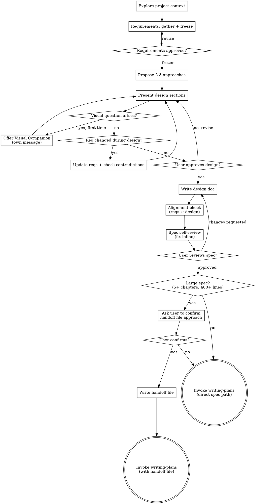

# Brainstorming Ideas Into Designs

Help turn ideas into fully formed designs and specs through natural collaborative dialogue.

The process has two phases: **requirements first, design second.** Requirements define what the system must do. Design defines how. Keeping them separate means design decisions don't silently reshape the problem — and when they do, you catch it.

<HARD-GATE>
Do NOT begin design, invoke any implementation skill, write any code, or take any implementation action until: (1) requirements are written and the user has approved them as frozen, and (2) you have presented a design and the user has approved it. Both gates apply to every feature regardless of perceived simplicity.
</HARD-GATE>

## Anti-Pattern: "This Is Too Simple To Need Requirements"

Every feature goes through both phases. A config change, a single-component tweak, a new store field — all of them. Requirements can be short (three bullet points for a trivial feature), but they must be written and approved before design begins. Skipping this is how you spend a week implementing the wrong thing.

---

## Checklist

You MUST create a task for each item and complete them in order:

1. **Explore project context** — check files, docs, recent commits
2. **Confirm feature folder** — ask the user which folder under `docs/design/` to use (e.g. `virtual-links` → `docs/design/virtual-links/`). Existing folders are preferred; only create a new one when no existing folder fits. Store this as `<feature>` and use it for every artifact path in this session.
3. **Requirements phase** — gather, write, and freeze requirements before any design (see below)
4. **Offer visual companion just-in-time** — NOT upfront. The first time a question would genuinely be clearer shown than described, offer it then (its own message); on approval its browser tab opens for you. If no visual question ever arises, never offer it. See the Visual Companion section below.
5. **Propose 2-3 design approaches** — with trade-offs and recommendation
6. **Present design** — in sections scaled to complexity, get user approval after each section
7. **Write design doc** — `docs/design/<feature>/<topic>-design.md`
8. **Requirements-design alignment check** — verify all requirements are addressed, no contradictions introduced
9. **Spec self-review** — placeholders, consistency, FSD/architecture compliance, scope, ambiguity
10. **User reviews written spec** — ask for approval before proceeding
11. **Transition to implementation** — invoke writing-plans skill (see below for large-spec path)

## Folder Convention

Persistent design artifacts (requirements, specs) live under `docs/design/<feature>/`.
Working/temporary planning artifacts (handoff files, implementation plans) live under
the separate `docs/plans/<feature>/` tree — they are inputs to execution, not
long-lived documentation.

```
docs/design/<feature>/
├── requirements.md          (if requirements warrant a separate file)
└── <topic>-design.md

docs/plans/<feature>/        (only for large specs — see "Large spec" path below)
├── <topic>-plan-handoff.md
└── <topic>.md (final plan, written by writing-plans)
```

Existing examples: `docs/design/generic-tree-view/`, `docs/design/usecase-visualizer/`.

## Process Flow



**The terminal state is using writing-plans.** The ONLY skill invoked after brainstorming is writing-plans.

---

## Phase 1: Requirements

**Before asking any questions**, scan the repo: docs, existing feature slices, recent commits. Understand what already exists. Don't ask about things the codebase already answers — only ask about genuine gaps.

Read the requirements guide for the full question set and document structure:
`skills/brainstorming/references/requirements-guide.md`

**Ask one question at a time.** After each answer, decide whether to follow up on that topic or move to the next gap. Never batch questions.

**Sizing decision** — decide before writing:
- Substantial feature (multiple entities, state machines, 6+ FRs, cross-cutting concerns) → **separate file**: `docs/design/<feature>/requirements.md`
- Small feature (handful of simple requirements, self-contained) → **inline section** in the design doc (requirements section at the top)

**Freeze gate** — once you have enough to write complete requirements, write them, then present them conversationally:
> "Here are the requirements as I understand them: [summary]. Does this look right? Any changes before we move to design?"

Wait for explicit approval. If they want changes, update and ask again. Only start design once the user says requirements are good.

**Handling user refusal to engage with requirements:**
If the user says "just skip to design" or "just do it":
- Acknowledge: *"Understood — I'll proceed with the following assumed requirements: [list them explicitly]."*
- Write those assumptions as requirements and mark them clearly as assumed.
- Continue to design with those assumptions documented.

---

## Phase 2: Design

**Exploring approaches:**

- Propose 2-3 different approaches with trade-offs
- Lead with your recommendation and explain why
- For architectural or long-lived decisions, frame each option as a lightweight ADR:
  - **Context** — why this decision is needed
  - **Decision** — what you're proposing
  - **Alternatives considered** — what else was evaluated
  - **Trade-offs and risks** — pros/cons, failure modes
  - **Rationale** — why this option wins given the project's decision principles (see CLAUDE.md)
- Favor reversible decisions. Call out rollback or migration paths explicitly.
- Evaluate each approach against the project's FSD layering rules in CLAUDE.md. Flag any approach that has a feature importing another feature directly, or an upper layer being imported by a lower one.

**If design reveals a requirement change:**

When a design choice implies adding, removing, or modifying a requirement — pause and handle it before continuing:

1. Flag it explicitly: *"This design choice affects [requirement ID or description] — [explain how]."*
2. Propose the updated requirement.
3. Check for contradictions: does this conflict with any other FR, invariant, or Out of Scope item? (Use the contradiction detection guide in `references/requirements-guide.md`.)
4. Get user confirmation before updating.
5. Update the requirements doc or inline section.
6. Continue design.

Don't silently absorb requirement changes into the design. Keeping requirements and design in sync is what makes the final spec trustworthy.

**Presenting the design:**

- Scale each section to its complexity: a few sentences if straightforward, up to 200-300 words if nuanced
- Ask after each section whether it looks right so far
- Cover: architecture (which FSD layer, which files), components, state/store shape, data flow, error handling, testing
- Be ready to go back and clarify if something doesn't make sense

**Design for isolation and clarity:**

- Break the system into smaller units that each have one clear purpose, communicate through well-defined interfaces, and can be understood and tested independently
- For each unit, you should be able to answer: what does it do, how do you use it, and what does it depend on?
- Can someone understand what a unit does without reading its internals? Can you change the internals without breaking consumers? If not, the boundaries need work.

**Working in existing codebases:**

- Explore the current structure before proposing changes. Follow existing patterns.
- Where existing code has problems that affect the work (e.g., a file that's grown too large, unclear boundaries, tangled responsibilities), include targeted improvements as part of the design.
- Don't propose unrelated refactoring. Stay focused on what serves the current goal.

**Code vs. design preference:**

- Prefer **design explanation and reasoning first**.
- Include code snippets **only when they clarify boundaries, contracts, or invariants**.
- Avoid large code dumps or speculative implementations unless explicitly requested.

---

## After the Design

**Documentation:**

- Write the validated design (spec) to `docs/design/<feature>/<topic>-design.md`
  - If requirements are inline: include the requirements section at the top of this file
  - If requirements are a separate file: open with a link: `Requirements: [../requirements.md]`
  - (User preferences for spec location override this default)
- Use elements-of-style:writing-clearly-and-concisely skill if available
- Commit the design document — use the `commit` skill

**Requirements-Design Alignment Check:**

After writing both documents, verify they are coherent:

1. **Coverage** — is every functional requirement addressed somewhere in the design? Flag any FR with no corresponding design element.
2. **No new implicit requirements** — does the design introduce behaviour that isn't in the requirements? If so, either add the missing requirement or remove the behaviour from the design.
3. **Invariant preservation** — does the design preserve every stated invariant across all operations?
4. **Open questions resolved** — are the Open Questions from the requirements doc answered in the design? Flag any that remain unresolved.

Fix gaps inline. If a contradiction can't be resolved without user input, surface it explicitly rather than guessing.

**Spec Self-Review:**

After the alignment check:

1. **Placeholder scan** — any "TBD", "TODO", incomplete sections, or vague requirements?
2. **Internal consistency** — do any sections contradict each other?
3. **Architecture compliance** — does the design respect FSD layer boundaries and other constraints in CLAUDE.md?
4. **Scope check** — is this focused enough for a single implementation plan?
5. **Ambiguity check** — could any requirement or design element be interpreted two different ways?

Fix any issues inline. You can dispatch a subagent for a more thorough review — see `spec-document-reviewer-prompt.md`.

**User Review Gate:**

> "Spec written and committed to `<path>`. Requirements and design are aligned. Please review before we start the implementation plan."

Wait for the user's response. If they request changes, make them, re-run the alignment check, and re-run spec self-review. Only proceed once the user approves.

**Completion:**

The brainstorming phase is complete when:
1. Requirements are frozen and approved.
2. The design is approved and aligned with requirements.
3. The spec has passed the self-review checklist.
4. The user explicitly says to proceed.

**Implementation:**

Decide which path to use based on the size of the spec you just wrote:

**Small spec** (fewer than 5 implementation chapters OR spec under ~400 lines):
- Invoke writing-plans directly: `"Use the writing-plans skill on <spec path>."`
- No handoff file needed.

**Large spec** (5 or more implementation chapters AND spec over ~400 lines):
- Before writing anything, tell the user:
  > "This spec has [N] implementation chapters and is large enough that writing-plans would timeout if run directly. I recommend writing a plan handoff file first so the plan generation is split across subagents. Shall I proceed that way?"
- Wait for explicit confirmation.
- If confirmed: write the handoff file, then invoke writing-plans with the handoff path.
- If declined: invoke writing-plans directly with the spec path and let the user decide how to handle any timeout.
- Do NOT use any other skill.

---

## Step 10: Writing the Plan Handoff File

After the user approves the spec, partition the design into implementation chapters and write a handoff file. Writing-plans reads this file as its sole input — it never reads the full spec. This keeps the plan generation fast and reliable regardless of spec size.

**When to partition:** Only for large specs (5 or more implementation chapters AND spec over ~400 lines). For small specs, skip this section entirely — writing-plans is invoked directly with the spec path.

**How to partition the design into chapters:**

A chapter is a set of files that can be built, tested, and committed independently. Use these rules:
- One chapter per FSD layer that has new files: entities, features, widgets, shared utilities
- One chapter per test layer: unit, integration
- Merge two adjacent chapters if either has fewer than 3 tasks
- If a chapter has more than ~8 tasks, split it into two — complex components with multiple states count as 2–3 tasks each, so a chapter with 3 stateful components is already near the limit

**Batch grouping rules (dependency order):**
- Entities & DTOs → can be parallel (no cross-dependency)
- Shared utilities → can be parallel with entities (pure functions, no store imports)
- Zustand stores → depends on entity types from batch above; run after entities
- Feature components → depends on stores; run after stores
- Widgets → depends on features; run after feature components
- Tests → run after components (need the interfaces to compile)

**Handoff file format:**

Save to: `docs/plans/<feature>/<topic>-plan-handoff.md`

```markdown
# Plan Handoff: <Feature Name>

**Spec:** `<relative path to design doc>`
**Plan output:** `docs/plans/<feature>/<topic>.md`
**Scope note:** <e.g. "Sections 1–10 only. Section 11 is a separate plan run.">

## Batches

### Batch 1 (parallel)
- **<Chapter name>** | Sections <X.Y–X.Z> | Start task 1
- **<Chapter name>** | Sections <X.Y–X.Z> | Start task <N>

### Batch 2 (parallel, after batch 1)
- **<Chapter name>** | Sections <X.Y–X.Z> | Start task <N>

### Batch 3 (sequential, after batch 2)
- **<Chapter name>** | Sections <X.Y–X.Z> | Start task <N>

### Batch 4 (parallel, after batch 3)
- **<Chapter name>** | Sections <X.Y–X.Z> | Start task <N>
```

**Task start number estimation** (rough — writing-plans adjusts as needed):
- Each new file: ~2–3 tasks
- Each component with 2–3 states/branches: ~4–6 tasks
- Store addition: ~2 tasks
- Each test layer: ~6–12 tasks depending on case count

**Invoking writing-plans after the handoff file is written:**

> "Use the writing-plans skill. Handoff file: `docs/plans/<feature>/<topic>-plan-handoff.md`"

That single line is the entire invocation. Writing-plans reads its reference file, then the handoff file, then fires agents.

---

## Key Principles

- **Requirements before design** — never start designing before requirements are frozen; it's how assumptions become bugs
- **One question at a time** — don't overwhelm; you get better answers
- **Multiple choice preferred** — easier to answer than open-ended when possible
- **YAGNI ruthlessly** — remove unnecessary features from all requirements and designs
- **Explore alternatives** — always propose 2-3 approaches before settling
- **Incremental validation** — present requirements, then design, get approval at each gate
- **Living requirements** — when design changes requirements, update and verify immediately, not at the end
- **Architecture awareness** — flag any design decision that violates FSD layer boundaries; consult CLAUDE.md
- **Handle refusal gracefully** — document assumptions explicitly and proceed

---

## Visual Companion

A browser-based companion for showing mockups, diagrams, and visual options. Available as a tool — not a mode — for questions where seeing beats reading.

**Offering the companion (just-in-time):** Do NOT offer it upfront. Wait until a question would genuinely be clearer shown than told — a real mockup / layout / diagram question, not merely a UI *topic*. The first time that happens, offer it then, as its own message:
> "This next part might be easier if I show you — I can put together mockups, diagrams, and comparisons in a browser tab as we go. It's still new and can be token-intensive. Want me to? I'll open it for you."

**This offer MUST be its own message.** Only the offer — no clarifying question, summary, or other content. Wait for the user's response. If they accept, start the server with `--open` so their browser opens to the first screen automatically. If they decline, continue text-only and don't offer again unless they raise it.

**Per-question decision:** Even after the user accepts, decide FOR EACH QUESTION whether to use the browser:
- **Use the browser** — mockups, wireframes, layout comparisons, architecture diagrams
- **Use the terminal** — requirements questions, conceptual choices, tradeoff lists, scope decisions

A question about a UI topic is not automatically a visual question. "What does personality mean?" is conceptual — terminal. "Which wizard layout works better?" is visual — browser.

If they agree, read the guide: `skills/brainstorming/visual-companion.md`
