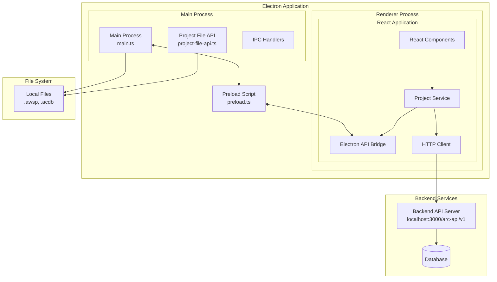
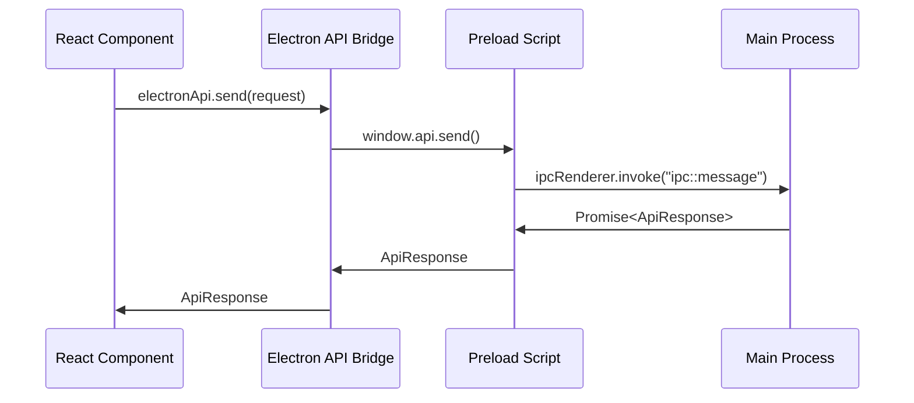
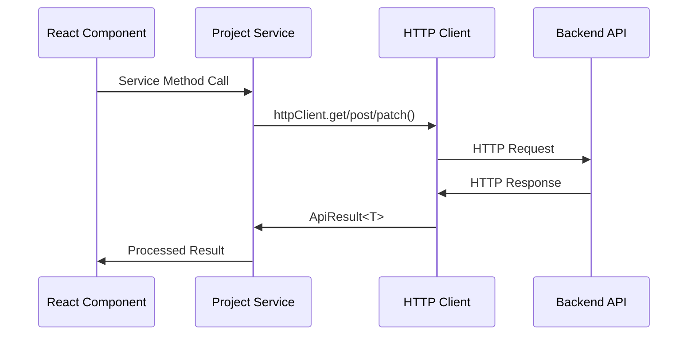
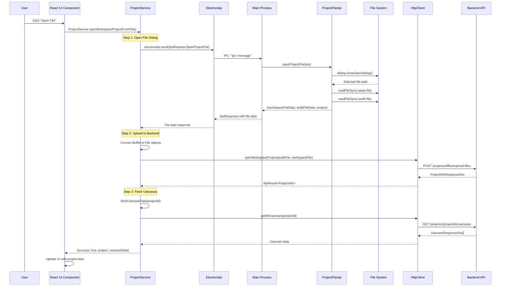
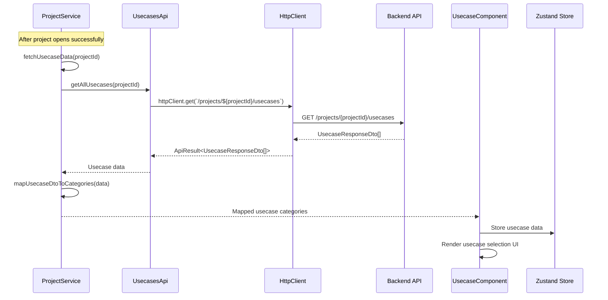
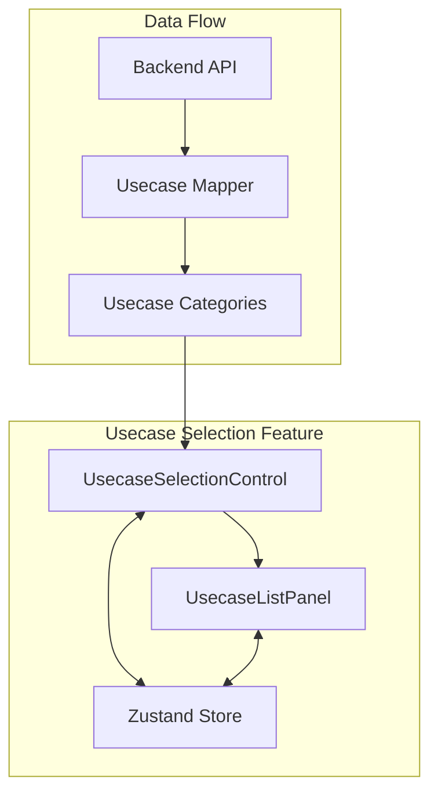
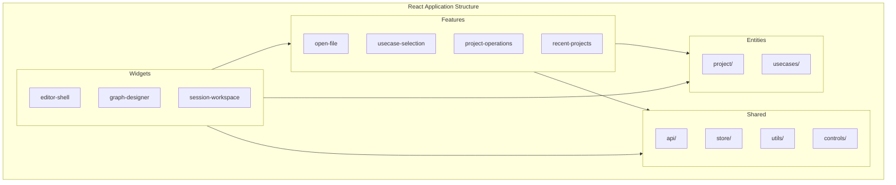
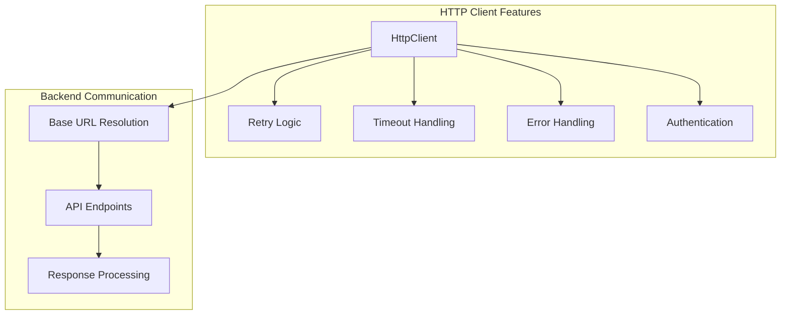
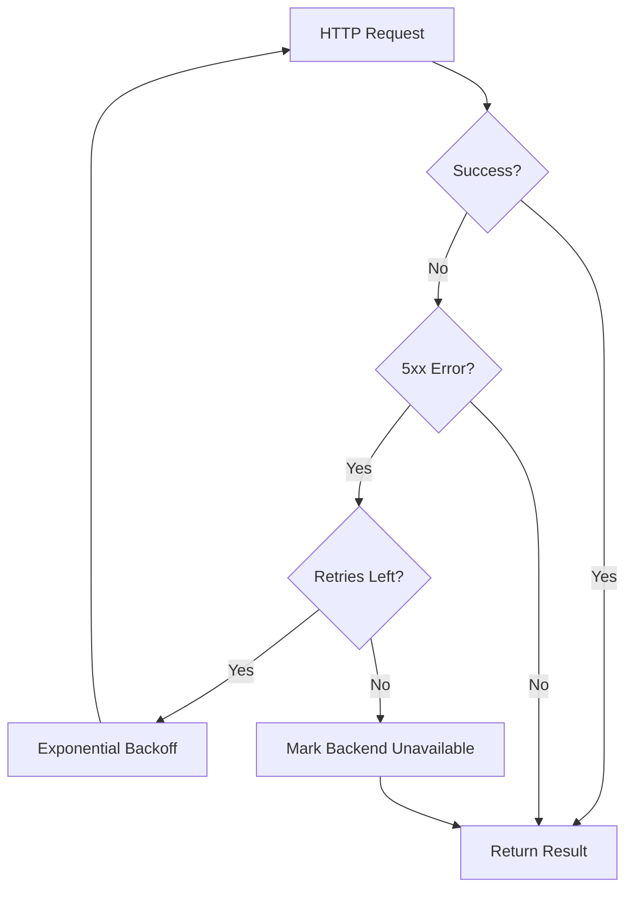

<!--
Copyright (c) Qualcomm Technologies, Inc. and/or its subsidiaries.
SPDX-License-Identifier: BSD-3-Clause
-->

# AudioReach Creator UI - Architecture Overview

## Table of Contents

1. [System Architecture](#system-architecture)
2. [Communication Patterns](#communication-patterns)
3. [Open File Flow](#open-file-flow)
4. [Usecase Selection Flow](#usecase-selection-flow)
5. [Component Architecture](#component-architecture)
6. [API Layer Details](#api-layer-details)

## System Architecture

The AudioReach Creator UI follows a multi-process Electron architecture with a React frontend and a separate backend API server.

### Key Components

- **Main Process**: Handles system-level operations, file dialogs, and native OS integration
- **Renderer Process**: React application providing the user interface
- **Preload Script**: Secure bridge exposing limited APIs to the renderer process
- **Backend API**: Separate Node.js server handling business logic and data persistence
- **File System**: Local project files (.awsp workspace files and .acdb database files)

## Communication Patterns

### 1. Inter-Process Communication (IPC)

The React app communicates with the Electron main process through a secure IPC bridge:

### 2. HTTP Communication

The React app communicates with the backend API through HTTP requests:

## Open File Flow

This section details how clicking "Open File" flows through all the architectural layers.

### Complete Open File Sequence

### Detailed Flow Breakdown

#### Phase 1: File Selection (Electron Layer)

1. **User Interaction**: User clicks "Open File" button in React UI
2. **Service Call**: React component calls `ProjectService.openWorkspaceProjectFromFile()`
3. **IPC Request**: Service sends `ApiRequest.OpenProjectFile` via Electron API
4. **File Dialog**: Main process shows native file picker dialog
5. **File Reading**: Reads both `.awsp` (workspace) and `.acdb` (database) files
6. **Response**: Returns file data and metadata to React

#### Phase 2: Backend Upload (HTTP Layer)

1. **File Conversion**: Convert Buffer data to File objects for upload
2. **API Call**: POST request to `/projects/offline/upload-files` with FormData
3. **Backend Processing**: Backend processes files and creates project
4. **Project Creation**: Returns project ID and metadata

#### Phase 3: Usecase Loading (HTTP Layer)

1. **Usecase Fetch**: GET request to `/projects/{projectId}/usecases`
2. **Data Mapping**: Transform DTOs to UI-friendly format
3. **State Update**: Store usecase data in application state

### Key Files Involved

| Layer               | File                                                                  | Responsibility                         |
| ------------------- | --------------------------------------------------------------------- | -------------------------------------- |
| **React UI**        | `packages/react-app/src/entities/project/services/project-service.ts` | Orchestrates the entire flow           |
| **Electron API**    | `packages/react-app/src/shared/api/electron-api.ts`                   | IPC bridge to main process             |
| **Main Process**    | `packages/electron-app/src/main.ts`                                   | IPC handler routing                    |
| **File Operations** | `packages/electron-app/src/project-file-api.ts`                       | File dialog and file system operations |
| **Preload Bridge**  | `packages/electron-app/src/preload.ts`                                | Secure API exposure                    |
| **HTTP Client**     | `packages/react-app/src/shared/api/http-client.ts`                    | Backend communication                  |
| **Project API**     | `packages/react-app/src/entities/project/api/projects-api.ts`         | Project-specific API calls             |

## Usecase Selection Flow

After a project is opened, the system fetches and displays available usecases for selection.

### Usecase Data Flow

### Usecase Component Architecture

### Usecase Selection Process

1. **Data Fetching**: After project opens, `ProjectService.fetchUsecaseData()` is called
2. **API Request**: Makes GET request to `/projects/{projectId}/usecases`
3. **Data Transformation**: Raw DTOs are mapped to UI-friendly category structure
4. **State Management**: Usecase data is stored in Zustand store by project ID
5. **UI Rendering**: `UsecaseSelectionControl` component displays searchable/filterable usecases
6. **User Interaction**: Users can search, expand categories, and select multiple usecases
7. **Selection Storage**: Selected usecases are persisted in the store for the current project

### Key Components

- **UsecaseSelectionControl**: Main component with search and dropdown functionality
- **UsecaseListPanel**: Renders the hierarchical list of usecases
- **useUsecaseStore**: Zustand store managing selected usecases per project
- **Usecase Mapper**: Transforms backend DTOs to frontend models

## Component Architecture

### Feature-Based Architecture

The React application follows a feature-based architecture with clear separation of concerns:

### Layer Responsibilities

| Layer        | Purpose                                     | Examples                         |
| ------------ | ------------------------------------------- | -------------------------------- |
| **Features** | Business logic and UI for specific features | `open-file`, `usecase-selection` |
| **Entities** | Domain models and API integration           | `project`, `usecases`            |
| **Shared**   | Common utilities, stores, and components    | `api`, `store`, `controls`       |
| **Widgets**  | Complex composite components                | `editor-shell`, `graph-designer` |

## API Layer Details

### HTTP Client Architecture

The application uses a robust HTTP client with the following features:

### Key Features

1. **Base URL Resolution**: Configurable backend URL (defaults to `http://localhost:3000/arc-api/v1`)
2. **Retry Logic**: Exponential backoff with jitter for failed requests
3. **Timeout Handling**: Configurable request timeouts with AbortController
4. **Error Processing**: Unified error handling and response mapping
5. **Connection State**: Tracks backend availability and connection status

### API Endpoints Used

| Endpoint                                       | Method | Purpose                |
| ---------------------------------------------- | ------ | ---------------------- |
| `/projects`                                    | GET    | Fetch all projects     |
| `/projects/{projectId}`                        | GET    | Fetch specific project |
| `/projects/{projectId}/connect-to-project`     | PATCH  | Connect to project     |
| `/projects/offline/upload-files`               | POST   | Upload workspace files |
| `/projects/{projectId}/usecases`               | GET    | Fetch project usecases |
| `/projects/{projectId}/usecases/getComponents` | POST   | Get usecase components |

### Error Handling Strategy

The HTTP client implements sophisticated error handling:

- **Network Errors**: Automatic retries with exponential backoff
- **Server Errors (5xx)**: Retries with backend availability tracking
- **Client Errors (4xx)**: Immediate failure without retries
- **Timeouts**: Configurable timeout with AbortController

This architecture ensures robust communication between the frontend and backend while providing excellent user experience through proper error handling and retry mechanisms.
