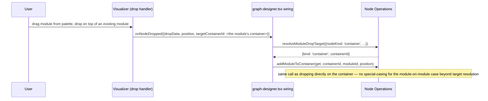

# Canvas UI Mechanics — Design

> Requirements: [requirements.md](requirements.md) §1–2 (FR-MODE-04),
> §9–11 (FR-PAL-01–FR-PROP-01), §13 (FR-PROXY-01–02), §16 (FR-CANVAS-01–02)
>
> Parent LLD: [design.md](design.md) §2, §6.1–6.3, §7 (architecture, store
> composition, response reconciliation, and API shapes this doc builds on
> without repeating)
>
> Feature path: `packages/react-app/src/features/graph-designer/lib/`
> Widget touched: `packages/react-app/src/widgets/properties-panel/`
> Depends on: Node Operations' and Link & Port's action functions (this
> doc wires them to UI surfaces; it introduces no new backend calls)

---

## Table of Contents

1. [Scope](#1-scope)
2. [Context Menu](#2-context-menu)
3. [Multi-Select and Batch Delete](#3-multi-select-and-batch-delete)
4. [Properties Panel](#4-properties-panel)
5. [Palette Drop Wiring](#5-palette-drop-wiring)
6. [Not This Doc's Concern](#6-not-this-docs-concern)
7. [Sequence Diagrams](#7-sequence-diagrams)
8. [Testing Strategy](#8-testing-strategy)
9. [Open Items Inherited](#9-open-items-inherited)

---

## 1. Scope

This doc is the integration layer between the canvas (`UsecaseVisualizer`)
and every backend-calling action function Node Operations and Link & Port
already define. It introduces **no new backend calls** — every mutation
this doc triggers is dispatched to a function those two docs already
specify. It owns:

- Context menu item definitions and click dispatch (FR-PORT-06, FR-CTXMENU-01–03).
- Batch delete for multi-selection (FR-CANVAS-01, FR-CANVAS-02).
- The properties panel rewrite, including View-mode read-only behavior
  (FR-MODE-04, FR-PROP-01).
- Wiring palette drops to Node Operations' placement functions.

**Explicitly out of scope** (see [requirements.md](requirements.md) for the
full text):

- **Drag-and-drop rejection logic.** FR-MOD-08/FR-SG-11 do not reject
  module/subgraph placement at the drag-and-drop level except for a module
  dropped on a subgraph-proxy or subsystem node (rejected — no
  container to resolve to). There is very little for this doc to "validate";
  [§5](#5-palette-drop-wiring) covers the thin wiring that remains.
- **Copy/paste (FR-ENH-04/FR-ENH-05).** Deferred to a future design pass. No
  `ClipboardBuffer` type, no copy/paste UI, no paste-target validation is
  designed here.
- KV & Key Configuration panel content — out of scope for this doc
  entirely (owned separately).

---

## 2. Context Menu

**File:** `features/graph-designer/lib/context-menu-config.ts`

`buildContextMenuConfig(get: () => GraphDesignerStore): VisualizerContextMenuConfig`
— a factory (not a bare object) since `getItems`/`onAction` need closure
access to `get` to read current selection/mode state and dispatch mutations.

### 2.1 `getItems(target: ContextMenuTarget): ContextMenuItem[]`

Dispatches on `target.kind`:

| `target.kind`                                | Items                                                                                                                                                                                                                                                                                                                                                                                                                                                                                                       |
| -------------------------------------------- | ----------------------------------------------------------------------------------------------------------------------------------------------------------------------------------------------------------------------------------------------------------------------------------------------------------------------------------------------------------------------------------------------------------------------------------------------------------------------------------------------------------- |
| `'module'`                                   | Delete only — "Offload to other DSP" (FR-MDF-03) deferred, see [design.md §16](design.md#16-not-doing)                                                                                                                                                                                                                                                                                                                                                                                                      |
| `'subgraph'`                                 | Delete; "Move to Subsystem"; "Remove from Subsystem" (if parented)                                                                                                                                                                                                                                                                                                                                                                                                                                          |
| `'subsystem'`                                | Delete (disabled, tooltipped, when the subsystem still has any children — subgraphs, modules, containers, or links; per FR-SUBSYS-02/[node-operations-design.md §6.3](node-operations-design.md#63-delete-req-031b) the backend only removes an empty subsystem); "Move to Subsystem" (opens destination selection and excludes the moved subsystem); "Remove from Subsystem" (if parented); "Expand" (FR-SUBSYS-06, dispatches to `expandSubsystem`). Rename is handled by the properties panel work, not this context-menu PR. |
| `'container'`                                | Delete only — no rename item (FR-CONT-02)                                                                                                                                                                                                                                                                                                                                                                                                                                                                   |
| `'subgraph-proxy'`                           | Delete only in this PR. Rename uses the underlying subgraph rename operation and is handled by the properties panel work.                                                                                                                                                                                                                                                                                                                                                                                      |
| `'port'`                                     | "Start connection" when no two-click connection is active; "End connection" when `target.connectionInProgress` is `true` (FR-PORT-06). These are mutually exclusive so the user cannot start a second two-click connection while one is already active. See [link-and-port-design.md §2.2](link-and-port-design.md#22-two-click-state-visualizer-internal) for why this field is populated by the Visualizer itself rather than read from its store here.                                                    |
| `'data-link'` / `'control-link'`             | Delete; "Exclude Link" shown only if `target.edge.id` is a key in `pairLinksById` (FR-SG-03 — only pair-derived edges are excludable)                                                                                                                                                                                                                                                                                                                                                                       |
| `'proxy-data-link'` / `'proxy-control-link'` | Same as the plain link kinds — a proxy edge is the display-collapsed form of a real link (FR-MDF-02), not a distinct excludable entity                                                                                                                                                                                                                                                                                                                                                                      |

All items are omitted (empty array — the Visualizer treats this as "no
menu") when `get().mode !== 'edit'`, since every item above is a Edit-mode
action; View mode's read-only click behavior (FR-MODE-04) does not use a
context menu at all.

### 2.2 `onAction(actionId: string, target: ContextMenuTarget): void`

**Delete dispatch is data-driven, not hardcoded per branch** — two lookup
tables, both shared with [§3](#3-multi-select-and-batch-delete)'s batch
delete:

```typescript
const DELETE_HANDLERS: Record<
  AnyNode['nodeKind'],
  (get: () => GraphDesignerStore, id: string) => Promise<boolean>
> = {
  container: (get, id) => containerOperations.deleteContainers(get, [id]),
  module: (get, id) => moduleOperations.deleteModuleInstance(get, id),
  subgraph: (get, id) => subgraphOperations.deleteSubgraph(get, id),
  'subgraph-proxy': (get, id) => subgraphOperations.deleteSubgraph(get, id),
  subsystem: (get, id) => subsystemOperations.deleteSubsystem(get, id),
};

// Lock-free counterparts of the same handlers — each calls the entity's
// `*Inner` function directly, no `withMutationLock` of its own. Only
// batch delete ([§3.1](#31-deleteselection)) uses this table, wrapping
// the whole batch in one outer lock; `onAction`'s single-target dispatch
// above always goes through `DELETE_HANDLERS`.
const DELETE_HANDLERS_INNER: Record<
  AnyNode['nodeKind'],
  (get: () => GraphDesignerStore, id: string) => Promise<boolean>
> = {
  container: (get, id) => containerOperations.deleteContainerInner(get, id),
  module: (get, id) => moduleOperations.deleteModuleInstanceInner(get, id),
  subgraph: (get, id) => subgraphOperations.deleteSubgraphInner(get, id),
  'subgraph-proxy': (get, id) =>
    subgraphOperations.deleteSubgraphInner(get, id),
  subsystem: (get, id) => subsystemOperations.deleteSubsystemInner(get, id),
};
```

`onAction('delete', target)` for a node target resolves
`DELETE_HANDLERS[target.node.nodeKind]` and calls it with the node's own id
field (`moduleId`/`subgraphId`/`containerId`/`subsystemId` per kind); the
resolved `boolean` is only consulted by batch delete's `DELETE_HANDLERS_INNER`
path — a single-target `onAction` delete's own toast on failure is already
handled inside the handler it calls, so `onAction` itself ignores the
return value. For an edge target, delete dispatches directly to Link &
Port's `deleteLink`. Every other action id (`'move-to-subsystem'`,
`'remove-from-subsystem'`, `'rename'`, `'expand'`, `'start-connection'`,
`'end-connection'`, `'exclude-link'`) maps one-to-one to a single Node
Operations/Link & Port function call — no branch has its own bespoke logic
beyond argument extraction from `target`. (`'offload-to-dsp'` is removed —
DSP offload, FR-MDF-03, is deferred, no endpoint exists; see
[design.md §16](design.md#16-not-doing).)

---

## 3. Multi-Select and Batch Delete

**File:** `features/graph-designer/lib/multi-select-delete.ts`

Multi-select itself (Shift+click, rubber-band drag) is already implemented
in `usecase-visualizer.tsx`/`VisualizerInternalStore` and needs no new code
— FR-CANVAS-01 is satisfied for selection already. What's missing, confirmed by
inspection, is that `onNodesDeleted`/`onEdgesDeleted` (the Visualizer's
existing Delete-key event hooks) have no consumer in `graph-designer.tsx`
today. This doc adds that consumer.

### 3.1 `deleteSelection`

```typescript
export async function deleteSelection(
  get: () => GraphDesignerStore,
  selectedNodeIds: string[],
  selectedEdgeIds: string[],
): Promise<void>;
```

1. **Mode self-check, before any dispatch.** If `get().mode !== 'edit'`,
   return immediately — no-op. This mirrors
   [design.md](design.md#11-error-handling)'s note that `deleteSelection`
   is reachable via a global `keydown` listener with no render-layer gate,
   so a Delete keypress in View mode is an expected, silent no-op, not a
   `withMutationLock` throw.
2. **Cascade-aware root filtering (FR-CANVAS-01).** Build the set of surviving
   node roots by excluding any selected node whose ancestor — walked via
   `graphData`'s container→subgraph→subsystem parent chain — is _also_
   selected. A selected module inside a selected container is dropped from
   the root list; only the container issues a delete call, and the
   module's removal happens as part of that cascade.
   ```typescript
   function isAncestorOf(
     graphData: UsecaseGraphData,
     ancestorId: string,
     nodeId: string,
   ): boolean;
   function filterCascadeRoots(
     graphData: UsecaseGraphData,
     selectedIds: string[],
   ): string[];
   function resolveNodeKind(
     graphData: UsecaseGraphData,
     nodeId: string,
   ): AnyNode['nodeKind'];
   ```
3. **Edge filtering.** A selected edge is dropped from the delete list if
   either of its endpoint nodes is covered by a surviving root's cascade
   (its removal happens as a side effect of that node's delete).
4. **One outer lock for the whole batch (FR-CANVAS-02).** The entire batch
   is one mutation from `isMutating`'s perspective, not one-in-name-only:
   ```typescript
   const results = await withMutationLock(get, () =>
     Promise.allSettled([
       ...survivingRoots.map((nodeId) =>
         DELETE_HANDLERS_INNER[resolveNodeKind(get().graphData!, nodeId)](
           get,
           nodeId,
           {suppressToast: true},
         ),
       ),
       ...survivingEdges.map((connectionId) =>
         linkOperations.deleteLinkInner(
           get,
           connectionId,
           edgeLinkType(connectionId),
           {
             suppressToast: true,
           },
         ),
       ),
     ]),
   );
   ```
   (`resolveNodeKind` is a small helper this doc adds alongside
   `isAncestorOf`/`filterCascadeRoots` — the same `graphData`
   container→subgraph→subsystem/module lookup those already walk, just
   returning the node's own `AnyNode['nodeKind']` instead of an ancestry
   check.) Every call goes through the `*Inner` variant
   ([§2.2](node-operations-design.md#22-the-mutation-wrapper-pattern)) —
   none of them calls `withMutationLock` itself, so nothing inside the
   batch re-enters the lock `deleteSelection`'s own `withMutationLock` call
   is already holding. This replaces the earlier "concurrent dispatch, no
   shared lock" design: that version had each `*Inner`'s wrapped
   counterpart (e.g. `deleteContainers`) call `withMutationLock`
   independently, so the _second_ concurrent root's call would hit
   `isMutating` already `true` and throw synchronously before ever
   reaching the backend — a real bug this doc's `Promise.allSettled`-based
   partial-success reporting (step 5) depended on not happening. Dispatch
   is still concurrent _within_ the one lock (`Promise.allSettled`, not a
   sequential loop) — only the lock acquisition changed, not the
   concurrency. Every call also passes `{suppressToast: true}`
   ([node-operations-design.md §2.2](node-operations-design.md#22-the-mutation-wrapper-pattern)'s
   `InnerActionOptions`) — without it, a batch with any failures would show
   both each failed entity's own raw toast _and_ this step's aggregate "N of
   M" summary toast, which is redundant and not the UX FR-CANVAS-02
   describes (a single toast, with per-entity detail going to the log
   instead).
5. **Result reporting.** Each settled promise resolves to a `boolean`
   (`*Inner`'s return value, [§2.2](node-operations-design.md#22-the-mutation-wrapper-pattern)),
   not a rejection — a suppressed-toast backend failure is `false`, not a
   thrown error, so counting must read `results` values, not settlement
   status. Every `false` result is logged (`logger.warn`, with the failed
   entity's id) precisely because its own `*Inner` toast was suppressed —
   this is what makes FR-CANVAS-02's "failed roots' details are written to
   the log rather than enumerated in the toast" true in practice, not just
   in the requirement text. A genuine unhandled exception (a programming
   error, not a user-facing failure) produces a `'rejected'` settlement
   instead, logged at `logger.error` and counted as a failure alongside any
   `false`. Toast text: "N of M deletions
   succeeded" when `0 < N < M`, a plain success toast when `N === M`, a
   plain failure toast when `N === 0`. The canvas is never rolled back for
   entities that did succeed (FR-CANVAS-02) — each successful delete's own
   `applyComponentCollection` call (or narrow write, for link/subsystem
   delete) has already landed in `graphData` by the time the summary toast
   fires.

### 3.2 Wiring

`graph-designer.tsx`'s `eventHandlers` gains `onNodesDeleted`/
`onEdgesDeleted` (currently absent from the `useMemo` block building
`eventHandlers`), each calling `deleteSelection(store.getState, ...)`
with the respective id array (an edge-only Delete keypress calls it with
an empty node array, and vice versa — `usecase-visualizer.tsx`'s existing
`handleKeyDown` already only fires each handler when its own array is
non-empty).

---

## 4. Properties Panel

**Widget touched:** `widgets/properties-panel/ui/properties-panel.tsx`
(currently a static placeholder `<div>`, confirmed by inspection — no
props, no store reads).

### 4.1 Open/close wiring (FR-MODE-04, FR-PROP-01)

`PropertiesViewSlice`'s `isPropertiesPanelOpen`/`openPropertiesPanel`/
`closePropertiesPanel` exist but are never called anywhere today. This doc
wires them: `graph-designer.tsx`'s existing `eventHandlers.onSelectionChange`
gains a branch — when the resulting selection is exactly one node or one
edge, call `openPropertiesPanel()`; on empty selection, call
`closePropertiesPanel()`. Multi-select (more than one node/edge selected)
leaves the panel in its current state rather than opening it — no
multi-entity properties view is defined by any requirement.

This selection-driven open/close applies in **both** View and Edit mode
(FR-MODE-04 explicitly covers View-mode clicks) — the handler doesn't branch
on `mode` for open/close, only the panel's own field-editability does
([§4.3](#43-readonly-view-mode-req-002a)).

### 4.2 Content dispatch by node/edge kind (FR-PROP-01)

`PropertiesPanel` reads the current single selection (`selectedNodeIds`/
`selectedEdgeIds`, length exactly 1) from `VisualizerInternalStore` via the
same store-context pattern `usecase-visualizer.tsx` itself uses, resolves
the selected id against `graphData`, and dispatches on kind:

| Kind                           | Fields                                                       | Write function                                                               |
| ------------------------------ | ------------------------------------------------------------ | ---------------------------------------------------------------------------- |
| Module                         | Name (alias); data/control port count +/-                    | `renameModuleInstance` (Node Ops); `updatePortCount` (Link & Port)           |
| Subsystem                      | Name; data/control port count +/-                            | `renameSubsystem` (Node Ops); `updatePortCount` (Link & Port)                |
| Subgraph / subgraph-proxy      | Name                                                         | `renameSubgraph` (Node Ops) — both kinds call the same function, FR-PROXY-02 |
| Container                      | Container ID                                                 | `updateContainerId` (Node Ops)                                               |
| Edge (any of the 4 edge kinds) | Read-only endpoint summary (source/target node + port names) | — (no editable fields; FR-PROP-01 does not specify an edge property to edit) |

Each field's write action follows the same call-then-wait-for-confirmation
pattern as everywhere else in this feature — no local optimistic edit; the
input shows a pending/disabled state until the backend confirms and the
narrow write lands in `GraphDataSlice`, at which point the panel re-renders
from the updated store value (it never holds its own copy of the field).

### 4.3 `readOnly` (View mode, FR-MODE-04)

Per [design.md §2](design.md#2-architectural-impacts), the panel "gains a
`readOnly` prop." `graph-designer.tsx` passes `readOnly={mode !== 'edit'}`.
When `readOnly`, every field in [§4.2](#42-content-dispatch-by-nodeedge-kind-req-051)'s
table renders as plain text (or a disabled input) instead of an editable
control — the panel still opens and shows the same content per FR-MODE-04,
it simply cannot be edited. This is a separate interaction from FR-MODE-03's
double-click-to-tune (which opens a dedicated cal/tag tuning tab, not this
panel) — the two coexist unchanged.

---

## 5. Palette Drop Wiring

Node Operations' [`resolveModuleDropTarget`](node-operations-design.md#31-drop-resolution-req-004-req-006-req-007-req-011)
and `placeSubgraphFromPalette` do the actual placement work; this doc only
wires `graph-designer.tsx`'s `onNodeDropped` handler (currently absent
from `eventHandlers`, confirmed by inspection) to call them:

```typescript
onNodeDropped: ({dropData, position, targetContainerId, targetSubgraphId}) => {
  const payload = parseModuleDropPayload(dropData) ?? parseSubgraphDropPayload(dropData);
  if (!payload) return; // malformed payload — no-op, not a user-facing error
  if (payload.kind === 'module') {
    const target = targetContainerId
      ? {nodeKind: NODE_KIND.CONTAINER, containerId: targetContainerId} as const
      : targetSubgraphId
        ? {nodeKind: NODE_KIND.SUBGRAPH, subgraphId: targetSubgraphId} as const
        : 'empty-canvas' as const;
    const resolution = resolveModuleDropTarget(target);
    switch (resolution.kind) {
      case 'container':
        void moduleOperations.addModuleToContainer(store.getState, resolution.containerId, payload.moduleId, position);
        break;
      case 'subgraph-no-container':
        void moduleOperations.addModuleToSubgraphNoContainer(store.getState, resolution.subgraphId, payload.moduleId, position);
        break;
      case 'empty-canvas':
        void moduleOperations.addModuleToEmptyCanvas(store.getState, payload.moduleId, position);
        break;
      case 'rejected':
        showToast('Cannot drop a module here', 'warning');
        break;
    }
  } else {
    void subgraphOperations.placeSubgraphFromPalette(store.getState, payload.subgraphId, position);
  }
},
```

This is the entirety of this doc's "drag-and-drop" surface — no separate
drag-over validation file exists, since almost every target resolves
to a valid placement. The one remaining rejection (`resolution.kind ===
'rejected'`, module onto a proxy/subsystem node) surfaces as a toast on
drop rather than a drag-over visual indicator — FR-MOD-08 only
requires that the tool "provide a
visual indicator that the target is invalid," which a post-drop toast
satisfies. (A drag-over cursor change is a reasonable future enhancement
but not required by the requirement.)

**FR-PAL-01 (subgraph palette disabled in subsystem level)** is a palette
_rendering_ concern — the subgraph palette component itself reads
`usesSubsystemVariant` and disables its drag source entirely — not
something `onNodeDropped` needs to check, since a disabled drag source
never fires a drop event.

---

## 6. Not This Doc's Concern

For clarity, restating what other docs own so nothing is silently
duplicated:

- Node/link/subsystem mutation logic itself — Node Operations, Link &
  Port. This doc only calls their exported functions.
- The `applyComponentCollection` reconciler — `graph-data-slice.ts`,
  specified in [design.md §6.3](design.md#63-response-reconciliation-shared-across-all-nodelinksubsystem-docs).
- Two-click connection state (`connectionInProgress`) — Visualizer-internal
  store, specified in
  [link-and-port-design.md §2.2](link-and-port-design.md#22-two-click-state-visualizer-internal).
  This doc's port context menu ([§2.1](#21-getitemstarget-contextmenutarget-contextmenuitem))
  only _reads_ `target.connectionInProgress`, a plain boolean field the
  Visualizer itself populates on the target before this doc's `getItems`
  ever sees it — this doc never reaches into `VisualizerInternalStore`
  directly, since it has no access to it (FSD).
- KV & Key Configuration panel content — out of scope for this design
  pass entirely.
- Copy/paste — deferred, FR-ENH-04/FR-ENH-05.

---

## 7. Sequence Diagrams

### Sequence: Batch Delete Across a Cascade Boundary (FR-CANVAS-01, FR-CANVAS-02)

```mermaid
sequenceDiagram
  participant U as User
  participant V as Visualizer (Delete key)
  participant M as multi-select-delete.ts
  participant B as Backend

  U->>V: select container C + its own module M1 + edge E (unrelated), press Delete
  V->>M: deleteSelection(get, [C, M1], [E])
  M->>M: filterCascadeRoots — M1 dropped (ancestor C also selected)
  M->>M: surviving roots: [C]; surviving edges: [E]
  M->>M: withMutationLock — beginMutation (once, for the whole batch)
  par
    M->>B: deleteContainerInner(C)
  and
    M->>B: deleteLinkInner(E)
  end
  B-->>M: C succeeds (cascades M1's removal); E fails
  M->>M: endMutation
  M->>U: toast "1 of 2 deletions succeeded"
  Note over M: C's cascade already reconciled into graphData; E's edge remains
```

### Sequence: Module Drop Resolves to Underlying Module's Container (FR-MOD-08)



---

## 8. Testing Strategy

Extends [design.md §14](design.md#14-testing-strategy) with cases specific
to this doc:

- **Unit — context menu item visibility**: each `target.kind` produces the
  expected item set; "End connection" appears only when
  `target.connectionInProgress` is `true`; "Exclude Link" appears only for a
  `pairLinksById`-tracked edge; menu is empty in View mode.
- **Unit — delete dispatch table**: each node kind in `DELETE_HANDLERS`
  calls the correct Node Operations function with the correct id field.
- **Unit — cascade-aware root filtering**: a selected container + its own
  selected module → module dropped from roots; a selected container + an
  unrelated selected module in a different container → both survive as
  independent roots; a selected edge whose endpoint is a covered root →
  edge dropped from the edge-delete list.
- **Unit — batch delete under one lock**: `deleteSelection`'s
  `withMutationLock` call is acquired exactly once per batch regardless of
  surviving-root count; `isMutating` is `true` for the duration of the
  whole batch, not just its first entity; a second `deleteSelection` (or
  any other mutating action) invoked while a batch is in flight is
  rejected by `withMutationLock`, same as any other overlapping mutation.
- **Unit — batch delete partial failure**: `Promise.allSettled` mixed
  `true`/`false`/rejected results (a `false` from a backend failure whose
  own `*Inner` toast was suppressed via `{suppressToast: true}`, a rejection
  only from a genuine thrown error) produce the correct "N of M" toast text
  and no rollback of succeeded entities; each `*Inner` call in the batch is
  asserted to receive `{suppressToast: true}` and `showToast` is asserted to
  fire exactly once for the whole batch (the summary toast), not once per
  failed entity.
- **Unit — properties panel readOnly**: every field renders non-editable
  when `readOnly` is true; write functions are never called from a
  `readOnly` panel regardless of user interaction with a disabled control.
- **Integration**: full drop-to-reconciliation round-trip for a
  module-on-module drop, asserting the new module lands in the module
  underneath's container — reached via the existing `targetContainerId`
  path, since the container's box always encloses its modules;
  properties-panel rename round-trip (optimistic-free — field stays
  showing the old value until backend confirms).

---

## 9. Open Items Inherited

- **Copy/paste (FR-ENH-04/FR-ENH-05)** — deferred; no `ClipboardBuffer` type or
  paste-target validation exists. A future pass needs to decide paste
  rules fresh, not by reference to this doc's now-minimal drop rules.
- **Drag-over visual feedback for the one remaining rejection** (module
  onto proxy/subsystem node) — this doc resolves it as a post-drop toast,
  not a drag-over cursor change; a drag-over indicator is a reasonable
  future enhancement, not designed here.
