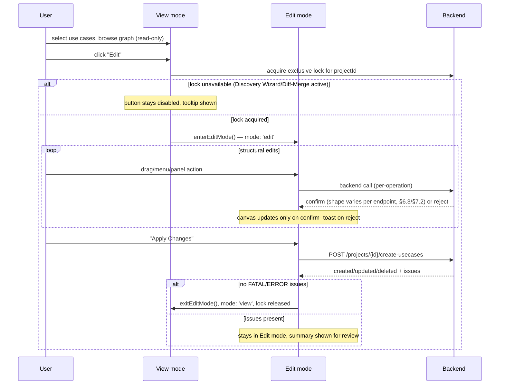

# LLD: Usecase Designer — Edit Feature

|                     |                                                                                                                       |
| ------------------- | --------------------------------------------------------------------------------------------------------------------- |
| **Epic Link**       | `<Epic link to related JIRA/epic — TBD>`                                                                              |
| **Document status** | DRAFT                                                                                                                 |
| **Document owner**  | `<TBD>`                                                                                                               |
| **Target release**  | `<Milestone — TBD>`                                                                                                   |
| **Stakeholders**    | Module owner, reviewers, backend API team, other developers impacted (Discovery Wizard, Diff/Merge, Key Configurator) |

Source documents (this LLD synthesizes, and defers to for full detail):

- [Requirements](requirements.md) — FR-MODE-01 to FR-ENH-05
- [Node Operations Design](node-operations-design.md)
- [Link and Port Design](link-and-port-design.md)
- [Canvas UI Mechanics Design](canvas-ui-mechanics-design.md)
- Apply/Discard Changes — designed separately, see [../apply-discard-changes/design.md](../apply-discard-changes/design.md)

---

## 1. Feature Overview and Strategic Fit

Today, the Graph Designer canvas is **read-only**: a user can select use
cases, view the resulting module/subgraph/subsystem graph, and double-click
a module to open a cal/tag tuning tab — but cannot change the graph's
structure from the canvas itself.

This feature adds a **structural editing mode** to the same canvas. From the
user's perspective:

1. The user clicks **"Edit"** to enter **Edit mode**.
2. While in Edit mode, the user can drag modules/subgraphs from palettes onto
   the canvas, draw or delete connections, resize port counts, group
   subgraphs into subsystems, and configure calibration/tag keys and KV
   selections — all via context menus, a properties panel, and a Key
   Configurator panel.
3. Every structural change is confirmed by the backend before the canvas
   reflects it (no optimistic UI) — the user always sees a loading state
   while a change is in flight and a toast if it fails.
4. When done, the user clicks **"Apply Changes"** to commit the session (the
   backend re-runs routing/use-case generation and returns a modification
   summary), or **"Discard"** to abandon everything staged this session.

This turns the Graph Designer from a browsing tool into the primary
authoring surface for use-case graphs.

**Out of scope for this feature** (see [§16](#16-not-doing)): undo/redo
(FR-ENH-02), inline quick-actions (FR-ENH-03), copy/paste (FR-ENH-04/FR-ENH-05), the
subsystem-level/use-case-level display-mode toggle itself (FR-PAL-01 only consumes it), and
Discovery Wizard/Diff-Merge as real features (this feature only adds the
exclusive-lock hook they'll plug into).

---

## 2. Architectural Impacts

Impacts on existing architecture:

- **New `EditSessionSlice`** composed into the existing
  `GraphDesignerStore` (`packages/react-app/src/features/graph-designer/model/graph-designer-store.ts`),
  alongside `GraphDataSlice`, `KeyConfigSlice`, `VisualizerSlice`, etc. This
  slice owns session bookkeeping only (mode, in-flight flags, provenance/KV
  maps) — it holds **no graph data** of its own; every structural mutation
  still lands in `GraphDataSlice`.
- **New per-project exclusive-lock slice** on the existing `ProjectStore`
  (`shared/store/project-store-slices/exclusive-lock-slice.ts`), shared by
  three features: Usecase Edit (built here), Discovery Wizard (stub today),
  and Diff/Merge (doesn't exist yet). One `ProjectStore` instance already
  exists per open project (via `projectStoreRegistry`), so the lock's
  per-project isolation comes for free from that existing scoping — no
  separate `Record<projectId, ...>` map is needed. This is a deliberate
  FSD-compliant decoupling point — Usecase Edit does not import either of
  the other two features.
- **New response-reconciliation contract.** Confirmed backend endpoints
  (per the latest swagger) do not share one uniform response shape — see
  [§6.3](#63-response-reconciliation-shared-across-all-nodelinksubsystem-docs)
  for the real per-endpoint shapes (a flat single collection on link
  create, a subsystem move delta from `/subsystems/components/move`, a
  deleted-entities collection on module delete) and which narrow single-entity/
  read-only endpoints are excluded entirely. For every endpoint that
  **does** return a multi-bucket `ComponentCollectionDto`/
  `ComponentCollectionWithSubsystemsDto` delta, a single shared reconciler
  (`applyComponentCollection`, in `graph-data-slice.ts`) merges the buckets
  into `GraphDataSlice` and re-derives containers/subgraphs — this
  generalizes and extends the existing `loadGraphData` grouping logic
  rather than replacing it.
- **Architectural principle: every backend-confirmed edit in this feature,
  regardless of which panel originated it, must flow back through one
  reconciliation path so `GraphDataSlice`/`EditSessionSlice` — and therefore
  every UI component reading them — reflects the latest backend state.**
  This explicitly includes properties-panel edits (rename, port count) and
  Key Configurator edits (CKV/TKV, Subsystem Keys), not
  only the canvas/palette/context-menu actions. Concretely:
  - Structural, multi-bucket edits use `applyComponentCollection` as designed.
  - Narrow single-entity edits (rename, port-count fields on
    `PATCH /spf-modules/{id}`/`PATCH /subsystems/{id}`, `PUT
/subsystems/{id}/filtered-keys`) update the one affected
    entity's field(s) directly in `GraphDataSlice`/its owning map on
    backend confirmation — no polling, no separate re-fetch needed, but
    also no edit that only updates a component-local or feature-local store
    with no path back to the shared state other components read.
- **Reused, not replaced:** `UsecaseVisualizer`'s existing producer/consumer
  callback boundary (`onNodeDropped`/`onEdgesDeleted`/`onEdgeConnected`),
  the existing properties panel widget (`widgets/properties-panel/`, gains a
  `readOnly` prop), the existing Key Configurator panel
  (`features/key-configurator/`, gains real backend staging — see
  [§6.4](#64-ckvtkv-and-subsystem-keys-staging)), the existing
  `ConfigFileManager`/`useUserPreferences` preferences mechanism (for the
  cross-DSP display-mode toggle), and the existing FlexLayout tab-lifecycle
  model (the exclusive lock is tied to component mount lifetime, not tab
  focus).

---

## 3. Assumptions

- The subsystem-level/use-case-level display-mode toggle ("subsystem
  level" vs. "use case level")
  is built **separately**, before or in parallel with this feature, and
  exposes a `useSubsystemDisplayMode(): 'usecase' | 'subsystem'` hook (or
  equivalent). This feature only consumes it (FR-PAL-01); if it hasn't landed
  by ship time, the consuming hook is stubbed to always return `'usecase'`
  (`usesSubsystemVariant` defaults to `false`).
- Discovery Wizard and Diff/Merge, as real mounted features with their own
  exclusive-lock acquisition, are built separately. Until then, this
  feature's lock enforcement point for Discovery Wizard is the existing
  `sideNavItems` menu entry (currently a no-op); Diff/Merge has no
  enforcement point at all yet since it has no code.
- Position/layout overrides (FR-POS-02) persist through a mechanism TBD with
  the backend team; this feature only guarantees the existing client-side
  `positionOverrides`/`parentSizes` behavior is unaffected by Edit mode.
- Users interact with this feature from the desktop Electron app (existing
  target platform for this tool) — no new platform assumptions.

---

## 4. Requirements

Full itemized requirements: [requirements.md](requirements.md)
(FR-MODE-01–FR-MDF-03). Condensed by section:

| #   | Section                                  | Summary                                                                                                                                                                                                                                                     | Importance | Type       | Notes                                                                                                                                                                                                                                                                                                                                                            |
| --- | ---------------------------------------- | ----------------------------------------------------------------------------------------------------------------------------------------------------------------------------------------------------------------------------------------------------------- | ---------- | ---------- | ---------------------------------------------------------------------------------------------------------------------------------------------------------------------------------------------------------------------------------------------------------------------------------------------------------------------------------------------------------------- |
| 1   | Canvas modes (FR-MODE-01–05)             | View/Edit mode toggle; View mode shows palettes/Key Configurator/properties panel read-only, plus double-click-to-tune; Edit mode makes them editable and adds context menus/inline connection creation                                                     | Must have  | Functional | Foundation for every other section                                                                                                                                                                                                                                                                                                                               |
| 2   | Module operations (FR-MOD-01–08)         | Add module (to container / empty space / subgraph-no-container), delete (cascades to links, and to the container/subgraph if it was their last module), rename; module-on-module drop resolves to container underneath, proxy/subsystem drop still rejected | Must have  | Functional | `POST /spf-modules` confirmed; `DELETE /spf-modules/{id}` confirmed, returns a deleted-entities collection (see [§6.3](#63-response-reconciliation-shared-across-all-nodelinksubsystem-docs))                                                                                                                                                                    |
| 3   | Subgraph operations (FR-SG-01–11)        | Palette placement (session-local; allowed to overlap any existing node including a proxy), pair-link auto-render + exclude, duplicate-placement guard, provenance-based delete, rename                                                                      | Must have  | Functional | 3 provenances drive delete behavior; delete has no dedicated endpoint — achieved by deleting every module in the subgraph, cascading per row 2; rename via `PATCH /subgraphs/{id}`                                                                                                                                                                               |
| 4   | Container operations (FR-CONT-01–03)     | Delete (cascades), no rename, implicit creation only                                                                                                                                                                                                        | Must have  | Functional | Containers are derived, not first-class; delete has no dedicated endpoint — achieved by deleting every module in the container, cascading per row 2                                                                                                                                                                                                              |
| 5   | Link operations (FR-LINK-01–07)          | Right-click-to-connect, Escape-cancel, cross-subsystem bridging, control-port limit warning, server as final arbiter, delete                                                                                                                                | Must have  | Functional | No client-side `maxConnections` gate                                                                                                                                                                                                                                                                                                                             |
| 6   | Subsystem operations (FR-SUBSYS-01–06)   | Move into / remove from subsystem, delete, rename, expand (promotes contents)                                                                                                                                                                               | Must have  | Functional | Moving/removing from a subsystem never deletes the source subsystem; expand = move every child to the parent + delete the now-empty subsystem; backend `DELETE` only removes an **empty** subsystem — confirmed correct backend behavior, not a gap; Delete is disabled/rejected on a non-empty subsystem (FR-SUBSYS-02), Expand is the promote-then-delete path |
| 7   | Port operations (FR-PORT-01–06)          | Data/control port count inc/dec on modules & subsystems, backend-arbitrated decrease, port context menu                                                                                                                                                     | Must have  | Functional | Confirmed: `maxInputPortsSupported`/`maxOutputPortsSupported`/`maxControlPortsSupported` are fields on `PATCH /spf-modules/{id}` (`PatchSpfModuleRequestDto`); `inputDataPortCount`/`outputDataPortCount`/`controlPortCount` on `PATCH /subsystems/{id}` (`PatchSubsystemRequestDto`) — no dedicated `updatePortCount` endpoint                             |
| 8   | Apply Changes (FR-APPLY-01–03)           | Disabled while mutating/in-flight; sends use cases + excluded links; summary view on success/failure                                                                                                                                                        | Must have  | Functional | `POST /projects/{id}/create-usecases` confirmed                                                                                                                                                                                                                                                                                                                  |
| 9   | Palettes (FR-PAL-01)                     | Subgraph palette disabled in subsystem level                                                                                                                                                                                                                | Must have  | Functional | Depends on out-of-scope toggle                                                                                                                                                                                                                                                                                                                                   |
| 10  | Context menus (FR-CTXMENU-01–03)         | Node/edge Delete dispatch by type; Delete key parity with menu                                                                                                                                                                                              | Must have  | Functional | Shared `deleteSelection` dispatcher                                                                                                                                                                                                                                                                                                                              |
| 11  | Properties panel (FR-PROP-01)            | Editable fields per node type incl. port-count controls                                                                                                                                                                                                     | Must have  | Functional | Reuses existing panel widget                                                                                                                                                                                                                                                                                                                                     |
| 12  | MDF use cases (FR-MDF-02–03)             | Expanded/virtual bridge display modes; Offload to other DSP                                                                                                                                                                                                 | Must have  | Functional | MDF is UI-computed, not backend field; **Offload to other DSP (FR-MDF-03) is not scoped — no `offloadModuleToDsp`-equivalent endpoint exists in swagger, and none is being requested** — see [§16](#16-not-doing)                                                                                                                                                |
| 13  | Subgraph proxy nodes (FR-PROXY-01–02)    | No connections to/from proxy nodes; rename proxy (renames underlying subgraph)                                                                                                                                                                              | Must have  | Functional | A subgraph _can_ be dropped onto a proxy node (renders overlapping) — only connections are restricted                                                                                                                                                                                                                                                            |
| 14  | Positioning (FR-POS-01–02)               | Exact drop coordinates, no auto-layout snap-back; drag-to-reposition in both modes, not staged as an edit                                                                                                                                                   | Must have  | Functional | Backend persistence TBD                                                                                                                                                                                                                                                                                                                                          |
| 15  | Edit mode lifecycle (FR-LIFECYCLE-01–03) | Exclusive lock vs. Discovery Wizard/Diff-Merge, per project; Discard with confirmation, incl. project-close                                                                                                                                                 | Must have  | Functional | `POST /projects/{id}/discard-changes` confirmed                                                                                                                                                                                                                                                                                                                  |
| 16  | Canvas interaction (FR-CANVAS-01)        | Multi-select in both modes with cascade-aware batch delete                                                                                                                                                                                                  | Must have  | Functional | Copy/paste (FR-ENH-04/FR-ENH-05) deferred, see row 17                                                                                                                                                                                                                                                                                                            |
| 17  | Enhancements (FR-ENH-01–05)              | `changeId` per staged edit (satisfied already); undo/redo, quick actions, and copy/paste all deferred                                                                                                                                                       | Deferred   | Functional | Explicitly out of scope                                                                                                                                                                                                                                                                                                                                          |

---

## 5. User Interaction and Design

No visual mockups exist yet for this feature; the interaction model below is
derived entirely from the requirements/design docs' behavioral
specifications. (If Figma/mockups are produced separately, link them here.)

### 5.1 Mode switch

- **View mode** (default): canvas shows the last-selected use cases. Module palette, subgraph palette, and Key
  Configurator panel remain visible but read-only (no drag effect, no
  editable fields). Only interactive operations: double-click a module
  → opens cal/tag tuning tab; click a module/subgraph/container/link → opens
  the properties panel **read-only**. "Edit" button is
  visible, enabled unless another exclusive-mode session (Discovery
  Wizard/Diff-Merge) is active for this project.
- **Edit mode**: entered via "Edit". Module palette, subgraph palette,
  properties panel, and Key Configurator panel become editable. Context
  menus and inline connection creation become available. "Apply
  Changes" and "Discard" buttons appear.

### 5.2 Structural editing surfaces

| Surface             | Interaction                                                                                                                                                                                                                                                 |
| ------------------- | ----------------------------------------------------------------------------------------------------------------------------------------------------------------------------------------------------------------------------------------------------------- |
| Module palette      | Drag a module onto any target (container, subgraph, empty canvas space, or another module — resolves to the container underneath); rejected only on a subgraph-proxy node or a subsystem node                                                               |
| Subgraph palette    | Drag an existing subgraph anywhere on canvas — placement renders at the drop point regardless of what's underneath, including overlapping a subgraph-proxy node; disabled (greyed, tooltipped) for subgraphs already placed, or entirely in subsystem level |
| Context menu (node) | Delete; "Move to Subsystem"; "Remove from Subsystem" (only if parent is a subsystem); "Expand" (subsystem nodes only, FR-SUBSYS-06) — "Offload to other DSP" (FR-MDF-03) deferred, see [§16](#16-not-doing)                                                 |
| Context menu (edge) | Delete, or "Exclude Link" for pair-derived edges                                                                                                                                                                                                            |
| Delete key          | Same dispatch as context-menu Delete, for the current selection (single or multi)                                                                                                                                                                           |
| Port handle (drag)  | Drag directly from a source port to a target port — native connection gesture, for ports both visible in the current view                                                                                                                                   |
| Right-click port    | "Start connection" / "End connection" (two-click flow) — required when the target port isn't yet rendered (e.g. into a collapsed subsystem)                                                                                                                 |
| Escape              | Cancels an in-progress connection                                                                                                                                                                                                                           |
| Properties panel    | Rename and port count +/- depending on node type                                                                                                                                                                                                            |
| Multi-select        | Shift+click or rubber-band drag; batch Delete respects cascade ordering                                                                                                                                                                                     |

Copy/Paste (FR-ENH-04/FR-ENH-05) is deferred — see [§16](#16-not-doing).

### 5.3 Feedback

- **Errors**: toast on failure for nearly every operation, leaving the
  canvas untouched. Exception: Apply Changes success/failure are both shown
  in a modal **modification summary view**, not a toast.

### 5.4 End-to-end flow



---

## 6. Component Design

### 6.1 Front-end store composition

```typescript
export type GraphDesignerStore = UsecaseSelectionSlice &
  GraphDataSlice &
  VisualizerSlice &
  SubsystemSlice &
  KeyConfigSlice &
  ValidationResultSlice &
  ModuleListSlice &
  SubgraphListSlice &
  PropertiesViewSlice &
  PanelLayoutSlice &
  PanelTabRegistrySlice &
  SearchSlice &
  EditSessionSlice; // new
```

`EditSessionSlice` (new) holds session bookkeeping only:

```typescript
interface EditSessionSlice {
  mode: 'view' | 'edit';
  enterEditMode: () => boolean; // false if exclusive lock unavailable
  exitEditMode: () => void;

  isMutating: boolean; // single serial mutation lock
  beginMutation: () => void;
  endMutation: () => void;

  usesSubsystemVariant: boolean; // fixed for the session, set in enterEditMode()

  // Session-local maps — cleared and/or reseeded on every '→ view' transition
  subgraphProvenanceById: Record<string, SubgraphProvenance>;
  kvSelectionsById: Record<string, KvSelection[]>;
  pairLinksById: Record<string, SubgraphPairDto>;
  excludedLinks: Connection[];
}
```

Session-local maps are plain `Record`s, not `Map`s — Zustand store state
must stay serializable (no `Set`/`Map`/class instances), so these are keyed
plain objects like every other map-shaped slice field in this codebase.

**Design principle — no optimistic mutation.** Every action: call backend →
merge response into `GraphDataSlice` only on success → toast + no change on
failure. `EditSessionSlice` never holds graph data itself.

**This "merge on success" rule applies uniformly to every backend-confirmed
edit in the feature, not only canvas/palette/context-menu actions.**
Properties-panel edits (rename, port count) are held to the same standard:
their confirmed response must land back in
`GraphDataSlice`/the relevant `EditSessionSlice` map, not only in a
panel-local or feature-local store, so that any other component reading
shared state (canvas, a different open panel) sees the change too. See
[§2](#2-architectural-impacts), which states this principle explicitly.

Rejected alternatives: a command-pattern undo buffer (unnecessary now that
undo/redo is deferred), and a fully separate sibling store (would only add
cross-store sync plumbing).

### 6.2 Exclusive locking (per-project)

Lives on `ProjectStore` (`shared/store/project-store-slices/exclusive-lock-slice.ts`),
not `global-store.ts` — one `ProjectStore` instance is already created and
registered per open project via `projectStoreRegistry`, so per-project
isolation falls out of that existing scoping for free; a second
`Record<projectId, ...>` map on `global-store.ts` would only duplicate it.
`shared/store/` is still the right layer (FSD forbids Usecase Edit from
importing Discovery Wizard/Diff-Merge directly), it just doesn't need to be
the _global_ store specifically:

```typescript
type ExclusiveSessionMode =
  'none' | 'usecase-edit' | 'discovery-wizard' | 'diff-merge';

interface ExclusiveLockSlice {
  activeExclusiveMode: ExclusiveSessionMode;
  setActiveExclusiveMode: (mode: ExclusiveSessionMode) => boolean;
  releaseExclusiveMode: (mode: ExclusiveSessionMode) => void;
}
```

- One `ExclusiveLockSlice` per `ProjectStore` — a lock on Project A's store
  instance is structurally incapable of blocking Project B's, since each
  project has its own store.
- Each of the three modes is single-instance-per-project, **including
  against itself** — a second Graph Designer tab on the same project cannot
  acquire a second `'usecase-edit'` lock.
- Lock is tied to **component lifetime**, not tab focus — FlexLayout keeps
  inactive tabs mounted (hidden via CSS), so switching focus away does not
  release the lock; only unmount (tab close) does.
- Discovery Wizard has no mount lifecycle yet (stub menu entry) — its
  enforcement point is the menu item's own
  `onClick`/`disabled`, reading the same selector via
  `projectStoreRegistry.get(projectId)`. Diff/Merge doesn't exist in code at
  all.

### 6.3 Response reconciliation (shared across all node/link/subsystem docs)

**Real, confirmed backend contract (per swagger): there is no single
uniform response shape across mutating structural endpoints.** Three
distinct shapes exist today:

```typescript
// 1. Link create (POST /data-links, /control-links) — one flat collection, no add/update/delete split
interface ComponentCollectionDto {
  spfModules: SpfModuleDto[];
  dataLinks: DataLinkDto[];
  controlLinks: ControlLinkDto[];
}

// 2. Link create, -with-subsystems variant — same, plus subsystems
interface ComponentCollectionWithSubsystemsDto extends ComponentCollectionDto {
  subsystems?: SubsystemDto[];
}

// 3. Subsystem move/re-parent (POST /subsystems/components/move) — sparse delta fields
interface MoveSubsystemComponentsResponseDto {
  updatedModules?: MoveSubsystemComponentParentDto[];
  updatedSubsystems?: MoveSubsystemComponentParentDto[];
  addedDataLinks?: DataLinkDto[];
  removedDataLinks?: string[];
  addedControlLinks?: ControlLinkDto[];
  removedControlLinks?: string[];
  subsystemPortChanges?: MoveSubsystemPortChangeDto[];
}

// 4. Module delete (DELETE /spf-modules/{id}) — a deleted-entities collection,
//    ids only, nested under a `deleted` envelope
interface RemoveSpfModuleResponseDto {
  deleted: {
    spfModules: string[];
    subgraphs: string[];
    containers: string[];
    dataLinks: string[];
    controlLinks: string[];
  };
}
```

**Module/container/subgraph delete has no dedicated cascading endpoint.**
Deleting a container or subgraph is achieved client-side by deleting every
`SpfModuleDto` inside it via `DELETE /spf-modules/{id}`, one call per
module — the container/subgraph then disappears as the side effect of the
containing module(s) being gone, once `recomputeContainersAndSubgraphs`
re-derives from the surviving set. There is no container-delete or
subgraph-delete endpoint to call directly, and none is planned.
`RemoveSpfModuleResponseDto.deleted` is an id-only deleted-entities
collection — unlike `ComponentCollectionDto`, its entries are `string[]` of
systemIds, not full DTOs, since the backend has already discarded the
entities by response time. Module delete's reconciliation still uses the
same `applyComponentCollection` path as every other multi-bucket case
below, passing `deleted` as the "deleted" bucket; the reconciler resolves
each deleted link's endpoints from its own already-loaded
`graphData.connections` before removing it, since an id-only bucket carries
no endpoint fields for the surviving-port-count adjustment (§6.3 point 4).
`deleted.subgraphs`/`deleted.containers` are the ids of any subgraph/
container that no longer has a surviving module after this delete — the
reconciler prunes `subgraphProvenanceById`/`kvSelectionsById`/
`pairLinksById` for each id in `deleted.subgraphs` directly (no diffing
against a before/after snapshot needed); `deleted.containers` has no
session-local map of its own, so it's accepted on the DTO but otherwise
unused — a container disappears purely as a side effect of
`recomputeContainersAndSubgraphs`.

**Subsystem expand has no dedicated endpoint either.** FR-SUBSYS-06's "expand"
is implemented client-side as: move every child out via
`POST /subsystems/components/move` with `targetSubsystemSystemId` set to
the expanded subsystem's parent (or `null` for root), then
`DELETE /subsystems/{id}` (now empty) to remove the shell. The backend
`DELETE` removing only an **empty** subsystem is confirmed-correct backend
behavior — Expand's own move-to-parent-then-delete sequence is exactly how
a non-empty subsystem is deleted; there is no separate cascading-delete path.
FR-SUBSYS-02 (direct subsystem delete) is written to match: Delete is
disabled/rejected on a non-empty subsystem.

A single shared reconciler (`applyComponentCollection`) accepts one or more
`ComponentCollectionDto`/`ComponentCollectionWithSubsystemsDto` buckets
(tagged added/updated/removed by the caller — for shape 1/2 above, the
entire response is passed as a single "added" or "updated" bucket
depending on the calling action, since the endpoint doesn't split them
itself) and merges them into `GraphDataSlice`, then:

1. Re-derives containers/subgraphs by grouping surviving modules
   (`recomputeContainersAndSubgraphs`) — containers/subgraphs are **never**
   first-class entities in the response; they disappear automatically when
   their last module does.
2. Prunes `subgraphProvenanceById`/`kvSelectionsById`/`pairLinksById` (the
   session-local maps, frontend-only fields with no backend counterpart)
   for every id in the deleted bucket's own `subgraphs` list
   (`pruneSessionLocalMapsForSubgraph`, called once per id) — driven
   directly by the backend's own deleted-subgraph-ids list, not by
   diffing a before/after snapshot.
3. Prunes `pairLinksById`/`excludedLinks` for any link ID present in the
   removed/deleted bucket.
4. Adjusts `totalLinksAtPort` on surviving endpoints for every added/deleted
   link (`adjustSurvivingPortCounts`) — the backend response never includes
   the surviving sibling module's updated port count directly. For an
   id-only deleted bucket (shape 4 above), each deleted link's endpoints
   are resolved from `graphData.connections` before the link's own entry
   is removed, since the id alone carries no endpoint fields.
5. Marks the session dirty (`markDirty`) — any successful add/delete
   reconciled through here enables the Apply button
   ([apply-discard-changes/design.md §7.1](../apply-discard-changes/design.md#71-confirmed-endpoints)).
   Rename bypasses this reconciler (narrow direct write, §2.4) and calls
   `markDirty` itself on success.

Two narrow-response endpoint classes are **excluded** from this mechanism
(no collection to reconcile): (a) actions that mutate exactly one
already-known entity's own field — renames, port-count fields on
`PATCH /spf-modules/{id}`/`PATCH /subsystems/{id}`; (b) read-only placement queries
(`GET /subgraphs/{id}/components`, `GET /subgraphs/{id}/subgraph-pairs`)
which merge directly into `GraphDataSlice` via their own dedicated logic
since they're snapshots, not deltas.

### 6.4 Feature-area component map

| Design doc          | Owns                                                                                                                                                     | Key state                                                                                                                                                                                                    | Key backend calls                                                                                                                                                                                                                                                                                                                                                                                                                                                                   |
| ------------------- | -------------------------------------------------------------------------------------------------------------------------------------------------------- | ------------------------------------------------------------------------------------------------------------------------------------------------------------------------------------------------------------ | ----------------------------------------------------------------------------------------------------------------------------------------------------------------------------------------------------------------------------------------------------------------------------------------------------------------------------------------------------------------------------------------------------------------------------------------------------------------------------------- |
| Core Edit Session   | Mode switch, exclusive lock, `isMutating`, Apply, Discard                                                                                                | `EditSessionSlice` core fields                                                                                                                                                                               | `POST /projects/{id}/create-usecases`, `POST /projects/{id}/discard-changes`                                                                                                                                                                                                                                                                                                                                                                                                        |
| Node Operations     | Module/container/subgraph/subsystem CRUD, provenance                                                                                                     | `subgraphProvenanceById`                                                                                                                                                                                     | `POST /spf-modules`, `DELETE /spf-modules/{id}` (cascading container/subgraph delete achieved via repeated calls, no dedicated endpoint), `PATCH /subgraphs/{id}` (rename), `POST /subsystems`, `DELETE /subsystems/{id}` (empty only), `PATCH /subsystems/{id}` (rename/port counts), `POST /subsystems/components/move` (move in, move out, and re-parent; move all children to parent + delete = expand), `GET /subgraphs/{id}/components`, `GET /subgraphs/{id}/subgraph-pairs` |
| Link & Port         | Connections, port counts                                                                                                                                 | Visualizer-internal `connectionInProgress`                                                                                                                                                                   | `POST /data-links`/`/control-links`(`/with-subsystems`), `DELETE /data-links/{id}`/`/control-links/{id}`, port-count fields on `PATCH /spf-modules/{id}`/`PATCH /subsystems/{id}`                                                                                                                                                                                                                                                                                                   |
| Canvas UI Mechanics | Drop-target routing (no client-side rejection except proxy/subsystem module drops), palettes, context menus, properties panel, positioning, multi-select | Reads Visualizer-internal `selectedNodeIds`/`selectedEdgeIds` ([`SelectionChangePayload`](../../../packages/react-app/src/features/usecase-visualizer/model/visualizer.types.ts)) — owns no state of its own | — (all mutating calls are Node Operations'/Link & Port's)                                                                                                                                                                                                                                                                                                                                                                                                                           |

---

## 7. API Design

All endpoints below are confirmed against the latest backend swagger
document unless marked `TBD`. See [§9](#9-open-questions) for the full
open-item list.

### 7.1 Confirmed endpoints

| Endpoint                                           | Method | Request                                                                                                                               | Response                                                                                                                                                                        |
| -------------------------------------------------- | ------ | ------------------------------------------------------------------------------------------------------------------------------------- | ------------------------------------------------------------------------------------------------------------------------------------------------------------------------------- |
| `/spf-modules`                                     | POST   | `CreateSpfModuleRequestDto`                                                                                                           | `SpfModuleDto`                                                                                                                                                                  |
| `/spf-modules/{id}`                                | PATCH  | `PatchSpfModuleRequestDto {alias?, containerSystemId?, maxInputPortsSupported?, maxOutputPortsSupported?, maxControlPortsSupported?}` | `SpfModuleDto` — covers rename and module port-count changes                                                                                                                    |
| `/spf-modules/{id}`                                | DELETE | —                                                                                                                                     | `RemoveSpfModuleResponseDto {removedSpfModules, removedDataLinks, removedControlLinks}`                                                                                         |
| `/subgraphs/{id}/components`                       | GET    | —                                                                                                                                     | `ComponentCollectionDto` (snapshot, not a delta)                                                                                                                                |
| `/subgraphs/{id}/subgraph-pairs`                   | GET    | —                                                                                                                                     | `SubgraphPairDto[]` — `{sourceSubgraphSystemId, destinationSubgraphSystemId, dataLinks: DataLinkDto[], controlLinks: ControlLinkDto[]}`                                         |
| `/subgraphs/{id}`                                  | PATCH  | `{name: string}`                                                                                                                      | `SubgraphDto` — covers subgraph rename, also used for subgraph-proxy rename (FR-PROXY-02)                                                                                       |
| `/subgraphs/{id}/properties`                       | GET    | —                                                                                                                                     | `SubgraphPropertiesDto`                                                                                                                                                         |
| `/containers/{id}/properties`                      | GET    | —                                                                                                                                     | `ContainerPropertiesDto`                                                                                                                                                        |
| `/data-links`, `/data-links/with-subsystems`       | POST   | `CreateDataLinkRequest`                                                                                                               | `ComponentCollectionDto` / `ComponentCollectionWithSubsystemsDto`                                                                                                               |
| `/control-links`, `/control-links/with-subsystems` | POST   | `CreateControlLinkRequest`                                                                                                            | `ComponentCollectionDto` / `ComponentCollectionWithSubsystemsDto`                                                                                                               |
| `/data-links/{id}`, `/control-links/{id}`          | DELETE | —                                                                                                                                     | The deleted link's own DTO                                                                                                                                                      |
| `/subsystems`                                      | POST   | `CreateSubsystemRequestDto {name?, parentSystemId?}`                                                                                  | `CreateSubsystemResponseDto`                                                                                                                                                    |
| `/subsystems/{id}`                                 | PATCH  | `PatchSubsystemRequestDto {name?, inputDataPortCount?, outputDataPortCount?, controlPortCount?}`                                      | `UpdateSubsystemResponseDto` — covers rename and subsystem port-count changes                                                                                                   |
| `/subsystems/{id}`                                 | DELETE | —                                                                                                                                     | `DeleteSubsystemResponseDto` — **removes an empty subsystem only**, no cascade                                                                                                  |
| `/subsystems/components/move`                      | POST   | `MoveSubsystemComponentsRequestDto {subgraphSystemIds?, subsystemSystemIds?, targetSubsystemSystemId: string \| null}`                | `MoveSubsystemComponentsResponseDto {updatedModules?, updatedSubsystems?, addedDataLinks?, removedDataLinks?, addedControlLinks?, removedControlLinks?, subsystemPortChanges?}` |
| `/projects/{projectId}/create-usecases`            | POST   | `CreateUsecasesRequestDto` (below)                                                                                                    | `CreateUsecasesResponseDto` (below)                                                                                                                                             |
| `/projects/{projectId}/discard-changes`            | POST   | `DiscardChangesRequestDto {changeIds?}`                                                                                               | `DiscardChangesResponseDto`                                                                                                                                                     |

### 7.2 Delete/move/expand response shapes (no single shared envelope)

Unlike link create, delete/move/expand do **not** share one 3-collection
envelope — each has its own confirmed shape:

```typescript
// Module delete
Promise<RemoveSpfModuleResponseDto>; // {removedSpfModules, removedDataLinks, removedControlLinks}

// Subsystem move/re-parent
Promise<MoveSubsystemComponentsResponseDto>; // sparse move delta fields

// Subsystem delete (empty only)
Promise<DeleteSubsystemResponseDto>;
```

| Action                | Client-side composition                                     | Backend calls                                                                 | Added                                | Updated                                                         | Removed                                                                                                                                                                                                                                                    |
| --------------------- | ----------------------------------------------------------- | ----------------------------------------------------------------------------- | ------------------------------------ | --------------------------------------------------------------- | ---------------------------------------------------------------------------------------------------------------------------------------------------------------------------------------------------------------------------------------------------------- |
| Module delete         | Single call                                                 | `DELETE /spf-modules/{id}`                                                    | —                                    | —                                                               | The module plus every data/control link that referenced it (`removedSpfModules`/`removedDataLinks`/`removedControlLinks`); the container/subgraph disappear as the side effect of `recomputeContainersAndSubgraphs` once re-derived from the surviving set |
| Container delete      | Delete every module inside                                  | `DELETE /spf-modules/{id}` × N                                                | —                                    | —                                                               | Every module in the container plus their links; container disappears as the side effect of the last one                                                                                                                                                    |
| Subgraph delete       | Delete every module inside                                  | `DELETE /spf-modules/{id}` × N                                                | —                                    | —                                                               | Every module in the subgraph plus their links; subgraph disappears as the side effect of the last one                                                                                                                                                      |
| Move into subsystem   | Single call                                                 | `POST /subsystems/components/move`                                            | `addedDataLinks`/`addedControlLinks` | `updatedModules`/`updatedSubsystems` and `subsystemPortChanges` | `removedDataLinks`/`removedControlLinks`                                                                                                                                                                                                                   |
| Move out of subsystem | Single call                                                 | `POST /subsystems/components/move`                                            | `addedDataLinks`/`addedControlLinks` | `updatedModules`/`updatedSubsystems` and `subsystemPortChanges` | `removedDataLinks`/`removedControlLinks`; subsystem itself is never deleted                                                                                                                                                                                |
| Expand subsystem      | Move every child to parent, then delete the now-empty shell | `POST /subsystems/components/move` (all children) → `DELETE /subsystems/{id}` | Per move response                    | Per move response                                               | Per move response, plus the subsystem itself from the final `DELETE`                                                                                                                                                                                       |

(A `pasteSubgraphFromSnapshot`-style row would apply once copy/paste,
FR-ENH-04/FR-ENH-05, is picked up — deferred, see [§16](#16-not-doing). Offload to
other DSP, FR-MDF-03, is likewise not scoped — no endpoint
exists and none is planned yet.)

### 7.3 Non-cascading narrow-response endpoints

```typescript
patchSpfModule(id, {alias?, containerSystemId?, maxInputPortsSupported?, maxOutputPortsSupported?, maxControlPortsSupported?}): Promise<SpfModuleDto> // rename and module port counts go through this one PATCH
patchSubsystem(id, {name?, inputDataPortCount?, outputDataPortCount?, controlPortCount?}): Promise<UpdateSubsystemResponseDto> // rename and subsystem port counts
renameSubgraph(id, newName): Promise<SubgraphDto> // PATCH /subgraphs/{id} {name}; also handles subgraph-proxy rename (FR-PROXY-02), no separate renameSubgraphProxy function, per node-operations-design.md §4.6
```

---

## 8. Database Design

**Not applicable.** This feature has no direct database access — the
frontend communicates exclusively through the backend's REST API
(`addSpfModule`, `createUsecases`, `discardChanges`, etc.), and all schema
concerns (tables, ACDB storage, migrations) belong to the backend team's own
service, not this LLD's scope. The only "storage" this feature introduces
is:

- **Frontend session state** (`EditSessionSlice`'s maps, all in-memory,
  cleared on every `'view'` transition — no persistence).
- **One new persisted user preference** — `VisualizationPreferences.crossDspConnectionView: 'expanded' | 'virtual'`
  (FR-MDF-02), via the existing `ConfigFileManager`/`config.json`
  mechanism (Electron `userData` directory), not a database.

---

## 9. Open Questions

_(TBD with backend team, unless noted)_

- **Position/layout-override persistence mechanism** (FR-POS-02) — explicitly
  unspecified; no candidate endpoint proposed by design.
- **Direct subsystem-port-to-subsystem-port connections** — FR-LINK-03/FR-LINK-04
  cover module↔module and module↔subsystem-port connections, and the backend
  auto-bridging that results when both modules sit inside different
  subsystems. Neither the requirements nor any design doc addresses a
  connection drawn directly between two subsystems' own ports, with no
  module endpoint on either side. Unclear whether the backend supports this
  case at all; if it does, the UI has no designed path for it.
- **Whether the subsystem move endpoint rejects a descendant-nesting cycle.** The
  client-side guard added to FR-SUBSYS-01 only excludes the right-clicked
  subsystem from its own destination picker (direct self-nesting); moving a
  node into one of its own descendant subsystems is a narrower case left to
  the backend to reject, unconfirmed with the backend team.
- **Whether a port-count decrease via `PATCH /spf-modules/{id}`/
  `PATCH /subsystems/{id}` can cascade to sever the port's existing
  links.** The design assumes the backend either allows the decrease
  outright or rejects it — if it instead allows the decrease and severs
  links as a side effect (the way module delete cascades), the current
  response (the full updated `SpfModuleDto`/`UpdateSubsystemResponseDto`) does not itself
  carry which links were severed, and the client-side reconciliation would
  need revisiting to diff before/after link sets rather than trust a
  dedicated field.
- **Connection-in-progress vs. concurrent mutation** — starting a connection
  from a port and deleting that port's owning module (or an ancestor)
  before completing the connection is not designed around; expected to
  self-resolve via the standard rejection/no-valid-target path (FR-LINK-06),
  but flagged as a known gap.

---

## 10. Interfaces, Services — UML Diagrams

The four sub-docs contain the full set of sequence diagrams for this
feature; summarized here by flow (see each linked doc for the literal
diagram). Mode entry/lock has no
separate sub-doc — see [§6.1](#61-front-end-store-composition)–[§6.2](#62-exclusive-locking-per-project)
of this document instead:

- **Mode entry / exclusive lock** — this document, [§6.1](#61-front-end-store-composition)–[§6.2](#62-exclusive-locking-per-project)
- **Apply Changes** — see [apply-discard-changes/design.md](../apply-discard-changes/design.md)
- **Discard / project-close interception** — see [apply-discard-changes/design.md](../apply-discard-changes/design.md)
- **Module drop on empty canvas (auto-create chain)** — [node-operations-design.md § Sequence: Module Drop on Empty Canvas](node-operations-design.md#sequence-module-drop-on-empty-canvas)
- **Module delete cascade** — [node-operations-design.md § Sequence: Delete Subgraph](node-operations-design.md#sequence-delete-subgraph--cascading-to-containersubgraph-req-016bc)
- **Exclude Link / reversal** — [node-operations-design.md § 4.3 Exclude / re-include](node-operations-design.md#43-exclude--re-include-fr-sg-03-fr-sg-04-fr-sg-04a)
- **Connection creation (two-click flow)** — [link-and-port-design.md § Sequence: Two-Click Connection](link-and-port-design.md#sequence-two-click-connection-into-a-collapsed-subsystem-fr-link-01)
  Copy/paste is deferred (FR-ENH-04/FR-ENH-05, [§16](#16-not-doing)) — no sequence
  diagram exists for it. Offload to other DSP is likewise deferred
  (FR-MDF-03, [§16](#16-not-doing)) — no endpoint exists yet, no sequence
  diagram is defined for it.

Class-level shapes of the entities this feature depends on
(`ComponentCollectionDto`, `SpfModuleDto`, `Connection`, `KvSelection`,
`SelectionChangePayload`, etc.) are inlined in [§6](#6-component-design)
and [§7](#7-api-design) above and are not restated as separate UML class
diagrams, since each is a plain TypeScript interface already shown in full.

---

## 11. Error Handling

**Uniform pattern across the entire feature:** call backend → merge on
success → **toast + zero canvas change** on failure. No exceptions to this
for any structural mutation (module/container/subgraph/subsystem/link
CRUD, port count). Apply Changes and Discard are designed separately — see
[apply-discard-changes/design.md](../apply-discard-changes/design.md) for
their own error-handling treatment (the modal summary view, issue
severities, and Discard failure/transport-failure handling).

**Programming-error vs. user-facing failure distinction:**
`withMutationLock` throws (does not toast) when called with `mode !== 'edit'`
— this signals a bug in the caller (every legitimate call site is already
UI-gated to Edit mode only), not a user-facing failure. The one exception,
`deleteSelection` (reachable via a global `keydown` listener with no
render-layer gate), checks `mode` itself _before_ calling `withMutationLock`
and no-ops silently — a Delete keypress in View mode is an expected, normal
user action, not a bug. (`pasteSelection` does not exist
— copy/paste is deferred, FR-ENH-04/FR-ENH-05.)

**Partial-failure handling:**

- `getSubgraphContents`/`getSubgraphPairs` (subgraph placement) are
  independent failure domains — a pairs-fetch failure only costs missing
  auto-rendered connections, the subgraph itself still lands.
- The use-case-selection-time `loadGraphData`/`getAllSubgraphs` pair is
  treated as one failure unit — either fails the whole load, since an
  unseeded `kvSelectionsById` would silently break the Key Configurator with no
  visible cause.
- A half-deleted multi-hop bridge connection (one hop of FR-LINK-04's
  module→A→B→module deleted independently) is a valid mid-session state,
  not detected client-side — validation is deferred entirely to Apply time,
  surfacing as `issues` if the backend rejects it.

**Control-port `maxConnections` warning** is the one **non-blocking**
signal in the feature — shown only _after_ the backend confirms a control
link was created and its target port's on-canvas count now exceeds
`maxConnections`; the connection is never undone or blocked.

---

## 12. Security Considerations

- **Authentication/authorization**: unchanged from the rest of the app —
  every backend call in this feature (module/link/subsystem CRUD, Apply,
  Discard) rides the existing project-scoped session/auth already enforced
  by the API layer; this feature introduces no new auth surface.
- **No new externally-reachable input surface.** All user input
  (module/subgraph/KV/key selections, positions, names) is scoped to a
  single project the user already has access to and is validated
  server-side as the final arbiter (FR-LINK-06, FR-PORT-03) — the client never
  trusts its own validation as authoritative.
- **Cross-project isolation.** The exclusive-lock slice lives on the
  per-project `ProjectStore` itself, so one project's edit session cannot
  reach another open project's lock state by construction — this is as much
  a data-integrity boundary as a UX one.
- **Electron preferences file** (`config.json`, for the
  `crossDspConnectionView` display preference) is local-machine,
  per-project, non-sensitive UI state — no new secrets or credentials are
  introduced.
- **No client-side trust of cascade extent.** The frontend never predicts
  which entities a delete/expand will affect (e.g. "is this the last module
  in its container") — it always waits for and reflects the backend's own
  authoritative response, avoiding a class of race/staleness bugs that
  could otherwise be exploited by a second concurrent session.

---

## 13. Performance/Scalability Considerations

- **Strict serialization of mutations (`isMutating`).** Only one mutating
  operation may be in flight per edit session at any time. This was chosen
  over a per-entity `pendingEntityIds` set specifically to eliminate a race
  class: cascading deletes affect entities the client doesn't yet know the
  IDs of, so per-entity locking cannot, by construction, block interaction
  with them. The accepted cost is that independent edits (e.g. renaming
  module A while deleting module B) no longer run concurrently — deliberate
  tradeoff, not an oversight.
- **Batch delete concurrency is scoped, not unlimited.** `deleteSelection`
  ([canvas-ui-mechanics-design.md §4.1](canvas-ui-mechanics-design.md#41-deleteselection))
  takes `isMutating`'s single outer lock once for the whole batch, then runs
  every surviving root/edge delete concurrently _inside_ that one lock via
  `Promise.allSettled` over each entity's lock-free `*Inner` function — real
  concurrency within one user action, not a second, separate acquisition of
  `isMutating` per entity. Each entity's delete must go through its
  lock-free `*Inner` function rather than its already-locking wrapper,
  since calling the wrapper for each entity would not actually be one
  mutation from `isMutating`'s perspective — the second concurrent call
  would find `isMutating` already `true` and throw.
- **Single-pass reconciliation.** Every cascading response — however large
  its blast radius — is merged in exactly one `applyComponentCollection`
  pass (module upserts, container/subgraph re-derivation, provenance/KV
  pruning, port-count adjustment), avoiding N re-renders for an N-entity
  cascade.
- **No polling, no manual event wiring for the exclusive lock** — implemented
  as a Zustand selector, so any subscribed component re-renders exactly once
  when the relevant project's lock state changes.
- **MDF-ness is computed, not cached.** It is a cheap, pure derivation from
  data already resident in `GraphDataSlice`
  (`moduleInstances`, `connections`) — deliberately not stored in a
  separate map that would need its own invalidation/sync logic on every
  recompute pass.
- **Known scaling gap for a future feature:** copy/paste is
  deferred (FR-ENH-04/FR-ENH-05, see [§16](#16-not-doing)), but when it's picked
  up, a paste of many entities would require N sequential single-entity
  backend calls with no atomicity guarantee — needs a batch-create
  endpoint first.

---

## 14. Testing Strategy

No test plan exists yet in the source docs; this section states the
strategy implied by the design's own architecture and should be expanded
into concrete test cases during implementation planning.

- **Unit tests**
  - `EditSessionSlice` actions in isolation: `enterEditMode`/`exitEditMode`
    (lock acquire/release, including same-mode-twice rejection),
    `beginMutation`/`endMutation`.
  - `applyComponentCollection`/`recomputeContainersAndSubgraphs` — upsert vs.
    delete per bucket, container/subgraph re-derivation, session-local map
    pruning, `adjustSurvivingPortCounts` increment/decrement correctness on
    both create and cascading-delete paths.
  - `isMdfSubgraph`, `isSameConnection`/exclusion-reversal matching,
    `isAncestorOf`/`isCoveredByRootCascade` (multi-select cascade-aware
    filtering) — each has clear edge cases (exact vs. subgraph-level
    matching; a selected container plus an unselected descendant edge).
  - Port-count diff logic (`updatedPorts` bucketing by `direction`, new-port
    `totalLinksAtPort: 0` default).
- **Integration tests**
  - Full mutation round-trips against a mocked backend: add/delete/rename
    for each entity type, verifying `GraphDataSlice` state post-merge
    matches expectations for both the pure-create/pure-delete and mixed
    three-bucket cases.
  - Cross-slice interactions: `EditSessionSlice` state changes correctly
    read by `GraphDataSlice`-dependent selectors (MDF
    exclusion, provenance-based context-menu dispatch).
  - Exclusive-lock behavior across two simulated Graph Designer tabs on the
    same `projectId` vs. two tabs on different projects.
  - Apply/Discard against both success and `FATAL`/`ERROR`/`WARNING`
    issue-bearing responses.
- **End-to-end tests**
  - Full user flow: select use cases → Edit → drag
    module to empty canvas → connect it → assign KV → Apply Changes → verify
    modification summary and post-Apply View-mode canvas state.
  - Discard mid-session, including the project-close interception path.
  - Multi-select batch delete across a container + its own module + an edge
    into that container (verifies no double-delete / no orphaned survivor).
  - (Copy/paste E2E deferred alongside FR-ENH-04/FR-ENH-05.)
- **Manual/exploratory** (until backend contracts land): every endpoint
  flagged `TBD` in [§9](#9-open-questions) needs contract verification
  against the real backend team's implementation before its automated tests
  can be considered complete rather than mocked.

---

## 15. Open-Source Libraries

No new open-source libraries are introduced by this feature.

- Drag-and-drop (palette placement) uses **native HTML5 `dataTransfer`**
  (confirmed: no DnD library exists in this repo's dependencies today) —
  consistent with the existing Visualizer's own MIME-sentinel convention.
- Connection creation supports **both** the canvas's existing native
  drag-connect gesture and a **two-click** right-click flow (FR-LINK-01)
  — the latter needed only when the target port isn't yet
  rendered in the current view. Neither needs a drag library: drag-connect
  reuses ReactFlow's built-in `onConnect`, and two-click is inherently not
  drag-based.
- All other mechanics (context menus, properties panel, Key Configurator
  panel) reuse existing in-repo widgets/components.

---

## 16. Not Doing

- **Undo/redo (FR-ENH-02)** — explicitly deferred. The data-layer prerequisite
  (`changeId` per staged edit, FR-ENH-01) is already satisfied and needs no
  frontend work; the `changeId` stack + undo/redo panel itself is a future
  enhancement. Open design problem noted for later: session-local palette
  placements have no backend `changeId` today, so including them in a
  future undo/redo stack needs either a client-side undo layer or staging
  palette drops to the backend on drop.
- **Inline quick actions (FR-ENH-03)** — deferred alongside undo/redo. Context
  menus are the only interaction surface for node/edge actions.
- **Copy/paste (FR-ENH-04/FR-ENH-05)** — deferred. Multi-select and cascade-aware
  batch delete (FR-CANVAS-01/FR-CANVAS-02) are in scope; copying and pasting components
  (including cross-hierarchy-level paste) is not. A future pass needs
  its own paste-target validation, since FR-MOD-08/FR-SG-11 do not reject
  drops based on the target underneath.
- **Client-side drag-and-drop rejection for module/subgraph placement,
  beyond proxy/subsystem nodes** — the backend is
  the effective arbiter of placement validity for the general case: module
  and subgraph drops render at the drop coordinates regardless of what node
  is underneath. The one remaining client-side rejection is a module dropped
  on a subgraph-proxy node or a subsystem node — see Node Operations'
  `resolveModuleDropTarget`.
- **The subsystem-level/use-case-level display-mode toggle itself** — FR-PAL-01 depends on this
  pre-existing, cross-cutting concept (predates this feature, applies to
  both View and Edit mode), but building the toggle's own state/UI/canvas-
  filtering logic is out of scope here; this feature only consumes whatever
  it exposes once built elsewhere.
- **Discovery Wizard and Diff/Merge as real features** — this feature only
  adds the shared exclusive-lock hook they will acquire/release from their
  own mount lifecycle once built; neither is implemented here (Discovery
  Wizard is a stub menu entry, Diff/Merge doesn't exist in code).
- **Backend routing/validation logic** — the backend is the sole arbiter of
  connection validity, port-count decreases, and Apply-time routing
  (FR-LINK-06/FR-PORT-03/FR-APPLY-03); this feature designs only the client's request/response
  handling around those decisions, not the routing algorithm itself.
- **Position/layout-override backend persistence** — the mechanism is
  explicitly left to a future backend-team decision; only the client-side
  contract (unchanged from today) is in scope here.
- **DSP offload (FR-MDF-03), entirely** — no endpoint exists and none is
  planned. Whenever it is picked up, note for
  that future pass: there is no dedicated "un-offload" action envisioned —
  reversing an offload was designed to reuse the same "Offload to other
  DSP" action targeting the module's original DSP, not a separate action.
