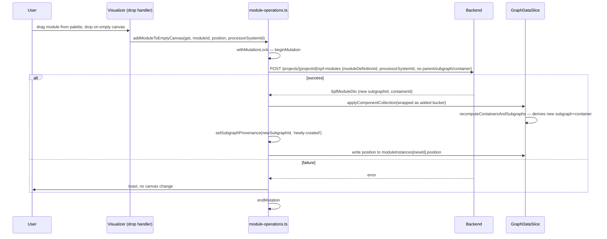
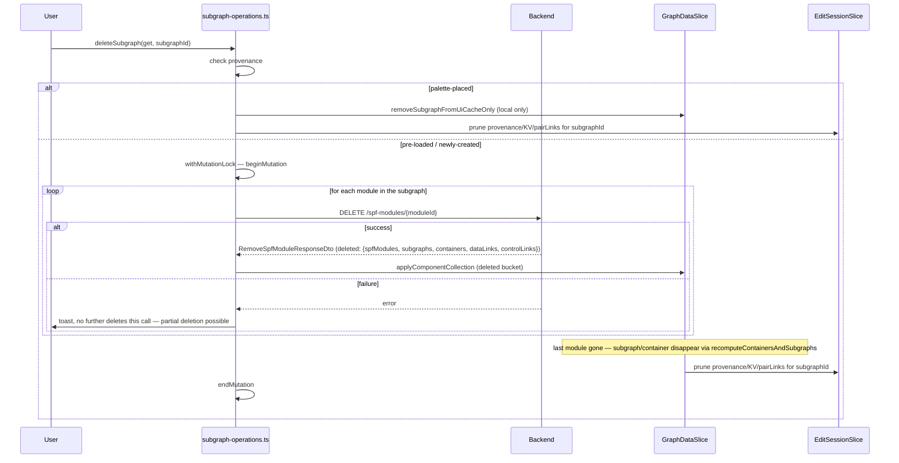
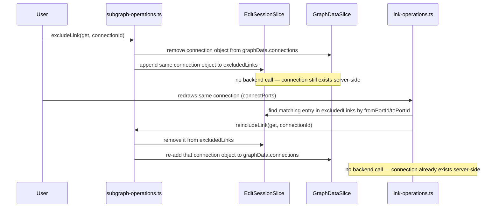

# Node Operations — Design

> Requirements: [requirements.md](requirements.md) §2–4, §6, §10, §13
> (FR-MOD-01–FR-CONT-03, FR-SUBSYS-01–06, FR-CTXMENU-01, FR-PROXY-01–02) — FR-CTXMENU-01 only for the
> per-node-type delete _dispatch logic_ §4.5 needs to resolve FR-SG-06/FR-SG-07/FR-SG-08;
> the context-menu wiring itself is Canvas UI Mechanics' per [§1](#1-scope)
>
> Parent LLD: [design.md](design.md) §2, §6.1–6.3, §7 (architecture,
> store composition, response reconciliation, and API shapes this doc builds
> on without repeating)
>
> Feature path: `packages/react-app/src/features/graph-designer/lib/`
> Backend endpoints: `POST /spf-modules`, `DELETE /spf-modules/{id}`,
> `PATCH /spf-modules/{id}` (rename, container-ID edit, module port counts),
> `POST /subsystems`, `DELETE /subsystems/{id}` (empty only),
> `PATCH /subsystems/{id}` (rename, subsystem port counts),
> `.../subsystems/{id}/components/move-in`,
> `.../subsystems/{id}/components/move-out` — container/subgraph delete and
> subsystem expand have no dedicated endpoint; each is a client-side
> composition of the above — see [§7](#7-api-surface)

---

## Table of Contents

1. [Scope](#1-scope)
2. [Shared Conventions](#2-shared-conventions)
3. [Module Operations](#3-module-operations)
4. [Subgraph Operations](#4-subgraph-operations)
5. [Container Operations](#5-container-operations)
6. [Subsystem Operations](#6-subsystem-operations)
7. [API Surface](#7-api-surface)
8. [Sequence Diagrams](#8-sequence-diagrams)
9. [Testing Strategy](#9-testing-strategy)
10. [Open Items Inherited](#10-open-items-inherited)

---

## 1. Scope

This doc designs the CRUD/mutation logic for the four structural entity
kinds — module, subgraph, container, subsystem — plus subgraph proxy node
operations (a thin alias over subgraph rename). It owns:

- Backend orchestration for every add/delete/rename/move/expand (only for subsystem) action
  listed in requirements §2–4, §6, §16.
- Module drop-target _resolution_ (`resolveModuleDropTarget`, mapping a drop
  target to the placement action and backend call it implies, including the
  two remaining client-side rejections — proxy node, subsystem node),
  exported for reuse by Canvas UI Mechanics' drag-over indicator.
- Provenance stamping moments — where `subgraphProvenanceById` gets written
  (not just read/pruned).

It does **not** own (per [design.md §6.4](design.md#64-feature-area-component-map)):

- Context menu item definitions/wiring, keyboard shortcut dispatch, or
  multi-select/batch-delete orchestration — Canvas UI Mechanics.
- Connection creation/deletion, port count changes — Link & Port. (DSP
  offload, FR-MDF-03, is deferred entirely, owned by neither doc — see
  [design.md §16](design.md#16-not-doing).)
- KV/CKV/TKV/Keys assignment — KV & Key Configuration.
- The response-reconciliation orchestrator itself
  (`applyComponentCollection`, `recomputeContainersAndSubgraphs`,
  `adjustSurvivingPortCounts`) — already specified in
  [design.md §6.3](design.md#63-response-reconciliation-shared-across-all-nodelinksubsystem-docs)
  and implemented in `graph-data-slice.ts`. This doc is a _consumer_ of
  that orchestrator.

---

## 2. Shared Conventions

### 2.1 File layout

One lib module per entity kind, in `features/graph-designer/lib/`:

- `module-operations.ts`
- `subgraph-operations.ts`
- `container-operations.ts`
- `subsystem-operations.ts`

Each file exports validation predicates and action functions for its entity
kind only. All backend-calling action functions for these four entities go
through these files — no component or context-menu handler calls an
`entities/*/api` function for these entities directly.

Each action function takes the store's `get: () => GraphDesignerStore`
(imperative accessor, matching the existing `withMutationLock` signature in
`edit-session-slice.ts`) as its first argument, plus whatever entity-specific
arguments it needs. None of these files hold their own state — they read
current state via `get()`. For writes, each file either:

- calls into an existing slice's own action — `get().applyComponentCollection`
  (cascading responses, `graph-data-slice.ts`) or `get().setSubgraphProvenance`
  (new action, added by this doc to `edit-session-slice.ts`; see
  [§2.3](#23-provenance-writes-added-to-editsessionslice)); or
- for a narrow single-field write with no home on an existing slice (a
  rename), writes directly via its own factory-closed `set` — see
  [§2.4](#24-narrow-direct-writes-closed-over-by-each-operations-factory).

No component or context-menu handler calls an `entities/*/api` function for
these entities directly, and no operations file's narrow writes leak into
`GraphDataSlice`'s or `EditSessionSlice`'s public interface — they stay
private to the operations file that performs them.

### 2.2 The mutation wrapper pattern

Every mutating action function (not validation predicates) follows the same
shape:

```typescript
export interface InnerActionOptions {
  /** Batch delete passes `true` — see §2.2's toast-suppression note. */
  suppressToast?: boolean;
}

export function createModuleOperations(
  set: StoreApi<GraphDesignerStore>['setState'],
  projectId: string,
) {
  return {
    deleteModuleInstance: async (
      get: () => GraphDesignerStore,
      moduleInstanceId: string,
    ): Promise<boolean> =>
      withMutationLock(get, () =>
        deleteModuleInstanceInner(get, moduleInstanceId),
      ),
    // ...other action functions, same closure
  };

  async function deleteModuleInstanceInner(
    get: () => GraphDesignerStore,
    moduleInstanceId: string,
    options?: InnerActionOptions,
  ): Promise<boolean> {
    const result = await deleteSpfModuleApi(projectId, moduleInstanceId);
    if (!result.success || !result.data) {
      if (!options?.suppressToast) {
        showToast(result.message ?? 'Failed to delete module', 'danger');
      }
      return false;
    }
    get().applyComponentCollection({
      added: EMPTY_COLLECTION,
      updated: EMPTY_COLLECTION,
      deleted: result.data.deleted,
    });
    return true;
  }
}
```

**Toast suppression, for batch delete.** Every `*Inner` function's signature
gains an optional trailing `options?: InnerActionOptions` parameter (defined
once, above, and imported by every operations file and by Link & Port's
`deleteLinkInner` — see
[link-and-port-design.md §5](link-and-port-design.md#5-link-deletion)).
When `options?.suppressToast` is `true`, the `*Inner` function's own
failure-path `showToast` call is skipped; every other behavior (return
value, state mutation on success) is unchanged. This exists because
[Canvas UI Mechanics' `deleteSelection`](canvas-ui-mechanics-design.md#41-deleteselection)
(FR-CANVAS-02) shows exactly one aggregate "N of M deletions succeeded"
toast for the whole batch — without suppression, a batch with failures
would _also_ show one raw per-entity toast per failed delete (each
`*Inner`'s own `showToast` call firing independently), which restates the
same failure less usefully than the one summary toast and is not the
intended UX. Every exported wrapper (`deleteModuleInstance`, and its
counterparts on the other three operations files) calls its `*Inner`
function with no `options` argument, so `suppressToast` defaults to
`undefined`/falsy and every non-batch caller (context menu, single-target
Delete key) keeps showing its own toast on failure, unchanged. Only
`deleteSelection`'s `DELETE_HANDLERS_INNER`/`deleteLinkInner` call sites
pass `{suppressToast: true}` — see
[canvas-ui-mechanics-design.md §4.1](canvas-ui-mechanics-design.md#41-deleteselection)
for how a suppressed failure is still logged at entity granularity so
FR-CANVAS-02's "failed roots' details are written to the log" holds.

This is the same call shape for every cascading action in this doc:
validate (if applicable) → `withMutationLock` → API call → on failure, toast
(unless suppressed) and return `false` with no state change → on success,
hand the response to `applyComponentCollection` (every endpoint in this doc
returns a component collection — link create, subsystem move-in/move-out,
and module delete's deleted-entities collection alike) or a narrow direct
write via the factory's own closed-over `set` (single-field
rename/port-count), then return `true`. No optimistic update, ever — this
is the uniform pattern `design.md` §11 requires across the whole feature,
not a per-entity choice.

**Every delete action is split into a lock-free `*Inner` function (the
actual API call + reconciliation, returning `Promise<boolean>`) and a
thin exported wrapper that runs it under `withMutationLock`.** This split
is driven by batch delete
([canvas-ui-mechanics-design.md §4](canvas-ui-mechanics-design.md#4-multi-select-and-batch-delete)):
batch delete needs to run multiple deletes — of different entity kinds —
under a _single_ outer lock, and `withMutationLock` throws if called while
`isMutating` is already true, so the deletes it dispatches to must not
each try to take the lock again. The `Inner` functions are exported
alongside their wrapped counterparts specifically so batch delete can call
them directly; every other caller (context-menu Delete, Properties panel,
single-target Delete-key dispatch) keeps calling the outer wrapped
function. Boolean returns let both the wrapper and any batch caller
distinguish a toasted failure from success without relying on promise
rejection (an internal-toast failure was never a rejection to begin with —
see [canvas-ui-mechanics-design.md §4.1](canvas-ui-mechanics-design.md#41-deleteselection)).

`get().projectId` does not exist on `GraphDesignerStore` today, so no action
function reads it from store state. Instead, each operations file exports a
factory whose returned action functions close over `projectId` directly,
since it's a construction-time constant, not reactive state a `get()` read
would need to stay live against. Three of the four factories —
`createModuleOperations(set, projectId)`, `createSubgraphOperations(set, projectId)`,
`createSubsystemOperations(set, projectId)` — also take `set`, since each
has at least one narrow direct write (see
[§2.4](#24-narrow-direct-writes-closed-over-by-each-operations-factory)).
`createContainerOperations(projectId)` does not take `set` at all — per
[§5](#5-container-operations), every Container Operations function routes
through `get().applyComponentCollection`, with no narrow write of its own to
close over. This mirrors how `createGraphDataSlice` itself takes
`(set, get, projectId)`, and matches how `graph-data-slice.ts`/
`subgraph-list-slice.ts` already close over `projectId` rather than storing
it. The factory's returned functions are composed once into the store the
same way slices are, and exposed via the existing feature `index.ts` barrel
for widgets to import. **Every code sample below that calls a backend API
function (§3.3, §4.5, §6.3, §7) is written against this closure — read
`projectId` as the enclosing factory's parameter, not `get().projectId`.**

### 2.3 Provenance writes added to `EditSessionSlice`

`edit-session-slice.ts` already declares `subgraphProvenanceById` and reads
it in `resetSessionLocalMaps`. This doc adds two actions to that slice's
interface:

```typescript
setSubgraphProvenance: (subgraphId: string, provenance: SubgraphProvenance) => void;
pruneSessionLocalMapsForSubgraph: (subgraphId: string) => void;
```

`setSubgraphProvenance` is written at three call sites, all inside this
doc's operations files (never inside `graph-data-slice.ts`'s reconciler,
which only _reads_/_prunes_ this map per `design.md` §6.3):

| Call site                                                                            | Provenance written                                                                                                        | Requirement           |
| ------------------------------------------------------------------------------------ | ------------------------------------------------------------------------------------------------------------------------- | --------------------- |
| `enterEditMode` (existing function in `edit-session-slice.ts`, extended by this doc) | Every subgraph present in `graphData.subgraphs` at entry → `'pre-loaded'`                                                 | Baseline for FR-SG-07 |
| `module-operations.ts`'s `addModuleToEmptyCanvas`                                    | The subgraph derived from the new module's `subgraphId`, after `applyComponentCollection` resolves it → `'newly-created'` | FR-MOD-03, FR-SG-10   |
| `subgraph-operations.ts`'s `placeSubgraphFromPalette`                                | The placed subgraph's own id → `'palette-placed'`                                                                         | FR-SG-01              |

Pruning (removing an entry from `subgraphProvenanceById`/`kvSelectionsById`/
`pairLinksById` when a subgraph no longer derives from surviving modules)
remains the reconciler's job for every cascading, backend-confirmed delete —
unchanged from `design.md` §6.3 point 2, this doc does not duplicate that
logic. `pruneSessionLocalMapsForSubgraph` exists only for the one path that
never reaches the reconciler at all: [§4.5](#45-delete-req-016a-req-016b-req-016c-req-048)'s
UI-cache-only removal of a `palette-placed` subgraph (FR-SG-06) has no
backend response for `applyComponentCollection` to prune after, so
`removeSubgraphFromUiCacheOnly` calls this action directly to keep
`EditSessionSlice` in the same shape a reconciler-driven prune would leave
it in.

### 2.4 Narrow direct writes closed over by each operations factory

Per [§2.2](#22-the-mutation-wrapper-pattern)'s revised factory signature,
`createModuleOperations`/`createSubgraphOperations`/`createSubsystemOperations`
each close over `set: StoreApi<GraphDesignerStore>['setState']` directly, the
same setter `graph-data-slice.ts` itself holds — so a narrow single-field
write is a private implementation detail of the operations file that
performs it, not a new action added to `GraphDataSlice`'s or
`EditSessionSlice`'s public interface, and **not a parameter any exported
function takes** — every exported action function's signature stays
`(get, ...args)`, identical to every cascading action in this doc, since
`set` is already in scope from the enclosing factory call. `renameModuleInstance`
([§3.4](#34-rename-req-010)), `renameSubgraph`
([§4.6](#46-rename-req-017-req-057)), `renameSubsystem`
([§6.4](#64-rename-req-031c)), `excludeLink`/`reincludeLink`
([§4.3](#43-exclude--re-include-fr-sg-03-fr-sg-04-fr-sg-04a)), and
`removeSubgraphFromUiCacheOnly` (an internal helper `deleteSubgraph` calls,
[§4.5](#45-delete-req-016a-req-016b-req-016c-req-048)) all follow this
shape: each calls its own factory-local `set` on success/invocation — no
cascade, no reconciliation, and no new surface for any other component to
call directly (the properties panel still only ever calls the exported
`renameModuleInstance`/etc. action functions, never a raw setter).

### 2.5 Drop-payload contract

No existing code defines what a module/subgraph palette drag actually
carries. This doc fixes it, since `module-operations.ts`/
`subgraph-operations.ts` are the first consumers:

- Module palette drag sets `dataTransfer` MIME type `application/json` with
  body `{kind: 'module', moduleId: string, processorSystemId: number}` —
  consistent with `usecase-visualizer.tsx`'s existing `handleDrop` already
  reading `application/json` generically (see `NodeDropPayload.dropData`).
  `processorSystemId` is the backend's `CreateSpfModuleRequestDto.processorSystemId`
  (required, per [§7](#7-api-surface)) — the module palette (Canvas UI
  Mechanics) resolves it from the dragged module definition's own processor
  info at drag-start and carries it in the payload verbatim; this doc's
  `parseModuleDropPayload` only validates/decodes it, never derives it.
- Subgraph palette drag sets MIME type
  `application/x-audioreach-node-type-subgraph` (already referenced by
  `usecase-visualizer.tsx`'s `handleDragOver` for its empty-canvas-only drag
  gating, but never paired with a body) with `application/json` body
  `{kind: 'subgraph', subgraphId: string}`.

Both files export a `parse*DropPayload(dropData: string)` helper
(`parseModuleDropPayload`, `parseSubgraphDropPayload`) that decode and
type-guard the body — malformed/mismatched-`kind` payloads return `null`,
which the caller (Canvas UI Mechanics' drop handler) treats as a no-op, not
an error toast (a malformed drop is a programming error in the drag source,
not a user-facing failure).

---

## 3. Module Operations

**File:** `features/graph-designer/lib/module-operations.ts`

### 3.1 Drop resolution (FR-MOD-01, FR-MOD-03, FR-MOD-04, FR-MOD-08)

A module-on-module drop **resolves to the container underneath** — it
resolves to the same placement as dropping onto that module's own container
(FR-MOD-01), since a module dragged to reposition
it already allows overlapping another module, and there's no UX reason to
treat a _palette_ drop differently. The module renders at the drop
coordinates and the user repositions afterward if the overlap is
undesirable. Proxy-node and subsystem-node targets are **rejected** —
neither has a container to resolve to (a proxy node represents a collapsed
subgraph with no visible container; a subsystem contains subgraphs, not
modules directly). See [requirements.md §3.2](requirements.md#32-module-operations)
for FR-MOD-08's full text.

```typescript
export type ModuleDropResolution =
  | {kind: 'container'; containerId: string}
  | {kind: 'subgraph-no-container'; subgraphId: string}
  | {kind: 'empty-canvas'}
  | {kind: 'rejected'};

export function resolveModuleDropTarget(
  target: AnyNode | 'empty-canvas',
): ModuleDropResolution {
  if (target === 'empty-canvas') return {kind: 'empty-canvas'};
  switch (target.nodeKind) {
    case NODE_KIND.CONTAINER:
      return {kind: 'container', containerId: String(target.containerId)};
    case NODE_KIND.SUBGRAPH:
      return {
        kind: 'subgraph-no-container',
        subgraphId: String(target.subgraphId),
      };
    case NODE_KIND.MODULE:
      if (!target.parentId) {
        throw new Error(
          `resolveModuleDropTarget: module node ${target.id} has no parentId — invariant violation, every ModuleNode must have its container as parentId`,
        );
      }
      return {kind: 'container', containerId: target.parentId};
    case NODE_KIND.SUBGRAPH_PROXY:
    case NODE_KIND.SUBSYSTEM:
      return {kind: 'rejected'};
  }
}
```

`target.parentId` (from `NodeBase`) is the module's immediate parent in the
rendered hierarchy, which for a `ModuleNode` is always its container —
`level-view-adapter.ts` already sets this when building the `LevelView`.
This is treated as a hard invariant, not an optional field: a `ModuleNode`
reaching this function without a `parentId` throws rather than silently
resolving to an empty `containerId`, since the latter would send a
malformed backend call instead of surfacing the violated assumption.
The `'rejected'` case is Canvas UI Mechanics' cue to show an invalid-drop
visual indicator and no-op the drop, for these two target kinds.

Exported for reuse by the Canvas UI Mechanics drag-over indicator (which
target kinds show the invalid cursor) — paste-target validation does not
reference this function, since copy/paste (FR-ENH-04/FR-ENH-05) is deferred to a
future design pass.

### 3.2 Add (FR-MOD-01, FR-MOD-03, FR-MOD-04)

Three entry points, keyed off `resolveModuleDropTarget`'s result — each
calls the same backend endpoint (`POST /spf-modules`) with different
arguments (`containerSystemId`, `subgraphSystemId`, or neither — see
[§7](#7-api-surface)), and, for the empty-canvas case only, a different
provenance write. All three take `processorSystemId` as their final parameter —
the drop payload's own field ([§2.5](#25-drop-payload-contract)), passed
through unchanged; none of these functions derive it themselves.

- `addModuleToContainer(get, containerId, moduleId, position, processorSystemId)` —
  FR-MOD-01. Called for both the `'container'` resolution (drop directly on a
  container or on a module, per [§3.1](#31-drop-resolution-req-004-req-006-req-007-req-011)).
  Backend response is a single `SpfModuleDto`. Wrapped into
  `{added: {spfModules: [dto], dataLinks: [], controlLinks: []}, updated: EMPTY_COLLECTION, deleted: EMPTY_COLLECTION}`
  and passed to `get().applyComponentCollection(...)` — reused rather than a
  hand-rolled insert, so the reconciler's existing container/subgraph
  re-derivation and new-port `totalLinksAtPort: 0` defaulting apply
  uniformly. After reconciliation, `position` is written to
  `graphData.moduleInstances[newId].position` via the
  `createModuleOperations(set, projectId)` factory's own closed-over `set`
  — the same narrow-write mechanism [§2.4](#24-narrow-direct-writes-closed-over-by-each-operations-factory)
  uses for renames (position is client-only per FR-POS-01/FR-POS-02, never sent to
  or echoed by the backend).
- `addModuleToEmptyCanvas(get, moduleId, position, processorSystemId)` — FR-MOD-03. Same
  wrap-and-reconcile as above. After `applyComponentCollection` returns,
  reads the newly reconciled module's `subgraphId` from
  `get().graphData.moduleInstances[newModuleId]` and calls
  `get().setSubgraphProvenance(subgraphId, 'newly-created')`.
- `addModuleToSubgraphNoContainer(get, subgraphId, moduleId, position, processorSystemId)` —
  FR-MOD-04. Same wrap-and-reconcile; no provenance write (subgraph already
  existed, already has a provenance entry).

Each function builds its own `CreateSpfModuleRequestDto` from its
arguments — `moduleDefinitionId: Number(moduleId)`, `processorSystemId`, and exactly
one of `containerSystemId`/`subgraphSystemId` set depending on which
function it is (`addModuleToEmptyCanvas` sets neither, letting the backend
create both a new subgraph and a new container per §7's DTO notes).

`EMPTY_COLLECTION` is a shared `const: ComponentCollectionDto = {spfModules: [], dataLinks: [], controlLinks: []}`
module-level constant in `module-operations.ts`, reused by all three
degenerate-wrap call sites above to avoid repeating the literal.

### 3.3 Delete (FR-MOD-05, FR-MOD-06)

`deleteModuleInstance(get, moduleInstanceId)` — thin `withMutationLock`
wrapper around `deleteModuleInstanceInner(get, moduleInstanceId):
Promise<boolean>`, per [§2.2](#22-the-mutation-wrapper-pattern) — the
`Inner` function is what batch delete
([canvas-ui-mechanics-design.md §4](canvas-ui-mechanics-design.md#4-multi-select-and-batch-delete))
calls directly, under its own single outer lock. Single call to `DELETE
/spf-modules/{id}`, returning `RemoveSpfModuleResponseDto {deleted:
{spfModules, subgraphs, containers, dataLinks, controlLinks}}` — id-only
arrays, not full DTOs, since the backend has already discarded the
entities by response time. `deleted.subgraphs`/`deleted.containers`
carry the ids of any subgraph/container that no longer has a surviving
module after this delete, resolved by the backend itself rather than
inferred client-side. On success, `result.data.deleted` is passed directly
as the "deleted" bucket to `get().applyComponentCollection({added:
EMPTY_COLLECTION, updated: EMPTY_COLLECTION, deleted: result.data.deleted})`
— the same reconciliation call every other cascading action in this doc
uses. This naturally drops the container/subgraph once their last module
is gone (`recomputeContainersAndSubgraphs`) and prunes
`subgraphProvenanceById`/`kvSelectionsById`/`pairLinksById` for every id in
`deleted.subgraphs` — the reconciler's existing pruning step
(design.md §6.3 point 2), unchanged from every other delete path.
`deleted.containers` has no session-local map of its own and is otherwise
unused — a container disappears purely as a side effect of
`recomputeContainersAndSubgraphs`.

### 3.4 Rename (FR-MOD-07)

`renameModuleInstance(get, moduleInstanceId, newAlias)` — narrow-response
endpoint (`PATCH /spf-modules/{id}` with `{alias: newAlias}`, returning the
full `SpfModuleDto`, not `void` — the same endpoint port-count changes and
container-ID edits use, per
[design.md §7.1](design.md#71-confirmed-endpoints)). On success, writes
directly via the `createModuleOperations(set, projectId)` factory's own
closed-over `set`, per
[§2.4](#24-narrow-direct-writes-closed-over-by-each-operations-factory) —
this doc only reads `result.data.alias` back onto `displayName`, not the
whole returned entity, since the other fields are already known-current:

```typescript
async function renameModuleInstance(
  get: () => GraphDesignerStore,
  moduleInstanceId: string,
  newAlias: string,
): Promise<void> {
  await withMutationLock(get, async () => {
    const result = await patchSpfModuleApi(projectId, moduleInstanceId, {
      alias: newAlias,
    });
    if (!result.success || !result.data) {
      showToast(result.message ?? 'Failed to rename module', 'danger');
      return;
    }
    if (!get().graphData?.moduleInstances[moduleInstanceId]) {
      logger.warn(
        `no local module instance for ${moduleInstanceId}, skipping state write`,
      );
      return;
    }
    set((s) => ({
      graphData: s.graphData && {
        ...s.graphData,
        moduleInstances: {
          ...s.graphData.moduleInstances,
          [moduleInstanceId]: {
            ...s.graphData.moduleInstances[moduleInstanceId],
            displayName: result.data.alias,
          },
        },
      },
    }));
    get().markDirty();
  });
}
```

This is the narrow-write pattern `design.md` §2's architectural principle
requires for every properties-panel edit — landing in `GraphDataSlice`
directly rather than a panel-local store, so canvas and any other open
panel observe the rename. The explicit `markDirty()` call is necessary
here specifically because rename bypasses `applyComponentCollection`
(design.md §6.3 point 5's `markDirty` call lives inside that reconciler,
which the add/delete paths funnel through but rename does not).

The existence guard before the write handles a stale panel reference: the
module could have been removed by a sibling action (e.g. a delete
dispatched from elsewhere in the same edit session) between the panel
issuing the rename and this PATCH resolving. Every narrow-write rename
(`renameSubgraph`, `renameSubsystem`) must perform the same
look-up-then-skip-if-gone check before writing back its own field.

---

## 4. Subgraph Operations

**File:** `features/graph-designer/lib/subgraph-operations.ts`

### 4.1 Drop placement (FR-SG-01, FR-SG-11)

A subgraph palette drop always
succeeds and renders at the drop coordinates regardless of visual overlap
with anything underneath, including a subgraph-proxy node (the placed
subgraph's contents render overlapping the proxy; the proxy itself is
unaffected). There is no `canDropSubgraphOn`/drop-resolution function for
subgraphs — unlike modules, there is no case where the target underneath
changes _which_ backend call is made; `placeSubgraphFromPalette` always
does the same fetch-and-render regardless of target. See
[requirements.md §3.3](requirements.md#33-subgraph-operations) for
FR-SG-11's full text.

Dropping onto a subsystem, or while the canvas is in subsystem level, is
still prevented — but one layer up, by the subgraph palette being disabled
entirely (FR-PAL-01, Canvas UI Mechanics' concern, not this doc's).

### 4.2 Palette placement (FR-SG-01, FR-SG-02)

`placeSubgraphFromPalette(get, subgraphId, position)`:

1. Call `getSubgraphContents(subgraphId)` → `ComponentCollectionDto` (every
   entry `changeType: 'NONE'` — a snapshot, not a delta). On failure, show
   an error toast ("Failed to load subgraph contents") and abort — steps
   2–4 do not run, and no placement occurs.
   If the response succeeds but `spfModules` is empty, treat it as an invalid
   backend response: show a danger toast, return `false`, and do not mutate
   graph state or session-local subgraph maps. Persisted subgraphs are not
   valid without at least one module.
2. Merge into `graphData` via the reconciler's **leaf upsert helpers
   directly** (`upsertModule`, `upsertLink` from `graph-data-slice.ts`) —
   _not_ the full `applyComponentCollection` orchestrator. This is a
   snapshot merge of already-existing backend entities being surfaced for
   the first time, not a delta with a deletion bucket or port-count
   adjustment to reconcile; running it through the full orchestrator would
   incorrectly attempt both. A synchronous client-side merge with no
   backend call of its own, so it has no independent failure mode — it
   only runs once step 1 has already succeeded.
3. `get().setSubgraphProvenance(subgraphId, 'palette-placed')`.
4. Independently (its own try/catch, no shared failure with steps 1–3 —
   see [design.md §11](design.md#11-error-handling)'s "independent failure
   domains"), call `getSubgraphPairs(subgraphId)` →
   `SubgraphPairDto[]`. For each pair where the _other_ subgraph in the pair
   is already present in `graphData.subgraphs`:
   - Store the pair in `pairLinksById`, keyed by a synthetic id
     (`` `${sourceSubgraphSystemId}:${destinationSubgraphSystemId}` ``,
     stable regardless of which side is "new" this drop vs. a future one).
   - Merge each of the pair's `dataLinks`/`controlLinks` into
     `graphData.connections` as ordinary `Connection` entries (mapped
     through the same `DataLinkDto`/`ControlLinkDto` → `Connection`
     shaping `graph-data-slice.ts`'s `loadGraphData` already does, factored
     into a shared `toConnection(dto, type)` helper both call).
   - A `getSubgraphPairs` failure logs and shows a toast
     ("Could not load linked-subgraph connections for this subgraph") but
     does not undo steps 1–4 — the subgraph placement itself already
     succeeded.

### 4.3 Exclude / re-include (FR-SG-03, FR-SG-04, FR-SG-04a)

```typescript
function excludeLink(get: () => GraphDesignerStore, connectionId: string): void;
function reincludeLink(
  get: () => GraphDesignerStore,
  connectionId: string,
): void;
```

Both are pure client-side state toggles — no backend call (FR-SG-03 is
explicit that excluding does not delete the connection from the backend).
Like the narrow-write renames in
[§2.4](#24-narrow-direct-writes-closed-over-by-each-operations-factory),
these mutate `graphData.connections` and `excludedLinks` directly via the
`createSubgraphOperations(set, projectId)` factory's own closed-over
`set` — `set` stays a closure variable captured when the factory is
constructed, not a parameter callers pass in, so the exported signature is
still just `(get, connectionId)`, matching every other Node Operations call
site Canvas UI Mechanics dispatches to (its `'exclude-link'` action maps
one-to-one to this function per
[canvas-ui-mechanics-design.md §2.2](canvas-ui-mechanics-design.md#22-onactionactionid-string-target-contextmenutarget-void)).
`excludedLinks` holds the full `Connection` object (per `design.md` §6.1's
`EditSessionSlice` shape), not just an id, so neither direction needs a
`pairLinksById` lookup: `excludeLink` removes the connection object from
`graphData.connections` (so it disappears from canvas per FR-SG-04) and
appends that same object to `excludedLinks`. `reincludeLink` reverses both
using the object already in hand: finds it in `excludedLinks` by
`connectionId`, removes it from `excludedLinks`, and re-adds it to
`graphData.connections` — no `pairLinksById` search required.

`reincludeLink`'s only trigger is **redrawing a connection between the same
two ports as an excluded link** (FR-SG-04a) — there is no context-menu
"Include Link"/"Re-include Link" item, since an excluded link has no on-canvas
edge to right-click once FR-SG-04 removes it from `graphData.connections`.
`connectPorts`
([link-and-port-design.md §2.3](link-and-port-design.md#23-cross-subsystem-and-cross-dsp-bridging-req-026-027-055))
checks `excludedLinks` for a matching `fromPortId`/`toPortId` pair before
doing anything else; on a match it calls `reincludeLink` directly and returns
— no backend call, since the connection already exists server-side and there
is nothing to create. Only when there is no matching excluded link does
`connectPorts` fall through to its normal `canConnectPorts` → backend-call
path.

### 4.4 Duplicate-placement guard (FR-SG-05)

No new state. The subgraph palette (Canvas UI Mechanics) checks
`subgraphId in graphData.subgraphs` directly to grey out an already-placed
entry — presence in `graphData.subgraphs` is authoritative regardless of
provenance, so this doc adds no separate "already placed" flag.

### 4.5 Delete (FR-SG-06, FR-SG-07, FR-SG-08, FR-CTXMENU-01)

`deleteSubgraph(get, subgraphId)` dispatches on provenance. **There is no
dedicated subgraph-delete endpoint** — per
[design.md §7.2](design.md#72-deletemoveexpand-response-shapes-no-single-shared-envelope),
this is achieved by calling `DELETE /spf-modules/{id}` for every module in
the subgraph; the subgraph disappears as the side effect of its last module
going, same as container delete. Shown here as a
method on the `createSubgraphOperations(set, projectId)` factory introduced
in [§2.2](#22-the-mutation-wrapper-pattern), so `projectId` is the closure
parameter, not `get().projectId`:

```typescript
async function deleteSubgraphInner(
  get: () => GraphDesignerStore,
  subgraphId: string,
  options?: InnerActionOptions,
): Promise<boolean> {
  const provenance = get().subgraphProvenanceById[subgraphId];
  if (provenance === 'palette-placed') {
    // FR-SG-06: UI-cache-only removal, no backend call, so no toast path to suppress.
    removeSubgraphFromUiCacheOnly(get, subgraphId);
    return true;
  }
  // FR-SG-07 (pre-loaded) / FR-SG-08 (newly-created):
  // delete every module in the subgraph.
  const moduleIds = Object.values(get().graphData!.moduleInstances)
    .filter((m) => m.subgraphId === subgraphId)
    .map((m) => m.moduleInstanceId);
  for (const moduleId of moduleIds) {
    const result = await deleteSpfModuleApi(projectId, moduleId);
    if (!result.success || !result.data) {
      if (!options?.suppressToast) {
        showToast(result.message ?? 'Failed to delete subgraph', 'danger');
      }
      return false; // partial deletion possible — see note below
    }
    get().applyComponentCollection({
      added: {spfModules: [], dataLinks: [], controlLinks: []},
      updated: {spfModules: [], dataLinks: [], controlLinks: []},
      deleted: result.data.deleted,
    });
  }
  return true;
}

async function deleteSubgraph(
  get: () => GraphDesignerStore,
  subgraphId: string,
): Promise<boolean> {
  return withMutationLock(get, () => deleteSubgraphInner(get, subgraphId));
}
```

Split into a lock-free `Inner` function and a thin wrapper per
[§2.2](#22-the-mutation-wrapper-pattern) — `deleteSubgraphInner` is what
batch delete calls directly under its own single outer lock; `deleteSubgraph`
is unchanged for every other caller (context menu, single-target Delete key).

**Partial-failure note, not resolved here:** if a mid-loop `DELETE
/spf-modules/{id}` call fails, earlier modules in the loop are already
deleted server-side while later ones remain — there is no atomic
multi-module delete to fall back on. This mirrors the same
sequential-calls-with-no-atomicity gap already flagged for paste
(FR-ENH-04/FR-ENH-05, deferred) — see
[design.md §13](design.md#13-performancescalability-considerations) — but
applies here to an in-scope, must-have action rather than a deferred one.
Flagged as a new open item in [§10](#10-open-items-inherited); the current
design accepts the risk rather than adding client-side rollback logic for
it.

`removeSubgraphFromUiCacheOnly(get, subgraphId)` removes the subgraph, its
containers, and its modules/links from `graphData` directly via the
factory's own closed-over `set` (private to the same
`createSubgraphOperations` closure `deleteSubgraph` itself is defined in, so
it doesn't need `set` passed in as a parameter, same as
[§2.4](#24-narrow-direct-writes-closed-over-by-each-operations-factory)'s
renames) — mirroring the reconciler's own container/subgraph re-derivation,
but locally, since there is no backend response to reconcile against — and
calls `get().pruneSessionLocalMapsForSubgraph(subgraphId)` — see
[§2.3](#23-provenance-writes-added-to-editsessionslice) — to prune the
provenance/KV/pairLinks entries for this subgraph id, same as the
reconciler's own pruning step for a real delete, kept consistent so a
palette-placed and a real delete leave `EditSessionSlice` in the same shape
afterward.

### 4.6 Rename (FR-SG-09, FR-PROXY-02)

`renameSubgraph(get, subgraphId, newName)` — narrow-response endpoint
(`PATCH /subgraphs/{id}` with `{name: newName}`, returning the full
`SubgraphDto`), the same treatment as module rename
(`PATCH /spf-modules/{id}`) and subsystem rename (`PATCH /subsystems/{id}`).
**This endpoint is not present in the current backend swagger** — the
backend team has committed to adding it (see [design.md §9](design.md#9-open-questions)),
but it does not exist yet; `renameSubgraph`/subgraph-proxy rename cannot be
implemented against a real endpoint until it lands. Flagged in
[§10](#10-open-items-inherited); does not block this doc's other sections
(Module/Container/Subsystem Operations have no dependency on subgraph
rename). On success, writes directly via
`createSubgraphOperations(set, projectId)`'s own closed-over `set` to
`graphData.subgraphs[subgraphId].subgraphName`, same shape as
`renameModuleInstance`. Also the target of FR-PROXY-02 (subgraph proxy
rename) — Canvas UI Mechanics' properties panel calls this same function
regardless of whether the user selected the full subgraph node or its
collapsed proxy, since both represent the same underlying `subgraphId`. No
separate proxy rename function exists.

### 4.7 Subgraph proxy node connection restriction (FR-PROXY-01)

```typescript
export const CAN_CONNECT_TO_PROXY_NODE = false;
```

A constant, not a function — FR-PROXY-01 is an unconditional restriction (proxy
node ports are never valid connection endpoints, full stop), so there is no
input this predicate would branch on. Filed under Subgraph Operations rather
than Subsystem Operations since the restriction is about the subgraph proxy
node itself (§1's scope groups proxy node operations alongside subgraph
operations), not any subsystem concern. Exported for Link & Port's
connection validation to consume directly rather than re-deriving the rule.

---

## 5. Container Operations

**File:** `features/graph-designer/lib/container-operations.ts`

Containers have no palette drop and no explicit create (FR-CONT-03 — created
only as a side effect of `addModuleToEmptyCanvas`/
`addModuleToSubgraphNoContainer` in Module Operations) and no rename
(FR-CONT-02). This file is correspondingly thin:

- `deleteContainers(get, containerIds)` — FR-CONT-01. **No dedicated
  endpoint** — per
  [design.md §7.2](design.md#72-deletemoveexpand-response-shapes-no-single-shared-envelope),
  achieved by calling `DELETE /spf-modules/{id}` for every module in each
  container, same composition as subgraph delete
  ([§4.5](#45-delete-req-016a-req-016b-req-016c-req-048)); each container
  disappears
  as the side effect of its last module going. The public `deleteContainers`
  wrapper takes the mutation lock once for the whole container batch and calls
  `deleteContainerInner(get, containerId, options?: InnerActionOptions): Promise<boolean>`
  for each deduped container id. `deleteContainerInner` returns `false` on
  the same mid-loop failure this section's partial-failure caveat describes,
  `true` otherwise, honors `options?.suppressToast` the same as every other
  `*Inner` function, and is what broader batch delete calls directly.

---

## 6. Subsystem Operations

**File:** `features/graph-designer/lib/subsystem-operations.ts`

### 6.1 Move validation (FR-SUBSYS-01)

```typescript
export function canMoveToSubsystem(
  candidateId: string,
  targetSubsystemId: string,
): boolean {
  return candidateId !== targetSubsystemId;
}
```

Excludes only direct self-nesting (a subsystem being offered as its own
destination) — this is the one client-side guard FR-SUBSYS-01 specifies.
Rejecting a descendant-nesting cycle (moving a subsystem into one of its
own descendants) is left to the backend, per `design.md` §9's open
question — not re-solved here. The context-menu destination picker
(Canvas UI Mechanics) calls this to filter the subsystem list it offers.

### 6.2 Move / remove (FR-SUBSYS-01, FR-SUBSYS-04, FR-SUBSYS-05)

- `moveToSubsystem(get, nodeId, destination: {subsystemId: string} | {createNew: true, name: string})` —
  FR-SUBSYS-01. `nodeId` is a subgraph or subsystem id only — modules
  cannot be moved into a subsystem directly (no context-menu item exists
  for it, per
  [canvas-ui-mechanics-design.md §2.1](canvas-ui-mechanics-design.md#21-getitemstarget-contextmenutarget-contextmenuitem)'s
  `'module'` row); a module moves indirectly whenever its containing
  subgraph moves. Two cases:
  - **Existing subsystem**: single call,
    `POST /subsystems/{id}/components/move-in {componentSystemIds: [nodeId]}`,
    returning `MoveSubsystemComponentsResponseDto {added, updated, removed}`
    per [design.md §7.1](design.md#71-confirmed-endpoints).
  - **New subsystem**: two sequential calls — `POST /subsystems {name}`
    (`CreateSubsystemRequestDto`, returns `SubsystemDto`) to create the
    shell, then `POST /subsystems/{newSubsystemId}/components/move-in`
    with the same request/response shape as the existing-subsystem case.
    If the first call succeeds but the second fails, the empty subsystem
    is left behind server-side with nothing moved into it — flagged as an
    open item in [§10](#10-open-items-inherited), no client-side
    rollback (delete-the-just-created-subsystem-on-failure) is built.
  - Both cases funnel their `move-in` response through one
    `applyComponentCollection` call — `added`/`updated`/`removed` map onto
    the reconciler's existing added/updated/deleted bucket handling
    one-to-one, including its `subsystems` bucket support for the
    new-subsystem case's `SubsystemDto`.
- `removeFromSubsystem(get, nodeId)` — FR-SUBSYS-05, same subgraph/subsystem-only
  scope as `moveToSubsystem` above. `POST
/subsystems/{id}/components/move-out {componentSystemIds: [nodeId]}`,
  same `{added, updated, removed}` response shape. The now-possibly-empty
  subsystem is never deleted by this call (FR-SUBSYS-04) — `move-out`'s own
  response never includes a deleted-subsystem entry, so "not deleted" is
  the response's default behavior, not something this doc has to suppress.

### 6.3 Delete (FR-SUBSYS-02)

`deleteSubsystem(get, subsystemId)` — **`DELETE /subsystems/{id}` only
removes an empty subsystem**, per
[design.md §7.1](design.md#71-confirmed-endpoints) — confirmed correct
backend behavior, not a gap. FR-SUBSYS-02 is written to match this contract:
the context-menu Delete item is only enabled when the subsystem has no
remaining children (subgraphs, modules, containers, or links); a
non-empty subsystem's own Delete item is disabled, with a tooltip pointing
the user at Expand ([§6.5](#65-expand-req-032)) instead. This doc does
**not** have `deleteSubsystem` itself compose a move-out-then-delete
sequence — that composition already exists as Expand, a distinct
user-facing action with its own requirement (FR-SUBSYS-06); `deleteSubsystem`
only ever calls `DELETE /subsystems/{id}` directly. If it is somehow
invoked on a non-empty subsystem regardless (e.g. a stale menu state, or
via the Delete key which has no per-target enablement gate), the backend
rejects the call and this doc treats that rejection as an ordinary
toast-and-no-change failure per this doc's uniform error pattern; on
success it writes the returned `SubsystemDto`'s removal directly (removing
`graphData.subsystems[subsystemId]`) — no
`applyComponentCollection` call, since the response carries only the one
deleted `SubsystemDto`, not a collection. Same `deleteSubsystemInner(get,
subsystemId, options?: InnerActionOptions): Promise<boolean>` / `deleteSubsystem`
split as the other three delete actions ([§2.2](#22-the-mutation-wrapper-pattern)) —
`false` on the toasted-rejection path above (suppressible via
`options?.suppressToast`, same as every other `*Inner` function), `true` on
success; `deleteSubsystemInner` is what batch delete calls directly.

### 6.4 Rename (FR-SUBSYS-03)

`renameSubsystem(get, subsystemId, newName)` — `PATCH /subsystems/{id}`
with `{name: newName}` (`PatchSubsystemRequestDto`), returning the full
`SubsystemDto` — the same endpoint subsystem port-count changes use, per
[design.md §7.1](design.md#71-confirmed-endpoints). On success, writes
`result.data.name` onto `graphData.subsystems[subsystemId].subsystemName`
via `createSubsystemOperations(set, projectId)`'s own closed-over `set`,
same narrow-write treatment as module/subgraph rename.

### 6.5 Expand (FR-SUBSYS-06)

`expandSubsystem(get, subsystemId)` — **no dedicated endpoint.** Per
[design.md §7.2](design.md#72-deletemoveexpand-response-shapes-no-single-shared-envelope),
this doc composes it from two calls:

1. `POST /subsystems/{subsystemId}/components/move-out` with every direct
   child's `componentSystemId` — promotes every child up to the
   subsystem's own parent level. Response is
   `MoveSubsystemComponentsResponseDto {added, updated, removed}`,
   reconciled via `applyComponentCollection` same as
   [§6.2](#62-move--remove-req-031a-req-031d-req-031e).
2. `DELETE /subsystems/{subsystemId}` — now empty after step 1, so this
   succeeds per [§6.3](#63-delete-req-031b)'s empty-only contract. On
   success, removes `graphData.subsystems[subsystemId]` directly (not
   through `applyComponentCollection`, same as §6.3).

If step 1 succeeds but step 2 fails (e.g. a concurrent move added a new
child in between), the subsystem is left behind, now empty, with its
former children already promoted — a partial-expand state, not designed
around further; flagged in [§10](#10-open-items-inherited) alongside the
other multi-call partial-failure gaps
([§4.5](#45-delete-req-016a-req-016b-req-016c-req-048),
[§5](#5-container-operations)).

---

## 7. API Surface

`createSpfModule`/`deleteSpfModule`/`patchSpfModule` live in
`entities/spf-modules/api/spf-modules-api.ts` — their own entity, alongside
the request/response DTOs in `entities/spf-modules/model/spf-module-crud.dto.ts`
(`CreateSpfModuleRequestDto`, `PatchSpfModuleRequestDto`,
`RemoveSpfModuleResponseDto`), since they're a module-domain REST resource
(`/spf-modules`) rather than a usecase operation; `SpfModuleDto` itself
stays in `entities/usecases/model/usecase-component.dto.ts`; and the module
CRUD functions import it from there for their return types. Every other
addition below — `getSubgraphContents`/`getSubgraphPairs`/`renameSubgraph`
and the subsystem functions — goes in `entities/usecases/api/usecases-api.ts`,
alongside every existing function already there (`getAllUsecases`,
`getUsecaseComponents`, etc.). Confirmed against the current backend
swagger, per [design.md §7](design.md#7-api-design). Every path below is
project-scoped (`/projects/{projectId}/...`) — `design.md` §7's own table
omits the `/projects/{projectId}` prefix for brevity; this doc's table is
the corrected, literal path each function calls. Several requirements in
this doc (container/subgraph delete, container-ID edit, subsystem expand)
have **no endpoint of their own** — they're compositions of the
module/subsystem endpoints below, called once per affected module/child
rather than through a single cascading call; see each operation's own
section for the composition.

| Function                     | Method | Path                                                        | Request                                                                                                                                       | Response                                                                                                                                                     |
| ---------------------------- | ------ | ----------------------------------------------------------- | --------------------------------------------------------------------------------------------------------------------------------------------- | ------------------------------------------------------------------------------------------------------------------------------------------------------------ |
| `createSpfModule`            | POST   | `/projects/{projectId}/spf-modules`                         | `CreateSpfModuleRequestDto {moduleDefinitionSystemId, processorSystemId, parentSystemId?, subgraphSystemId?, containerSystemId?}` — see below | `SpfModuleDto`                                                                                                                                               |
| `deleteSpfModule`            | DELETE | `/projects/{projectId}/spf-modules/{id}`                    | —                                                                                                                                             | `RemoveSpfModuleResponseDto {deleted: {spfModules, subgraphs, containers, dataLinks, controlLinks}}` — every array is `string[]` of systemIds, not full DTOs |
| `patchSpfModule`             | PATCH  | `/projects/{projectId}/spf-modules/{id}`                    | `{alias?, containerSystemId?, maxInputPortsSupported?, maxOutputPortsSupported?, maxControlPortsSupported?}`                                  | `SpfModuleDto` — covers module rename (§3.4) and container-ID edit (§5)                                                                                      |
| `getSubgraphContents`        | GET    | `/projects/{projectId}/subgraphs/{id}/components`           | —                                                                                                                                             | `ComponentCollectionDto`                                                                                                                                     |
| `getSubgraphPairs`           | GET    | `/projects/{projectId}/subgraphs/{id}/subgraph-pairs`       | —                                                                                                                                             | `SubgraphPairDto[]`                                                                                                                                          |
| `renameSubgraph`             | PATCH  | `/projects/{projectId}/subgraphs/{id}`                      | `{name: string}`                                                                                                                              | `SubgraphDto` — see [§4.6](#46-rename-req-017-req-057). **Endpoint not present in current swagger — backend-committed, not yet landed.**                     |
| `createSubsystem`            | POST   | `/projects/{projectId}/subsystems`                          | `CreateSubsystemRequestDto {name, parentId?}`                                                                                                 | `SubsystemDto`                                                                                                                                               |
| `deleteSubsystem`            | DELETE | `/projects/{projectId}/subsystems/{id}`                     | —                                                                                                                                             | `SubsystemDto` — **empty subsystem only**, no cascade                                                                                                        |
| `patchSubsystem`             | PATCH  | `/projects/{projectId}/subsystems/{id}`                     | `{name?, maxInputDataPortsSupported?, maxOutputDataPortsSupported?, maxControlPortsSupported?}`                                               | `SubsystemDto` — covers subsystem rename (§6.4) and subsystem port counts                                                                                    |
| `moveSubsystemComponentsIn`  | POST   | `/projects/{projectId}/subsystems/{id}/components/move-in`  | `MoveSubsystemComponentsRequestDto {componentSystemIds}`                                                                                      | `MoveSubsystemComponentsResponseDto {added, updated, removed}`                                                                                               |
| `moveSubsystemComponentsOut` | POST   | `/projects/{projectId}/subsystems/{id}/components/move-out` | `MoveSubsystemComponentsRequestDto {componentSystemIds}`                                                                                      | `MoveSubsystemComponentsResponseDto {added, updated, removed}`                                                                                               |

**`CreateSpfModuleRequestDto`'s full shape** (backend, per the current
swagger export's `components.schemas.CreateSpfModuleRequestDto`):

```typescript
interface CreateSpfModuleRequestDto {
  moduleDefinitionId: number; // the module definition's numeric id — NOT the string `systemId` this doc's `moduleId` params carry elsewhere; see the construction note below
  processorSystemId: number; // required — the target processor's numeric id, carried in the drop payload per §2.5, not derived here
  parentSystemId?: number;
  subgraphSystemId?: number; // omitted → backend creates a new subgraph
  containerSystemId?: number; // omitted → backend creates a new container
}
```

`moduleId` (the string parameter every `add*` function in §3.2 takes) is
`ModuleDefinition.moduleId` (`module-list-slice.ts`, itself
`String(dto.moduleId)`) — this doc's construction sites convert it back to
a number (`Number(moduleId)`) for the `moduleDefinitionId` field, since the
wire DTO's numeric type is the backend module definition's own primary
key, unrelated to any entity's `systemId` string. This is the same
already-established string/numeric split every other DTO in this feature
carries (`SpfModuleDto.moduleId: number` vs. `SpfModuleDto.systemId:
string`) — not a new convention.

---

## 8. Sequence Diagrams

### Sequence: Module Drop on Empty Canvas (FR-MOD-03)



### Sequence: Delete Subgraph — Cascading to Container/Subgraph (FR-SG-07/FR-SG-08)



### Sequence: Exclude Link Reversal (FR-SG-03/FR-SG-04/FR-SG-04a)



`reincludeLink` has no other trigger: there is no context-menu "Include
Link"/"Re-include Link" item, since FR-SG-04 removes the excluded link's edge
from canvas, leaving nothing to right-click. Redrawing the same connection
(FR-SG-04a) is the only documented way a user reverses an exclusion — see
[link-and-port-design.md §2.3 step 0](link-and-port-design.md#23-cross-subsystem-and-cross-dsp-bridging-req-026-027-055).

---

## 9. Testing Strategy

Extends [design.md §14](design.md#14-testing-strategy)'s feature-wide
strategy with the cases specific to this doc's logic:

- **Unit — drop resolution**: `resolveModuleDropTarget` for every
  `AnyNode['nodeKind']` plus `'empty-canvas'` — container/subgraph/module
  targets resolve to a placement (module-on-module resolving to the
  underlying `containerId` via `parentId`), proxy-node/subsystem-node
  targets resolve to `'rejected'`; `canMoveToSubsystem` self-nesting
  rejection.
- **Unit — provenance stamping**: `addModuleToEmptyCanvas` stamps
  `'newly-created'` on the correct derived subgraph id;
  `placeSubgraphFromPalette` stamps `'palette-placed'`; `enterEditMode`
  seeds every pre-existing subgraph as `'pre-loaded'`.
- **Unit — narrow-write renames**: `renameModuleInstance`/`renameSubsystem`/
  `renameSubgraph` each write only their own field, leaving the rest of the
  affected entity and all sibling entities unchanged.
- **Unit — pair-link merge**: `placeSubgraphFromPalette`'s pairs step only
  renders a pair when the _other_ side is already on canvas; a
  `getSubgraphPairs` failure leaves the subgraph itself placed
  (independent-failure-domain check).
- **Unit — multi-call composition, partial failure**: `deleteSubgraph` and
  `deleteContainers` per-module delete loops stop and toast on the first
  failed call, leaving earlier-in-loop deletes already applied — assert the
  loop does not attempt rollback and does not continue past the first
  failure. `moveToSubsystem`'s new-subsystem path:
  assert behavior when `POST /subsystems` succeeds but the subsequent
  `move-in` fails (empty subsystem left behind, no rollback).
  `expandSubsystem`: assert behavior when `move-out` succeeds but the
  final `DELETE /subsystems/{id}` fails (children already promoted,
  subsystem shell left behind).
- **Integration**: full `addModuleToContainer`/`deleteModuleInstance`/
  `moveToSubsystem`/`expandSubsystem` round-trips against a mocked backend,
  asserting final `graphData` shape and that `EditSessionSlice` maps
  (`subgraphProvenanceById`, `pairLinksById`, `excludedLinks`) end up
  consistent after cascading deletes prune them.

---

## 10. Open Items Inherited

Carried from [design.md §9](design.md#9-open-questions), unresolved by this
doc (either backend-owned or explicitly deferred):

- **New: partial-failure risk in every multi-call composition this doc
  introduces** to work around the lack of dedicated cascading endpoints —
  `deleteSubgraph` and `deleteContainers` per-module delete loops
  ([§4.5](#45-delete-req-016a-req-016b-req-016c-req-048),
  [§5](#5-container-operations)), `moveToSubsystem`'s create-then-move-in
  for a new subsystem, and `expandSubsystem`'s
  move-out-then-delete ([§6.2](#62-move--remove-req-031a-req-031d-req-031e)/[§6.5](#65-expand-req-032)).
  None of these have client-side rollback; a mid-sequence failure leaves a
  partially-applied result. Accepted risk, not solved here.
- Whether `move-in` rejects a descendant-nesting cycle
  (client-side guard here only excludes direct self-nesting).
- Whether a port-count decrease can sever links as a side effect —
  not this doc's concern (Link & Port).
