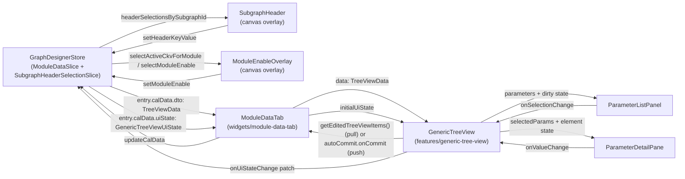
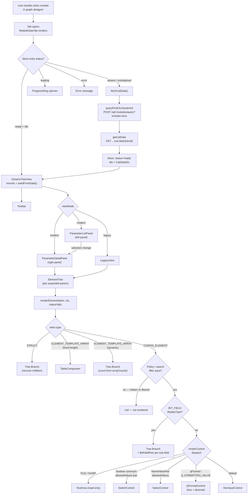
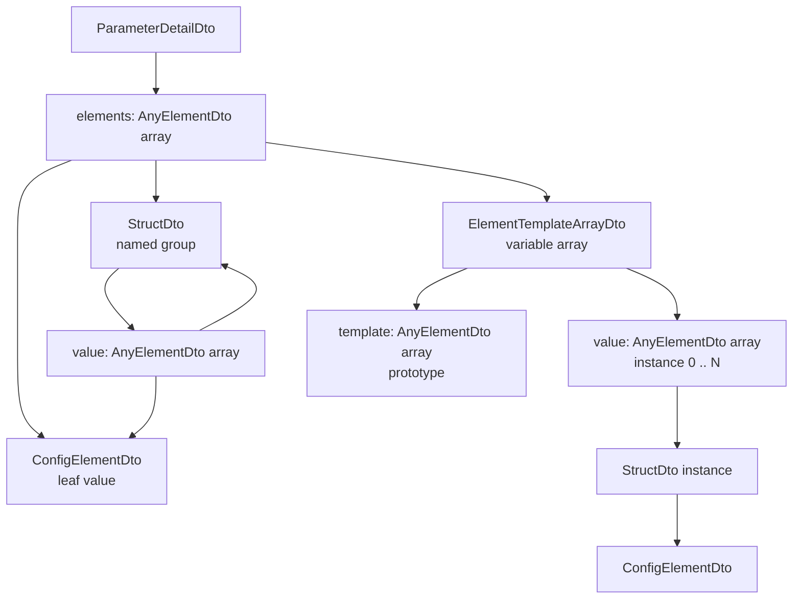
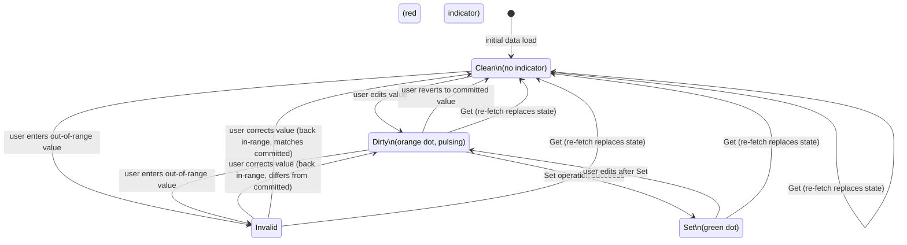
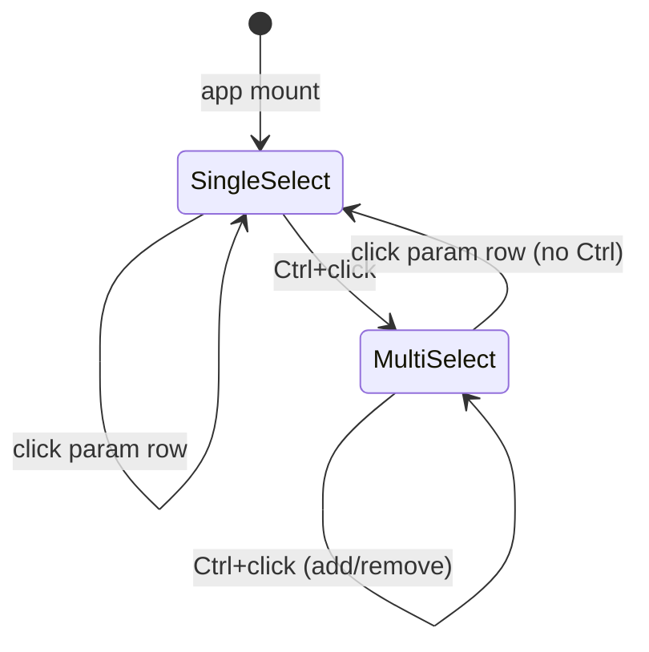

# Generic Tree View — Low-Level Design

> Feature path: `packages/react-app/src/features/generic-tree-view/`
>
> Feature/store: `packages/react-app/src/features/graph-designer/model/module-data-slice.ts`
>
> Immediate consumer: `packages/react-app/src/widgets/module-data-tab/ui/module-data-tab.tsx`
>
> Requirements: [requirements.md](requirements.md)
>
> **Note:** Paths above are planned target state across follow-on PRs. Only
> `features/generic-tree-view/` exists in the current branch.

---

## Table of Contents

1. [Purpose and Goals](#1-purpose-and-goals)
2. [Improvements Over the WPF Control](#2-improvements-over-the-wpf-control)
3. [Domain Concepts](#3-domain-concepts)
4. [High-Level Architecture](#4-high-level-architecture)
5. [File Structure](#5-file-structure)
6. [Public API](#6-public-api)
7. [Data Model](#7-data-model)
8. [Internal State](#8-internal-state)
9. [Key Algorithms](#9-key-algorithms)
10. [Layout and View Modes](#10-layout-and-view-modes)
11. [ModuleDataTab Widget (`widgets/module-data-tab`)](#11-moduledatatab-widget-widgetsmodule-data-tab)
12. [Component Details](#12-component-details)
13. [Element Rendering and Dynamic Expansion](#13-element-rendering-and-dynamic-expansion)
14. [Search Behavior](#14-search-behavior)
15. [Clipboard and Context Menu](#15-clipboard-and-context-menu)
16. [Module-Data Store Slice](#16-module-data-store-slice)
17. [Invocation Path](#17-invocation-path)
18. [QUI Component Mapping](#18-qui-component-mapping)
19. [Design Decisions and Invariants](#19-design-decisions-and-invariants)
20. [Open Items](#20-open-items)
21. [Canvas Enable Switch and Subgraph CKV Header](#21-canvas-enable-switch-and-subgraph-ckv-header)

---

## 1. Purpose and Goals

`GenericTreeView` is a parameter editor for tuning DSP module calibration data.
It accepts a `TreeViewData` payload fetched from the backend, lets engineers
inspect and modify element values, tracks dirty/committed state across the
editing session, and drives the **Get** (re-fetch from backend) and **Set** (write-back)
operations.

The component is mounted as a tab in the graph designer — one tab per module
that the user double-clicks on the canvas.

### Goals

- Faithfully render the full `TreeViewData` structure regardless of module shape
- Support engineers tuning multiple parameters simultaneously via multi-select
- Provide both a modern two-pane view and a legacy single-tree view, switchable
  at runtime
- Track dirty and committed state per element and surface it clearly
- Stay within the QUI React design system throughout

### Non-Goals

- Backend implementation and API design
- Persistence across browser sessions or app restarts (tab-switch state preservation is in scope; see §8)
- `FORMULA` `displayType` rendering — deferred

---

## 2. Improvements Over the WPF Control

The existing WPF `GenericTreeViewEx2` control is functional and well-understood.
This component preserves everything that works — the tree structure, element
controls, dirty/set state tracking, search, tooltips, context menu, clipboard
operations, and policy filtering — and addresses the following known pain points.

### Navigation & Density

- **Everything is visible but hard to navigate.** The WPF renders the entire
  module as one scrollable tree. With 40 parameters and deep nesting, finding a
  specific element means scrolling hundreds of rows. The new **two-pane layout**
  separates navigation (left panel — parameter list) from detail (right panel —
  elements of selected parameters), reducing the scroll burden dramatically.
- **No way to view multiple parameters side by side.** The new component supports
  **Ctrl+click multi-select**: the right pane shows only the selected parameters
  as accordion items, making focused comparison and editing practical.
- **The module has no clickable entry point.** Clicking the new **module header
  row** in the left panel populates the right pane with all parameters — a fast
  full-module view.
- **No at-a-glance change summary.** The new **status strip** at the bottom of
  the left panel always shows total parameter count, dirty count, and set count.

### View Modes

- **Single fixed layout.** The WPF has one layout. This component adds a
  **Modern two-pane mode** while preserving the original single-tree layout as
  **Legacy mode**, switchable at runtime. Editing state is preserved across the
  switch.

### Status Indicators & Parameter Metadata

- **Invalid values show a red border on the control only.** The new component
  bubbles validation failure up to the accordion header and disables Set globally
  until resolved.
- **No server-side change state visibility.** `ParameterDetailDto.changeInfo`
  carries `changeType` and `changeStatus` from the backend — reflecting changes
  from a previous session not yet deployed. These are surfaced as a distinct
  indicator on the accordion header, separate from client dirty state.
- **Tool policy not visible in the UI.** The new component shows a ToolPolicy
  `Badge` in the accordion header when `toolPolicy` is present on the DTO.
- **No read-only indicator at parameter level.** When `ParameterDetailDto.isReadOnly
=== true`, a **`Read Only` Badge** is shown in the accordion header.
- **`isNeuralNet` and `isOffloaded` flags are invisible.** The new component
  shows **`Neural Net`** and **`Offloaded`** Badges in the accordion header.
- **No deprecated indicator.** A **`Deprecated` Badge** is shown when
  `deprecated === true`.
- **Dirty indicator is a narrow coloured bar** that can be easy to miss. The new
  component uses **QUI StatusBadge** (`warning` / `success`) which is larger,
  semantically coloured, and accessible.

### PID Visibility

- **PIDs are not shown in the WPF tree.** The new component adds a **Show PIDs
  toggle** in the toolbar — each parameter row shows its hex PID when enabled.

### Controls & Element Detail

- **`CHECK_BOX` elements render as a dropdown** in the WPF. The new component
  renders boolean synonym pairs as a **QUI `Switch`**.
- **Range information not shown upfront.** A **Show Ranges** toolbar toggle
  (off by default) shows range hints below inputs. Min/max is always available
  in the element label tooltip regardless.
- **Dynamic array size is invisible.** `ELEMENT_TEMPLATE_ARRAY` branch nodes now
  show an instance count (e.g. `config_data (2 instances)`) and expand/shrink
  reactively as the controlling element changes.

### Architecture & Integration

- **Synchronous WPF payload API.** The new component **decouples payload delivery from the write**: dirty items are made available through the imperative handle (`getEditedTreeViewItems()`) for widgets with a Set button, and through `autoCommit.onCommit` for widgets without one. The widget owns the async dispatch and error handling; the feature is fully synchronous with respect to backend I/O.
- **Clipboard and file I/O owned by the control.** The new component **delegates
  these to the orchestrator** via callbacks — keeping the component portable and
  testable outside Electron.
- **No "save all tabs" capability.** The new component exposes a **`ref` handle**
  (`getEditedTreeViewItems()`, `getTreeViewData()`, `reset()`) so the orchestrator can collect dirty state from
  multiple open tabs simultaneously.

---

## 3. Domain Concepts

| Term               | Definition                                                                                                                                                           |
| ------------------ | -------------------------------------------------------------------------------------------------------------------------------------------------------------------- |
| **Module**         | A DSP processing unit on the signal pipeline graph (e.g., IIR MBDRC, FLUENCE SM V2)                                                                                  |
| **Parameter**      | A top-level calibration parameter within a module, identified by a PID. One module has at most ~40 parameters.                                                       |
| **Element**        | A leaf configuration value within a parameter (e.g., `enable`, `num_config`, `limiter_threshold`)                                                                    |
| **Struct**         | A named group of elements, used for logical organisation within a parameter                                                                                          |
| **Template Array** | A variable-length array of struct instances whose count is driven by another element                                                                                 |
| **PID**            | Parameter ID — a unique hex identifier for a parameter (e.g., `0x800107C`)                                                                                           |
| **Q-Format**       | Fixed-point representation — a hex value paired with a decimal conversion via `decimal = hex / 2^N`                                                                  |
| **CKV**            | Calibration Key-Value — the calibration context (device variant, use-case) for which the data applies                                                                |
| **Dirty**          | An element whose current value differs from the last committed (Set) value                                                                                           |
| **Committed**      | An element whose value has been saved via the Set operation                                                                                                          |
| **ToolPolicy**     | (`CALIBRATION`, `RTC`, `RTC_READONLY`, `RTM`) — describes which tool context can edit a parameter; rendered as `Badge` elements in the accordion header when present |

---

## 4. High-Level Architecture

### 4.1 Component Hierarchy

```
                          Use Case Visualizer Canvas
                          ┌─────────────────────────┐
                          │ SubgraphNode            │
                          │  └─ SubgraphHeader ─────┼── §21: reads
                          │       (renderNodeContent)│    headerSelectionsBySubgraphId
                          │                         │    writes via setHeaderKeyValue
                          │                         │
                          │ ModuleNode              │
                          │  ├─ ModuleEnableOverlay ┼── §21: reads
                          │  │   (renderNodeContent)│    selectModuleEnable(id)
                          │  │                      │    writes via setModuleEnable
                          │  └─ (dim + tooltip when │
                          │      unresolved-CKV)    │
                          └─────────────────────────┘
                                        │ double-click
                                        ▼
┌─────────────────────────────────────────────────────────────────────┐
│  ModuleDataTab  (widgets/module-data-tab)                             │
│  • reads entry from GraphDesignerStore.moduleDataByModuleId[moduleId] │
│  • on first mount, initializes selectedCalIndex from                   │
│    selectActiveCkvForModule(moduleId)  (§11.4 / §21.9)                 │
│  • calls store.fetchCalData / store.updateCalData                    │
└────────────────────────────┬────────────────────────────────────────┘
                             │ props: data, title, initialUiState,
                             │        onUiStateChange, autoCommit?
                             │ ref:   getTreeViewData(), getEditedTreeViewItems(), reset()
                             ▼
┌─────────────────────────────────────────────────────────────────────┐
│  GenericTreeView  (features/generic-tree-view)                      │
│  ┌──────────────────────────────────────────────────────────────┐   │
│  │  Toolbar                                                     │   │
│  │  search · policy filter · expand/collapse · view toggle      │   │
│  └──────────────────────────────────────────────────────────────┘   │
│  ┌────────────────────────┐  ┌──────────────────────────────────┐   │
│  │  ParameterListPanel    │  │  ParameterDetailPane             │   │
│  │  (left, resizable)     │  │  (right, resizable)              │   │
│  │  • QUI Tree, leaf only │  │  • QUI Accordion per parameter   │   │
│  │  • dirty / set badges  │  │  • ElementTree per expanded param│   │
│  │  • StatusStrip         │  └──────────────────────────────────┘   │
│  └────────────────────────┘                                         │
│                                                                     │
│  ── OR (legacy mode) ──────────────────────────────────────────     │
│  ┌──────────────────────────────────────────────────────────────┐   │
│  │  LegacyView                                                  │   │
│  │  • QUI Tree: module → params → ElementTree per param         │   │
│  │  • StatusStrip                                               │   │
│  └──────────────────────────────────────────────────────────────┘   │
│                                                                     │
│  ViewSwitchOverlay  (animated progress ring during view transition) │
└─────────────────────────────────────────────────────────────────────┘
                             │
                     renderElement (lib)
                             │
              ┌──────────────┴──────────────────┐
              │  ElementTree (per parameter)     │
              │  QUI Tree wrapping renderElement │
              └──────────────────────────────────┘
                             │
        ┌──────────┬─────────┴──────────┬──────────────┐
     STRUCT    ELEMENT_TEMPLATE_ARRAY  CONFIG_ELEMENT  (BIT_FIELD branch)
   (branch)    fixed=TableComponent    HexInput / Select / Switch /
               dynamic=branch+children QFormat / TextArea
```

### 4.2 Data Flow



### 4.3 End-to-End Flow

The diagram below traces the complete path from a module double-click to
individual input controls rendered in the tree.



---

## 5. File Structure

```
features/generic-tree-view/
├── index.ts                         — public API
├── model/
│   └── tree-view-data.ts            — TreeViewData domain-agnostic type
├── lib/
│   ├── elementKey.ts                — key derivation utility
│   └── renderElement.tsx            — recursive element renderer
└── ui/
    ├── GenericTreeView.tsx          — root component + store-backed state
    └── components/
        ├── ElementTable.tsx         — fixed-length array table
        ├── ElementTree.tsx          — QUI Tree wrapper per parameter
        ├── HorizontalGuideLine.tsx  — tree indent connector
        ├── LegacyView.tsx           — single-tree legacy layout
        ├── ParameterDetailPane.tsx  — right panel (accordion)
        ├── ParameterListPanel.tsx   — left panel (leaf tree)
        ├── StatusStrip.tsx          — footer: param/dirty/set counts
        ├── Toolbar.tsx              — top toolbar
        └── ViewSwitchOverlay.tsx    — animated mode-switch overlay

widgets/module-data-tab/
├── index.ts
└── ui/
    ├── module-data-tab.tsx      — outer shell: Tabs.Root, action bar, dialogs
    ├── cal-data-panel.tsx       — Cal index selector + GenericTreeView for cal data
    └── tag-data-panel.tsx       — Tag index selector + GenericTreeView for tag data

features/graph-designer/model/
└── module-data-slice.ts             — ModuleDataEntry, ModuleDataSlice, cal+tag actions

entities/tree-elements/              ← NOT created. Element DTOs (AnyElementDto,
                                       ConfigElementDto, etc.) stay in
                                       entities/spf-module-data — they are
                                       cal-data domain types. A cross-entity
                                       move would violate FSD layering.

shared/types/tree-view-ui-state.ts   — GenericTreeViewUiState type
```

---

## 6. Public API

### 6.1 `GenericTreeViewProps`

| Prop                     | Type                                               | Description                                                                                                                                                                                                                                                                                                                                                                                                                                                                                         |
| ------------------------ | -------------------------------------------------- | --------------------------------------------------------------------------------------------------------------------------------------------------------------------------------------------------------------------------------------------------------------------------------------------------------------------------------------------------------------------------------------------------------------------------------------------------------------------------------------------------- |
| `data` \*                | `TreeViewData`                                     | The parameter tree to display. Always pass an adapted `TreeViewData`; domain adapters (e.g. `calDataDtoToTreeViewData` in `widgets/module-data-tab`) convert backend DTOs before passing this prop.                                                                                                                                                                                                                                                                                                |
| `defaultViewMode`        | `'modern' \| 'legacy'`                             | Initial view mode (default `'modern'`). Ignored when `initialUiState` is present, which carries a persisted `viewMode`.                                                                                                                                                                                                                                                                                                                                                                             |
| `defaultPolicyFilter`    | `('ADVANCED' \| 'BASIC')[]`                        | Initial policy tiers to show when no `initialUiState` is provided. Defaults to `['BASIC']` (Basic only). Pass `['BASIC', 'ADVANCED']` to show all non-hidden elements from the start. When `initialUiState` is present its `policyFilter` field takes precedence and this prop is ignored.                                                                                                                                                                                                          |
| `className`              | `string`                                           | Additional CSS class applied to the root element. Use for layout context (width, flex placement) from the host widget.                                                                                                                                                                                                                                                                                                                                                                             |
| `title` \*               | `string`                                           | Display name shown in the left panel header and legacy tree root. The header row is also the click target for select-all (FR‑LP‑02); a title is always required.                                                                                                                                                                                                                                                                                                                                    |
| `onCopy`                 | `(payload: ClipboardPayload) => void`              | Called with the outbound clipboard text. Menu item hidden if absent.                                                                                                                                                                                                                                                                                                                                                                                                                                |
| `onExport`               | `(payload: ClipboardPayload) => void`              | Called with the export text; orchestrator writes to `.txt` file. Menu item hidden if absent.                                                                                                                                                                                                                                                                                                                                                                                                        |
| `onImport`               | `() => Promise<ClipboardPayload>`                  | Orchestrator opens file dialog, parses `.txt`, returns payload. Menu item hidden if absent.                                                                                                                                                                                                                                                                                                                                                                                                         |
| `onNotify`               | `(notification: TreeViewNotification) => void`             | Called when the feature needs to surface a user-facing notification (e.g. paste result summary, clipboard errors). Menu items/actions that produce notifications are hidden when this prop is absent.                                                                                                                                                                                                                                                                                               |
| `onPaste`                | `() => Promise<ClipboardPayload>`                  | Orchestrator reads clipboard, parses, returns payload. Menu item hidden if absent.                                                                                                                                                                                                                                                                                                                                                                                                                  |
| `readOnly`               | `boolean`                                          | Disables all input controls (default `false`). When `true`, `autoCommit` is ignored.                                                                                                                                                                                                                                                                                                                                                                                                                |
| `hideToolbar`            | `boolean`                                          | Suppresses the entire toolbar (default `false`). The feature's content area and element controls render normally. Use when the host widget provides its own chrome (e.g. a subgraph properties panel).                                                                                                                                                                                                                                                                                              |
| `autoCommit`             | `{onCommit: (dirtyItems: TreeViewItem[]) => void}` | When provided, the feature invokes `onCommit` with the current dirty items as soon as the user finishes editing a leaf input control — provided there are unsaved edits and no elements are in invalid state. No timer, no debounce. Trigger per control type: text-input controls (hex, Q-format, dB, string) commit on blur; dropdown and bit-field-sub-field controls commit on option selection; Switch controls commit on toggle. Appropriate for host widgets without a Set button (e.g. subgraph properties panel). Ignored when `readOnly` is `true`. |
| `initialUiState`         | `GenericTreeViewUiState`                           | If provided, restores all UI and edit-session state from this snapshot on mount instead of deriving defaults. Used by `ModuleDataTab` to preserve state across tab switches.                                                                                                                                                                                                                                                                                                                        |
| `onUiStateChange`        | `(patch: Partial<GenericTreeViewUiState>) => void` | Called with only the changed fields whenever any UI or edit-session state changes. Caller merges the patch into the store to keep `initialUiState` up to date.                                                                                                                                                                                                                                                                                                                                      |

\* Required prop.

**Sending edits back to the widget.** The feature does not expose an `onSet` prop. Widgets with a manual Set button call `getEditedTreeViewItems()` on the imperative handle (§6.2) when the button is clicked. Widgets configured for auto-commit receive dirty items through `autoCommit.onCommit` as described above. In both cases, the widget dispatches the write through its adapter and the feature re-seeds via the standard `data`-prop-change pathway on success.

### 6.2 `GenericTreeViewHandle` (imperative ref)

| Method                   | Signature                      | Description                                                                                                                                                                                                  |
| ------------------------ | ------------------------------ | ------------------------------------------------------------------------------------------------------------------------------------------------------------------------------------------------------------ |
| `getEditedTreeViewItems` | `() => TreeViewItem[] \| null` | Returns items that have unsaved edits with their current element values, or `null` if nothing is dirty. The caller's adapter constructs the domain-specific request payload. Useful for bulk save-all flows. |
| `getTreeViewData`        | `() => TreeViewData`           | Returns the complete current data as last known to the feature (the most recent `data` prop value). Useful when a caller needs a full snapshot — e.g. for Batch Copy — without a server round-trip.          |
| `reset`                  | `() => void`                   | Restores all element values to the last committed state and clears dirty/set tracking — a local rollback without any network call.                                                                           |

### 6.3 Consumer Usage Examples

**Minimal (widget-owned Set button):**

```tsx
const ref = useRef<GenericTreeViewHandle>(null);

<GenericTreeView ref={ref} data={moduleData} />
<button onClick={() => {
  const dirty = ref.current?.getEditedTreeViewItems();
  if (dirty) handleSet(dirty);  // widget dispatches to backend
}}>Set</button>
```

**Auto-commit on blur (no Set button):**

```tsx
<GenericTreeView
  data={moduleData}
  hideToolbar
  defaultViewMode="legacy"
  autoCommit={{onCommit: (items) => handleWrite(items)}}
/>
```

**Legacy mode, read-only inspection:**

```tsx
<GenericTreeView data={moduleData} defaultViewMode="legacy" readOnly />
```

**Multiple tabs with imperative save-all:**

```tsx
const tabRefs = useRef<Map<string, GenericTreeViewHandle>>(new Map());

function handleSaveAll() {
  for (const [moduleId, handle] of tabRefs.current) {
    const payload = handle.getEditedTreeViewItems();
    if (payload) handleSet(moduleId, payload);
  }
}

{
  openTabs.map((tab) => (
    <TabPanel key={tab.moduleSystemId}>
      <GenericTreeView
        ref={(el) =>
          el
            ? tabRefs.current.set(tab.moduleSystemId, el)
            : tabRefs.current.delete(tab.moduleSystemId)
        }
        data={tab.calTreeViewData}
        title={tab.title}
        onNotify={(n) => showGlobalToast(n)}
      />
    </TabPanel>
  ));
}
```

---

## 7. Data Model

### 7.1 `TreeViewData` and `TreeViewItem` — the feature's data contract

`GenericTreeView` does not consume backend DTOs directly. Each domain adapter
(e.g. `widgets/module-data-tab`) is responsible for fetching its domain-specific
DTO from the backend and adapting it into `TreeViewData` / `TreeViewItem` before
passing it as the `data` prop. This keeps the feature reusable across domains
(cal-data, subgraph properties, tag-data) without changes to the feature itself.

```typescript
// features/generic-tree-view/model/tree-view-data.ts

interface TreeViewData {
  systemId: string; // uniquely identifies this snapshot
  changeInfo?: ChangeInfoDto; // top-level change status (optional)
  items: TreeViewItem[]; // the list of items to display
}

interface TreeViewItem {
  id: string; // cal-data: parameterId; subgraph: propertyId.toString()
  name: string; // cal-data: name;        subgraph: propertyName
  description?: string;
  elements: AnyElementDto[]; // identical union across all domains
  // Optional metadata — absent fields are simply not rendered
  changeInfo?: ChangeInfoDto;
  isHidden?: boolean;
  isReadOnly?: boolean;
  deprecated?: boolean;
  isNeuralNet?: boolean;
  isOffloaded?: boolean;
  toolPolicy?: ToolPolicy[]; // type alias in entities/spf-module-data
}
```

Each domain adapter provides the projection:

| Backend field                       | `TreeViewItem` field | Domain                                |
| ----------------------------------- | -------------------- | ------------------------------------- |
| `ParameterDetailDto.parameterId`    | `id`                 | cal-data                              |
| `ParameterDetailDto.name`           | `name`               | cal-data                              |
| `PropertyDto.propertyId.toString()` | `id`                 | subgraph properties                   |
| `PropertyDto.propertyName`          | `name`               | subgraph properties                   |
| `PropertyDto.elements`              | `elements`           | subgraph properties (identical union) |

`AnyElementDto` (`ConfigElementDto | StructDto | ElementTemplateArrayDto`) is
the element-level contract shared by both domains and is not abstracted further
— every field on these types is a rendering instruction (`displayType`,
`allowedValues`, `qFormat`, `min`/`max`, `policy`, `lengthFormula`) that the
rendering logic in §13 reads directly. The adapter boundary at `TreeViewItem`
is sufficient: backend field renames are caught there, and a structural change
to the element union would require rendering changes regardless. These types
stay in `entities/spf-module-data` (their origin); `tree-view-data.ts`
imports them from there — a legal feature→entity import.

**Subgraph properties are currently read-only.** The subgraph and container
properties endpoints are GET-only in the current API. `GenericTreeView` renders
them with `readOnly={true}`. When a write endpoint is added, the subgraph
properties widget passes `autoCommit={{onCommit: ...}}` and dispatches the
resulting `TreeViewItem[]` through its adapter — no feature change required.

### 7.2 `ClipboardPayload` — clipboard and file I/O format

All Copy, Export, Paste, and Import operations use this shape:

```typescript
interface ClipboardPayload {
  lines: string; // tab-separated plain text, one element per line:
  // "PARAM_NAME.path.to.element\t0xHEXVALUE\n"
}
```

The path uses the parameter **display name** (not the numeric PID) as the
root segment, then dot-notation down to the element. See §15 for the full
format and example.

### 7.3 `GenericTreeViewUiState` — persisted session state

`TreeViewData` is the _server data_ — what gets displayed. `GenericTreeViewUiState`
is the _client session_ — how the user has interacted with it (which items
are selected, what edits are in progress, view mode, etc.). The two are
orthogonal: a new `TreeViewData` does not reset UI preferences, and a new
`GenericTreeViewUiState` does not replace the server data.

```typescript
// shared/types/tree-view-ui-state.ts

interface GenericTreeViewUiState {
  // Edit session — shared across grouped and standard views (same element paths)
  elementValues: Record<string, string>; // current element values by path
  committedValues: Record<string, string>; // last committed snapshot
  arrayCounts: Record<string, number>; // current instance count per array
  dirtyPaths: string[]; // paths that differ from committed
  setPaths: string[]; // paths successfully written to backend
  invalidPaths: string[]; // paths currently failing validation

  // UI preferences — per-view (selection, layout, search are view-specific)
  viewMode: 'modern' | 'legacy';
  selectedIds: string[]; // parameter IDs selected in left panel
  expandedIds: string[]; // parameter IDs expanded in right panel
  legacyExpandedKeys: string[];
  searchText: string;
  policyFilter: ('ADVANCED' | 'BASIC')[];
  showPids: boolean;
  showRanges: boolean;
  showBadges: boolean;
  showModifiedOnly: boolean; // FR‑TB‑06 — Modified Only filter
  showErrorsOnly: boolean; // FR‑TB‑07 — Errors Only filter
  panelSplitPct: number; // left panel width %, clamped 20–60
}
```

The `GenericTreeViewUiState` type is a flat bag containing both edit-session fields
and UI-preference fields. When a widget hosts two views over the same data (e.g.
grouped and standard), the edit-session fields are **shared** across both views —
element values, dirty state, and array counts are indexed by `parameterId/fieldPath`,
which is identical in both projections. The UI-preference fields are
**per-view** — each view has its own selection, expansion, search text, and layout
state. See §7.5 for how the widget routes `onUiStateChange` patches.

### 7.4 Element Hierarchy

The element tree under each `ParameterDetailDto` is recursive. The three DTO
types form a discriminated union (`AnyElementDto`) that can nest arbitrarily.



### 7.5 Grouped view projection

Each element in `AnyElementDto` optionally carries a `group?: string` and
`subgroup?: string` field. These are flat annotations — the DTO does not
contain GROUP/SUBGROUP nodes; the grouping is decoded from the label on each
element.

A consuming widget can present a _grouped view_ (see FR‑EC‑11 in
requirements) by running a projection over the flat parameter list before
passing `TreeViewData` to the feature. `GenericTreeView` has no knowledge
that the tree is grouped; it renders `STRUCT` nodes as collapsible branches
regardless of origin, so the grouped projection slots in naturally.

#### Projection algorithm — `buildGroupedTreeViewData`

Location: `widgets/module-data-tab/lib/cal-data-adapter.ts` (or a sibling
file alongside `calDataDtoToTreeViewData`).

```ts
function buildGroupedTreeViewData(params: ParameterDetailDto[]): TreeViewData;
```

1. **Collect all grouped elements.** Walk every `param.elements[]` (flattened
   one level — only top-level `CONFIG_ELEMENT`s inside a `ParameterDetailDto`
   carry `group`; nested elements inside `STRUCT`/`ELEMENT_TEMPLATE_ARRAY` do
   not). For each `CONFIG_ELEMENT` with a non-empty `group`, record the triple
   `(group, subgroup|undefined, element)`. Elements without `group` are
   discarded.

2. **Deduplicate groups and subgroups.** Produce a stable ordered list of
   `(group, subgroup)` pairs in order of first appearance across the
   parameter list. Ordering matches the WPF display order.

3. **Build one `TreeViewItem` per unique group.** Its `id` is the group name;
   its `name` is the group name; its `elements` array contains:
   - Directly: each `ConfigElementDto` in the group that has no `subgroup`.
   - As a `StructDto` wrapper for each unique `subgroup` within the group:
     `{type: 'STRUCT', name: subgroup, structType: subgroup, isReadOnly: false, value: [... subgroup's elements]}`
     (subgroup elements sorted by their order of first appearance).

4. **Return `TreeViewData`.** The `systemId` should match the original DTO's
   `systemId` so CKV context is preserved.

#### Co-existence with the standard view

Both views operate on the same `CalDataEntry.dto` in the store. The store
holds the single authoritative snapshot; both `TreeViewData` objects are
derived projections of it.

When the widget mounts both views (grouped and parameter) simultaneously — or
when a tab switch makes the user navigate from one to the other — the shared
snapshot ensures they always reflect the same values. Because both projections
pass in the same `data` object (or the same derived `TreeViewData` computed
from the same DTO), a change committed from either view flows back through the
widget's `updateCalData` action, replacing the store DTO, which triggers a
re-seed in whichever `GenericTreeView` is currently mounted. The edit appears
in both views the next time each is rendered.

**Same `uiState` or separate?** The two views use separate `uiState`
entries in the store (`entry.calData.uiState` for the standard view,
`entry.calData.groupedUiState` for the grouped view) for the
UI-preference fields (expansion, selection, view mode, search, etc.).
The edit-session fields (`elementValues`, `committedValues`, `arrayCounts`,
`dirtyPaths`, `setPaths`, `invalidPaths`) are **shared** — they are kept
in `entry.calData.uiState` and both views read from and write to that
same location.

The widget is responsible for the routing. When constructing `initialUiState`
for each `GenericTreeView` instance:

- Standard view: pass `entry.calData.uiState` directly.
- Grouped view: pass a merged object — the edit-session fields from
  `entry.calData.uiState`, the UI-preference fields from
  `entry.calData.groupedUiState`.

When handling `onUiStateChange` patches from each instance, the widget
routes by key:

- Edit-session keys (`elementValues`, `committedValues`, `arrayCounts`,
  `dirtyPaths`, `setPaths`, `invalidPaths`) → always written to
  `entry.calData.uiState` via `setCalUiState`, regardless of which view
  emitted the patch.
- UI-preference keys (everything else) → written to the view-specific
  entry: `setCalUiState` for the standard view, `setGroupedCalUiState`
  for the grouped view.

This ensures that editing an element value in the grouped view is
immediately visible when the user switches to the standard view, and
vice versa — both views share the same working values in flight without
needing a backend round-trip.

#### Element path stability under grouping

The element path (`parameterId/fieldPath`) is preserved verbatim in the
grouped projection. The grouping only changes the structural wrapper around
a `ConfigElementDto`, never the element itself. So:

- Dirty tracking reads and writes the same key regardless of which view made
  the edit.
- The Set payload produced by `getEditedTreeViewItems()` from either view
  contains the same dirty items with the same paths.
- The adapter's `dirtyItemsToCalDataRequest` does not need to know about
  grouping.

---

## 8. Internal State

`GenericTreeView` holds state as local working copies during rendering. All
durable state is externalized to the caller's store via `initialUiState` /
`onUiStateChange` so it survives tab remounts (see §19).

### 8.1 Store-persisted state

All fields are defined in `GenericTreeViewUiState` (§7.3). They are read from
`initialUiState` on mount and written back via `onUiStateChange` on every
change. Plain serializable types only — no `Map` or `Set` instances.

The full field list is in §7.3. Notable addition: `invalidPaths: string[]` —
keys currently failing min/max validation. Persisting this means all three
status indicators (dirty, set, invalid) are fully correct immediately on
remount, with no mount-time re-validation pass needed.

### 8.2 Transient local-only state

Not written to the store — meaningless to restore across remounts.

| State                                 | Type      | Purpose                                                                        |
| ------------------------------------- | --------- | ------------------------------------------------------------------------------ |
| `searchInput`                         | `string`  | Raw (unthrottled) search bar value — debounced into the persisted `searchText` |
| `modernExpandAll` / `legacyExpandAll` | `boolean` | One-shot expand-all signal; resets after use                                   |
| `pendingSwitch` / `switchingTo`       | flags     | Transient overlay state during mode switch                                     |
| `resetKey`                            | `number`  | Cache-buster incremented on Get to force input remount                         |

### 8.3 Element dirty state transitions



---

## 9. Key Algorithms

### 9.1 `elementKey` (`lib/elementKey.ts`)

Produces a slash-joined path that uniquely addresses any element within the
cal-data tree.

```
elementKey(parameterId, ...path) → "parameterId/seg1/seg2/..."
```

Examples:

- `elementKey("101", "filter_cfg", "tap_count")` → `"101/filter_cfg/tap_count"`
- `elementKey("101", "coefs[0]", "value")` → `"101/coefs[0]/value"`

This key is the map key in `elementValues`, `dirtyPaths`, `arrayCounts`, etc.

### 9.2 Data seeding (`seedFromData` / `seedFromElements`)

On mount and whenever `data` prop changes, `seedFromData` walks the full DTO
recursively and populates:

- `elementValues`: every `CONFIG_ELEMENT` leaf → its `value` string.
- `arrayCounts`: every `ELEMENT_TEMPLATE_ARRAY` → `value.length`.

A `prevDataRef` guards against double-seeding when the parent re-renders
without actually changing the data object reference.

### 9.3 Dynamic array expansion (`buildLengthFormulaMap` / `applyLengthFormulas`)

See §13.3 for the full five-step lifecycle. In brief: `buildLengthFormulaMap`
indexes `controllerPath → [{arrayPath, template}]` once on mount.
`handleValueChange` looks up this map whenever a value changes and updates
`arrayCounts` in the same state update. `applyLengthFormulas` re-drives counts
from committed values after a void Set.

### 9.4 Search (`buildMatchSets`)

`buildMatchSets` does a case-insensitive substring scan of all visible parameter
names/IDs and element names, returning:

- `paramIds`: IDs of parameters with at least one match anywhere in their subtree.
- `elementIds`: element keys that matched directly.

This runs inside `useTransition` so it does not block the input. When search
clears, pre-search selection/expansion state is restored from `preSearchRef`.

See §14 for the full search behavior specification.

### 9.5 Dirty detection and payload construction

`handleValueChange` updates `elementValues` and computes dirty status by
comparing each key to `committedValues`. The `dirtyPaths` set accumulates only
keys that differ from committed. `patchElements` builds patched
`AnyElementDto[]` arrays for the outbound payload by walking the DTO structure
and substituting values from `elementValues` for dirty paths; it also truncates
`ELEMENT_TEMPLATE_ARRAY` instances to the count in `arrayCounts`. The payload
is built lazily on demand — either when the widget calls `getEditedTreeViewItems()`
on the imperative handle, or when `autoCommit.onCommit` fires on blur.

### 9.6 Get / Set lifecycle

```
Get clicked (widget action bar)
  → widget invokes its adapter action (e.g. store.fetchCalData for the
    active tab); no confirmation dialog — clicking Get is the user's
    consent to replace local state on success
  ← on success: store writes new dto; widget passes updated `data` prop
                to feature; feature detects reference change and re-seeds
                (same path as new data prop arriving — see below)
  ← on failure: store leaves entry.dto untouched; feature's `data` prop
                is unchanged; feature preserves unsaved edits, dirty
                markers, and validation errors; widget surfaces the error

Set (widget action bar button, or auto-commit on blur)
  → payload delivery:
      • pull:  widget calls handle.getEditedTreeViewItems() → TreeViewItem[]
      • push:  feature calls autoCommit.onCommit(dirtyItems) on blur
              of a leaf input control (invalid state suppresses the push)
  → widget dispatches the payload via its adapter
  ← on success: adapter returns TreeViewData; widget writes to store;
                feature receives new `data` prop and re-seeds (below)
  ← on failure: widget does not update the store; no new `data` prop
                flows to the feature; unsaved edits are preserved
                automatically; widget surfaces the error

New data prop arrives (after successful Get, successful Set, or explicit
re-fetch by caller)
  → prevDataRef detects reference change
  → re-seed elementValues, committedValues, arrayCounts from new DTO
  → clear dirtyPaths, setPaths, invalidPaths; increment resetKey
  → UI preferences (selection, expansion, view mode) are NOT reset
```

---

## 10. Layout and View Modes

### 10.1 Modern Mode (default)

Two-pane layout. Left panel shows the parameter list. Right panel shows an
accordion rendering the elements of the selected parameters. Supports search,
policy filter, PID toggle, multi-select, and per-element dirty indicators.

The left and right panels are separated by a **draggable divider**. Default
split is 30% left / 70% right, clamped to 20–60%.

```
┌──────────────────────────────────────────────────────────────────────────┐
│  TOOLBAR                                                                 │
│  🔍 Search  [Basic][Adv]  [▲Collapse][▼Expand]  [Legacy]               │
│  [PIDs] [Ranges] [Badges]                                                │
├─────────────────────────┬───┬──────────────────────────────────────────  │
│  LEFT (30%)             │◀▶│  RIGHT (70%)                               │
│  IIR MBDRC              │   │  ▼ PARAM_ID_IIR_MBDRC_CONFIG_PARAMS  ●   │
│  ─────────────────────  │   │    ├─ num_bands     [ 0x00000001 ]        │
│  ● PARAM_CONFIG         │   │    ├─ limiter_mode  [Disable ▼]  0x0     │
│    FILTER_XOVER         │   │    ├─ limiter_delay [ 0x00000106 ] [0.008]│
│    MODULE_ENABLE        │   │    ├─ num_config    [ 0x00000002 ]        │
│                         │   │    └─ ▼ config_data (2 instances)        │
│  ─────────────────────  │   │         ▼ config_data[0]                 │
│  12 params  3 dirty     │   │  ▶ PARAM_ID_IIR_MBDRC_FILTER_XOVER       │
│             1 set       │   │                                           │
└─────────────────────────┴───┴───────────────────────────────────────────┘
```

### 10.2 Legacy Mode

Single-pane hierarchical tree. The entire module renders as one collapsible
tree — module → parameter → struct → nested struct. No multi-select, no
accordion. The status strip identical to the Modern left panel footer is shown
at the bottom.

```
┌──────────────────────────────────────────────────────────────┐
│  TOOLBAR                                                     │
│  🔍 Search  [Basic][Adv]  [▲Collapse][▼Expand]  [Modern]    │
├──────────────────────────────────────────────────────────────┤
│  ▼ IIR MBDRC                                                 │
│      ▼ PARAM_ID_IIR_MBDRC_CONFIG_PARAMS                      │
│          ── num_bands              0x00000001                │
│          ── limiter_mode           Disable ▼  0x0           │
│          ── limiter_delay          0x00000106  0.008         │
│          ▼ config_data (2 instances)                         │
│              ▼ config_data[0]                                │
│                  ── channel_mask_lsb   0x0000000E            │
│      ▶ PARAM_ID_IIR_MBDRC_FILTER_XOVER                       │
├──────────────────────────────────────────────────────────────┤
│  12 params   3 dirty   1 set                                 │
└──────────────────────────────────────────────────────────────┘
```

### 10.3 Mode Switching

- The toolbar toggles between modes at runtime. All editing state (dirty values,
  committed snapshot) is preserved across the switch.
- When switching to Legacy, the tree opens to _param level_ — module branch
  expanded, parameter branches collapsed. Collapse All returns to this state.
- Switching blurs and dims the current view while a `ViewSwitchOverlay` shows
  an animated `ProgressRing` (0→100% over 700 ms) with a direction label.
  The overlay uses `useTransition` to defer the layout swap.

---

## 11. ModuleDataTab Widget (`widgets/module-data-tab`)

`ModuleDataTab` is the widget that composes `GenericTreeView` into the graph
designer canvas. When a module is double-clicked, a tab opens and renders
`ModuleDataTab` — not a standalone window. The tab bar provides its own close
button; no Close action is needed inside the widget.

`ModuleDataTab` owns the outer shell: the vertical `Tabs.Root`, the action bar
(Get / Set / Batch Copy), and the index-change and tab-close dialogs. Each
sub-tab panel delegates to a dedicated sub-component:

- **`CalDataPanel`** — cal index selector, `GenericTreeView` for cal data,
  `onUiStateChange` routing to `setCalUiState`, imperative ref for Set/Get.
- **`TagDataPanel`** — tag index selector, `GenericTreeView` for tag data,
  `onUiStateChange` routing to `setTagUiState`, imperative ref for Set/Get.

### 11.1 Layout

```
┌─────────────────────────────────────────────────────────────────────┐
│  ModuleDataTab  (widgets/module-data-tab)                           │
│                                                                     │
│  ┌──────┬──────────────────────────────────────────────────────┐   │
│  │  C ● │  [Cal Index ▼]                                       │   │
│  │  a   │  ┌─────────────────────────────────────────────────┐ │   │
│  │  l   │  │  GenericTreeView                                │ │   │
│  │  D   │  │  (search, filter, expand/collapse, view toggle) │ │   │
│  │  a   │  └─────────────────────────────────────────────────┘ │   │
│  │  t   │                                                       │   │
│  │  a   │                                                       │   │
│  ├──────┤                                                       │   │
│  │  T   │  [Tag Index ▼]                                       │   │
│  │  a   │  ┌─────────────────────────────────────────────────┐ │   │
│  │  g   │  │  GenericTreeView                                │ │   │
│  │  D   │  └─────────────────────────────────────────────────┘ │   │
│  │  a   │                                                       │   │
│  │  t   │                                                       │   │
│  │  a   │                                                       │   │
│  └──────┴──────────────────────────────────────────────────────┘   │
│  ─────────────────────────────────────────────────────────────     │
│  [ Get ]   [ Set ]   [ Batch Copy ]         (active tab only)      │
└─────────────────────────────────────────────────────────────────────┘
```

### 11.2 QUI Tabs configuration

```tsx
import {Tab, Tabs} from '@qualcomm-ui/react/tabs';

<Tabs.Root
  orientation="vertical" // left-edge tab strip, matches WPF layout
  variant="line" // selection indicator line; 'contained' hides
  // Tabs.Indicator and limits sizes to sm/md
  lazyMount // Tag Data panel not mounted until first visit
  unmountOnExit // only active panel in DOM; store is the
  // persistence layer, not the component tree
  activationMode="automatic" // default — tab activates on focus
  value={activeTab}
  onValueChange={handleTabChange}
>
  <Tabs.List>
    <Tabs.Indicator />
    <Tab.Root value="cal-data">
      <Tab.Button endIcon={calBadge}>Calibration Data</Tab.Button>
    </Tab.Root>
    <Tab.Root value="tag-data">
      <Tab.Button endIcon={tagBadge}>Tag Data</Tab.Button>
    </Tab.Root>
  </Tabs.List>

  <Tabs.Panel value="cal-data">
    <CalDataPanel moduleSystemId={moduleId} />
  </Tabs.Panel>
  <Tabs.Panel value="tag-data">
    <TagDataPanel moduleSystemId={moduleId} />
  </Tabs.Panel>
</Tabs.Root>;
```

**Why `lazyMount` without `unmountOnExit` is wrong here:** keeping both panels
mounted simultaneously means two `GenericTreeView` trees live in the DOM
concurrently — double the memory and React work — with no benefit, because the
store already persists all state. `unmountOnExit` is the correct choice.

**Why `line` not `contained`:** `contained` hides `Tabs.Indicator` and only
supports `sm`/`md` sizes. `line` with `orientation="vertical"` renders the
left-edge selection indicator that matches the WPF layout.

**No `Tab.DismissButton` on the sub-tabs.** QUI's `Tabs` component treats the
per-tab dismiss button as an opt-in slot: consumers render `Tab.DismissButton`
inside `Tab.Root` when they want a close affordance. We deliberately omit it
for both Cal Data and Tag Data — the sub-tabs should not be individually
closable (per FR‑MDT‑11). Users leave `ModuleDataTab` only by closing the
outer project tab, which triggers the confirmation dialog in §11.8.

### 11.3 Tab-level status badges

Badge state is derived **directly from the store** (`entry.calData.uiState`,
`entry.tagData.uiState`) — not from the mounted `GenericTreeView` instances.
This means badges on unmounted tab headers remain accurate.

Priority (highest wins): danger (any invalid paths) > warning (any dirty
paths) > success (any set paths, none dirty) > hidden.

```tsx
function tabBadge(uiState?: GenericTreeViewUiState) {
  if (!uiState) return null;
  if (uiState.invalidPaths.length > 0)
    return <StatusBadge emphasis="danger" size="xs" />;
  if (uiState.dirtyPaths.length > 0)
    return <StatusBadge className="dirty-pulse" emphasis="warning" size="xs" />;
  if (uiState.setPaths.length > 0)
    return <StatusBadge emphasis="success" size="xs" />;
  return null;
}
```

### 11.4 Index selectors

Both Cal Indices and Tag Indices use a controlled QUI `Select`:

```tsx
import {selectCollection} from '@qualcomm-ui/core/select';
import {Select} from '@qualcomm-ui/react/select';

// {systemId: string, label: string}[]
const collection = selectCollection({
  items: availableIndices,
  itemLabel: (i) => i.label,
  itemValue: (i) => i.systemId,
});

<Select
  collection={collection}
  value={[selectedIndex]}
  onValueChange={(details) => handleIndexChange(details[0])}
  label="Cal Index"
  size="sm"
  clearable={false}
/>;
```

**Index change with unsaved edits** — when the user selects a new index while
the active tab has unsaved edits, a `Dialog` is shown with three actions:

| Action               | Behaviour                                                                                                                    |
| -------------------- | ---------------------------------------------------------------------------------------------------------------------------- |
| **Set & Switch**     | Widget triggers Set for the active tab (via `getEditedTreeViewItems()` + adapter); on success fetches data for the new index |
| **Discard & Switch** | Discard edits (local reset), fetch data for the new index                                                                    |
| **Cancel**           | Remain on the current index                                                                                                  |

**Initial-CKV inheritance from the subgraph header.** When the tab first
opens for a module and `entry.calData.selectedCalIndex` is not yet set, it
is initialized from `selectActiveCkvForModule(moduleId)` — the CKV derived
from the subgraph header selection (§21). From that point onward, the
tab's `Cal Indices` `Select` is fully decoupled from the subgraph header:
subsequent header changes do not propagate into the tab, and changes to
the tab's own selector do not propagate back to the header. This
decoupling is deliberate — the unsaved-edits dialog above is triggered
only by the user's own interaction with the tab's selector, never by a
header-driven change. See `docs/plans/gtv-refactor.md` Part 11 for the
full rationale.

### 11.5 Action bar

The action bar is owned by `ModuleDataTab`, not by `GenericTreeView`. It
contains Get, Set, and Batch Copy buttons operating on the **active tab only**.

| Button         | Enabled when                                                                 | Behaviour                                                                                                                                                                                                                                                                                                                                                                 |
| -------------- | ---------------------------------------------------------------------------- | ------------------------------------------------------------------------------------------------------------------------------------------------------------------------------------------------------------------------------------------------------------------------------------------------------------------------------------------------------------------------- |
| **Get**        | Always                                                                       | Widget calls its adapter action (e.g. `fetchCalData` for the Cal Data tab, `fetchTagData` for the Tag Data tab) to re-fetch the active tab's data. On success the store updates `entry.<tab>.dto`; the widget passes the new `data` prop to the feature, which re-seeds. On failure the store leaves `entry.<tab>.dto` untouched and the feature preserves unsaved edits. |
| **Set**        | Active tab has unsaved edits AND `entry.<tab>.uiState.invalidPaths` is empty | Widget calls `activeRef.current.getEditedTreeViewItems()` and dispatches the result via `store.updateCalData` (or `updateTagData`)                                                                                                                                                                                                                                        |
| **Batch Copy** | Always                                                                       | Active-tab-specific operation; cal-data and tag-data use different backend calls                                                                                                                                                                                                                                                                                          |

Dirty state in the inactive tab is visible via its tab badge but does not
affect the active tab's button states.

### 11.6 Store wiring

`ModuleDataTab` reads from and writes to `ModuleDataSlice` in
`GraphDesignerStore`:

```tsx
// Cal Data panel (simplified)
const calEntry = useGraphDesignerStoreShallow(
  (s) => s.moduleDataByModuleId[moduleId]?.calData,
);
const {fetchCalData, updateCalData, setCalUiState} =
  useGraphDesignerStoreShallow((s) => ({
    fetchCalData: s.fetchCalData,
    updateCalData: s.updateCalData,
    setCalUiState: s.setCalUiState,
  }));

<GenericTreeView
  ref={calRef}
  data={calEntry.dto}
  title={entry.moduleName}
  initialUiState={calEntry.uiState}
  onUiStateChange={(patch) => setCalUiState(moduleId, patch)}
/>;
```

The Set button in the action bar reads the pending edits via the imperative
handle:

```tsx
<Button
  onClick={() => {
    const dirty = calRef.current?.getEditedTreeViewItems();
    if (dirty) updateCalData(moduleId, dirty);
  }}
>
  Set
</Button>
```

### 11.7 `GenericTreeView` props used by `ModuleDataTab`

| Prop          | Value             | Why                                                                                                                                 |
| ------------- | ----------------- | ----------------------------------------------------------------------------------------------------------------------------------- |
| `hideToolbar` | `false`           | Toolbar chrome (search, filter, expand/collapse, view toggle) is useful                                                             |
| `autoCommit`  | not set           | `ModuleDataTab` provides a manual Set button in the action bar; edits flow through `getEditedTreeViewItems()` on click, not on blur |
| `readOnly`    | `false` (default) | Both tabs are editable                                                                                                              |

For subgraph properties (a separate future widget), the shape is different:
`readOnly={true}` + `hideToolbar={true}` today (GET-only API); when a write
endpoint is added the widget passes `autoCommit={{onCommit: ...}}` and hides
the toolbar for silent inline editing on blur.

### 11.8 Tab close with unsaved edits

`ModuleDataTab` intercepts the tab-close event and inspects both sub-tabs
for unsaved edits. Dirty state is derived from the same source the tab
badges read (§11.3): `entry.calData.uiState.dirtyPaths.length > 0` and
`entry.tagData.uiState.dirtyPaths.length > 0`. When neither is dirty,
the tab closes with no dialog.

When either is dirty, the widget shows a QUI `Dialog` with three
actions:

| Action              | Behaviour                                                                                                                                                                                                                                                                                                                                                                                                                                                                                                                            |
| ------------------- | ------------------------------------------------------------------------------------------------------------------------------------------------------------------------------------------------------------------------------------------------------------------------------------------------------------------------------------------------------------------------------------------------------------------------------------------------------------------------------------------------------------------------------------ |
| **Set & Close**     | For every dirty sub-tab, pull dirty items via `activeRef.current.getEditedTreeViewItems()` (mounting the sub-tab briefly if it's the inactive one, or reading a cached ref if the tab has kept a handle to each sub-tab's `GenericTreeView`) and dispatch through the sub-tab's adapter (`updateCalData` / `updateTagData`). Only close the tab when **every** dispatched write resolves successfully. If any write fails, keep the tab open, keep the unsaved edits, surface the error, and stay on the sub-tab whose write failed. |
| **Discard & Close** | Clear both sub-tabs' `uiState.dirtyPaths` / `uiState.setPaths` / `uiState.invalidPaths` and close the tab. This does not fire any backend call.                                                                                                                                                                                                                                                                                                                                                                                      |
| **Cancel**          | Dismiss the dialog. The tab remains open with all unsaved edits intact.                                                                                                                                                                                                                                                                                                                                                                                                                                                              |

**Set & Close enablement.** Disabled when any dirty sub-tab has a
non-empty `uiState.invalidPaths` (the same gate as the action bar's
Set button — FR‑EH‑03 / FR‑MDT‑06). The user must either fix the
invalid values, or use Discard & Close. Discard & Close is always
enabled when the dialog is showing.

**Handle acquisition for the inactive sub-tab.** When Set & Close is
triggered, the widget reads dirty items for each sub-tab directly from
the store (`entry.<tab>.uiState.elementValues` + `dirtyPaths` + the
original `dto` — the same data the adapter uses for a normal Set). This
is the canonical approach: the inactive sub-tab is unmounted
(`unmountOnExit`) so its ref is stale, and the store-persisted `uiState`
is already the source of truth for all editing state (§7.3). The widget
never needs to mount the inactive panel to build the request payload.

**Interaction with the index-change dialog (§11.4).** The two dialogs
are independent triggers: the index-change dialog fires on selector
interaction; the tab-close dialog fires on close-button click. They
cannot both be open simultaneously (closing the tab dismisses any
open dialog first at the QUI level).

**Interaction with `ModuleDataTab.setModuleOpenTab` (§16.2).** On a
successful Set & Close or Discard & Close, the widget dispatches
`setModuleOpenTab(moduleId, null)` (or the equivalent "close this
tab" action) so the tab is removed from the graph designer's tab
strip.

---

## 12. Component Details

### 12.1 `Toolbar`

Stateless; receives all state values and callbacks as props. The toolbar is suppressed entirely when `hideToolbar={true}`. `autoCommit` does not affect the toolbar. Get, Set, and Batch Copy are not part of the toolbar — they are owned by the consuming widget's action bar.

| Control                                          | Prop driven                                                 | Notes                                          |
| ------------------------------------------------ | ----------------------------------------------------------- | ---------------------------------------------- |
| Search (`TextInput`)                             | `searchText`, `onSearchChange`                              | Left-aligned; both modes                       |
| Policy filter (`SegmentedControl`, multi-select) | `policyFilter`, `onPolicyFilterChange`                      | Basic pre-selected; additive                   |
| Collapse / Expand All                            | `onCollapseAll`, `onExpandAll`; `isExpanding` shows spinner | Modern: accordion items; Legacy: tree branches |
| View mode toggle                                 | `viewMode`, `onViewModeChange`                              | Label reflects target mode                     |
| PID / Ranges / Badges switches                   | `showPids/Ranges/Badges`, callbacks                         | Modern only for PIDs, Ranges, and Badges       |
| Modified Only switch (contextual)                | `showModifiedOnly`, callback                                | Modern only; appears only when `dirtyPaths` is non-empty; disappears when no parameter is dirty |
| Errors Only switch (contextual)                  | `showErrorsOnly`, callback                                  | Modern only; appears only when `invalidPaths` is non-empty; disappears when no element is invalid |

Controls appear left-to-right in the order listed above. Modified Only and Errors Only are contextual — they are only inserted into the layout when their respective trigger set is non-empty.

**Filter composition.** The three active filters — search text, Modified Only, and Errors Only — narrow the visible parameter set as independent AND conditions:

```
visible = search_matches ∩ modified_set ∩ errors_set
```

Each set is the full parameter list when its filter is off. When either Modified Only or Errors Only is toggled on, the right-panel selection is **replaced** with all parameters that remain visible in the left panel after filtering — the same behaviour as search (see §14).

### 12.2 `ParameterListPanel`

Renders a **QUI `Tree`** in leaf-only mode, keyed on `title` (full
remount on module change). Uses `selectionMode="multiple"`.

The root node label acts as a click-all header (Ctrl+click toggles between all
and none). Each visible, search-filtered parameter is a `Tree.LeafNode` with:

- A `StatusBadge` — `warning` (dirty, pulsing animation) or `success` (set).
- Optional hex PID as a right-aligned monospace label (`showPids`).
- A `Tooltip` on hover with PID and `description`.

`StatusStrip` is rendered at the bottom of this panel.

### 12.3 `ParameterDetailPane`

Renders a **QUI `Accordion`** (multiple, collapsible). On new parameter
selection, a scroll effect brings the new item into view.

When `selectedIds.length > 1`, a sub-header line is rendered above the
first accordion item:

> _N parameters selected · Ctrl+click to add/remove_

where N is the current selection count. The sub-header disappears when a
single parameter is selected.

Each accordion item trigger shows:

- A `StatusBadge` — `warning` (dirty pulse) or `success` (set).
- The parameter name.
- Optional `Badge` chips when `showBadges` is on: ToolPolicy (`CALIBRATION`→neutral,
  `RTC`→danger, `RTC_READONLY`→warning, `RTM`→info), `Neural Net` (brand),
  `Offloaded` (neutral), `Read Only` (neutral), `Deprecated` (warning).

`ElementTree` is rendered inside `Accordion.ItemContent` and is gated by
`expandedIds.includes(param.parameterId)` — collapsed items do not mount their
element trees (required for modules with many parameters).

### 12.4 `ElementTree`

Bridge between QUI `Tree` context and `renderElement`. Creates a minimal
one-node `createTreeCollection` just to satisfy `Tree.Root`; actual rendering
is delegated entirely to `renderElement`.

Keyed on `${parameterId}-${resetKey}-${expandAll ? 'expand' : 'default'}` —
incrementing `resetKey` after Get forces a full unmount/remount so uncontrolled
inputs pick up fresh server values.

`collectBranchKeys` walks the DTO to build the full set of collapsible node IDs
for `defaultExpandedValue` when `expandAll` is true.

### 12.5 `renderElement` (`lib/renderElement.tsx`)

Recursive function dispatched on `AnyElementDto.type`. Accepts a
`RenderElementContext` carrying all shared state and callbacks.

`RenderElementContext` is a **transient render-time projection** of
`GenericTreeViewUiState` — the arrays and records from the stored state are
converted to `Map`/`Set` once per render for O(1) lookup inside the recursive
function. This context object is never stored in Zustand and never emitted
through `onUiStateChange`; only `GenericTreeViewUiState` (using `Record` and
`string[]`) is persisted.

```typescript
interface RenderElementContext {
  arrayCounts: Map<string, number>;
  committedValues: Map<string, string>;
  dirtyPaths: Set<string>;
  elementValues: Map<string, string>;
  invalidPaths: Set<string>;
  matchElementKeys?: Set<string>; // per-element search filtering
  onValueChange: (key: string, value: string) => void;
  parameterId: string;
  pathPrefix: string[];
  paramReadOnly: boolean;
  policyFilter: Set<'ADVANCED' | 'BASIC'>;
  setPaths: Set<string>;
  showRanges: boolean;
}
```

See §13 for the full dispatch logic.

### 12.6 `LegacyView`

Single QUI `Tree` showing the full hierarchy: module branch → parameter branches
→ `ElementTree` per parameter (delegating element rendering to the same
`renderElement` as Modern mode). Uses `expandedValue` (controlled) +
`defaultExpandedValue` (initial). Shares `StatusStrip` with Modern.

### 12.7 `StatusStrip`

One-line footer: param count (shows "X of Y" when search is active), dirty
count (warning colour), set count (success colour).

### 12.8 `ViewSwitchOverlay`

Full-coverage overlay during view-mode transitions. Blurs and dims the content
area via `filter: blur(3px) brightness(0.85)` and `pointerEvents: none`.
Overlays an animated `ProgressRing` that advances from 0→100% over 700 ms via
`requestAnimationFrame`.

### 12.9 `TableComponent` (`ElementTable.tsx`)

Renders a fixed-length array as a scrollable `Table` (max 250 px) using
`@qualcomm-ui/react/table` + `useReactTable`. Each row has an index column and
an editable `TextInput` value column. Dirty state is tracked per-row; calls to
the parent's `onCellChange` are debounced (100 ms) via a stable ref to prevent
focus loss on every keystroke.

---

## 13. Element Rendering and Dynamic Expansion

### 13.1 Two-Stage Dispatch

`renderElement` is the single entry point for every `AnyElementDto` node.

**Stage 1 — structural type dispatch**

```
renderElement(elem, ctx, indexPath)
  elem.type === 'STRUCT'                  → renderStruct  (collapsible branch, recurse)
  elem.type === 'ELEMENT_TEMPLATE_ARRAY'  → renderArray   (table or collapsible branch)
  otherwise (CONFIG_ELEMENT)              → renderLeaf → renderControl
```

Only `CONFIG_ELEMENT` reaches a user-editable control.

**Stage 2 — control dispatch (inside `renderLeaf` / `renderControl`)**

Before calling `renderControl`, `renderLeaf` applies two early exits:

- **Policy filter**: `policy === 'HIDDEN'` always returns `null`; `'BASIC'`/
  `'ADVANCED'` return `null` when the corresponding tier is absent from
  `policyFilter`. Search filtering (`matchElementKeys`) applies the same way.
- **Bitfield branch-out**: when `displayType === 'BIT_FIELD'` and `allowedValues`
  contains `BitFieldDto` entries, the element is promoted to a `Tree.Branch`.
  The parent shows the combined hex value; each child is a `BitFieldRow`
  (`Select` per sub-field via bitmask arithmetic). `renderControl` is never
  called for this case.

`renderControl` then evaluates the remaining `CONFIG_ELEMENT` in priority order:

| Priority | DTO condition                                                             | Control rendered                                 |
| -------- | ------------------------------------------------------------------------- | ------------------------------------------------ |
| 1        | `displayType === 'FILE'` or `'DUMP'`                                      | `TextArea` (read-only, monospace)                |
| 2        | `allowedValues` present **and** `isBooleanSwitch()` is `true`             | `SwitchControl`                                  |
| 3        | `allowedValues` present, first entry is `NAME_VALUE_PAIR`                 | `SelectControl` (+ hex value echo)               |
| 4        | `displayType === 'Q_FORMATTED_VALUE'` or `qFormat` set, not `'DROP_DOWN'` | `QFormatControl` (dual hex + decimal)            |
| 5        | _(none of the above)_                                                     | `HexInputControl` (`TextInput`, 100 ms debounce) |

`isBooleanSwitch` returns `true` only for exactly two `NAME_VALUE_PAIR` options
whose names form a recognised synonym pair (`enable/disable`, `on/off`,
`true/false`, `yes/no`, `enabled/disabled`). A two-option enum whose names are
e.g. `"0x0"/"0x1"` stays a `Select`. This prevents arbitrary two-option
dropdowns from silently becoming toggles.

### 13.2 Complete Element Controls Reference

The following table covers all `displayType` values. Entries marked
_(design intent)_ are specified but not yet implemented in the current codebase.

| `displayType`                               | Control                                          | Notes                                                                      |
| ------------------------------------------- | ------------------------------------------------ | -------------------------------------------------------------------------- |
| `TEXT_BOX` or _(none)_                      | `HexInputControl` (`TextInput`)                  | Default fall-through                                                       |
| `Q_FORMATTED_VALUE`                         | `QFormatControl` — two `TextInput`s              | Hex + decimal; `decimal = int / 2^N` where N from `qFormat` (e.g. `"Q15"`) |
| `DROP_DOWN` with `NameValuePair` options    | `SelectControl`                                  | Shows hex value echo alongside the select                                  |
| `CHECK_BOX` / 2-option boolean synonym pair | `SwitchControl`                                  | Identified by `isBooleanSwitch()` check, not by `displayType` alone        |
| `BIT_FIELD`                                 | `Tree.Branch` + `BitFieldRow` per field          | Parent shows combined hex; each child is a `Select`                        |
| `DUMP` / `FILE`                             | Read-only `TextArea`                             | Monospace, 6 rows, vertical resize                                         |
| `DB_TEXT_BOX`                               | Dual `TextInput` — linear + dB _(design intent)_ | `dB = 20 * log10(linear)`; both editable                                   |
| `SLIDER`                                    | `Slider` + `TextInput` _(design intent)_         | `min`/`max` from element                                                   |
| `STRING_FIELD`                              | `TextInput` (text mode) _(design intent)_        | No hex conversion                                                          |

All leaf nodes include a 4 px left-edge dirty bar (warning = dirty, success =
set, transparent = clean).

**Read-only precedence** (most restrictive wins):

1. `GenericTreeViewProps.readOnly === true`
2. `ParameterDetailDto.isReadOnly === true`
3. `ConfigElementDto.isReadOnly === true`

**Range hint** — when `min`/`max` are present: always available in the element
label tooltip; pinned below the input when the **Show Ranges** toolbar toggle
is on.

### 13.3 Dynamic Array Expansion

An `ELEMENT_TEMPLATE_ARRAY` with a `lengthFormula` field names a sibling
`CONFIG_ELEMENT` whose value determines how many instances to show. The
mechanism has five steps:

**1. Build the formula map (once, on mount)**

`buildLengthFormulaMap` walks every parameter's element tree and builds:

```
Map< controllerPath: string  →  [{arrayPath, arrayName, template}][] >
```

`controllerPath` is the `elementKey` of the sibling named in `lengthFormula`.
The map is memoized; rebuilt only when `activeData` changes.

**2. Seed initial counts**

`seedFromData` sets `arrayCounts.get(arrayPath) = elem.value.length` — the
number of instances the backend actually returned.

**3. Expand reactively on edit**

In `handleValueChange`, after updating `elementValues`, the handler looks up
`lengthFormulaMap.get(key)`. If the changed key is a controller, it parses the
new value (hex or decimal via `parseHexOrDec`) and writes the new count into
`arrayCounts` for every array it governs — all in the same `setState` call.

**4. Render from `arrayCounts`**

`renderArray` reads `count = arrayCounts.get(arrayPath) ?? elem.value.length`.
Instances with index `< elem.value.length` come from the parsed DTO; any
index beyond that is synthesised by cloning `template[0]` and naming it
`${arrayName}[i]`. Synthetic instances carry the same element structure as
parsed ones and render identically.

**5. Persist the count after Set**

When a new `data` prop arrives after a successful Set (per FR‑GS‑02),
`seedFromData` re-derives `arrayCounts` from the server's response, so the
expansion is preserved automatically. No feature-side "local-commit path"
exists — every successful write flows back through the `data` prop.

The key invariant: **`arrayCounts` is always the single source of truth** for
how many instances to display. `elem.value.length` is only the initial seed.

---

## 14. Search Behavior

Search is in the toolbar and operates globally across both panels.

### Mechanics

- Debounced 150 ms after the last keystroke; the filter work runs inside a
  `useTransition` so it never blocks user input.
- Matches against: parameter name, parameter ID, element name. Case-insensitive
  substring; searches the full hierarchy including struct children and array
  instances.
- `buildMatchSets` returns `paramIds` (parameters containing any match) and
  `elementIds` (element keys that matched directly).

### Modern mode behaviour

- **Left panel**: only parameters in `matchSets.paramIds` are shown. Status
  strip shows _"X of Y params"_.
- **Right panel**: selection is replaced with all matching parameters, each
  expanded. Non-matching element rows return `null` from `renderLeaf`. Struct
  and array branch nodes containing at least one matching descendant remain
  visible.
- Pre-search selection and expansion state are snapshotted in `preSearchRef`
  when the first character is typed, and restored exactly when search clears.

### Legacy mode behaviour

- Tree is filtered to show only matching parameters; non-matching parameters
  are removed from the rendered tree. Matching parameter branches are
  auto-expanded. Status strip shows _"X of Y params"_.

### No matches

Right panel (Modern) and legacy tree body show _"No parameters match the
search."_

### Multi-Select interaction model



| Action                     | Effect                                                      |
| -------------------------- | ----------------------------------------------------------- |
| Click a parameter row      | Select that parameter only (replace previous selection)     |
| Ctrl+click a parameter row | Toggle that parameter in/out of selection                   |
| Click module header        | Select all visible params; no auto-expand                   |
| Ctrl+click module header   | Toggle all — deselect if all selected, otherwise select all |

Each **newly selected** accordion item is expanded. Items already in the
accordion keep their collapsed/expanded state across subsequent Ctrl+clicks.

---

## 15. Clipboard and Context Menu

### Clipboard Format

All Copy, Export, Paste, and Import operations share a single plain text format:
one element per line, path and value separated by a tab character.

```
PARAM_ID_SPKR_PROT_V7_DYNAMIC_CFG.fbsp_th_ctrl_param[0].pi_scale_u16q18	0x00000EBF
PARAM_ID_SPKR_PROT_V7_DYNAMIC_CFG.fbsp_th_ctrl_param[0].rx_scale_u16q16	0x0000FC50
PARAM_ID_SPKR_PROT_V7_DYNAMIC_CFG.fbsp_th_ctrl_param[0].r_spk_coil_q8	0x00000800
```

`path` is the parameter **display name** (not the numeric PID) followed by the
dot-notation structural path to the element. `value` is the raw hex/string.
This format is used at all tree levels — only the set of collected elements
changes, not the format itself.

> **Note on internal vs. clipboard key format:** internally, element state is
> keyed as `parameterId/struct/array[i]/element` (slash-separated, PID root).
> The clipboard uses `ParamDisplayName.struct.array[i].element`
> (dot-separated, display name root). These two formats are equivalent —
> paste/import matching normalises a clipboard path by splitting on the first
> `.` to isolate the display name, looking up its `parameterId`, then replacing
> remaining `.` separators with `/` to produce the internal key. The short PID
> root is kept internally to avoid inflating serialised store state with long
> parameter name strings.

Export writes this content to a `.txt` file chosen by the user via the
orchestrator's file-save dialog.

### Context Menu Structure

Right-clicking any node opens a QUI `Menu`. The scope toggle is hidden at leaf
element level.

```
┌──────────────────────────────┐
│ Scope: [ Basic ● ] [ All ]   │  ← hidden at leaf element level
│ ─────────────────────────── │
│ Copy                         │
│ Export                       │
│ ────────────────────────────│
│ Paste                        │
│ Import                       │
└──────────────────────────────┘
```

| Level                                 | Scope of collected items                   |
| ------------------------------------- | ------------------------------------------ |
| Module header row                     | All visible parameters in the module       |
| Parameter row / accordion item header | All elements within that parameter         |
| Struct / array branch                 | All elements within that branch            |
| Leaf element row                      | That single element only (no scope toggle) |

Scope applies to outbound operations (Copy / Export) only; Paste / Import are
inbound and scope does not apply.

### Paste

1. Calls `onPaste()`. Orchestrator reads `electron.clipboard`, returns `ClipboardPayload`.
2. For each pasted path, the feature normalises it to the internal key format:
   split on the first `.` to get the display name root → look up `parameterId`
   → replace remaining `.` separators with `/`. Example:
   `PARAM_ID_SPKR_PROT_V7_DYNAMIC_CFG.fbsp_th_ctrl_param[0].pi_scale_u16q18`
   → `101/fbsp_th_ctrl_param[0]/pi_scale_u16q18`.
3. Normalised paths are matched against the current element keys
   (case-insensitive). **All Exact**: apply silently, mark matched elements dirty.
4. **Any Partial**: show a warning dialog listing match quality per item with
   View Details / Cancel / Paste Anyway.
5. **All NoMatch**: error toast — "No matching elements found. Nothing was pasted."

### Import

1. Calls `onImport()`. Orchestrator opens `dialog.showOpenDialog` (filter:
   `.txt`), returns parsed `ClipboardPayload`.
2. Always shows a confirmation dialog (file import is destructive) with item
   counts (Exact / Partial / NoMatch) and View Details / Cancel / Import.

### Batch Copy

Batch Copy is a widget-owned action. The feature exposes the current data via
`getTreeViewData()` on the imperative handle and the current dirty set via the
store's persisted `uiState.dirtyPaths` — the widget reads both and drives the
dialog and dispatch itself. When the widget's Batch Copy button is clicked
with `dirtyPaths` non-empty, the widget shows a confirmation dialog:

| Action                   | Behaviour                                                                                                                                             |
| ------------------------ | ----------------------------------------------------------------------------------------------------------------------------------------------------- |
| **Set & Copy**           | Widget dispatches Set (`getEditedTreeViewItems()` → adapter); on success emits Batch Copy with the resulting parameter tree                           |
| **Discard Edits & Copy** | Widget calls `reset()` on the feature (or re-fetches) and emits Batch Copy with the current committed data via `getTreeViewData()`                    |
| **Cancel**               | No action                                                                                                                                             |

If `dirtyPaths` is empty, the widget invokes its Batch Copy handler
immediately with `getTreeViewData()` — no dialog.

---

## 16. Module-Data Store Slice

### 16.1 `ModuleDataEntry`

`ModuleDataSlice` is composed into the `GraphDesignerStore` at project scope.
`GenericTreeView` (the feature) has no Zustand store of its own — all durable
state is externalized through `initialUiState` / `onUiStateChange` to the slice.

```typescript
interface ModuleDataEntry {
  moduleName: string;
  calData?: {
    status: SliceStatus; // 'uninitialized'|'loading'|'ready'|'error'
    dto?: TreeViewData; // most recent cal-data snapshot (partial or full)
    availableCalIndices: CkvDto[]; // from POST /spf-modules/query?include=ckvs,tags
    selectedCalIndex?: string; // CkvDto.systemId
    loadedScope: 'none' | 'partial' | 'full'; // §21 — see below
    uiState?: GenericTreeViewUiState; // standard view session state; edit-session fields are shared with groupedUiState
    groupedUiState?: GenericTreeViewUiState; // grouped view UI-preference state only (edit-session fields not used — read from uiState)
    error?: string;
  };
  tagData?: {
    status: SliceStatus;
    dto?: TreeViewData; // most recent tag-data snapshot
    availableTagIndices: TagInfoDto[]; // each contains tkvs: TkvDto[]
    selectedTagIndex?: string; // TkvDto.systemId
    uiState?: GenericTreeViewUiState;
    error?: string;
  };
}
```

`loadedScope` distinguishes the coverage of the current `dto` snapshot:

- `'none'` — no DTO fetched yet.
- `'partial'` — the DTO exists but was fetched with a `param-system-ids`
  filter (typically the enable-parameter-only fetch at project open — §21).
  Some items are populated, others are absent. Which items are present is
  directly inspectable from `dto.items` — no separate "which paramIds are
  loaded" set is tracked. Canvas surfaces (§21) check
  `dto.items.find(i => i.id === X)` to decide whether their parameter of
  interest is in the current fetch.
- `'full'` — the DTO was fetched without a filter. This is the only state
  at which `GenericTreeView` may render.

### 16.2 `ModuleDataSlice` actions

| Action                 | Signature                                                                                                | Description                                                                                                                                                                                                                                                                                                                                                                                                                                                                                                                                                                    |
| ---------------------- | -------------------------------------------------------------------------------------------------------- | ------------------------------------------------------------------------------------------------------------------------------------------------------------------------------------------------------------------------------------------------------------------------------------------------------------------------------------------------------------------------------------------------------------------------------------------------------------------------------------------------------------------------------------------------------------------------------ |
| `queryModuleData`      | `(moduleId) => Promise<void>`                                                                            | Calls `POST /spf-modules/query?include=ckvs,tags`; populates `availableCalIndices` and `availableTagIndices`; triggers initial data fetch for each                                                                                                                                                                                                                                                                                                                                                                                                                             |
| `fetchCalData`         | `(moduleId, ckvSystemId, scope?: 'partial' \| 'full', paramSystemIds?) => Promise<TreeViewData \| void>` | Fetches cal-data for the given CKV index. When `scope === 'partial'`, forwards `paramSystemIds` as the `param-system-ids` query filter and sets `loadedScope = 'partial'` on success; when `scope === 'full'` (default), sends no filter and sets `loadedScope = 'full'`. On success stores result in `entry.calData.dto` and resolves with it; on failure leaves `entry.calData.dto` untouched and resolves with `void`. Used for initial full load, the Get button's re-fetch, and the partial enable-only fetches at project open and on subgraph-header CKV changes (§21). |
| `fetchTagData`         | `(moduleId, tkvSystemId) => Promise<TreeViewData \| void>`                                               | Same shape as full-scope `fetchCalData` for the Tag Data tab.                                                                                                                                                                                                                                                                                                                                                                                                                                                                                                                  |
| `setModuleEnable`      | `(moduleId, value: boolean) => Promise<void>`                                                            | §21 — invoked from the canvas enable overlay. PUTs the enable parameter (filtered by `param-system-ids`) under the module's currently-active CKV; on success merges the returned items into `entry.calData.dto` (replace matched items by id, preserve the rest); on failure toasts and leaves the DTO untouched.                                                                                                                                                                                                                                                              |
| `updateCalData`        | `(moduleId, dirtyItems: TreeViewItem[]) => Promise<TreeViewData \| void>`                                | Adapter maps dirty items to the cal-data PUT request; on success stores updated `TreeViewData`                                                                                                                                                                                                                                                                                                                                                                                                                                                                                 |
| `updateTagData`        | `(moduleId, dirtyItems: TreeViewItem[]) => Promise<TreeViewData \| void>`                                | Adapter maps dirty items to the tag-data PUT request; on success stores updated `TreeViewData`                                                                                                                                                                                                                                                                                                                                                                                                                                                                                 |
| `setCalUiState`        | `(moduleId, patch: Partial<GenericTreeViewUiState>) => void`                                             | Merges patch into `entry.calData.uiState`. Both edit-session and UI-preference patches for the standard view go here; edit-session patches from the grouped view also route here (see §7.5).                                                                                                                                                                                                                                                                                                                                                                                   |
| `setGroupedCalUiState` | `(moduleId, patch: Partial<GenericTreeViewUiState>) => void`                                             | Merges patch into `entry.calData.groupedUiState`. Used only for UI-preference fields emitted by the grouped view — edit-session fields from the grouped view are routed to `setCalUiState` instead.                                                                                                                                                                                                                                                                                                                                                                            |
| `setTagUiState`        | `(moduleId, patch: Partial<GenericTreeViewUiState>) => void`                                             | Merges patch into `entry.tagData.uiState`                                                                                                                                                                                                                                                                                                                                                                                                                                                                                                                                      |
| `clearModuleData`      | `(moduleId) => void`                                                                                     | Removes the entire `ModuleDataEntry` from the store                                                                                                                                                                                                                                                                                                                                                                                                                                                                                                                            |

### 16.3 API endpoints

| Operation         | Method + Path                                                       |
| ----------------- | ------------------------------------------------------------------- |
| Query CKVs + Tags | `POST /projects/{pid}/spf-modules/query?include=ckvs,tags`          |
| Get cal-data      | `GET /projects/{pid}/spf-modules/{moduleId}/cal-data/{ckvSystemId}` |
| Set cal-data      | `PUT /projects/{pid}/spf-modules/{moduleId}/cal-data/{ckvSystemId}` |
| Get tag-data      | `GET /projects/{pid}/spf-modules/{moduleId}/tag-data/{tkvSystemId}` |
| Set tag-data      | `PUT /projects/{pid}/spf-modules/{moduleId}/tag-data/{tkvSystemId}` |

### 16.4 Store lifecycle

The subgraph-scoped model of the domain (see requirements §1.17) makes
lifecycle rules simple. `moduleDataByModuleId` and
`headerSelectionsBySubgraphId` are both indexed by identifiers that
survive across use-case switches whenever the underlying subgraph
survives, so the "keep versus clear" decision reduces to a set diff of
subgraph IDs.

**Tab close (per FR‑MDL‑01).** No store mutation. `ModuleDataTab` closes
by dispatching whichever action removes the tab from the project tab
strip (typically `setModuleOpenTab(moduleId, null)`, §16.2) — the
`moduleDataByModuleId[moduleId]` entry is left intact. Reopen mounts
`ModuleDataTab` again with `moduleId` as a prop; the widget reads the
same store entry it left behind. Cached DTOs and `uiState`
(view mode, split position, expansion, PID/ranges/badges toggles,
policy filter) are reused verbatim.

**Use-case switch (per FR‑MDL‑02..04).** The graph designer store
action that loads a use case (call it `loadUseCase(useCaseId)`)
computes the new module set and the new subgraph ID set, then applies
this rule:

```
oldSubgraphIds = current keys of headerSelectionsBySubgraphId
newSubgraphIds = subgraph IDs in the new use case
survivors     = oldSubgraphIds ∩ newSubgraphIds

For each subgraphId in oldSubgraphIds \ survivors:
  - delete headerSelectionsBySubgraphId[subgraphId]
  - delete every moduleDataByModuleId[moduleId] where the module
    belonged to this subgraph

For each subgraphId in newSubgraphIds \ survivors:
  - initializeHeaderSelection(subgraphId, defaults)  // per FR-SGH-04
  - no moduleDataByModuleId entries are created yet

Survivors are untouched.
```

Because a surviving subgraph's module set, its modules' `ckvs`
lists, and its header selection are all preserved, every surviving
module's currently-active CKV is unchanged and its cached DTO remains
valid. No refetch is triggered by the switch itself. The canvas simply
re-renders and every surviving module's enable overlay picks up right
where it left off.

**Project close (per FR‑MDL‑05).** Reset the entire graph designer
store — both `moduleDataByModuleId` and `headerSelectionsBySubgraphId`
back to empty. Any tabs open at the moment of project close will have
been resolved by whatever project-close flow the shell runs (this is
governed at the app-shell level, not by `ModuleDataTab` — the shell
iterates open tabs and runs an aggregate Save All / Discard All /
Cancel dialog before dispatching the project-close action).

**In-session module deletion (per FR‑MDL‑06).** When a module is
removed from a subgraph via canvas edit, the same action that mutates
the subgraph's module set shall also dispatch `clearModuleData(moduleId)`
so the store entry is removed. The rest of the subgraph's state
(header selection, other modules' entries) is untouched.

**Why this is sufficient without refetching survivors.** The naive
concern is that a "surviving" subgraph might still land the user in a
subtly inconsistent state if the module CKV lists have changed
underneath them. This can't happen. Subgraphs are project-scoped: a
subgraph's module set, its modules' `ckvs` arrays, and their tag data
are all backend-declared properties of the subgraph itself. A use-case
switch does not mutate any subgraph; it only changes which subgraphs
are rendered on the canvas. A subgraph _revision_ (edit that adds,
removes, or otherwise changes modules or their CKV structure) is a
distinct workflow, treated as a subgraph-scoped change — see the
in-session-deletion rule above for the atomic case; larger subgraph
edits follow the same pattern.

**Bounding the cache.** The survivor rule caps the store at the
current use case's module count — realistic use cases run to ~200
modules, and full-DTO entries average ~100 KB, so the worst-case
steady-state footprint is a few tens of megabytes. No explicit LRU
cap is included in the initial release. If profiling shows memory
growth becomes a concern in long sessions (e.g. users cycling
through many use cases without closing the project), see open item
12 in §20 for the shape of the cap-and-demote mechanism that would
be added.

---

## 17. Invocation Path

```
graph-designer widget (module double-click)
  → opens a new tab in the tab bar
  → renders ModuleDataTab (widgets/module-data-tab) with moduleSystemId prop

ModuleDataTab
  1. on mount: call queryModuleData(moduleId)
     → POST /spf-modules/query?include=ckvs,tags
     → populates entry.calData.availableCalIndices and entry.tagData.availableTagIndices
     → triggers fetchCalData(moduleId, firstCkvId) and fetchTagData(moduleId, firstTkvId)
  2. renders Tabs.Root (orientation="vertical", lazyMount, unmountOnExit)
     → Tab "Calibration Data" if entry.calData present
     → Tab "Tag Data" if entry.tagData present (at least one tab always shown)
  3. each tab panel:
     - index Select (CKV or TKV list)
     - loading/error state while fetch in progress
     - GenericTreeView when data is ready:
         <GenericTreeView
           ref={activeRef}
           data={entry.calData.dto}          // or tagData.dto
           title={entry.moduleName}
           initialUiState={entry.calData.uiState}
           onUiStateChange={(p) => setCalUiState(moduleId, p)}
         />
  4. action bar below tabs — Get / Set / Batch Copy (active tab only)
     Set: activeRef.current.getEditedTreeViewItems() → updateCalData(...)
     Get: fetchCalData(moduleId, activeCkvId)
     Batch Copy: widget's own handler; reads
       activeRef.current.getTreeViewData() and entry.<tab>.uiState.dirtyPaths
       to decide whether to show a confirmation dialog
```

On first load `uiState` is absent and `GenericTreeView` derives defaults from
the DTO. On revisit, `initialUiState` restores the exact prior session —
selections, unsaved edits, view mode — without any network call. Tab-level
`StatusBadge` is derived directly from `entry.calData.uiState.dirtyPaths` /
`entry.tagData.uiState.dirtyPaths` in the store, so badges remain accurate
even when a panel is unmounted.

---

## 18. QUI Component Mapping

| UI Element                                   | QUI Component                             | Key Props / Notes                                                                                                     |
| -------------------------------------------- | ----------------------------------------- | --------------------------------------------------------------------------------------------------------------------- |
| Left panel parameter list                    | `Tree`                                    | `selectionMode="multiple"`; one leaf per parameter                                                                    |
| Right panel accordion                        | `Accordion`                               | `multiple`, `collapsible`; one `AccordionItem` per selected parameter                                                 |
| Element tree within accordion body           | `Tree`                                    | Rendered by `renderElement`; branches for `StructDto` and `ElementTemplateArrayDto`                                   |
| Legacy single tree                           | `Tree`                                    | Full module hierarchy in one tree                                                                                     |
| Boolean element (`CHECK_BOX` / synonym pair) | `Switch`                                  | Two-option `NameValuePair` mapped to on/off                                                                           |
| Dropdown element                             | `Select`                                  | `allowedValues` as options; `SelectControl`                                                                           |
| Hex input (`TEXT_BOX`, default)              | `TextInput`                               | Uncontrolled (`defaultValue`); 100 ms debounce                                                                        |
| Dual-value input (`Q_FORMATTED_VALUE`)       | `TextInput` × 2                           | Hex + decimal side-by-side; both editable                                                                             |
| Array data grid (fixed-length)               | `Table`                                   | `@qualcomm-ui/react/table`; max 250 px height, scrollable                                                             |
| Policy filter                                | `SegmentedControl`                        | Multi-select; Basic pre-selected                                                                                      |
| Search                                       | `TextInput`                               | Search icon; in toolbar                                                                                               |
| Get / Set / Batch Copy                       | `Button`                                  | Owned by the consuming widget's action bar (`ModuleDataTab`), not by `GenericTreeView`                                |
| Mode toggle                                  | `Button`                                  | Label reflects target mode                                                                                            |
| PIDs / Ranges / Badges toggles               | `Switch`                                  | In toolbar                                                                                                            |
| Modified Only / Errors Only toggles          | `Switch`                                  | In toolbar, Modern mode; visible only when there is something to filter (dirty or invalid paths present respectively) |
| Collapse All / Expand All                    | `Button`                                  | `ProgressRing` spinner on `isExpanding`                                                                               |
| Dirty / Set state indicator                  | `StatusBadge`                             | `warning` (dirty + `dirty-pulse` CSS animation) or `success` (set); hidden when clean                                 |
| ToolPolicy / metadata badges                 | `Badge`                                   | Subtle variant; per-badge `emphasis` (see §12.3)                                                                      |
| Parameter tooltip                            | `Tooltip`                                 | Shows PID + description on hover                                                                                      |
| FILE / DUMP element                          | `TextArea`                                | `readOnly`, monospace, 6 rows, vertical resize                                                                        |
| View switch overlay                          | Custom `ViewSwitchOverlay`                | Blur + determinate `ProgressRing` + direction label                                                                   |
| Context menu _(design intent)_               | `Menu`                                    | At module, parameter, branch, and leaf levels                                                                         |
| Cal/Tag tab strip                            | `Tabs` (`@qualcomm-ui/react/tabs`)        | `orientation="vertical"` `variant="line"` `lazyMount` `unmountOnExit` — in `ModuleDataTab`                            |
| Index selector (Cal/Tag)                     | `Select` (`@qualcomm-ui/react/select`)    | Controlled; `selectCollection` from `@qualcomm-ui/core/select`; object items `{systemId, label}`                      |
| Tab-level status badge                       | `StatusBadge` (on `Tab.Button` `endIcon`) | Derived from store `uiState` — visible even when panel is unmounted                                                   |
| Action bar (Get/Set/Batch Copy)              | `Button`                                  | In `ModuleDataTab` footer; operates on active tab only                                                                |

---

## 19. Design Decisions and Invariants

**State externalized to the store, not owned locally.** `GenericTreeView` (a feature, not a widget) holds state as local working copies during rendering, but externalizes every change via `onUiStateChange` to the caller's store. On remount the store passes `initialUiState` back and the feature restores the exact prior session. The feature itself is store-agnostic and portable — it imposes no dependency on any specific Zustand slice. This decoupling is what enables tab-switch persistence without coupling the feature to any specific store.

**Map-based value tracking instead of DTO mutation.** Editing does not mutate
the `data` prop. A flat `elementKey → value` map is maintained. The DTO
is only reconstructed (via `reconstructParam`) at Set time. This avoids
expensive deep-clone operations on every keystroke.

**Payload delivery: pull vs push, never async return.** The feature does not `await` any widget callback. Dirty items are made available through two mechanisms: `getEditedTreeViewItems()` on the imperative handle (widget pulls on a user gesture — e.g. Set button click) and `autoCommit.onCommit` (feature pushes on blur / atomic-commit event for widgets with no Set button). In both cases the widget owns the async dispatch and error handling; success flows back through the `data` prop for the standard re-seed, failure leaves the `data` prop unchanged so unsaved edits are preserved automatically. The feature is fully synchronous with respect to backend I/O — there is no "pending Set" state to manage inside it.

**`resetKey` for uncontrolled inputs.** `HexInputControl` uses `defaultValue`
(uncontrolled) to avoid re-rendering on every keystroke. Incrementing `resetKey`
after Get forces a `key`-triggered remount so inputs pick up new server values.

**`useTransition` for non-urgent updates.** Search-text application and
expand-all operations run in a React transition so they do not block the input
field.

**Fixed arrays as tables.** An `ELEMENT_TEMPLATE_ARRAY` with `length` and no
`lengthFormula` is a static list of scalar elements. Rendering each as a tree
leaf would be prohibitively tall; a compact table is used instead.

**Bitfields as parent + child rows.** A `CONFIG_ELEMENT` with
`displayType === 'BIT_FIELD'` stores a combined integer whose bits map to named
fields. The parent row shows the combined hex; each child row is a `Select`
that reads/writes its sub-range via bitmask arithmetic. Both `onValueChange`
calls (child path for the bit field, parent path for the combined value) are
issued in the same handler.

**`TreeViewData`/`TreeViewItem` for domain decoupling.** `GenericTreeView` accepts `TreeViewData` and `TreeViewItem` — domain-agnostic types. Each domain adapter (cal-data, tag-data, subgraph properties) projects its backend DTO into these types before passing them to the feature. The feature needs no changes when a new domain is added; only a new widget-layer adapter is required.

**Range validation gates Set.** `invalidPaths` is the gating set for the Set button. Any `CONFIG_ELEMENT` with both `min` and `max` whose current value falls outside that range adds its key to `invalidPaths`, which the feature persists through `onUiStateChange` (§7.3, §8.1). The widget hosting the Set button reads `invalidPaths` from its store slice — `moduleDataByModuleId[id].calData.uiState.invalidPaths` for `ModuleDataTab` — and disables the button while the set is non-empty. `autoCommit.onCommit` does not fire while any element is invalid (FR‑AC‑05). The accordion header for any parameter with at least one invalid element shows a danger `StatusBadge`. Validation is skipped when either bound is absent, so unconstrained elements never block Set.

**`isBooleanSwitch` guards Switch promotion.** Exactly two `NAME_VALUE_PAIR`
options AND boolean synonym names are both required. This prevents arbitrary
two-option enums from silently becoming toggles — the intent must be visible in
the option names.

---

## 20. Open Items

| #   | Topic                                      | Question                                                                                                                                                                                                                                                                                                                                                                                                                                                                                                                                                                                                                                                                                                                                                                                  | Owner          |
| --- | ------------------------------------------ | ----------------------------------------------------------------------------------------------------------------------------------------------------------------------------------------------------------------------------------------------------------------------------------------------------------------------------------------------------------------------------------------------------------------------------------------------------------------------------------------------------------------------------------------------------------------------------------------------------------------------------------------------------------------------------------------------------------------------------------------------------------------------------------------- | -------------- |
| 1   | Default values in template                 | `ElementTemplateArrayDto.template` needs default values for seeding new instances on dynamic expansion. Confirm backend will populate them.                                                                                                                                                                                                                                                                                                                                                                                                                                                                                                                                                                                                                                               | Backend        |
| 2   | `group` / `subgroup` rendering             | Resolved — see §7.5 and R9 in Resolved below.                                                                                                                                                                                                                                                                                                                                                                                                                                                                                                                                                                                                                                                                                                                                             | —              |
| 3   | Policy filter persistence                  | Policy filter is per-tab only. Should it persist to user settings across sessions?                                                                                                                                                                                                                                                                                                                                                                                                                                                                                                                                                                                                                                                                                                        | Product        |
| 4   | Search scope                               | Currently matches parameter name, element name, and PID. Should element description text also be searchable?                                                                                                                                                                                                                                                                                                                                                                                                                                                                                                                                                                                                                                                                              | Product        |
| 5   | Accessibility                              | Keyboard navigation for multi-select (Shift+click range, Space to toggle), ARIA labels on bitfield branch groups and accordion items — not yet specified.                                                                                                                                                                                                                                                                                                                                                                                                                                                                                                                                                                                                                                 | Design         |
| 6   | Dependency-aware element defaults          | Dynamic array expansion seeds new instances from `template` defaults unconditionally. If dependent defaults exist (WPF `DefaultDependencyList`), the seeded value may be incorrect. Confirm whether the backend resolves these server-side before serving the template.                                                                                                                                                                                                                                                                                                                                                                                                                                                                                                                   | Backend        |
| 7   | `toolPolicy` field on `ParameterDetailDto` | Present in WPF but absent from the REST DTO in older backend versions. Confirm backend adds this field and the exact enum values, and whether `RTC_READONLY` is a distinct value or inferred from `isReadOnly + toolPolicy contains RTC`.                                                                                                                                                                                                                                                                                                                                                                                                                                                                                                                                                 | Backend        |
| 8   | Subgraph header cross-filtering            | Free-selection is used today (§21 / WPF parity). Cross-filtering (recompute other comboboxes' options on each selection change so only mutually-resolvable tuples remain) is deferred; revisit when the free-selection model proves problematic in practice.                                                                                                                                                                                                                                                                                                                                                                                                                                                                                                                              | Product        |
| 9   | Smart default for subgraph header          | Default combobox values are first-value-per-key today. A "smart default" that maximizes the number of modules resolving to a real CKV is deferred; revisit if the first-value default leaves too many dimmed nodes on use-case load.                                                                                                                                                                                                                                                                                                                                                                                                                                                                                                                                                      | Product        |
| 10  | Subgraph header persistence                | Per-project persistence of subgraph header selections is deferred. Revisit once storage and restore contracts for the graph designer are decided.                                                                                                                                                                                                                                                                                                                                                                                                                                                                                                                                                                                                                                         | Product        |
| 11  | Project-open KPI                           | The `getAllSpfModuleDefinitions` call is now required to complete before the graph designer mounts (§21 depends on `paramDefinitionsSummaryInfo`). Monitor project-open latency; if regressed, revisit the up-front-fetch assumption.                                                                                                                                                                                                                                                                                                                                                                                                                                                                                                                                                     | Product / Perf |
| 12  | LRU cap on cached full DTOs                | The survivor rule (§16.4) bounds the store to the current use case's module count, which is well within available memory for realistic use cases (~200 modules × ~100 KB avg = ~20 MB worst case). An LRU cap and demotion mechanism (evict-to-partial when the count of full DTOs exceeds a threshold; touch on tab activation; pin currently-open tabs) is deferred until profiling of real-world long sessions shows memory growth becomes a concern. Proposed shape if needed later: `lastAccessedAt` on `ModuleDataEntry.calData`, a `demoteFullDto(moduleId)` action that trims `dto.items` to canvas-surfaced items only and flips `loadedScope` to `'partial'` while preserving `uiState`, invoked from `fetchCalData` before dispatching a full fetch that would exceed the cap. | Product / Perf |

### Resolved

| #   | Topic                                          | Resolution                                                                                                                                                                                                                                                                                                                                                                                                                                                                                                                                                                                |
| --- | ---------------------------------------------- | ----------------------------------------------------------------------------------------------------------------------------------------------------------------------------------------------------------------------------------------------------------------------------------------------------------------------------------------------------------------------------------------------------------------------------------------------------------------------------------------------------------------------------------------------------------------------------------------- |
| R1  | `deprecated` parameter indicator               | `Badge` `emphasis="warning"` `variant="subtle"` `size="sm"` in accordion header when `deprecated === true`.                                                                                                                                                                                                                                                                                                                                                                                                                                                                               |
| R2  | Set API endpoint                               | `PUT /arc-api/v1/.../cal-data/{ckvSystemId}` with `UpdateSpfModuleCalDataRequest`. Response is the complete `CalDataDto` — no separate re-fetch needed.                                                                                                                                                                                                                                                                                                                                                                                                                                   |
| R3  | Batch Copy payload shape                       | Batch Copy is a widget-owned action. The widget reads the current parameter tree via `getTreeViewData()` on the feature's imperative handle. Clipboard Copy/Export use tab-separated plain text (§15).                                                                                                                                                                                                                                                                                                                                                                                    |
| R4  | `isNeuralNet` / `isOffloaded` visual treatment | `Neural Net` (`emphasis="brand"`) and `Offloaded` (`emphasis="neutral"`) Badges in accordion header when `showBadges` is on.                                                                                                                                                                                                                                                                                                                                                                                                                                                              |
| R5  | Subgraph entity properties                     | `TreeViewItem` resolves the structural incompatibility — `PropertyDto.elements` uses the same `AnyElementDto[]` union. A future `widgets/subgraph-data-tab` renders `GenericTreeView` with `readOnly={true}` + `hideToolbar={true}` today (GET-only API).                                                                                                                                                                                                                                                                                                                                 |
| R6  | CKV context display                            | The Cal Index selector in `ModuleDataTab` displays the CKV context (device variant / use-case) as the index label. No additional display in `GenericTreeView` itself is needed.                                                                                                                                                                                                                                                                                                                                                                                                           |
| R7  | Tag data API endpoints                         | `POST /spf-modules/query?include=ckvs,tags` returns `TagInfoDto[]` (each containing `TkvDto[]`). Tag-data fetch/write uses `GET/PUT .../tag-data/{tkvSystemId}`. `TagDataDto` has the same `parameters: ParameterDetailDto[]` structure as `CalDataDto`.                                                                                                                                                                                                                                                                                                                                  |
| R8  | CKV propagation across views                   | Resolved by the subgraph header + derived-selector model (§21). Every module in a subgraph derives its active CKV from `SubgraphHeaderSelectionSlice.headerSelectionsBySubgraphId[subgraphId]` via `selectActiveCkvForModule`. The canvas enable-switch overlay and the module data tab both read through this selector, so they stay in sync without cross-component wiring. There is no project-scoped active-CKV concept — CKV remains subgraph-scoped, matching the WPF app.                                                                                                          |
| R9  | `group` / `subgroup` rendering                 | Resolved — groups become top-level `TreeViewItem`s; subgroups become collapsible `StructDto` wrappers inside their group; elements without a `group` annotation are omitted from the grouped view. The projection is computed by `buildGroupedTreeViewData` in the adapter layer (§7.5). `GenericTreeView` renders the grouped tree identically to any other tree — no feature prop needed. Both the grouped and standard parameter views operate on the same `CalDataEntry.dto`; edits in either view flow through the same store write and re-seed pathway, so both views stay in sync. |

---

## 21. Canvas Enable Switch and Subgraph CKV Header

Every module whose definition carries `PARAM_ID_MODULE_ENABLE` renders a
switch overlay on its canvas node in the use case visualizer. Toggling the
switch on the canvas commits the change to the backend; toggling the same
parameter inside `GenericTreeView` (module data tab) commits through the
tab's normal staged Set flow. Both surfaces stay in sync because they read
and write through a single store shape — `ModuleDataEntry.calData.dto` in
`ModuleDataSlice` — never through each other.

The active CKV per module is not a stored value. It is derived from the
subgraph-level CKV selection maintained by a new
`SubgraphHeaderSelectionSlice` on the graph designer store. Every subgraph
node renders a header overlay containing one QUI `Select` per unique CKV
key across the modules in that subgraph.

### 21.1 The subgraph CKV header

Composition (rendered as a `renderNodeContent` override on
`subgraph-node.tsx`):

```
┌────────────────────────────────────────────────────────────────────┐
│ Subgraph header — one Select per unique CKV key across its modules  │
│                                                                    │
│  [ voice_sample_rate ▾ ] [ voice_vol_level ▾ ] [ voice_network ▾ ]  │
│                                                                    │
└────────────────────────────────────────────────────────────────────┘
                    │
                    ▼
       setHeaderKeyValue(subgraphId, key, value)
                    │
                    ▼
       headerSelectionsBySubgraphId (in the store)
                    │
                    ▼
   Every module in the subgraph re-runs selectActiveCkvForModule
```

**Aggregation.** Union of every `KeyValueInfo` across every `CkvDto` in
every `moduleInstance.ckvs` list inside the subgraph. One combobox per
unique `keyInfo.keySystemId`, its options are the sorted set of
`valueInfo.valueSystemId` values seen for that key. Pure function
`aggregateSubgraphCkvKeys(modules)` computes both the options and an
`isDependent` flag (`product(|values_per_key|) > total CKV count`) —
matching WPF's `IsDependentCkvs` (see
`qact_ref/CKVComboBoxUserCtrl/CKVComboBoxListUserCtrl.xaml.cs:544-561`).

**NA sentinel.** When `isDependent` is true, the sentinel value `'NA'` is
injected as an additional option in every combobox. This matches WPF's
handling on lines 451-459 of the same file. The `resolveActiveCkv`
utility treats `'NA'` in a header selection as never matching any real
CKV — a module whose header projection contains any `'NA'` mapping is
always unresolved (§21.4).

**No cross-filtering.** Selecting a value in one combobox does not
restrict the options available in others. Tuples that don't resolve to a
real CKV for a given module leave that module in unresolved-CKV state.
Cross-filtering is deferred (§20 open item 8).

**Default selection at mount.** For each combobox, select the first value
in its sorted option list (WPF parity). In dependent-CKV subgraphs this
may leave some modules unresolved on first paint. A smart default
maximizing resolved-module count is deferred (§20 open item 9).

**Persistence.** Not implemented — deferred (§20 open item 10). Every
subgraph re-defaults to first-value on project reopen.

### 21.2 `SubgraphHeaderSelectionSlice`

New slice composed into `GraphDesignerStore` at project scope:

```typescript
interface SubgraphHeaderSelection {
  subgraphId: string;
  keyValues: Record<string, string>; // keySystemId → valueSystemId (or 'NA')
}

interface SubgraphHeaderSelectionSlice {
  headerSelectionsBySubgraphId: Record<string, SubgraphHeaderSelection>;
  initializeHeaderSelection: (
    subgraphId: string,
    defaults: Record<string, string>,
  ) => void;
  setHeaderKeyValue: (
    subgraphId: string,
    keySystemId: string,
    valueSystemId: string,
  ) => void;
}
```

Only the subgraph header UI writes to this slice. Every read is through
the derived selector below.

### 21.3 The `selectActiveCkvForModule` selector

Pure derived selector:

```typescript
function selectActiveCkvForModule(
  state: GraphDesignerStore,
  moduleInstanceId: string,
): {ckvSystemId: string; isResolved: true} | {isResolved: false};
```

Implementation: look up the module's `subgraphId` and `ckvs` from
`graphData.moduleInstances[id]`; look up the subgraph's header selection
from `headerSelectionsBySubgraphId[subgraphId]`. Walk each `CkvDto`; a
CKV matches when for every `KeyValueInfo` it declares, the header
selection contains the same `keyInfo.keySystemId → valueInfo.valueSystemId`
mapping. Return the first match's `systemId` or `{isResolved: false}` if
none match.

This selector is the sync mechanism between the canvas enable switch, the
module data tab's initial CKV, and any future observer that wants to
know which CKV a module is currently configured under. It is called
from both the canvas overlay and the tab mount; both surfaces re-run it
whenever the header selection or the module's `ckvs` list changes.

### 21.4 The three canvas enable-switch states

The enable-switch overlay is a `CoreOverride` on the module node
(`position: 'top-right'`, subject to adjustment during execution). It
reads `selectModuleEnable(state, moduleInstanceId)` and renders one of
three visual states:

**State 1 — CKV resolved, value fetched (the norm).** Real toggleable
QUI `<Switch>`. Eager commit on toggle via `setModuleEnable`.

**State 2 — CKV resolved, value not yet fetched (progressive loading).**
Placeholder — QUI skeleton or a disabled `<Switch>` at reduced opacity.
Not toggleable. This is the _default state at first paint_ for every
enable-carrying module, because the enable-value fetches happen after
render. Values fill in progressively as their per-module fetches resolve.
Reappears briefly on header selection changes when previously-cached CKV
entries are invalidated and refetched under the new CKV.

**State 3 — Unresolved CKV (outlier case).** The overlay is hidden
entirely; the module node itself is rendered dimmed (reduced opacity,
~50%) with a tooltip _"CKV combination not available for this module —
adjust the subgraph header selection to enable configuration."_ No
cal-data fetch is triggered for the module while it remains in this
state. Double-click still opens the module data tab, which shows `NA` in
whichever of the module's own CKV dropdowns don't resolve (WPF parity).
This is a strict improvement over WPF, which renders unresolved modules
identically to resolved ones and only surfaces the mismatch on tab open.

Derivation:

```
if !moduleDefinition.paramDefinitionsSummaryInfo has PARAM_ID_MODULE_ENABLE:
    no overlay rendered at all
else if !selectActiveCkvForModule(id).isResolved:
    State 3 — dim node, hide switch, tooltip
else if !dto?.items.find(i => i.id === PARAM_ID_MODULE_ENABLE_SYSTEM_ID):
    State 2 — loading placeholder
else:
    State 1 — real switch bound to the enable item's boolean value
```

### 21.5 The `selectModuleEnable` selector

Wraps the derivation above:

```typescript
function selectModuleEnable(
  state: GraphDesignerStore,
  moduleInstanceId: string,
):
  | {isPresent: false}
  | {isPresent: true; isCkvResolved: false}
  | {isPresent: true; isCkvResolved: true; isReady: false}
  | {isPresent: true; isCkvResolved: true; isReady: true; value: boolean};
```

- `isPresent` — does the module's definition carry
  `PARAM_ID_MODULE_ENABLE_SYSTEM_ID` in its `paramDefinitionsSummaryInfo`.
  Synchronous — read from the module-definitions cache populated at
  project open.
- `isCkvResolved` — forwarded from `selectActiveCkvForModule`.
- `isReady` — is the enable item present in
  `moduleDataByModuleId[id].calData.dto.items`? Checked directly on the DTO
  contents, not on `loadedScope`, because `'partial'` means "some items
  are populated" and only inspecting the DTO tells us whether _this_
  item is one of them.
- `value` — read the enable item's `elements[0]` (a `ConfigElementDto`
  with the `enable`/`disable` `allowedValues`) and map its current
  hex-string `value` to boolean by comparing against the hex value paired
  with the `enable` name.

### 21.6 The `setModuleEnable` write action

```typescript
setModuleEnable(moduleInstanceId: string, value: boolean): Promise<void>
```

Only invoked from the canvas overlay. Behavior:

1. Look up `selectActiveCkvForModule(id)`. Abort if unresolved.
2. Construct a filtered `UpdateSpfModuleCalDataRequest` mutating only the
   enable parameter's value (single-item dirty list through
   `dirtyItemsToCalDataRequest`).
3. Call `putCalData(projectId, moduleId, ckvSystemId, payload)` with
   `param-system-ids=<enable-param-system-id>`.
4. On success: adapt the response via `calDataDtoToTreeViewData`. **Merge**
   the returned items into the existing `entry.calData.dto` — replace each
   item by matching `id`, preserve all other items unchanged. `loadedScope` stays unchanged: a
   `'partial'` DTO remains partial, a `'full'` DTO remains full and
   complete — the merge ensures no items are lost.
5. On failure: toast; DTO not mutated.

**Reseed handles the tab-side sync automatically.** If the module data
tab is open when the canvas switch is toggled, the store's DTO update
(a merged `dto` with one item replaced) flows through to the tab's
`data` prop → `GenericTreeView` re-seeds per §9.5/§9.6 → dirty state
on the enable param that matches the new value is cleared; other staged
edits are preserved. No special-casing. Because the merge preserves all
other items, the tab does not lose any parameter that was already in
the DTO.

### 21.7 Tab-side writes go through the existing Set flow

Inside the module data tab, toggling the enable item inside
`GenericTreeView` marks it dirty like any other parameter. The user
commits it via the tab's Set button, which reads dirty items via
`getEditedTreeViewItems()` and dispatches `updateCalData` — same flow as
any other parameter.

**Asymmetry is intentional:** canvas is eager (a switch that doesn't
visually switch until you find and click a Save button elsewhere is bad
UX); tab is staged (consistent with every other parameter in the tab).
The reseed mechanism handles cross-surface sync in both directions.

**Multi-editor is NOT introduced.** The canvas overlay is stateless (no
staged dirty buffer). The tab remains the sole stateful editor per
`(moduleId, ckvSystemId)`. The single-writer invariant from §3 of the
assessment doc still holds.

### 21.8 Fetching the enable value

- **At use-case load**, for every module whose definition carries
  `PARAM_ID_MODULE_ENABLE` and whose active CKV is resolved, dispatch a
  partial fetch:

  ```typescript
  fetchCalData(moduleId, activeCkvSystemId, 'partial', [
    ENABLE_PARAM_SYSTEM_ID,
  ]);
  ```

  These are dispatched concurrently. The canvas renders immediately with
  switches in the loading-placeholder state; values fill in as fetches
  land. Progressive loading — node visibility is not gated on backend
  readiness.

- **On subgraph-header selection change**, for every module in the
  affected subgraph:
  - If the module transitions to unresolved-CKV, do nothing (canvas
    dims / hides on the next tick via the selector).
  - If the module transitions to a new resolved CKV, dispatch a partial
    fetch under the new CKV. Switch shows the placeholder during the
    refetch.
  - If the module remains resolved to the same CKV, no fetch.

- **On module data tab open**, if `loadedScope !== 'full'`, dispatch a
  full fetch. This is the same action the tab already dispatches today
  (§16.2 `fetchCalData` with default scope).

### 21.9 Tab CKV selector — inherits then decouples

When the module data tab first opens and `entry.calData.selectedCalIndex`
is not yet set, the tab initializes it to
`selectActiveCkvForModule(moduleId).ckvSystemId`. From that point onward
the tab's `Cal Indices` selector (§11.4) is fully decoupled: subsequent
header changes are invisible to the tab, and tab-selector changes do
not propagate back to the header. This is deliberate — the tab is a
focused editing surface and should not lose its context to a
canvas-level operation.

### 21.10 Store fan-out summary

```
User event (canvas toggle or tab Set click)
      │
      ▼
Slice action (setModuleEnable  or  updateCalData)
      │
      ▼
Store mutation: moduleDataByModuleId[id].calData.dto.items
      │
      ▼
Zustand selectors re-run for every subscribed surface
      │
      ├──▶ Canvas overlay <Switch> reflects new value
      └──▶ GenericTreeView (if tab open) receives new `data` prop,
              reseed runs, dirty state reconciled
```

Header selection changes flow identically:

```
User event (subgraph header combobox change)
      │
      ▼
setHeaderKeyValue action
      │
      ▼
headerSelectionsBySubgraphId mutation
      │
      ▼
Every subscribed surface re-runs selectActiveCkvForModule
      │
      ├──▶ Canvas overlay: resolved → placeholder → fetched value;
      │      unresolved → dim + hide.
      └──▶ Module data tab: NOT subscribed after mount. Header
             changes are invisible to an open tab.
```

