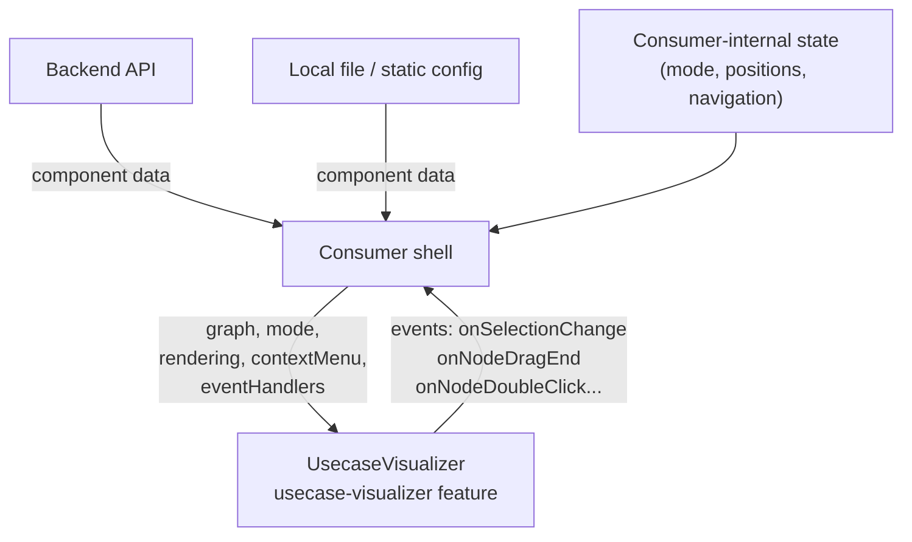
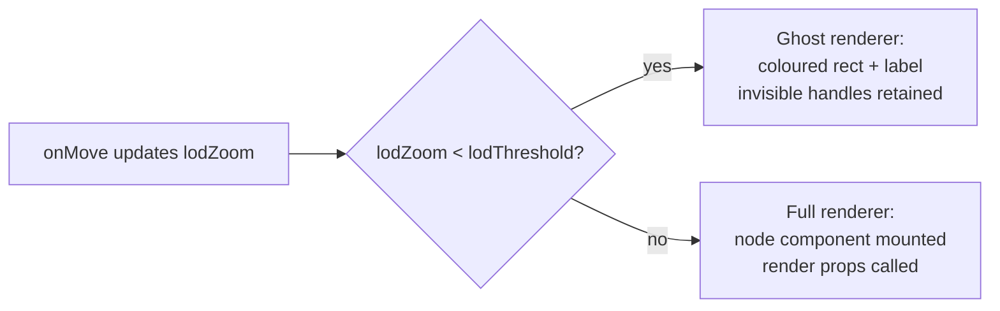
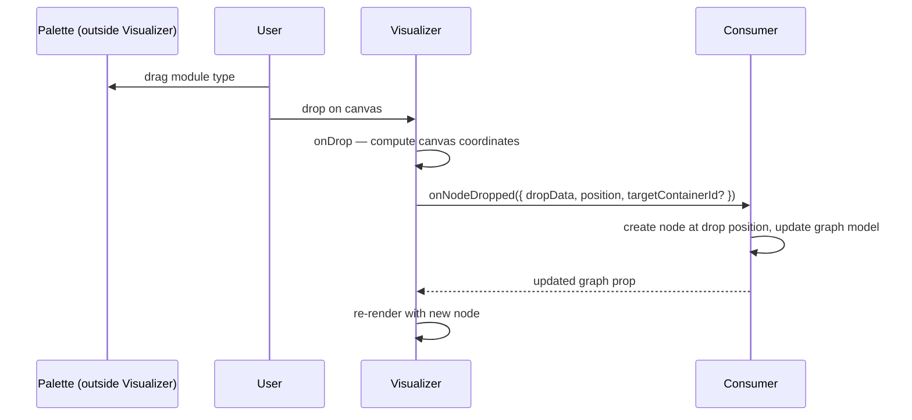
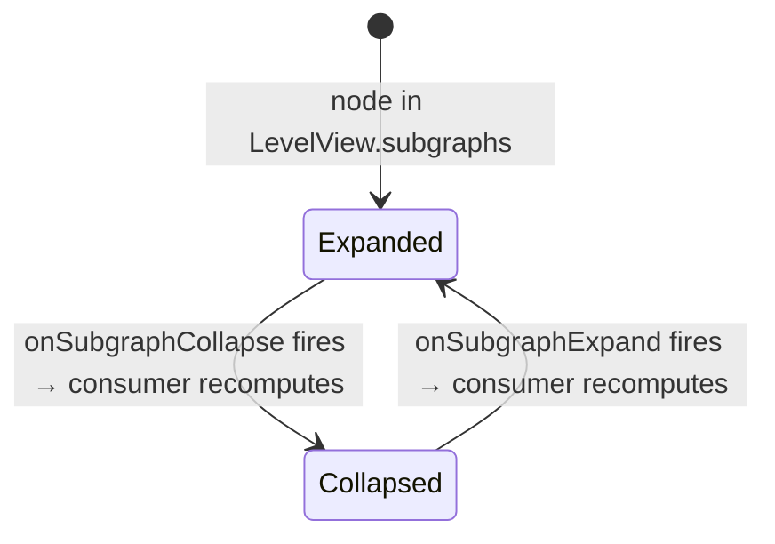
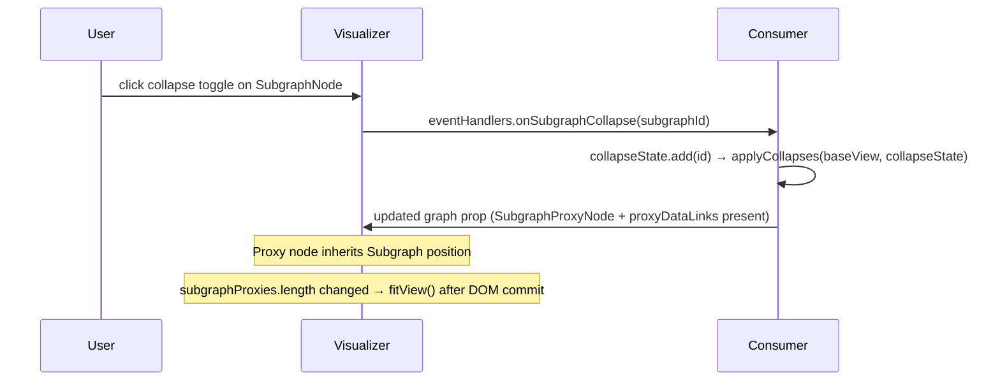
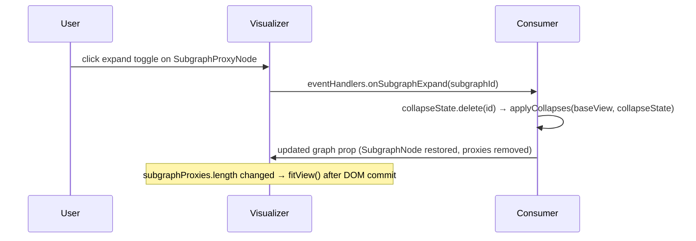
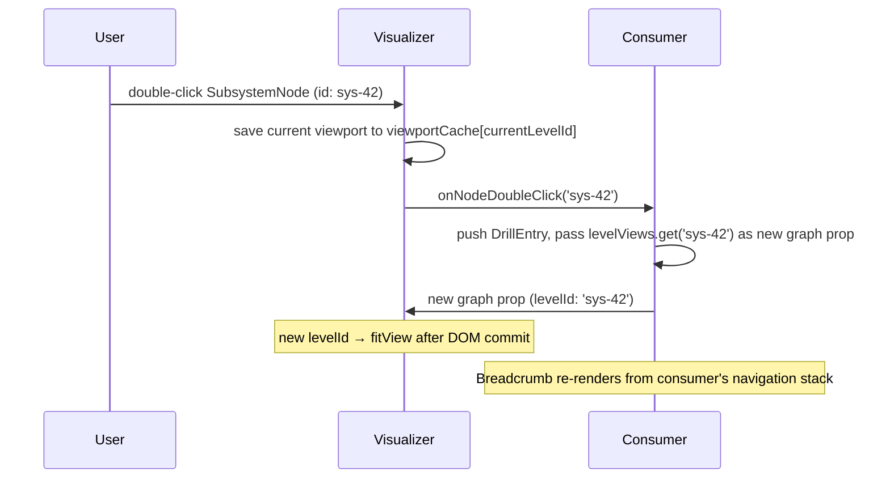
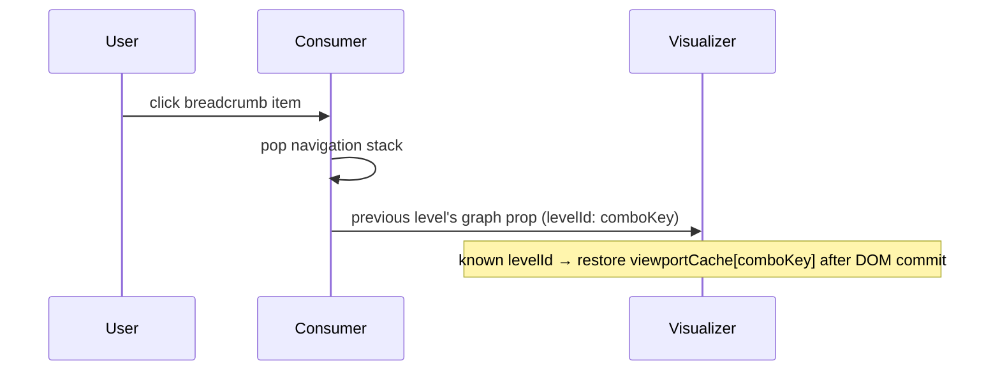

# Use Case Visualizer — Design

The Use Case Visualizer (`UsecaseVisualizer`) is an interactive graph canvas that renders
AudioReach signal-processing topologies. It displays the hierarchical relationship between
Subsystems, Subgraphs, Containers, and Modules together with the data and control edges
between them. Target: 1000+ nodes with acceptable performance on the Electron desktop app.

The Visualizer is a reusable React component. Every consumer gets the following for free:

- All ReactFlow internals hidden — consumers never import `@xyflow/react`
- Built-in default node components for all five AudioReach node kinds
- Port handles, LOD (Level of Detail) ghost rendering, collapse toggles, drill-in affordances
- 60fps drag — positions stay in ReactFlow local state during drag, cross the boundary exactly once on drag end
- Viewport management — fitView on drill-in, restore on drill-out, all internally driven by `levelId`

---

## Table of Contents

- [Tech Stack](#tech-stack)
- [Node Hierarchy & Vocabulary](#node-hierarchy--vocabulary)
- [Node Visual Diagrams](#node-visual-diagrams)
- [Architecture Boundary](#architecture-boundary)
- [Public API](#public-api)
- [Consumer Usage Example](#consumer-usage-example)
- [Graph Model](#graph-model)
- [Internal State](#internal-state)
- [Controlled Mode & Canvas Updates](#controlled-mode--canvas-updates)
- [Rendering](#rendering)
- [Interactions & Events](#interactions--events)
- [Authoring (Edit Mode)](#authoring-edit-mode)
- [Collapse](#collapse)
- [Drill-down](#drill-down)
- [Viewport Management](#viewport-management)
- [Search Highlights](#search-highlights)
- [Screenshot capability](#screenshot-capability)
- [Performance](#performance)
- [Post-MVP Extensions](#post-mvp-extensions)
- [Implementation Notes](#implementation-notes)

---

## Tech Stack

| Concern            | Choice                                                    |
| ------------------ | --------------------------------------------------------- |
| UI framework       | React + TypeScript                                        |
| State              | Zustand (internal store only — no shared stores)          |
| Graph canvas       | `@xyflow/react` v12                                       |
| Layout engine      | ELK via `@xyflow/elkjs` (consumer-side)                   |
| UI tokens          | `@qualcomm-ui` (QUI) CSS variables — no hardcoded colours |
| Architecture style | Feature Sliced Design (FSD)                               |

---

## Node Hierarchy & Vocabulary

Understanding the five node kinds and how data is packaged for the Visualizer is the
prerequisite for everything else in this document.

### Node kinds

```
Subsystem  (nestable via parentId)
  └── Subgraph  (derived from module data; no first-class backend type)
        └── Container  (groups modules that share a resource)
              └── Module  (primary connectable block)
```

**Subsystem** — A named processing domain. At the parent level it appears as an opaque
rectangle with ports. Double-clicking fires `onNodeDoubleClick` — the consumer typically
responds by replacing the canvas with the subsystem's interior, a pattern called
_drill-in_. Subsystems can nest: a subsystem's interior can itself contain other
subsystems.

**Subgraph** — A labelled grouping of containers and modules. Can be _collapsed_: when
collapsed, the entire subgraph is replaced on canvas by a **SubgraphProxy** node that
exposes only the ports whose edges cross the subgraph boundary. The consumer computes
this substitution before passing the `LevelView`; the Visualizer simply renders whatever
it receives.

**Container** — Groups modules that share a resource. Has no ports of its own — module
ports connect directly.

**Module** — A single signal-processing unit. Has data ports (input left, output right)
and control ports (directionless, top). Carries a `moduleType` that drives shape, icon,
and footer content.

**SubgraphProxy** — A compact placeholder rendered when a subgraph is collapsed. Its
ports are derived from edges that crossed the original subgraph boundary. Shows an
expand toggle.

### Ports and positions

| Node type     | Left (data in) | Right (data out) | Top (control)  |
| ------------- | :------------: | :--------------: | :------------: |
| Module        |       ✅       |        ✅        |       ✅       |
| Subsystem     |       ✅       |        ✅        |       ✅       |
| SubgraphProxy |       ✅       |        ✅        |       ✅       |
| Container     | Not Applicable |  Not Applicable  | Not Applicable |
| Subgraph      | Not Applicable |  Not Applicable  | Not Applicable |

Control ports are directionless — placed on top only.

### Edges

**DataLink** — A directed data connection rendered as a solid bezier with an arrowhead.

**ControlLink** — A directionless control connection rendered as a dashed bezier.

When a subgraph is collapsed, any edge that crossed its boundary is replaced by a
**ProxyDataLink** or **ProxyControlLink** — a virtual edge remapped through the proxy
node. The consumer can identify the original edges by matching `sourceNodeId`,
`sourcePortId`, `targetNodeId`, `targetPortId` against the full `LevelView`.

### LevelView and levelId

The Visualizer renders **one drill level at a time**. A `LevelView` is the complete
snapshot of every node and edge visible on canvas at that level. The consumer builds one
for the top level and one per subsystem, then passes whichever is currently active as
the `graph` prop.

`levelId` is a stable string the consumer stamps on each `LevelView`. The Visualizer
uses it to manage viewport history with no ref to the canvas:

`levelId` drives the Visualizer's viewport cache — the Visualizer fits, restores, or preserves the viewport based on whether the levelId has been seen before and whether the proxy count changed. See [Viewport Management](#viewport-management) for the full behaviour table.

See [Graph Model](#graph-model) for complete TypeScript interfaces.

---

## Node Visual Diagrams

Annotations: **(V)** = Visualizer-owned, **(O)** = consumer-provided via render prop or `node.label`.

### ModuleNode

```
                ▲  ▲  control port handles (V)   id="Control:{id}-source/target"
                │  │
◄ Input (V) ────┤  ├──── Output (V) ──►          id="Data:{id}"
     ┌──────────┴──┴──────────────────────────┐
     │  C O R E                          (V)  │
     │                                        │
     │  [icon]  ← node.icon                  │  (O)
     │                                        │
     │  shape geometry:                       │  (V)
     │  rect / circle /                       │
     │  trapezoid-source / trapezoid-sink /   │
     │  triangle                              │
     │  ← node.shape → rect (default)         │  (O / V)
     │                                        │
     ├────────────────────────────────────────┤
     │  F O O T E R                      (O)  │  renderNodeContent(node)?.footer
     │  alias or label          #moduleId     │  default (V): label + #id
     └────────────────────────────────────────┘
```

### SubgraphNode

```
┌───────────────────────────────────────────────────────┐
│  H E A D E R                                     (O)  │  renderNodeContent(node)?.header
│  node.label                              [▼ toggle]   │  ▼ = collapse toggle always rendered (V)
│  [optional controls]                                  │  null → Visualizer default (label + toggle)
├───────────────────────────────────────────────────────┤
│                                                       │
│  C O R E  — children area                        (V)  │
│                                                       │
│   ┌─── ContainerNode ───┐  ┌─── ContainerNode ───┐    │
│   │  ...                │  │  ...                │    │
│   └─────────────────────┘  └─────────────────────┘    │
│                                                       │
└───────────────────────────────────────────────────────┘
  no ports on SubgraphNode itself
```

### ContainerNode

```
┌───────────────────────────────────────────────────────┐
│  H E A D E R                                     (V)  │  always node.label — no render prop
│  node.label                                           │
├───────────────────────────────────────────────────────┤
│                                                       │
│  C O R E  — children area                        (V)  │
│                                                       │
│      ◄──┌──────────────────────┐──►                   │
│         │  ModuleNode          │   module ports       │
│         │  ...                 │   connect here       │
│         └──────────────────────┘                      │
│                                                       │
└───────────────────────────────────────────────────────┘
  no ports on ContainerNode itself
```

### SubsystemNode

```
▲  control port handles (V)   ports[] filtered by portIoType: 'control'
│
◄ Input (V) ──────────────────────────────── Output (V) ──►
     ┌───────────────────────────────────────────────────┐
     │                                                   │
     │  C O R E  — opaque rectangle                 (V)  │
     │                                                   │
     │  node.label                                  (O)  │
     │                                                   │
     │  double-click → eventHandlers.onNodeDoubleClick   │  (V)
     │                                                   │
     └───────────────────────────────────────────────────┘
  no header, no footer
  ports[] from node drives handle placement (filtered by portIoType)
```

### SubgraphProxyNode

```
▲  derived control port handles (V)   from crossing ControlLinks
│
◄ derived Input (V) ──────────────── derived Output (V) ──►
      from crossing DataLinks           from crossing DataLinks
     ╔═══════════════════════════════════════════════════╗
     ║                                                   ║
     ║  node.label  (from original SubgraphNode)    (O)  ║
     ║                                                   ║
     ║  [▶ expand] → onSubgraphExpand             (V)   ║
     ║                                                   ║
     ╚═══════════════════════════════════════════════════╝
  dashed border in UI; no header, no footer
  all ports derived from crossing edges (consumer-computed)
```

---

## Architecture Boundary

### Consumer-Visualizer Relationship



| Role                                       | FSD layer | Owns                                                                                                   |
| ------------------------------------------ | --------- | ------------------------------------------------------------------------------------------------------ |
| **Consumer shell** (e.g. `graph-designer`) | widget    | Data fetching, adapter, ELK layout, collapse computation, position merging, navigation stack, shell UI |
| **Visualizer** (`usecase-visualizer`)      | feature   | ReactFlow canvas, LOD, drag (60fps), selection, hover, viewport cache, context menu UX                 |

### What the Visualizer requires from its consumer

| Requirement                 | Detail                                                                                                                                                                                                                                                                                 |
| --------------------------- | -------------------------------------------------------------------------------------------------------------------------------------------------------------------------------------------------------------------------------------------------------------------------------------- |
| `LevelView.levelId`         | Must be set by the consumer. `levelId` drives the viewport cache — an unseen value triggers `fitView`; a known value restores the cached viewport.                                                                                                                                     |
| Node positions              | Every node must carry `{x, y, width, height}` pre-computed. Nodes without positions stack at the origin. The consumer runs ELK (or loads saved positions) before passing the `graph` prop.                                                                                             |
| Collapsed state pre-applied | The consumer must compute the effective `LevelView` before passing it. Collapsed subgraphs must appear as `SubgraphProxyNode` entries in `subgraphProxies`; internal nodes and crossing-edge originals must be replaced with proxy edges. The Visualizer renders whatever it receives. |
| `mode` prop                 | Consumer owns mode state and passes it down explicitly. The Visualizer has no dependency on any external store.                                                                                                                                                                        |

### What the Visualizer must never do

- Import from `~widgets/*` (upward FSD violation)
- Fetch data from any API
- Run ELK or any layout algorithm
- Own or manage the navigation stack
- Maintain position overrides or `isDirty` state
- Read from any shared Zustand store (`mode` arrives as a prop)
- Inspect `node.meta` fields — it passes them to render props without examining them
- Hardcode any colour values — all colours via QUI CSS variable tokens

### FSD import rules

```
consumer widget (e.g. graph-designer)
  ✅ imports from ~features/usecase-visualizer  (via public index.ts only)
  ✅ imports from ~entities/usecases
  ✅ imports from ~shared/*

usecase-visualizer (feature)
  ✅ imports from ~entities/usecases (types only)
  ✅ imports from ~shared/*
  ❌ must NOT import from ~widgets/*
```

---

## Public API

### `UsecaseVisualizerProps`

Props are grouped into typed config objects — 7 top-level props.

```typescript
interface UsecaseVisualizerProps {
  // ── Graph data ─────────────────────────────────────────────────────────────
  // levelId set by consumer: comboKey for top level, subsystemId for drill levels.
  // Visualizer uses levelId to manage viewport history.
  graph: LevelView;

  // ── Mode ───────────────────────────────────────────────────────────────────
  // Passed explicitly — no shared store. Multiple Visualizer instances can have
  // independent modes. Default: 'readonly'.
  mode?: VisualizerMode;

  // ── Visual customisation ───────────────────────────────────────────────────
  rendering?: VisualizerRenderingConfig;

  // ── Context menu ───────────────────────────────────────────────────────────
  contextMenu?: VisualizerContextMenuConfig;

  // ── Events — readonly + authoring unified; all optional ───────────────────
  eventHandlers?: VisualizerEventHandlers;

  // ── Search highlights ──────────────────────────────────────────────────────
  // Consumer owns search logic and passes results here.
  // Visualizer renders highlight rings and snaps viewport to activeId changes.
  searchHighlights?: SearchHighlights;

  // ── Performance ────────────────────────────────────────────────────────────
  lodThreshold?: number; // default: 0.4

  // ── Viewport restoration ───────────────────────────────────────────────────
  // Viewport to restore on mount instead of calling fitView for the current levelId.
  // Consumer saves viewport via onViewportChange and restores on remount via this
  // prop to preserve the user's viewport after navigation away and back.
  initialViewport?: ViewportState;

  // ── Screenshot capability ──────────────────────────────────────────────────
  // Fires once after canvas mount with an imperative capture function.
  // See Screenshot capability section.
  onScreenshotApiReady?: (capture: () => Promise<string | null>) => void;
}
```

### `VisualizerRenderingConfig`

```typescript
interface VisualizerRenderingConfig {
  nodeDisplayConfig?: NodeDisplayConfig;
  renderNodeContent?: (node: AnyNode) => NodeContentOverride | null;

  // Post-MVP:
  // getNodeAdornments?: (node: AnyNode) => NodeAdornment[];
  // getEdgeAdornments?: (edge: AnyEdge) => EdgeAdornment[];
}

interface NodeDisplayConfig {
  showContainerId?: boolean; // default: true
  showModuleInstanceId?: boolean; // default: true
  showSubgraphId?: boolean; // default: true
}

interface NodeContentOverride {
  // Additional content inside the node shape at fixed corner positions.
  // e.g. enable/disable checkbox at top-left; reserved selection checkbox at top-right.
  coreOverrides?: CoreOverride[];
  // Content rendered below the node's built-in ID label (below the footer area).
  footer?: ReactNode;
  // Content rendered between the default ID label and the collapse/expand toggle.
  header?: ReactNode;
}

interface CoreOverride {
  content: ReactNode;
  position: 'bottom-left' | 'bottom-right' | 'top-left' | 'top-right';
}
```

The Visualizer always renders the subgraph ID label and collapse/expand toggle at fixed
positions. The `header` slot provides the content between them. `coreOverrides` positions
additional content inside the node shape (e.g. enable/disable checkbox at top-left,
future selection checkbox at top-right). The term "overlays" is reserved for planned
real-time data logging chart overlays.

### `VisualizerContextMenuConfig`

```typescript
interface VisualizerContextMenuConfig {
  getItems: (target: ContextMenuTarget) => ContextMenuItem[];
  onAction: (actionId: string, target: ContextMenuTarget) => void;
}
```

### `VisualizerEventHandlers`

Readonly and authoring callbacks unified in one optional interface. `mode` controls
which authoring callbacks are active — the Visualizer ignores authoring callbacks when
`mode !== 'edit'`.

```typescript
interface VisualizerEventHandlers {
  // ── Readonly ───────────────────────────────────────────────────────────────
  onSelectionChange?: (payload: SelectionChangePayload) => void;
  onNodeDragEnd?: (payload: NodeDragEndPayload) => void;
  onSubgraphCollapse?: (subgraphId: number) => void;
  onSubgraphExpand?: (subgraphId: number) => void;
  // Fired on any node double-click. Visualizer saves viewport to viewportCache
  // before firing when the double-clicked node is a SubsystemNode.
  onNodeDoubleClick?: (nodeId: string) => void;
  // Fires on every viewport mutation — both user-initiated (pan, zoom, Space-drag)
  // and Visualizer-initiated (fitView on drill-in/collapse, setViewport on
  // drill-out cache restore, setCenter on search snap). Consumers persisting the
  // viewport across mounts can wire this to a setter and pass the saved value
  // back via initialViewport on the next mount.
  onViewportChange?: (viewport: ViewportState) => void;

  // ── Authoring (only active when mode === 'edit') ──────────────────────────
  onNodeDropped?: (payload: NodeDropPayload) => void;
  onEdgeConnected?: (payload: EdgeConnectPayload) => void;
  onNodesDeleted?: (payload: {nodeIds: string[]}) => void;
  onEdgesDeleted?: (payload: {edgeIds: string[]}) => void;
  // onPortAdded / onPortRemoved — post-MVP; ports are managed from the properties panel
}
```

### Canvas ownership

The consumer holds no `ref` to the canvas — it is managed entirely by the Visualizer.
Viewport operations are triggered by prop changes and handled internally:

- Drill-in fitView: triggered by `graph.levelId` changing to an unseen value
- Drill-out restore: triggered by `graph.levelId` changing to a previously seen value
- Search snap: triggered by `searchHighlights.activeId` changing

### Full reset via `key`

The props-driven flow covers all normal cases. If ReactFlow's internal state becomes
corrupted — fast refresh, React StrictMode edge cases, or a pathological state sequence —
passing the same or new `graph` prop will not self-heal it; the `useEffect` only fires
when `graph` changes.

The idiomatic React solution is the **`key` prop**: changing it causes React to unmount
and remount the component entirely. All internal state is destroyed — `viewportCache`,
`selection`, `hoverState`, Zustand store slices — and the fresh mount starts from the
current `graph` prop. The Visualizer treats all `levelId` values as unseen and calls
`fitView`.

```tsx
const [canvasKey, setCanvasKey] = useState(0);
// To fully reset:  setCanvasKey(k => k + 1)

<UsecaseVisualizer key={canvasKey} graph={currentLevel} ... />
```

No custom `forceRedraw` API is needed or planned.

---

## Consumer Usage Example

A minimal invocation only needs `graph`. Every other prop is optional and can be added
incrementally as the consumer requires the feature.

### Minimal

```tsx
<UsecaseVisualizer graph={currentLevel} />
```

### Full wiring

The example below shows how a typical consumer shells the Visualizer with collapse,
drill-in, drag, and selection all wired up.

```tsx
function GraphDesigner() {
  const [mode, setMode] = useState<'readonly' | 'edit'>('readonly');
  const [canvasKey, setCanvasKey] = useState(0);
  const [collapseState, setCollapseState] = useState(new Set<number>());
  const [drillStack, setDrillStack] = useState([
    {subsystemId: null, label: 'Top'},
  ]);
  const [positionOverrides, setPositionOverrides] = useState<
    Record<string, XY>
  >({});

  // graph is always the effective (post-collapse) view of the active drill level.
  // applyCollapses is a pure function from entities/usecase-graph.
  const graph = useMemo(
    () =>
      applyCollapses(
        levelViews.get(drillStack.at(-1)!.subsystemId),
        collapseState,
      ),
    [levelViews, drillStack, collapseState],
  );

  return (
    <>
      {/* Breadcrumb lives outside the Visualizer — consumer renders it */}
      <Breadcrumb
        stack={drillStack}
        onNavigate={(idx) => setDrillStack((s) => s.slice(0, idx + 1))}
      />

      <UsecaseVisualizer
        key={canvasKey} // increment to fully reset canvas state
        graph={graph}
        mode={mode}
        rendering={{
          nodeDisplayConfig: {showModuleInstanceId: true},
          renderNodeContent: (node) => {
            if (node.nodeKind !== 'module') return null;
            return {
              footer: <ModuleFooter node={node} />,
            };
          },
        }}
        contextMenu={{
          getItems: (target) => buildMenuItems(target, mode),
          onAction: (actionId, target) => handleMenuAction(actionId, target),
        }}
        eventHandlers={{
          // Collapse — consumer recomputes effective LevelView via applyCollapses
          onSubgraphCollapse: (id) =>
            setCollapseState((s) => new Set(s).add(id)),
          onSubgraphExpand: (id) =>
            setCollapseState((s) => {
              const n = new Set(s);
              n.delete(id);
              return n;
            }),

          // Drill-in — consumer checks node type and decides what to do
          onNodeDoubleClick: (nodeId) => {
            const isSubsystem = levelViews
              .get(drillStack.at(-1)!.subsystemId)
              ?.subsystems?.some((s) => s.id === nodeId);
            if (!isSubsystem) return; // module/container double-click — handle as needed
            setDrillStack((s) => [
              ...s,
              {
                subsystemId: nodeId,
                label: levelViews.get(nodeId)!.label ?? nodeId,
              },
            ]);
          },

          // Drag — record the final position so the next graph prop is consistent
          onNodeDragEnd: ({nodeId, position, resizedParents}) => {
            setPositionOverrides((prev) => ({...prev, [nodeId]: position}));
            if (resizedParents) persistParentSizes(resizedParents);
          },

          onSelectionChange: (payload) => syncSelection(payload),
        }}
        searchHighlights={searchHighlights}
      />
    </>
  );
}
```

`levelViews` is a `Map<string | null, LevelView>` pre-computed by the consumer's adapter
at load time (null key = top level). Drill-in is a synchronous map lookup — no fetch,
no loading state.

---

## Graph Model

### Node types

```typescript
// ── Shared base ───────────────────────────────────────────────────────────────

interface NodeBase {
  id: string;
  label: string;
  parentId?: string; // ReactFlow nesting — set by consumer adapter
  x: number;
  y: number;
  width: number; // Visualizer renders at exactly this size
  height: number;
  meta?: Record<string, unknown>; // Domain-specific data; passed to render props, never inspected
  locked?: boolean; // When true: no edit affordances, excluded from Delete key, no context menu — still draggable
}

// ── Subsystem ─────────────────────────────────────────────────────────────────

interface SubsystemNode extends NodeBase {
  nodeKind: 'subsystem';
  ports: Port[];
  subsystemId: string;
}

// ── Subgraph ──────────────────────────────────────────────────────────────────

interface SubgraphNode extends NodeBase {
  nodeKind: 'subgraph';
  subgraphId: number;
}

// ── Container ─────────────────────────────────────────────────────────────────

interface ContainerNode extends NodeBase {
  containerId: number;
  logicalContainerId?: string; // for hover highlight across duplicate Container instances
  nodeKind: 'container';
}

// ── Module ────────────────────────────────────────────────────────────────────

interface ModuleNode extends NodeBase {
  alias?: string;
  icon?: string; // static icon; hidden in ghost mode
  moduleId: number;
  moduleType: string;
  nodeKind: 'module';
  ports: Port[];
  shape?: ModuleShape; // static shape; defaults to 'rect'
}

type ModuleShape =
  | 'rect'
  | 'circle'
  | 'trapezoid-source' // flat left edge converging to a point on the right; source modules — output port only
  | 'trapezoid-sink' // narrow/pointed left, flat right; sink modules — input port only
  | 'triangle'; // right-pointing equilateral; gain/amplifier modules

/** PortIoType drives handle placement: 'input' → left (target), 'output' → right (source), 'control' → top (both). */
type PortIoType = 'input' | 'output' | 'control';

export interface Port {
  id: string;
  /** Prevents new connections and hides context menu for this port. */
  locked?: boolean;
  /** Max edges connectable to this port. Absent means unlimited. */
  maxConnections?: number;
  name?: string;
  portIoType: PortIoType;
  /** Consumer-settable. Absent means no status indicator is shown. */
  portStatus?: PortStatus;
}

// All node types that carry ports use a single `ports: Port[]` array. The
// Visualizer filters by `portIoType` for handle placement: 'input' → left
// handle (type="target"), 'output' → right handle (type="source"),
// 'control' → top handles (both source and target stacked).

// PORT_STATUS = { PARTIAL: 'partial', UNUSED: 'unused', USED: 'used' } as const
type PortStatus = (typeof PORT_STATUS)[keyof typeof PORT_STATUS];

// ── Subgraph proxy (collapsed subgraph placeholder) ───────────────────────────
// Created by the consumer via applyCollapses; passed in LevelView.subgraphProxies[].

interface SubgraphProxyNode extends NodeBase {
  nodeKind: 'subgraph-proxy';
  ports: Port[]; // derived from crossing edges at collapse time
  subgraphId: number;
}
```

### Edge types

```typescript
interface EdgeBase {
  id: string;
  label?: string;
  /** Excluded from Delete key and context menu. */
  locked?: boolean;
  sourceNodeId: string;
  sourcePortId: string;
  targetNodeId: string;
  targetPortId: string;
  // visual?: EdgeVisual — post-MVP; per-edge style overrides deferred
}

interface DataLink extends EdgeBase {
  edgeKind: 'data';
}
interface ControlLink extends EdgeBase {
  edgeKind: 'control';
}

// Proxy edges — both endpoints remapped through the proxy boundary
interface ProxyDataLink extends EdgeBase {
  edgeKind: 'proxy-data';
}

interface ProxyControlLink extends EdgeBase {
  edgeKind: 'proxy-control';
}
```

### `LevelView`

The canonical input to the Visualizer. All array fields are optional.

**Consumers without drill-in support** pass all nodes in a single flat `LevelView` with
no `SubsystemNode` entries. The Visualizer renders no drill-in affordance when
`subsystems` is absent or empty. `levelId` stays constant (e.g. the combo key) unless
the selection changes. `onNodeDoubleClick` need not be wired up if the consumer has
no double-click behaviour.

A flat-module-only consumer passes just `{ levelId, modules, dataLinks }` — no subsystems,
subgraphs, containers, or their associated interfaces need to be imported.

```typescript
interface LevelView {
  // Required. Set by consumer:
  //   top level:       comboKey  (e.g. 'uc-1|uc-3')
  //   subsystem level: subsystemId
  // Drives viewport history — unseen value → fitView; known → restore; same → preserve.
  // Exception: if subgraphProxies.length changes with the same levelId, the Visualizer
  // detects a collapse/expand and calls fitView automatically.
  levelId: string;

  subsystems?: SubsystemNode[];
  subgraphs?: SubgraphNode[]; // expanded subgraphs
  subgraphProxies?: SubgraphProxyNode[]; // collapsed subgraphs (consumer-computed)
  containers?: ContainerNode[];
  modules?: ModuleNode[];
  dataLinks?: DataLink[];
  controlLinks?: ControlLink[];
  proxyDataLinks?: ProxyDataLink[]; // virtual data edges through proxy boundary
  proxyControlLinks?: ProxyControlLink[]; // virtual control edges through proxy boundary
}
```

### Context menu types

```typescript
type ContextMenuTarget =
  | {kind: 'module'; node: ModuleNode}
  | {kind: 'subgraph'; node: SubgraphNode}
  | {kind: 'subgraph-proxy'; node: SubgraphProxyNode}
  | {kind: 'container'; node: ContainerNode}
  | {kind: 'subsystem'; node: SubsystemNode}
  | {edge: DataLink; kind: 'data-link'}
  | {edge: ControlLink; kind: 'control-link'}
  | {edge: ProxyDataLink; kind: 'proxy-data-link'}
  | {edge: ProxyControlLink; kind: 'proxy-control-link'}
  | {kind: 'port'; nodeId: string; port: Port};

interface ContextMenuItem {
  id: string;
  label: string;
  icon?: string;
  disabled?: boolean;
  tooltip?: string;
  dividerBefore?: boolean;
  children?: ContextMenuItem[]; // submenu
}
```

---

## Internal State

The Visualizer owns an internal Zustand store that no external component writes to.
External state arrives only via props.

**Per-mount instance.** Each `<UsecaseVisualizer>` mount creates its own store via a
`createVisualizerStore` factory. Multiple Visualizer instances rendered on the same
page (e.g. side-by-side editors, picture-in-picture preview) therefore have fully
independent selection, hover, viewport cache, and search-highlight slices. The factory
also lets `key`-driven remounts start from a clean store rather than carrying stale
state from the previous mount.

```typescript
interface VisualizerInternalStore {
  // Drives ghost vs full render
  lodZoom: number;

  // Per-level viewport history. Populated when onNodeDoubleClick fires from a SubsystemNode.
  // Restored when graph.levelId changes to a previously seen value.
  viewportCache: Record<string, ViewportState>;

  // Cross-instance Container highlight
  hoverState: {
    hoveredNodeId: string | null;
    hoveredLogicalContainerId: string | null;
  };

  // Current selection — mirrored via onSelectionChange
  selection: {
    selectedNodeIds: string[];
    selectedEdgeIds: string[];
  };

  // Previous selection — retained to compute delta for SelectionChangePayload.
  // Updated after delta is computed, before the next onSelectionChange fires.
  previousSelection: {
    selectedNodeIds: string[];
    selectedEdgeIds: string[];
  };

  // Search highlights — mirrored from the searchHighlights prop into a
  // per-node-id Map so node components subscribe by id and only those whose
  // status changed re-render. Avoids re-creating the rfNodes array on every
  // search keystroke. containsMatchNodeIds carries the contains-match overlay
  // for any currently-rendered ancestor whose subtree holds a deeper-level
  // match — typically SubsystemNode (drill-in) or SubgraphProxyNode (expand).
  // Consumer-supplied (see Search Highlights section).
  searchHighlightById: Record<string, SearchHighlightState>;
  containsMatchNodeIds: string[];
}

interface ViewportState {
  x: number;
  y: number;
  zoom: number;
}
interface XY {
  x: number;
  y: number;
}
```

**60fps drag optimisation:** During drag, `onNodesChange` updates ReactFlow's own local state
only — the Visualizer store and the consumer are not written on every frame. `onNodeDragEnd`
fires exactly once on drag release.

```tsx
const [liveNodes, , onNodesChange] = useNodesState(rfNodes);
const handleNodeDragStop = (_event, node) => {
  eventHandlers.onNodeDragEnd?.({
    nodeId: node.id,
    position: node.position,
    resizedParents: getResizedParents(),
  });
};
```

---

### Parent node auto-resize during drag

When a node is dragged, the Visualizer dynamically resizes its parent nodes to maintain
consistent padding on all sides. The algorithm runs on every `onNodesChange` position
event during drag:

1. **Bottom-up traversal**: Container → Subgraph → Subsystem — each level uses updated
   dimensions from the level below
2. **Bounding box**: Compute `minX`, `minY`, `maxRight`, `maxBottom` across all children
3. **Overflow correction**: If children are closer to the top/left edge than
   `NODE_DIMENSIONS` padding, shift siblings inward and move the parent outward by the
   same amount, preserving absolute screen positions
4. **Parent resize**: Set parent `{width, height}` to `maxRight + padding` and
   `maxBottom + padding`

This runs entirely in ReactFlow local state — `LevelView` is not touched during drag. On
drag end, `onNodeDragEnd` fires with the dragged node's final `position` and any
`resizedParents: Record<string, {height, width}>` so the consumer can persist the new
dimensions.

ELK does not re-run after a drag. A node from the palette appears at the exact drop
position with no re-layout.

---

## Controlled Mode & Canvas Updates

### How the consumer's data reaches the canvas

The Visualizer runs ReactFlow in **controlled mode** — the `nodes` and `edges` arrays
passed to `<ReactFlow>` are the authoritative state. When the `graph` prop changes, an
effect converts the `LevelView` to ReactFlow's internal format and calls `setNodes` /
`setEdges`. ReactFlow reconciles the difference and re-renders only the affected nodes.

```tsx
useEffect(() => {
  setRfNodes(toReactFlowNodes(graph));
  setRfEdges(toReactFlowEdges(graph));
}, [graph]);

return (
  <ReactFlow
    nodes={rfNodes}
    edges={rfEdges}
    onNodesChange={onNodesChange}
    onNodeDragStop={(_, node) => eventHandlers.onNodeDragEnd?.({nodeId: node.id, position: node.position})}
    ...
  />
);
```

This conversion — LevelView domain types to ReactFlow node/edge objects — is entirely
internal. The consumer never imports `@xyflow/react`.

### The drag divergence window

During a drag, ReactFlow's `onNodesChange` fires at ~60fps with position updates. The
Visualizer applies these to `rfNodes` local React state only — the consumer's `graph`
prop is not touched. On drag end, `onNodeDragEnd` fires exactly once to the consumer.

This creates a deliberate brief divergence: what ReactFlow renders (dragged position in
local state) differs from what the consumer has (pre-drag position in `graph`). The
divergence collapses on drag end when the consumer updates its position overrides and
passes a new `graph` prop. Consumers benefit from 60fps drag without knowing this exists.

### Why positions must live in the consumer's graph prop

In controlled mode, every call to `setRfNodes(toReactFlowNodes(graph))` overwrites
`rfNodes` with whatever positions are in `graph`. If the consumer's `graph` still carries
stale positions from before a drag, any subsequent `graph` update — collapse, new node
added, authoring edit — triggers the effect and causes dragged nodes to **snap back**:

```
1. m1 is at (100, 200) in graph
2. User drags m1 → rfNodes local state has m1 at (150, 250)
3. User collapses SG-1 → consumer passes new graph (m1 still at 100, 200 — not updated)
4. useEffect fires → setRfNodes → m1 snaps back to (100, 200)  ← wrong
```

`onNodeDragEnd` → consumer records position override → next `graph` prop carries m1 at
(150, 250) → subsequent graph updates never snap the node back.

### Memoization

**Consumer responsibility:** memoize the `LevelView`-derived arrays passed as props so
unchanged nodes retain reference identity — ReactFlow compares nodes by reference, so
recreating the full array when only one node changed forces re-evaluation of every node.

**Visualizer responsibility:** internally memoizes `rfNodes`/`rfEdges` so ReactFlow only
re-evaluates nodes whose data or position actually changed.

---

### ReactFlow rendering mechanics

How `LevelView` domain objects become rendered nodes in three layers:

**Layer 1 — `toReactFlowNodes` / `toReactFlowEdges`**

Each domain array maps to a flat list of ReactFlow node/edge objects. The key fields:

```typescript
// Every domain node becomes:
{ id, type, position: {x, y}, data: domainNode, parentId, width, height }
//       ↑ looked up in nodeTypes registry    ↑ full domain object, passed to component
```

| LevelView array   | `type` string      |
| ----------------- | ------------------ |
| `modules`         | `'module'`         |
| `subgraphs`       | `'subgraph'`       |
| `containers`      | `'container'`      |
| `subsystems`      | `'subsystem'`      |
| `subgraphProxies` | `'subgraph-proxy'` |

`data` carries the entire domain node so the component has full access to ports,
`meta`, `moduleType`, etc. `parentId` threads through from `NodeBase.parentId` to
give ReactFlow the nesting hierarchy.

**Layer 2 — `nodeTypes` registry**

The Visualizer registers its built-in components before mounting `<ReactFlow>`:

```typescript
const nodeTypes = {
  module: ModuleNode,
  subgraph: SubgraphNode,
  container: ContainerNode,
  subsystem: SubsystemNode,
  'subgraph-proxy': SubgraphProxyNode,
};
```

When ReactFlow renders a node with `type: 'module'` it calls `ModuleNode` and passes
`NodeProps<ModuleNode>` — the component receives `props.data` which is the original
`ModuleNode` domain object. The consumer never imports `@xyflow/react`.

**Layer 3 — `<Handle>` elements wire edges to specific ports**

Each node component renders `<Handle>` elements internally. The handle `id` must match
the `sourceHandle` / `targetHandle` value the edge conversion puts on each edge:

```
DataLink edge:   sourceHandle = "Data:{sourcePortId}"
                 targetHandle = "Data:{targetPortId}"
ModuleNode:      Input  handle id = "Data:{port.id}"  (type="target")
                 Output handle id = "Data:{port.id}"  (type="source")
```

This three-way naming contract is why edges connect to specific port positions rather
than to the node centre. Full convention is in the Handle ID naming convention section.

---

## Rendering

### Default node components

The Visualizer ships built-in defaults for all five node kinds. No registration required.
Content is customised through render props; structural overrides are planned via
`NodeShapeDescriptor` (post-MVP).

| ReactFlow `type` | Default component   | Renders                                                          |
| ---------------- | ------------------- | ---------------------------------------------------------------- |
| `module`         | `ModuleNode`        | Shape geometry, data + control port handles, header/footer slots |
| `subgraph`       | `SubgraphNode`      | Container rectangle + header with collapse toggle                |
| `container`      | `ContainerNode`     | Container rectangle + header                                     |
| `subsystem`      | `SubsystemNode`     | Opaque rectangle with drill-in affordance                        |
| `subgraph-proxy` | `SubgraphProxyNode` | Dashed proxy box with derived port handles + expand toggle       |

See [Node Visual Diagrams](#node-visual-diagrams) for annotated layouts of each component.

### Module shape and icon resolution

Shape is resolved from `node.shape`, defaulting to `'rect'`. Icon is resolved from
`node.icon`, defaulting to `null` (no icon; hidden in ghost mode). Consumers set these
fields in their adapter. There are no render-prop callbacks for shape or icon.

### Node content customisation

`renderNodeContent(node)` returns a `NodeContentOverride` or `null`. Returning `null`
(or omitting `renderNodeContent`) uses the Visualizer's built-in defaults for all slots.

```tsx
rendering={{
  renderNodeContent: (node) => {
    if (node.nodeKind !== 'module') return null;
    return {
      footer: (
        <div className="module-footer">
          <span>{node.alias ?? node.label}</span>
          <code>#{node.moduleId}</code>
        </div>
      ),
    };
  },
}}
```

The `header` slot is rendered between the node's ID label and its collapse/expand toggle.
The `coreOverrides` slots position content inside the node shape at fixed corners.

### Level of Detail (LOD)

Below `lodThreshold` (default `0.4`), node components are not mounted. Instead, each
node renders as a uniform ghost: a QUI-token-coloured rectangle at its declared
`{width, height}`, the node's label, and invisible `<Handle>` elements at the correct
port positions. The ghost appearance is entirely Visualizer-owned — no per-component
configuration is needed. Because ReactFlow preserves parent-child nesting, the hierarchy
remains visible in ghost mode as nested coloured rectangles at different scales.

Ghost rendering is consistent across all five node kinds (ModuleNode, SubgraphNode,
ContainerNode, SubsystemNode, SubgraphProxyNode).

**Invisible handles in ghost mode:** The Visualizer always renders invisible `<Handle>`
elements at the correct port positions in ghost mode, so ReactFlow can resolve
`sourceHandle`/`targetHandle` IDs and keep connections visible at low zoom.

**LOD rendering pipeline:**



### Edge rendering

| Edge kind          | Visual                                                                           | Routing      |
| ------------------ | -------------------------------------------------------------------------------- | ------------ |
| `DataLink`         | Solid bezier with arrowhead                                                      | Bezier (MVP) |
| `ControlLink`      | Dashed bezier                                                                    | Bezier (MVP) |
| `ProxyDataLink`    | Same as DataLink; slightly thicker stroke to distinguish proxy from direct edges | Bezier (MVP) |
| `ProxyControlLink` | Same as ControlLink; slightly thicker stroke                                     | Bezier (MVP) |

Step/orthogonal routing is planned for post-MVP.

**Edge labels:** When `EdgeBase.label` is set, the label is rendered slightly above the
bezier midpoint using ReactFlow's `EdgeLabelRenderer`, horizontally centred between the
two endpoints. Labels participate in LOD — they are hidden in ghost mode (below
`lodThreshold`).

### Theming

All visual tokens are QUI CSS variables (`var(--color-*)`). No hardcoded colours
anywhere in the Visualizer. Light/dark theme is applied automatically via `data-theme`
on the document root.

---

## Interactions & Events

### Interaction table

| Interaction           | Visualizer behaviour                                                              | Event emitted                         |
| --------------------- | --------------------------------------------------------------------------------- | ------------------------------------- |
| Click node            | Select (single)                                                                   | `onSelectionChange`                   |
| Ctrl+Click node       | Add/remove from selection                                                         | `onSelectionChange`                   |
| Click edge            | Select edge                                                                       | `onSelectionChange`                   |
| Lasso drag            | Select multiple (left-drag on empty canvas)                                       | `onSelectionChange`                   |
| Space+drag            | Pan canvas                                                                        | —                                     |
| Scroll wheel          | Zoom / pan (standard ReactFlow)                                                   | —                                     |
| Click canvas          | Clear selection                                                                   | `onSelectionChange` with empty arrays |
| Hover node            | Set `hoverState`; highlight Container siblings                                    | —                                     |
| Right-click node/edge | Call `getItems`; render context menu                                              | —                                     |
| Select menu item      | Dismiss menu                                                                      | `onAction`                            |
| Click collapse toggle | Fire `onSubgraphCollapse`                                                         | `onSubgraphCollapse(subgraphId)`      |
| Click expand toggle   | Fire `onSubgraphExpand`                                                           | `onSubgraphExpand(subgraphId)`        |
| Drag node             | Positions update in ReactFlow local state only                                    | —                                     |
| Drop node (drag end)  | Fire `onNodeDragEnd`                                                              | `onNodeDragEnd(payload)`              |
| Double-click any node | Fire `onNodeDoubleClick`; save viewport to cache first if node is a SubsystemNode | `onNodeDoubleClick(nodeId)`           |
| Zoom / Pan            | Standard ReactFlow; update `lodZoom`                                              | —                                     |

### Event payload types

```typescript
interface SelectionChangePayload {
  // Current full selection
  selectedNodeIds: string[];
  selectedEdgeIds: string[];
  // Delta — what changed in this event. Computed by the Visualizer from its
  // previousSelection store slice; consumers need not track this themselves.
  delta: {
    addedNodeIds: string[]; // newly selected
    removedNodeIds: string[]; // just deselected
    addedEdgeIds: string[];
    removedEdgeIds: string[];
  };
}

interface NodeDragEndPayload {
  nodeId: string;
  position: XY;
  // Present when the drag caused one or more ancestor nodes to resize.
  // Consumer should persist the new dimensions to avoid snap-back on next graph update.
  // Keyed by nodeId for O(1) lookup when updating positions.
  resizedParents?: Record<string, {height: number; width: number}>;
}
```

### Context menu contract

`getItems` is called **lazily at right-click time** — not precomputed. The consumer
closure has full access to current app state (mode, selection, etc.).

The menu renders as a standard popover at the cursor position. It dismisses on
click-outside or when an item is selected. No keyboard navigation is required for MVP.

```tsx
contextMenu={{
  getItems: (target) => {
    if (target.kind === 'module') {
      const items: ContextMenuItem[] = [
        { id: 'configure',    label: 'Configure' },
        { id: 'view-details', label: 'View Details' },
      ];
      if (mode === 'edit') items.push({ id: 'delete', label: 'Delete', dividerBefore: true });
      return items;
    }
    if (target.kind === 'proxy-data-link') {
      return [{ id: 'show-originals', label: 'Show original connections' }];
    }
    return [];
  },
  onAction: (actionId, target) => { /* consumer handles */ },
}}
```

### Context menu rules

- Returns `[]` → no menu shown
- Right-click on a multi-selected item: `getItems` receives the right-clicked target. The consumer's closure has access to its own selection state and may include items applicable to all selected nodes.
- `onAction` receives the same `target` that was passed to `getItems`

### Selection clearing

- On drill-in / drill-out — navigated nodes may not exist at the new level
- On collapse / expand — selected internal nodes may disappear

In both cases the Visualizer calls `clearSelection()` inside the same `useEffect` that
handles viewport transitions (the one that watches `graph`). It fires unconditionally on
`levelId` change and on `subgraphProxies.length` change — the same two conditions that
trigger viewport actions. No separate effect is needed.

---

## Authoring (Edit Mode)

The Visualizer is the **interaction surface** in edit mode, not the authority on graph
mutations. It emits what the user did; the consumer validates and mutates its graph model;
updated props flow back as the source of truth.

### Activation

When `mode === 'edit'`:

- `nodesConnectable={true}` on `<ReactFlow />`
- Canvas becomes a drag-drop target (for palette drops)
- Delete key fires `onNodesDeleted` / `onEdgesDeleted`

**Locked nodes (`NodeBase.locked === true`):** Regardless of canvas `mode`, a locked
node has no edit affordances (connection handles), is excluded from
Delete-key deletion, and has no context menu. Locked nodes remain draggable — position
adjustments are permitted even when content editing is not. The consumer sets `locked`
per-node in the adapter — useful for read-only reference nodes or system-managed nodes
that should not be modified in a given editing context.

**Locked ports (`Port.locked === true`):** A locked port is excluded from context menus
and the Visualizer internally prevents new connections to or from it. The consumer is
responsible for setting `locked: true` on ports that should not be modified — for
example, ports on SubgraphProxy nodes where connections through the proxy boundary
cannot be changed.

**Locked edges (`EdgeBase.locked === true`):** A locked edge is excluded from
Delete-key deletion and has no context menu. The consumer sets `locked` on edges that
must not be removed — for example, edges that cross a SubgraphProxy boundary, where
removing the edge would require re-running the collapse computation.

### Authoring event payloads

```typescript
interface NodeDropPayload {
  /** Raw string from dataTransfer — consumer parses. */
  dropData: string;
  position: XY; // canvas coordinates of the drop
  targetContainerId?: string;
  targetSubgraphId?: string;
}

interface EdgeConnectPayload {
  edgeKind: EdgeKind;
  sourceNodeId: string;
  sourcePortId: string;
  targetNodeId: string;
  targetPortId: string;
}
// EdgeKind: 'data' | 'control' | 'proxy-data' | 'proxy-control'
// The Visualizer rejects connections between mismatched port types (control↔data)
// internally before firing this event. It also rejects connections to/from locked ports.
```

### Module drop sequence

**Palette drag convention**: The palette must register a secondary MIME type during drag
so the Visualizer can enforce drop rules during `dragover`:

```javascript
event.dataTransfer.setData('application/json', JSON.stringify(payload));
// Use node-type-specific sentinel: 'module', 'subgraph', etc.
event.dataTransfer.setData('application/x-audioreach-node-type-module', '');
```

The Visualizer reads `event.dataTransfer.types` during `dragover` and enforces rules
internally (e.g. subgraph-on-subgraph is rejected; the browser shows the forbidden
cursor).



### Keyboard shortcuts (edit mode)

| Key      | Behaviour                                                                |
| -------- | ------------------------------------------------------------------------ |
| `Delete` | `onNodesDeleted` for selected nodes; `onEdgesDeleted` for selected edges |
| `Escape` | Clear selection                                                          |

---

## Collapse

The Visualizer is a **pure renderer** for collapse state. It does not track which
subgraphs are collapsed. The consumer computes the effective `LevelView` (with proxy
nodes and edges) before passing it via the `graph` prop.

Collapse and expand keep the same `levelId`. The Visualizer detects that a structural
change occurred by comparing `subgraphProxies.length` against the previous render. If
it changed, `fitView()` is called after the DOM commits. This covers both single-toggle
collapse and consumer-driven batch operations (collapse-all) with no consumer-side
configuration needed.

### State machine



`Expanded` = `SubgraphNode` present in `LevelView.subgraphs`.
`Collapsed` = `SubgraphProxyNode` present in `LevelView.subgraphProxies`.

### Subgraph collapse sequence



### Subgraph proxy expand sequence



---

## Drill-down

The Visualizer fires one event on drill-in and manages viewport history internally.
Navigation stack, level switching, and breadcrumb rendering are all consumer concerns.

**Consumers that do not need drill-in** simply omit `SubsystemNode` entries from their
`LevelView`. `onNodeDoubleClick` still fires for any node double-click, but with no
Subsystem nodes present there is nothing to navigate into. The event need not be wired
if the consumer has no double-click behaviour.

### Drill-in sequence



### Drill-out sequence



### Deep direct navigation (cross-subsystem search)

When a search result lives in a different Subsystem, the consumer sets the full drill
path in one step, passes the deepest level's `LevelView`, and sets `searchHighlights`
with the matching node as `activeId`. The Visualizer detects the new `levelId` (calls
`fitView`), then snaps to `activeId` internally.

---

## Viewport Management

The Visualizer owns per-level viewport history. It maintains
`viewportCache: Record<string, ViewportState>` in its internal store.

### Viewport cache behaviour

When `graph.levelId` changes:

| Transition                                       | Action                                                                                                                                                                    |
| ------------------------------------------------ | ------------------------------------------------------------------------------------------------------------------------------------------------------------------------- |
| New `levelId` (unseen), `initialViewport` set    | Restore `initialViewport` instead of `fitView` — consumer re-hydrates the saved viewport on mount. Also seeds `viewportCache[levelId]` with the same value (see below).   |
| New `levelId` (unseen), no `initialViewport`     | `fitView()` after DOM commit — first visit to a level                                                                                                                     |
| Known `levelId` (seen before, cache populated)   | Restore exact cached viewport (zoom + pan) after DOM commit — drill-out returns the user to where they were looking, not a fresh fitView                                  |
| Known `levelId` (seen before, cache empty)       | `fitView()` — cache can be absent if the Visualizer was remounted (e.g. `key` reset); fall through to fit rather than leaving the viewport at an arbitrary previous state |
| Same `levelId`, `subgraphProxies.length` changed | `fitView()` — Visualizer detects collapse or expand; covers single-toggle and batch                                                                                       |
| Same `levelId`, everything else                  | No viewport action — authoring edits, search highlight updates, position drags                                                                                            |

The Visualizer saves the current viewport to `viewportCache[currentLevelId]` immediately
before firing `onNodeDoubleClick` on a SubsystemNode. No `currentViewport` parameter is
passed in the event. The cache stores only `{ x, y, zoom }` — a camera position with no
node or edge data — and cannot become stale when graph content changes.

**Why `initialViewport` also seeds the cache.** In the typical flow (mount → drill-in →
drill-out → ...), drill-in saves the current viewport, so drill-out finds it. But if the
consumer changes `graph.levelId` programmatically without a double-click — deep-link
restore, search-driven cross-level jump, breadcrumb that skips a level — the top-level
viewport never reaches the cache. A later return to that level would then fall into the
"known levelId, empty cache" branch and run `fitView`, losing the value the consumer
just restored. Seeding the cache from `initialViewport` on mount makes the restore
sticky across all navigation paths, not just user-driven ones.

---

## Search Highlights

The consumer owns all search logic — all node data across every level is in memory.
Results are passed as a prop; the Visualizer renders rings and snaps the viewport with
no imperative calls.

```typescript
searchHighlights?: {
  highlightedIds: string[];   // Visualizer renders a highlight ring on each matched node
  activeId?: string;          // Visualizer snaps viewport to this node when it changes
  // Currently-rendered node ids whose subtree (at deeper levels or behind a
  // collapsed proxy) contains a match. Typically SubsystemNode ids (drill-in
  // affordance) or SubgraphProxyNode ids (expand affordance). The consumer
  // computes — they own the full level hierarchy and the collapse state.
  // The Visualizer applies a distinct contains-match class to each node in
  // this list, regardless of node kind.
  containsMatchNodeIds?: string[];
}
```

### Consumer flow

1. User types in the search bar (consumer UI, outside the Visualizer).
2. Consumer filters its in-memory `levelViews` map across all levels and collects
   matching node IDs into `highlightedIds`. First match becomes `activeId`.
3. If the first match is on a different level, consumer also updates `graph` (navigation)
   in the same render — both props change together.
4. To cycle, consumer updates only `activeId` to the next match. If the next match is
   on a different level, consumer also updates `graph`.

### How the Visualizer applies highlights

The Visualizer mirrors `searchHighlights` into its internal Zustand store. Individual
node components subscribe to the store and apply a highlight ring CSS class when their
`id` appears in `highlightedIds`, and an active-match class when their `id` equals
`activeId`. This avoids re-creating the `rfNodes` array on every search keystroke —
only components whose highlight status changed re-render.

`highlightedIds` only affects nodes in the current `LevelView`. Nodes on other levels
are not rendered, so they carry no visible ring until the consumer navigates to their
level.

A match can also be hidden behind a currently-rendered ancestor:

- inside a `SubsystemNode` the user has not drilled into, or
- inside a `SubgraphProxyNode` (a collapsed subgraph whose children are not in the
  current `LevelView`).

The Visualizer cannot detect either case on its own — for the first it does not have
the deeper levels; for the second the collapsed children were already filtered out by
the consumer's `applyCollapses` step before the `LevelView` was built. The consumer,
which owns the full `Map<levelId, LevelView>` plus the collapse state, computes which
currently-rendered nodes should expose a contains-match affordance and passes their ids
in `searchHighlights.containsMatchNodeIds`. The Visualizer applies a distinct
**contains-match** CSS class to each id in that list. The class is independent of the
direct-match ring class so consumers can style them differently and stack them when a
node is both a direct match and contains a deeper match.

### Snap to `activeId`

A dedicated `useEffect` watches `searchHighlights?.activeId`. When it changes to a
non-null value, the Visualizer looks up the node in `rfNodes` and calls
`setCenter(cx, cy, { zoom, duration: 300 })` inside a `requestAnimationFrame`. The zoom
is floored at `lodThreshold + 0.1` so the target node is always rendered in full detail,
not as a ghost.

### Cross-level snap sequencing

When the consumer changes both `graph.levelId` and `searchHighlights.activeId` in the
same render (cross-level navigation to a search match), two RAF callbacks queue:
`fitView` from the levelId change, then `setCenter` from the activeId change. Both
execute in the same frame in definition order — `fitView` first, `setCenter` last. The
final viewport position is the matched node, which is the correct outcome.

---

## Screenshot capability

The Visualizer can produce a PNG data URL of the current canvas on demand. Consumers
typically use this to attach an image preview to saved use cases.

### Why a callback, not a ref

The architecture rule that "consumer holds no `ref` to the canvas" prevents the consumer
from reaching into ReactFlow internals or DOM directly. The screenshot feature still
needs ReactFlow's hooks (`getNodes`, `getNodesBounds`, `getViewportForBounds`) and DOM
access to the `.react-flow__viewport` element. Both live inside the Visualizer.

To expose this without breaking the no-ref rule, the Visualizer accepts an
`onScreenshotApiReady` callback that fires once after mount with an imperative capture
function. The consumer stores it in a ref and calls it on demand:

```tsx
const captureRef = useRef<(() => Promise<string | null>) | null>(null);

<UsecaseVisualizer
  graph={currentLevel}
  onScreenshotApiReady={(capture) => { captureRef.current = capture; }}
/>

// Later, e.g. on save:
const dataUrl = await captureRef.current?.();
```

### How capture works

The internal helper (`lib/capture-screenshot.ts`) replicates the legacy behaviour:

1. Read all current nodes via `useReactFlow().getNodes()`. Return `null` if zero nodes.
2. Compute their bounding box with `getNodesBounds(nodes)`.
3. Compute a viewport transform via `getViewportForBounds(bounds, w, h, 0.5, 2, 0.1)`.
4. Resolve a theme-aware background colour from QUI tokens (no hardcoded hex).
5. Call `toPng(viewportEl, { backgroundColor, pixelRatio: 2, skipFonts: true, ... })`
   on the `.react-flow__viewport` DOM node.
6. Resolve to the data URL, or `null` on error.

The capture function is bound to the ReactFlow context of the mounted Visualizer; it
becomes a no-op (returns `null`) once the component unmounts. The consumer is
responsible for not calling a stale capture function after unmount — typical practice
is to clear the ref on a `componentWillUnmount`-style effect cleanup.

### What the consumer is responsible for

- Saving the captured data URL to disk / backend
- UI affordances around capture (button, hotkey)
- Aspect-ratio constraints if any (the Visualizer captures the full bounding box)
- Theme switch behaviour: capture uses the theme active at call time

The capture function does not pan, zoom, or fit the canvas — it captures whatever is
currently rendered. If the consumer wants a "fit and capture" workflow, it can call
`fitView` (via a separate Visualizer ref API, post-MVP) or include all-nodes-visible
state in the user flow before calling capture.

### Why not include `fitBeforeCapture`

The combinatorial space of pre-capture options (fit, zoom level, padding, animate) is
better expressed as a separate `useVisualizerImperativeApi` hook in a future iteration
than as overloaded options on a one-shot callback. For MVP, a single `capture()` call
is enough.

---

## Performance

### MVP strategy

| Mechanism          | How                                                                    | Where                               |
| ------------------ | ---------------------------------------------------------------------- | ----------------------------------- |
| Viewport culling   | Off-screen nodes not mounted                                           | ReactFlow built-in                  |
| LOD ghost renderer | Below `lodThreshold`, ghost descriptor replaces full component         | Visualizer built-in node components |
| Node count cap     | Consumer warns user before fetching when selected use cases exceed cap | Consumer                            |

### ReactFlow optimisations (consumer responsibility)

- **Memoize typed arrays** — ReactFlow compares nodes by reference. Replacing the entire array on unchanged data forces re-evaluation; memoize to avoid this.
- **`selectNodesOnDrag={false}`** — prevents accidental selection events during pan.

### Post-MVP: semantic zoom

Subgraphs auto-collapse to Proxy nodes below a zoom threshold, reducing the visible node
count dramatically. Manual collapse/expand state is preserved separately from zoom-driven
state. **Not implemented for MVP.**

---

## Post-MVP Extensions

### Node and edge adornments

A composable overlay mechanism — render status badges, diff markers, or health indicators
**on top of** existing node rendering without replacing the built-in component.

```typescript
// Additions to VisualizerRenderingConfig (post-MVP):
getNodeAdornments?: (node: AnyNode) => NodeAdornment[];
getEdgeAdornments?: (edge: AnyEdge) => EdgeAdornment[];

interface NodeAdornment {
  id:       string;
  position: 'top-left' | 'top-right' | 'bottom-left' | 'bottom-right' | 'center-top';
  content:  ReactNode;
}

interface EdgeAdornment {
  id:      string;
  content: ReactNode;
}

type AnyNode = SubsystemNode | SubgraphNode | SubgraphProxyNode | ContainerNode | ModuleNode;
type AnyEdge = DataLink | ControlLink | ProxyDataLink | ProxyControlLink;
```

The standard node shape, port handles, LOD ghost, and drag behavior are all unaffected.
Adornments compose — they do not replace.

### Other planned extensions

| Feature                              | Notes                                                                             |
| ------------------------------------ | --------------------------------------------------------------------------------- |
| `NodeShapeDescriptor`                | Structural node overrides keeping ReactFlow hidden from consumers                 |
| Semantic zoom                        | Auto-collapse at low zoom (significant complexity)                                |
| Step/orthogonal edge routing         | Currently bezier only                                                             |
| Adaptive LOD threshold               | Based on visible node count, not zoom alone                                       |
| Subsystem content preview            | Floating hover tooltip without drilling                                           |
| Collapsed state persistence          | Extend `ComboPositions` with `collapsedIds[]`                                     |
| Per-drill-level position persistence | Extend file format                                                                |
| Undo/redo (edit mode)                | Significant Zustand complexity                                                    |
| `onPortAdded` / `onPortRemoved`      | Port add/remove from canvas; for MVP, ports are managed from the properties panel |
| `EdgeVisual` / per-edge style        | `strokeColor`, `strokeDasharray`, `strokeWidth` overrides on `EdgeBase.visual`    |

---

## Implementation Notes

Reference for implementers. Covers mechanics that are implied by the design but not
derivable from the API contracts alone.

---

### Feature slice file structure

The Visualizer lives at `packages/react-app/src/features/usecase-visualizer/`. The
revamp extends the existing `lib / model / ui + index.ts` FSD layout — no structural
reorganisation needed.

```
features/usecase-visualizer/
  index.ts                              ← public API surface (UsecaseVisualizer + types only)
  lib/
    to-reactflow.ts                     ← toReactFlowNodes / toReactFlowEdges (internal; not exported)
    node-dimensions.ts                  ← NODE_DIMENSIONS export (new)
    capture-screenshot.ts               ← internal helper; see Screenshot capability
  model/
    visualizer.types.ts                 ← LevelView, node/edge domain interfaces (canonical types — replaces legacy usecase-visualizer.types.ts at cutover)
    usecase-visualizer-store.ts         ← Zustand store + actions (state slices co-located in store file; no separate types file)
  ui/
    usecase-visualizer.tsx              ← root component (new)
    usecase-visualizer-legacy.tsx       ← verbatim copy of pre-revamp root, retired in cutover
    edge-types/
      data-link-edge.tsx
      control-link-edge.tsx
    node-types/
      module-node.tsx
      subgraph-node.tsx
      subgraph-proxy-node.tsx           ← new
      container-node.tsx
      subsystem-node.tsx
```

Files that belong in the consumer widget, not the feature, and must be relocated as part
of the revamp:

- `lib/adapter.ts` (`buildGraphViewFromUsecase`) → `widgets/graph-designer/lib/`
  (converts backend `ComponentCollectionDto` to domain model — a consumer concern)
- `lib/elk-layout.ts` → `widgets/graph-designer/lib/elk-layout.ts`
  (ELK is a consumer concern; the Visualizer must never run layout)
- `lib/node-to-config.mapper.ts` → `widgets/graph-designer/lib/node-to-config.mapper.ts`
  (depends on `~widgets/configurator-panel`; produces consumer-side panel data)

`adapter.ts` and `elk-layout.ts` are currently re-exported from `index.ts` and must be
removed from the public API surface. `node-to-config.mapper.ts` is used internally within
the feature (not exported) and must be relocated to remove the upward FSD dependency.

---

### `nodeTypes` and `edgeTypes` registration

The Visualizer passes static maps to `<ReactFlow>`. These must be defined outside the
component to avoid re-mounting nodes on every render.

```typescript
const nodeTypes = {
  module: ModuleNode,
  subgraph: SubgraphNode,
  container: ContainerNode,
  subsystem: SubsystemNode,
  'subgraph-proxy': SubgraphProxyNode,
};

const edgeTypes = {
  'data-link': DataLinkEdge,
  'control-link': ControlLinkEdge,
  'proxy-data-link': DataLinkEdge, // reuses DataLink visual
  'proxy-control-link': ControlLinkEdge, // reuses ControlLink visual
};
```

The `type` field set in `toReactFlowNodes` / `toReactFlowEdges` must match these keys exactly.

Although TypeScript can narrow `AnyNode` by structural checks at compile time, `nodeKind`
is required at runtime for two reasons: (1) `toReactFlowNodes` uses `node.nodeKind`
directly as the ReactFlow `type` string, eliminating a separate mapping; (2) consumers
use `node.nodeKind` in `renderNodeContent` switch statements to handle each node type.

---

### LevelView → ReactFlow conversion

`toReactFlowNodes` maps every typed array in `LevelView` to a flat ReactFlow node list.
`toReactFlowEdges` maps every edge array to a flat ReactFlow edge list.

**Node mapping:**

| LevelView array   | ReactFlow `type`   | `position` | `data`              | Notes                           |
| ----------------- | ------------------ | ---------- | ------------------- | ------------------------------- |
| `subsystems`      | `'subsystem'`      | `{x, y}`   | `SubsystemNode`     | `parentId` from `node.parentId` |
| `subgraphs`       | `'subgraph'`       | `{x, y}`   | `SubgraphNode`      | `parentId` from `node.parentId` |
| `subgraphProxies` | `'subgraph-proxy'` | `{x, y}`   | `SubgraphProxyNode` | `parentId` from `node.parentId` |
| `containers`      | `'container'`      | `{x, y}`   | `ContainerNode`     | `parentId` from `node.parentId` |
| `modules`         | `'module'`         | `{x, y}`   | `ModuleNode`        | `parentId` from `node.parentId` |

`width` and `height` from `NodeBase` are passed as `width` / `height` on the ReactFlow
node (not inside `data`). ReactFlow uses these for parent-child boundary rendering.

**Edge mapping:**

| LevelView array     | ReactFlow `type`       | `source` / `target`             | `sourceHandle` / `targetHandle` |
| ------------------- | ---------------------- | ------------------------------- | ------------------------------- |
| `dataLinks`         | `'data-link'`          | `sourceNodeId` / `targetNodeId` | see Handle ID convention        |
| `controlLinks`      | `'control-link'`       | `sourceNodeId` / `targetNodeId` | see Handle ID convention        |
| `proxyDataLinks`    | `'proxy-data-link'`    | `sourceNodeId` / `targetNodeId` | same as data links              |
| `proxyControlLinks` | `'proxy-control-link'` | `sourceNodeId` / `targetNodeId` | same as control links           |

DataLinkEdge and ControlLinkEdge have built-in visual defaults (solid arrowhead vs
dashed). Per-edge style overrides (`EdgeVisual`) are post-MVP.

---

### Handle ID naming convention

Handles must be named consistently between the node component that renders them and the
edge conversion that references them via `sourceHandle` / `targetHandle`.

The same naming applies to ALL node types with ports (ModuleNode, SubgraphProxyNode,
SubsystemNode):

```
Input port  (portIoType: 'input')    → type="target" Handle, id = "Data:{port.id}"
Output port (portIoType: 'output')   → type="source" Handle, id = "Data:{port.id}"
Control port (portIoType: 'control') → source Handle, id = "Control:{port.id}-source"
                                       target Handle, id = "Control:{port.id}-target"
```

Each data port renders **one** Handle. The `type` prop is a ReactFlow concept — it tells
ReactFlow which end of an edge this handle represents (`'source'` = edge originates here,
`'target'` = edge terminates here). Output ports sit on the right; input ports on the
left. Edges reference these via `sourcePortId` / `targetPortId` (already stored as strings).

Each control port renders **two** Handles stacked at the same top position — one
`type="source"` and one `type="target"`. This is required because control links are
semantically directionless: either port in a connection can be the initiating end.
Rendering both handle types on every control port allows the user to drag a connection
from either port without the graph needing to know in advance which is the "from" end.

Using the same `Data:` and
`Control:` prefixes across all node types means the edge conversion is uniform —
`sourceHandle`/`targetHandle` construction is identical regardless of whether the
endpoint is a Module, SubgraphProxy, or Subsystem node. `Port.id` is a string
(the adapter converts backend numeric IDs); no `String()` cast is needed here.

**Edge `sourceHandle` / `targetHandle` construction:**

```typescript
// data-link / proxy-data-link:
sourceHandle: `Data:${edge.sourcePortId}`;
targetHandle: `Data:${edge.targetPortId}`;

// control-link / proxy-control-link:
sourceHandle: `Control:${edge.sourcePortId}-source`;
targetHandle: `Control:${edge.targetPortId}-target`;
```

---

### Port handle spacing

For nodes with multiple ports on the same side, handles are distributed evenly across
the available length of that side, with equal padding at both ends.

```typescript
// Even distribution for N ports on a side of length L, with padding P:
const step = (L - 2 * P) / (N + 1);
ports.forEach((port, i) => {
  position = P + step * (i + 1);
});
```

- **Module data ports (left/right):** distributed vertically across node height
- **Module control ports (top):** distributed horizontally across node width
- **Subsystem ports:** same rule per side, driven by `ports[]` order (filtered by `portIoType`)

The default padding `P` is **12px** on each end. This is a styling constant that should
live in a shared tokens file, not hardcoded in each component.

---

### Viewport timing — the RAF pattern

ReactFlow's `fitView()` and `setViewport()` must be called after the DOM has committed
the new node layout. Calling them synchronously inside `useEffect` risks operating on
stale dimensions. The correct pattern uses `requestAnimationFrame`:

```typescript
const {fitView, setViewport} = useReactFlow();

useEffect(() => {
  const prevProxies = prevProxiesRef.current;
  const currProxies = graph.subgraphProxies?.length ?? 0;
  prevProxiesRef.current = currProxies;

  const proxiesChanged = currProxies !== prevProxies;
  const levelChanged = graph.levelId !== prevLevelIdRef.current;
  prevLevelIdRef.current = graph.levelId;

  // Convert and push new nodes/edges first
  setRfNodes(toReactFlowNodes(graph));
  setRfEdges(toReactFlowEdges(graph));

  const cachedViewport = viewportCache[graph.levelId];

  requestAnimationFrame(() => {
    if (levelChanged && cachedViewport) {
      setViewport(cachedViewport, {animate: true});
    } else if (levelChanged || proxiesChanged) {
      fitView({padding: 0.1});
    }
    // same levelId, no structural change → do nothing
  });
}, [graph]);
```

`requestAnimationFrame` fires after the browser has painted the updated DOM, which is
when ReactFlow's internal node dimensions are stable for `fitView` to compute bounds
correctly.

---

### Collapse detection pattern

The Visualizer tracks the previous `subgraphProxies.length` with a `useRef` to detect
collapse/expand without adding it as a `useEffect` dependency (which would cause
infinite loops):

```typescript
const prevProxiesRef = useRef(graph.subgraphProxies?.length ?? 0);
const prevLevelIdRef = useRef(graph.levelId);
```

Both refs are updated at the start of the `useEffect` body (before the RAF call) so
they always reflect the previous render's values when the effect runs.

---

### Zustand internal store — actions

The Visualizer's internal store (`VisualizerInternalStore`) exposes the following actions
alongside the state fields:

```typescript
interface VisualizerInternalStore {
  // — state (see Internal State section) —

  // Actions
  setLodZoom: (zoom: number) => void;
  setViewportCache: (levelId: string, viewport: ViewportState) => void;
  setHoverState: (
    nodeId: string | null,
    logicalContainerId: string | null,
  ) => void;
  // Takes only the new selected ids. Store computes delta from previousSelection
  // before producing the SelectionChangePayload that's emitted via onSelectionChange.
  setSelection: (selectedNodeIds: string[], selectedEdgeIds: string[]) => void;
  clearSelection: () => void;
  // Mirrors the searchHighlights prop into searchHighlightById +
  // containsMatchSubsystemIds. Pass undefined to clear.
  syncSearchHighlights: (highlights: SearchHighlights | undefined) => void;
}
```

| Action                  | Called by                                | When                                                 |
| ----------------------- | ---------------------------------------- | ---------------------------------------------------- |
| `setLodZoom`            | `onMove` ReactFlow handler               | Every viewport move                                  |
| `setViewportCache`      | Drill-in handler                         | Before firing `onNodeDoubleClick` on a SubsystemNode |
| `setHoverState`         | Node `onMouseEnter` / `onMouseLeave`     | On node hover                                        |
| `setSelection`          | ReactFlow `onSelectionChange` handler    | On any selection change                              |
| `clearSelection`        | Drill-in/out and collapse/expand effects | After level or structure change                      |
| `syncSearchHighlights`  | Effect on `searchHighlights` prop change | Whenever the prop reference changes                  |

---

### LOD zoom update event

Use ReactFlow's **`onMove`** event (fires continuously during pan/zoom) to update
`lodZoom`, not `onMoveEnd`. This avoids a visible "pop" where nodes stay in full-render
mode while the user is actively zooming, then suddenly switch to ghost at the moment
they stop.

`setLodZoom` writes a single `number` to Zustand — the performance cost is one store
write per animation frame during pan/zoom, which is acceptable.

---

### Search highlight state — internal rendering

The Visualizer maps the `searchHighlights` prop into an internal
`SearchHighlightState` enum that individual node components subscribe to via Zustand
store selectors. Embedding state on nodes is avoided — `rfNodes` is NOT re-created on
every highlight change; only components whose highlight status changed re-render.

```typescript
// Internal — not exported
type SearchHighlightState = 'active' | 'match' | 'none';

const SEARCH_HIGHLIGHT_BORDER: Record<SearchHighlightState, string> = {
  active: 'var(--color-category-orange-medium)',
  match: 'var(--color-category-yellow-strong)',
  none: 'transparent',
};

const SEARCH_HIGHLIGHT_BG: Record<SearchHighlightState, string> = {
  active: 'var(--color-category-orange-strong)',
  match: 'transparent',
  none: 'transparent',
};
```

`active` = the node matching `searchHighlights.activeId` (current focused result).
`match` = any node in `searchHighlights.highlightedIds` that is not the active one.
`none` = all other nodes.

Node components subscribe to their own `SearchHighlightState` from the internal store.
Any node whose id appears in `containsMatchNodeIds` additionally receives a distinct
`contains-match` CSS class — typically applied to SubsystemNodes (drill-in hint) and
SubgraphProxyNodes (expand hint), but applied uniformly to whatever node kind the
consumer requests.

---

### Search snap mechanism

When `searchHighlights.activeId` changes to a non-null value, the Visualizer calls
ReactFlow's `setCenter(x, y, { zoom, duration })` to snap to the node:

```typescript
useEffect(() => {
  const activeId = searchHighlights?.activeId;
  if (!activeId) return;

  const node = rfNodes.find((n) => n.id === activeId);
  if (!node) return;

  const cx = node.position.x + (node.width ?? 0) / 2;
  const cy = node.position.y + (node.height ?? 0) / 2;

  requestAnimationFrame(() => {
    setCenter(cx, cy, {
      zoom: Math.max(lodZoom, lodThreshold + 0.1),
      duration: 300,
    });
  });
}, [searchHighlights?.activeId]);
```

`zoom` is clamped to at least `lodThreshold + 0.1` so the snapped node is always
rendered in full (not ghost) mode. `duration: 300` gives a smooth animated snap.

---

### `logicalContainerId` and multi-use-case hover

`ContainerNode.logicalContainerId` exists because the same physical container can appear
at multiple positions when multiple use cases are active simultaneously (each use case
may reference the same container ID but with different placements). The adapter emits
one `ContainerNode` per placement with a synthetic unique `id` (e.g. `container_C1_0`,
`container_C1_1`) while all instances share the same `logicalContainerId`.

On hover, the Visualizer sets `hoverState.hoveredLogicalContainerId`. Every
`ContainerNode` whose `logicalContainerId` matches applies a highlight class — so
hovering one instance highlights all sibling instances automatically.

---

### Node dimensions and consumer sizing contract

The Visualizer exports canonical dimension constants so the consumer's adapter can
declare accurate `{width, height}` values for ELK without guessing.

```typescript
// Exported from ~features/usecase-visualizer alongside UsecaseVisualizer
export const NODE_DIMENSIONS = {
  module: {
    width: 160,
    baseHeight: 80, // height with 1 port per side
    portRowHeight: 24, // added per additional port row (max of input/output count − 1)
    footerHeight: 32, // default footer (label + #instanceId)
  },
  subsystem: {
    width: 200,
    baseHeight: 100,
    portRowHeight: 24,
  },
  subgraphProxy: {
    width: 160,
    height: 60,
  },
  // Subgraph and Container: ELK computes height from children.
  // The adapter supplies these as ELK padding so the header reserves space.
  subgraph: {
    headerHeight: 40, // default header (label + collapse toggle)
    padding: 16,
  },
  container: {
    headerHeight: 32,
    padding: 12,
  },
} as const;
```

**Module height formula:**

```typescript
height =
  NODE_DIMENSIONS.module.baseHeight +
  Math.max(0, Math.max(inputPorts.length, outputPorts.length) - 1) *
    NODE_DIMENSIONS.module.portRowHeight +
  (footerVisible ? NODE_DIMENSIONS.module.footerHeight : 0);
```

`footerVisible` is `true` when the default footer renders (i.e. `renderNodeContent`
returns `null` or does not return a `footer` override, and
`nodeDisplayConfig.showModuleInstanceId` is not explicitly `false`).

**Consumer sizing contract:**

Declared dimensions and render props must agree. The Visualizer renders nodes at exactly
the declared `{width, height}` — it performs no measurement. When the consumer uses
`renderNodeContent` to supply a taller footer or a subgraph header with extra controls,
the adapter must adjust the declared dimensions accordingly. Since the adapter and render
prop are written by the same consumer, they can share a sizing helper that both call:

```typescript
// Shared between adapter (for ELK input) and render prop (for layout decisions)
function subgraphHeaderWidth(calibVectors: CalibKeyVector[]): number {
  if (!calibVectors.length) return NODE_DIMENSIONS.subgraph.headerHeight; // use default
  return (
    LABEL_WIDTH +
    calibVectors.length * COMBOBOX_WIDTH +
    TOGGLE_WIDTH +
    HEADER_PADDING * 2
  );
}
```

If display config changes at runtime (e.g., user toggles "show instance ID"), the
consumer triggers a LevelView rebuild with updated module heights and re-runs ELK —
the same response as any structural change to the graph.

When `renderNodeContent` returns a `footer` at a height other than
`NODE_DIMENSIONS.module.footerHeight` (32px), the consumer's adapter must declare that
custom height in the node's `height` field. The Visualizer renders at exactly the
declared size and does not measure rendered content.

---

### ReactFlow selection and pan props

Left-drag on empty canvas is assigned to **lasso selection**. Pan is via scroll wheel or
Space+drag (holding Space while dragging, familiar from Figma/Photoshop). This avoids a
mode toggle at the cost of requiring users to learn the Space shortcut — acceptable for a
professional Electron app. An explicit `interactionMode` prop can be added post-MVP if
discoverability is a concern.

```typescript
<ReactFlow
  // Left-drag on canvas creates a lasso selection box
  selectionOnDrag={true}
  // Space+drag pans the canvas (overrides selectionOnDrag while held)
  panActivationKeyCode="Space"
  // Prevents accidental node selection during drag — nodes selected by click/lasso only
  selectNodesOnDrag={false}
  // Ctrl (Windows/Linux) or Meta (Mac) adds/removes from selection on click
  multiSelectionKeyCode="Control"
  ...
/>
```

Node drag still works as expected: left-drag starting on a node moves that node
regardless of the above settings, since ReactFlow's node drag handling takes priority
over canvas drag detection.

---
