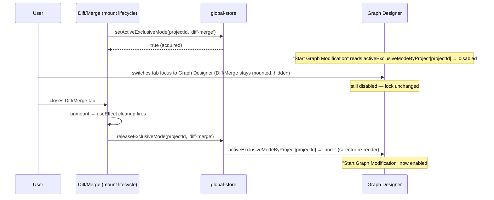
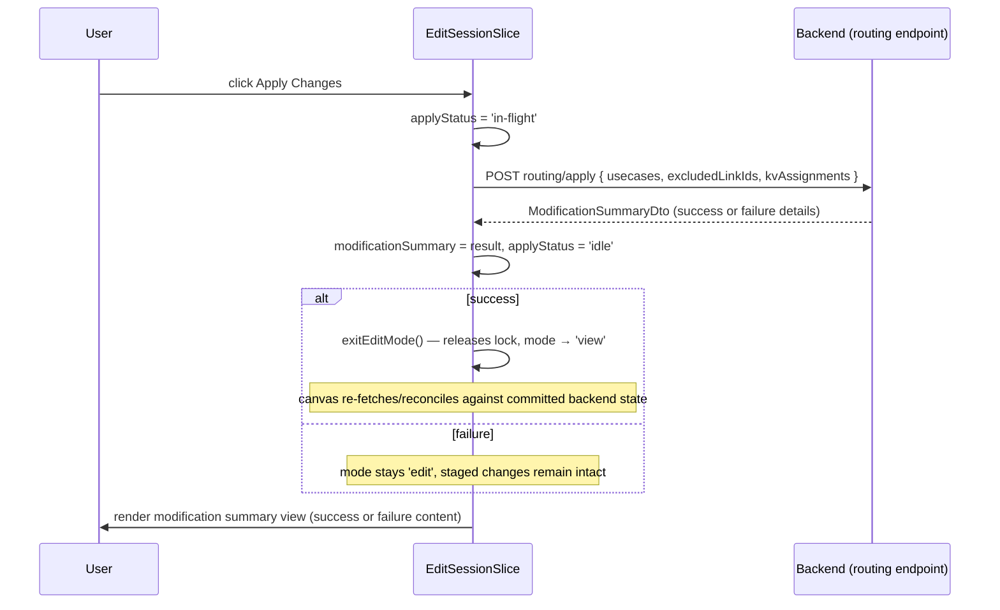
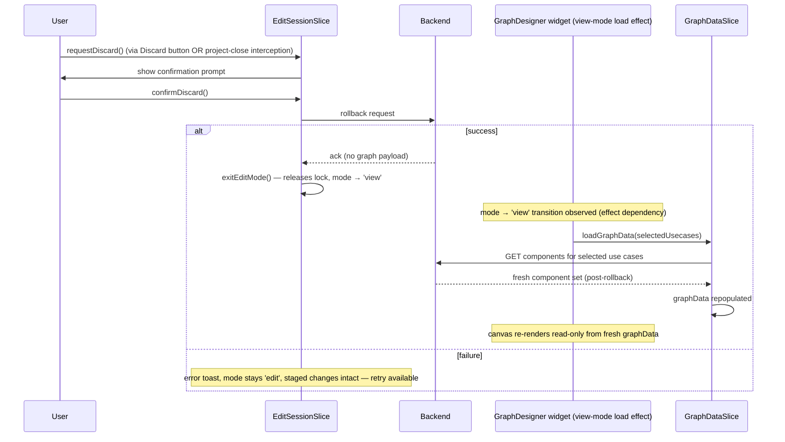

# Graph Designer Edit — Core Edit Session Design

Requirements: [../requirements/graph-designer-edit-requirements.md](../requirements/graph-designer-edit-requirements.md)
(REQ-001, 001a, 002, 002a, 003, 044–046, 060–062, 065; REQ-066/067 explicitly out of scope — see below)

This document covers the foundation everything else in the Graph Designer
Edit feature builds on: the View/Edit mode switch, the exclusive lock that
keeps Edit mode from conflicting with the Discovery Wizard or Diff/Merge
view, and the Apply Changes / Discard lifecycle. The four other design docs
(node operations, link/port operations, KV/key configuration, canvas UI
mechanics) all assume this session exists and call into it.

## Table of Contents

- [Out of Scope](#out-of-scope)
- [Architecture](#architecture)
- [Mode State & Exclusive Locking](#mode-state--exclusive-locking)
- [Per-Operation Loading State](#per-operation-loading-state)
- [Response Reconciliation — Component Collections](#response-reconciliation--component-collections)
- [Apply Changes](#apply-changes)
- [Discard / Rollback](#discard--rollback)
- [Open Items Inherited](#open-items-inherited)

---

## Out of Scope

**REQ-066/067 (undo/redo).** REQ-066 (backend returns a `changeId` per
staged edit) is already satisfied at the data layer — every DTO already
carries `ChangeInfoDto.changeId` — and needs no frontend work here. REQ-067
(a `changeId` stack + undo/redo panel) is deferred to a future enhancement;
nothing in this document depends on it existing.

**REQ-068 (quick actions).** Deferred alongside REQ-067; context menus
(designed in `canvas-ui-mechanics-design.md`) are the only interaction
surface for node/edge actions in this pass.

---

## Architecture

Edit-session state is a new `EditSessionSlice`, composed into the existing
`GraphDesignerStore` (`packages/react-app/src/features/graph-designer/model/graph-designer-store.ts`)
the same way `GraphDataSlice`, `KeyConfigSlice`, `VisualizerSlice`, etc. are
composed today:

```typescript
export type GraphDesignerStore = UsecaseSelectionSlice &
  GraphDataSlice &
  VisualizerSlice &
  SubsystemSlice &
  KeyConfigSlice &
  ValidationResultSlice &
  ModuleListSlice &
  SubgraphListSlice &
  PropertiesViewSlice &
  PanelLayoutSlice &
  PanelTabRegistrySlice &
  SearchSlice &
  EditSessionSlice; // new
```

**No optimistic mutation.** Every structural edit designed across all five
documents follows one rule: call the backend first, merge the response into
`GraphDataSlice` only on success, toast and leave the canvas untouched on
failure. `EditSessionSlice` itself holds no graph data — it holds session
bookkeeping (mode, in-flight flags, the modification summary, the discard
confirmation gate) that other slices' actions read and write as a
side-effect of their own backend calls.

This was chosen over two alternatives considered during design:

- **Command-pattern undo buffer** — rejected as unnecessary weight now that
  undo/redo is deferred; REQ-067's own language (`changeId` stack) points at
  a server-driven restore, not a client-side command replay.
- **Fully separate sibling store** (parallel to the planned `DiffMergeStore`)
  — rejected because `GraphDataSlice` must mutate in place either way once
  the backend confirms an edit; a separate store would only add cross-store
  sync plumbing for no isolation benefit.

---

## Mode State & Exclusive Locking

**REQ-001–003.** The canvas has two modes, `'view'` and `'edit'`. In `view`,
structural editing surfaces — module/subgraph palettes, context-menu
structural actions, and the Key Configurator panel — do not render
(REQ-002). Two interactions remain available in `view` regardless of mode:
the existing double-click-to-tune flow (REQ-002, unchanged), and clicking a
module/subgraph/container/data-or-control-link, which opens the **same**
properties panel used in Edit mode but in a **read-only** state (REQ-002a)
— every field rendered, none editable, no port-count steppers, no rename
input. This is a `readOnly` prop threaded into the existing panel widget
(`widgets/properties-panel/`, same component REQ-051 designs the editable
fields for in `canvas-ui-mechanics-design.md`), driven by
`mode === 'view'`; it is not a second panel implementation. Content menus,
palettes, and the Key Configurator panel are unaffected by REQ-002a — only
the properties panel gains a read-only mode.

**REQ-001a — View-mode canvas selection.** On entering View mode (including
on initial load), the canvas renders the last-selected use cases from
`UsecaseSelectionSlice`. If no prior selection exists for this project (for
example, first open), it falls back to the first use case in the list
returned by the use-case list load. This is a read at mount/mode-transition
time, not new state — `UsecaseSelectionSlice` already persists the last
selection. The Graph Visualizer and Log View panels render alongside the
canvas in View mode exactly as they do today; this feature does not change
their visibility.

In `edit`, the module/subgraph palettes, context
menus, properties panel (now editable), and Key Configurator panel all
become active (designed across the other four docs).

```typescript
interface EditSessionSlice {
  mode: 'view' | 'edit';
  enterEditMode: () => boolean; // false if the exclusive lock is already held elsewhere
  exitEditMode: () => void;     // called internally after Apply success or Discard
  // ... Apply/Discard state, below
}
```

**REQ-060, 062 — exclusive-mode locking.** The Discovery Wizard and
Diff/Merge view are separate features (Diff/Merge doesn't exist in code yet;
Discovery Wizard is currently a stub) that can independently modify graph
structure, so at most one of {Graph Edit, Discovery Wizard, Diff/Merge} may
be active at a time **for a given project**. Because FSD forbids one
feature from importing another directly, the lock lives one layer down, in
the existing cross-cutting `shared/store/global-store.ts`.

**The lock must be keyed by `projectId`, not a single flat flag.** This
repo supports multiple simultaneously open projects
(`ProjectGroupSlice.openProjects`, a `maxOpenProjects` preference, and
per-project `projectStoreRegistry`/`tabStoreRegistry` instances), and each
Graph Designer edit session is itself per-project
(`createGraphDesignerStore(tabId, projectId)`). REQ-060/062 only require
blocking conflicts *within the same project's* graph — entering Edit mode
on Project A must not disable "Start Graph Modification" or block Discovery
Wizard/Diff-Merge on an unrelated Project B that happens to also be open. A
single app-global flag would produce exactly that cross-project blocking
bug, so the lock is a per-project map:

```typescript
type ExclusiveGraphMode = 'none' | 'graph-edit' | 'discovery-wizard' | 'diff-merge';

interface GlobalStore {
  // ...existing slices...
  activeExclusiveModeByProject: Record<string, ExclusiveGraphMode>;
  /** Returns false if a different mode already holds the lock for this project. */
  setActiveExclusiveMode: (projectId: string, mode: ExclusiveGraphMode) => boolean;
  /** Only clears the lock if `mode` is the value currently held for this
   *  project — guards against a stale unmount releasing a lock a newer
   *  instance acquired. */
  releaseExclusiveMode: (projectId: string, mode: ExclusiveGraphMode) => void;
}
```

`enterEditMode()` calls `setActiveExclusiveMode(projectId, 'graph-edit')`;
if it returns `false`, edit mode does not start. This is surfaced as a
disabled "Start Graph Modification" button with an explanatory tooltip
(REQ-062), not a runtime error — the button's `disabled` state is a plain
selector read, scoped to the tab's own `projectId`:

```typescript
const activeExclusiveMode = useGlobalStore(
  (s) => s.activeExclusiveModeByProject[projectId] ?? 'none',
);
const disabled = activeExclusiveMode !== 'none' && activeExclusiveMode !== 'graph-edit';
```

Because this is a Zustand selector, any component reading it re-renders the
instant that project's lock changes — no events or polling needed.

**Discovery Wizard has no mount lifecycle to hook into today.** As of this
writing, Discovery Wizard is only a `sideNavItems` menu entry (id
`'discovery-wizard'` in `widgets/graph-designer/ui/graph-designer.tsx`) with
no backing component — clicking it is currently a no-op. Diff/Merge does
not exist in code at all yet. Until either is built as a real mounted
feature, REQ-060's enforcement point for *this* pass is the menu entry
itself: its `onClick`/`disabled` state must read
`activeExclusiveModeByProject[projectId]` the same selector shown above,
and show the explanatory tooltip (REQ-060) whenever a `'graph-edit'` lock is
held for that project, instead of opening anything. When Discovery
Wizard/Diff/Merge are later built as real features with their own mount
lifecycle, they switch to the `useEffect` acquire/release pattern below
instead of the menu-level disable — this is a placeholder enforcement point,
not a permanent design choice.

Discovery Wizard and Diff/Merge (built separately, out of scope here)
acquire and release the same per-project flag from their own mount
lifecycle, using whichever `projectId` their own tab is scoped to:

```typescript
useEffect(() => {
  const acquired = setActiveExclusiveMode(projectId, 'diff-merge');
  if (!acquired) {
    // show "already in use by Graph Modification" and bail
  }
  return () => releaseExclusiveMode(projectId, 'diff-merge');
}, [projectId]);
```

**Lock is tied to component lifetime, not tab focus.** This repo's
FlexLayout-based tab system (`widgets/project-layout/project-layout-manager.tsx`)
keeps inactive tabs mounted — hidden via CSS `display: none` — and only
unmounts a tab's component tree on explicit tab close
(`enableRenderOnDemand`'s default portal-based rendering; confirmed no
per-switch factory re-invocation exists in this codebase). Consequently:

- Switching focus away from an open Diff/Merge tab **does not** release the
  lock — "Start Graph Modification" stays disabled, because the Diff/Merge
  session is still alive in the background and could still be resumed.
- Closing the Diff/Merge tab unmounts it, the `useEffect` cleanup fires,
  the lock releases, and "Start Graph Modification" enables immediately
  (reactive, no polling).

This is a deliberate choice, not an artifact of the mechanism: REQ-060's
concern is that Diff/Merge "can modify the graph structure independently,"
and that risk exists for as long as the session is alive, not only while its
tab happens to be focused.



---

## Per-Operation Loading State

**REQ-065.** Every operation across all five design docs that requires a
backend call — module/container/subgraph/subsystem add/delete/rename, link
create/delete, port count changes, CKV/TKV edits, and so on — must show a
loading indicator and make the canvas non-interactive until the response
arrives.

**Design: a single `isMutating: boolean` on `EditSessionSlice`, gating all
canvas interaction for the duration of any one backend call.** Edits are
strictly serial — only one mutating operation may be in flight at a time
for a given edit session. This was chosen over a per-entity
`pendingEntityIds` set (considered and rejected during design) because a
per-entity set cannot, by construction, block interaction with entities
*not yet known to be affected* — for example, deleting module M cascades to
delete every link connected to M, but the client doesn't know which link
IDs those are until the backend responds; in the meantime nothing stops the
user from independently deleting one of those same links, racing the
in-flight cascade. Serializing all edits behind one flag removes this class
of race entirely: no second mutating call can start while one is
outstanding, so there is no window in which a not-yet-cascaded entity is
still interactive. The cost is that unrelated edits (e.g. renaming module A
while deleting module B) no longer run concurrently — accepted as the
simpler, race-free tradeoff.

```typescript
interface EditSessionSlice {
  // ...
  isMutating: boolean;
  beginMutation: () => void;
  endMutation: () => void;
}
```

Every mutating action designed in `node-operations-design.md`,
`link-and-port-design.md`, and `kv-key-configuration-design.md` follows the
same three-step wrapper, regardless of which entity type it targets:

```typescript
async function withMutationLock<T>(action: () => Promise<T>): Promise<T> {
  get().beginMutation();
  try {
    return await action();
  } finally {
    get().endMutation();
  }
}
```

**A single full-canvas overlay is the enforcement point, not per-component
`disabled` props.** While `isMutating` is `true`, a canvas-wide overlay
renders: a wait cursor, and an event-capturing layer that blocks all
pointer interaction with palettes, context menus, the properties panel, the
Key Configurator panel, and node/edge selection. The batch Delete-key
handler (`deleteSelection`, `canvas-ui-mechanics-design.md`) checks
`isMutating` at the top and no-ops entirely if true, for the same reason —
the Delete key bypasses whatever DOM-level pointer blocking the overlay
provides, so it needs its own explicit guard rather than relying on the
overlay alone.

```typescript
const isMutating = useGraphDesignerStore((s) => s.isMutating);
// rendered once, above the canvas, not per-node:
{isMutating && <MutationOverlay />} // wait cursor + pointer-event capture
```

This replaces per-entity spinners as the *interaction* gate; a lightweight
spinner on the specific entity the user acted on (module being deleted,
module being renamed, etc.) is still worth keeping as a purely cosmetic
affordance — it does not gate anything on its own, since the overlay above
already blocks all interaction regardless of which entity is showing a
spinner.

**Exception: REQ-025's Escape-to-cancel is not gated.** Canceling an
in-progress connection attempt is purely local `UsecaseVisualizer` state
with no backend call (`link-and-port-design.md`) — it is unaffected by
`isMutating` and remains available even mid-mutation, since it can't race
anything the backend is doing.

For operations that don't yet have a real entity ID (for example REQ-006's
atomic subgraph-from-empty-space creation, before the backend has returned
one), the node still renders at the drop position immediately (REQ-058)
with its own cosmetic spinner active — the overlay's interaction block
already covers it regardless of ID.

---

## Response Reconciliation — Component Collections

**One shared shape and one shared reconciler for every backend response
that adds, updates, or deletes more than a single already-known entity
field.** Across `node-operations-design.md` and `link-and-port-design.md`,
several operations cascade to child entities — module delete, container
delete, subsystem delete, subsystem expand, subsystem move, DSP offload,
paste-a-subgraph — and each one needs the backend's response to enumerate
its full blast radius so the UI can reconcile in one response cycle, as the
requirements repeatedly demand (REQ-005/006/007/008-009/020/031a/031b/032/069-070/072).
Left to each document, this produces a different bespoke shape per
endpoint (`{deletedModuleId, deletedLinkIds}`, `{deletedSubsystemId,
deletedSubgraphIds, deletedContainerIds, ...}`, `{promotedNodeIds,
deletedConnectionIds}`, `{ipcTxModule, ipcRxModule, reroutedLinkIds,
newContainerId}`, ...) and a different hand-written merge for each. Instead,
every such endpoint returns one shape:

```typescript
interface ComponentCollectionDto {
  added?: {
    subsystems?: Subsystem[];
    subgraphs?: Subgraph[];
    containers?: Container[];
    modules?: ModuleInstance[];
    links?: Connection[];
  };
  updated?: {
    subsystems?: Subsystem[];
    subgraphs?: Subgraph[];
    containers?: Container[];
    modules?: ModuleInstance[];
    links?: Connection[];
  };
  deleted?: {
    subsystemIds?: string[];
    subgraphIds?: string[];
    containerIds?: string[];
    moduleIds?: string[];
    linkIds?: string[];
  };
}
```

`GraphDataSlice.applyComponentCollection(collection: ComponentCollectionDto):
void` is the single reconciler every such action calls with its response,
instead of each action hand-writing its own merge:

```typescript
function applyComponentCollection(collection: ComponentCollectionDto): void {
  set((state) => {
    for (const [bucket, entities] of Object.entries(collection.added ?? {}))
      upsertAll(state, bucket, entities); // insert-or-replace by ID
    for (const [bucket, entities] of Object.entries(collection.updated ?? {}))
      upsertAll(state, bucket, entities); // same upsert-by-ID as added
    for (const [bucket, ids] of Object.entries(collection.deleted ?? {}))
      removeAll(state, bucket, ids);
  });
}
```

**`added` and `updated` are both applied as an upsert-by-ID — the frontend
never branches on which bucket an entity arrived in.** The DTO still
distinguishes the two buckets (useful backend-side documentation, and
groundwork for any future diff/summary view built on the same shape), but
`applyComponentCollection` treats them identically: an entity that didn't
exist yet is inserted, one that did is replaced. This is what lets
`offloadModuleToDsp`'s "insert if first offload, update in place if
re-offload" IPC pair (`link-and-port-design.md`) fall out of the mechanism
for free — the endpoint doesn't need its own special-cased upsert, and
neither does any other cascading operation that revisits an entity it
previously created.

**Exception: a primary-key rename goes in `deleted`+`added`, never
`updated`.** The upsert-by-ID above assumes an entity's own ID is stable
across the response — `updated` means "this ID's fields changed," not
"this entity now has a different ID." An operation that renames the field
an entity is keyed by (for example REQ-023's `updateContainerId`,
`node-operations-design.md`) must report the old ID in `deleted` and the
renamed entity (under its new ID) in `added`; putting it in `updated`
would upsert a new entry at the new ID while leaving the stale entry at
the old ID behind, since nothing would ever remove it. Entities that
merely *reference* the renamed ID (e.g. modules whose `containerId`
pointed at the old container) are unaffected by this exception — their own
ID hasn't changed, only a field's value, so they go in `updated` as usual.

**Caller-owned fields are stamped before the collection is applied, not by
the reconciler.** `applyComponentCollection` is intentionally a generic,
dumb upsert/delete with no knowledge of frontend-only bookkeeping fields —
`provenance` on a `Subgraph` (`node-operations-design.md`) is the main
example, since the backend never returns it. Each call site annotates those
fields onto the response's entities *before* passing the collection to the
reconciler:

```typescript
async function createSubgraphWithModule(moduleDefId: string, position: XY): Promise<void> {
  const collection = await api.createSubgraphWithModule(moduleDefId, position);
  collection.added!.subgraphs![0].provenance = 'newly-created'; // caller-owned, not part of the DTO
  get().applyComponentCollection(collection);
}
```

**What does *not* go through this mechanism.** Endpoints that only ever
mutate one already-known entity's own field — renames (REQ-010/017/031c/057),
`updatePortCount` (REQ-033–037, returns `{updatedPorts}`), and CKV/TKV
edits (REQ-053) — keep their existing narrow response shapes. There is no
collection to reconcile when the caller already knows exactly which single
entity/field changed, and forcing those through `ComponentCollectionDto`
would only add indirection. The line: if a response can affect more than
one entity, or an entity the client didn't already have the ID for, it
uses `ComponentCollectionDto`; otherwise it returns just what changed.

**Read-only placement fetches are also excluded.** `getSubgraphContents`
and `getSubgraphPairs` (REQ-012/013, `node-operations-design.md`) are not
staged backend mutations — the requirements doc explicitly calls placement
session-local, not staged — so they are merged into `GraphDataSlice`
directly by REQ-012/013's own placement logic, which also has to seed
`kvAssignments` and stamp `provenance: 'palette-placed'`: session-local
concerns specific to that flow, not a fit for the generic reconciler.

**Batch operations apply multiple independent collections, not one merged
call.** `deleteSelection`'s batch delete (`canvas-ui-mechanics-design.md`)
issues one backend call per cascade root via `Promise.all`; each root's
response is a complete, self-contained `ComponentCollectionDto` applied via
its own `applyComponentCollection` call as it resolves. This is correct
without any extra merging step — Zustand's `set` calls compose sequentially
regardless of order, and each root's collection only ever touches entities
that root's own cascade is responsible for.

---

## Apply Changes

**REQ-044–046.** "Apply Changes" is only actionable in `mode: 'edit'` and
disabled while a previous Apply is in flight:

```typescript
interface EditSessionSlice {
  // ...mode state above...
  applyStatus: 'idle' | 'in-flight';
  modificationSummary: ModificationSummaryDto | null;
  dismissSummary: () => void; // clears modificationSummary; see below
  applyChanges: () => Promise<void>;
}
```

`applyChanges()` builds its request payload by reading across sibling
slices in the same composed store via `get()` — a same-store cross-slice
read, not a cross-store concern:

- the selected use cases (`UsecaseSelectionSlice`)
- excluded data/control links from the session (`EditSessionSlice.excludedLinkIds`,
  designed in `node-operations-design.md`)
- selected KV assignments for every subgraph on canvas (`kvAssignments`
  arrays on subgraph nodes, designed in `kv-key-configuration-design.md`)
- selected key assignments for every subsystem on canvas (`assignedKeyIds`
  arrays on subsystem nodes, per REQ-071, designed in
  `kv-key-configuration-design.md`) — this field is not called out in the
  requirements doc's own REQ-045 text, but REQ-071 is explicit that it is
  "not sent to the backend until Apply Changes," so it belongs in this
  payload; flagged here so it isn't dropped when this endpoint's DTO is
  actually implemented.

A single `applyStatus` flag is sufficient — Apply is one request, not many
concurrent per-operation calls like the rest of the feature.

**Apply is blocked while any other operation is in flight, not only while a
previous Apply is in flight.** Because edits are already strictly serial
(`isMutating`, above), this falls out of the same mechanism rather than
needing a separate check: `applyChanges()` itself runs under
`withMutationLock`, so it cannot start while an unrelated add/delete/rename
is still awaiting its backend response, and no other edit can start while
Apply is running. The "Apply Changes" button's `disabled` condition is
`applyStatus === 'in-flight' || isMutating`, not `applyStatus` alone.

**Success and failure are both surfaced through the same summary view, not
a toast.** This is a deliberate departure from the rest of the feature's
"toast on failure" pattern, because the backend returns a structured
modification summary either way:



On failure, the session **stays in Edit mode** — staged changes remain
intact, and the user reviews the failure details in the summary view before
either retrying Apply or manually Discarding. Nothing is auto-rolled-back.

**Minimal `ModificationSummaryDto` shape, pending backend confirmation.**
Unlike other TBD-backend items in this feature, no shape assumption has
existed for this DTO, which blocks building even a stub summary view. Until
the backend team confirms the real contract, build against:

```typescript
interface ModificationSummaryDto {
  success: boolean;
  changedEntities: Array<{id: string; type: string; action: string}>;
  errors?: Array<{message: string; entityId?: string}>;
}
```

**Summary view lifecycle.** The summary view opens automatically whenever
`modificationSummary` is non-null (both the success and failure case render
through it, per REQ-046) and is **modal** — it blocks further canvas
interaction, since on success the session has already exited to View mode
and on failure the user must consciously choose retry-Apply or Discard
before resuming editing. It is dismissed only by the explicit
`dismissSummary()` action (sets `modificationSummary` back to `null`), wired
to the summary view's own close button — there is no auto-dismiss on a
timer or on the next Apply click.

---

## Discard / Rollback

**REQ-061, plus the project-close case.** "Discard" is available at any
time during the edit session, and closing the project while in Edit mode
triggers the identical flow — REQ-061 explicitly unifies both triggers.

```typescript
interface EditSessionSlice {
  // ...
  discardConfirmationOpen: boolean;
  requestDiscard: () => void;          // opens the confirmation prompt
  confirmDiscard: () => Promise<void>; // sends the rollback request
  cancelDiscard: () => void;
}
```

`discardConfirmationOpen` lives on the slice (not local component state)
because the project-close trigger needs to reach it from outside the
Discard button's own component.

**The rollback response carries no graph payload, and `EditSessionSlice`
does not fetch graph data itself.** Unlike Apply Changes, the
discard/rollback endpoint only confirms the backend-side rollback
succeeded (or failed) — it returns no graph data. Per the Architecture
section above, `EditSessionSlice` holds no graph data and must not reach
into `GraphDataSlice` directly; on a successful rollback its only
responsibility is `exitEditMode()` (releases the lock, `mode → 'view'`).
Fetching and rendering the post-rollback components is the responsibility
of the **view-mode session that mode switch starts** — the same rendering
path already used for ordinary use-case browsing.

That path is the existing load effect in
`packages/react-app/src/widgets/graph-designer/ui/graph-designer.tsx`
("Effect A", lines 277–300), which calls `loadGraphData(systemIds)`
whenever `selectedUsecases` changes. Discard does not change
`selectedUsecases`, so this effect's dependency list must gain `mode`.

**Guard the reset on `mode === 'view'`, not merely on `mode` changing.**
Effect A's body unconditionally clears search, level-view, collapse,
position-override, and viewport state before calling `loadGraphData` — if
`mode` is added to the dependency array naively, that reset also fires on
the `'view' → 'edit'` transition (clicking "Start Graph Modification"),
wiping REQ-059 position overrides and viewport/search state the instant
edit mode starts, which is not what REQ-061 asks for. Wrap the entire
existing body in `if (mode === 'view') { ... }` so it only runs on
transitions *into* `'view'` (initial mount, where `mode` is already
`'view'`, and the post-discard/post-rollback transition) — the
`'view' → 'edit'` transition must leave canvas state untouched.



If the rollback endpoint acks success but the view-mode session's
follow-up `loadGraphData` call itself fails, that failure surfaces through
`GraphDataSlice`'s own `graphDataError`/`graphDataStatus` handling
(existing error path, not new here) — the lock has already been released
and `mode` is `'view'` at that point, since the rollback itself succeeded;
the canvas shows the graph-data error state until the user retries (e.g.
by re-selecting the same use cases, which re-runs the same effect).

**Project-close interception.** `packages/react-app/src/features/project-operations/hooks/use-project-lifecycle.ts`'s
`handleProjectClose(projectId, projectName)` is the existing async
close-project flow (archives config, captures a screenshot, always resolves
`true` — there is no unsaved-changes confirmation dialog anywhere in this
path today). This flow must gain a check: if the closing project's Graph
Designer tab has `mode === 'edit'`, redirect into `requestDiscard()`'s
confirmation before proceeding, instead of closing silently. The existing
`onClose`/`OnGroupClose` confirmation hook already exists in
`widgets/project-layout/project-layout-manager.tsx`'s `createProjectMainTab`
signature but is unused at today's call site (`use-project-opener.tsx`) —
this is the mechanism to wire up, not new infrastructure.

**Rollback failure (user-confirmed):** shown as an error toast, consistent
with the generic backend-failure pattern used everywhere else in this
feature (REQ-008/029-style). The session stays in Edit mode with staged
changes intact; the user can retry Discard. There is no forced exit from
Edit mode on a failed rollback.

---

## Open Items Inherited

This document inherits, unresolved, the requirements doc's own open items
relevant to this scope. `applyChanges()` is the single call site that
bundles all of the following into one request, so a contract gap in any of
them blocks Apply Changes specifically:

- **API contracts** for the routing/apply endpoint and the discard/rollback
  endpoint — paths and DTO shapes are TBD with the backend team.
- **`ModificationSummaryDto` shape** — not yet defined; the summary view
  (success and failure rendering) cannot be built to a final contract until
  this exists.
- **Excluded links API** (REQ-014) — DTO shape for passing
  `excludedLinkIds` to the routing algorithm, designed in
  `node-operations-design.md`, consumed here by `applyChanges()`.
- **Batch/multi-entity creation for paste** — designed in
  `canvas-ui-mechanics-design.md`; not part of `applyChanges()`'s payload,
  but listed here for visibility since it's the other major open
  backend-contract gap introduced during this feature's design.
