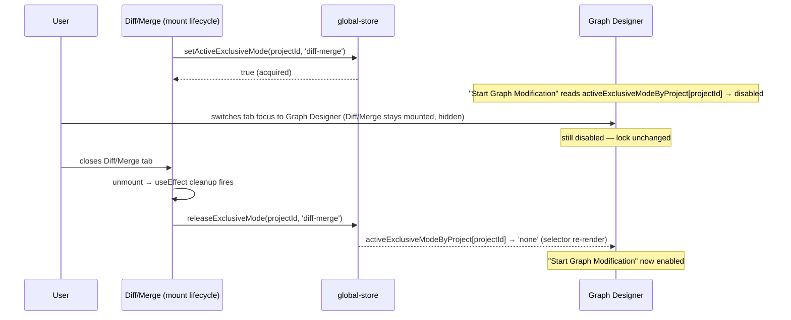
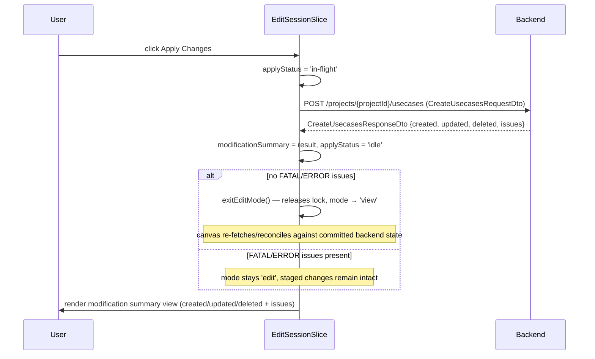
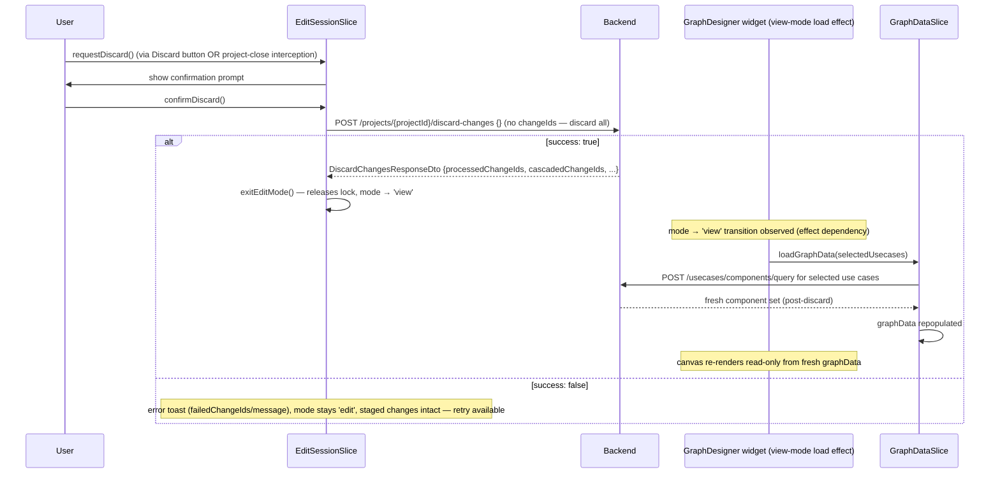

# Graph Designer Edit — Core Edit Session Design

Requirements: [../requirements/graph-designer-edit-requirements.md](../requirements/graph-designer-edit-requirements.md)
(REQ-001, 001a, 002, 002a, 003, 044–046, 060–062, 065; REQ-066/067 explicitly out of scope — see below)

This document covers the foundation everything else in the Graph Designer
Edit feature builds on: the View/Edit mode switch, the exclusive lock that
keeps Edit mode from conflicting with the Discovery Wizard or Diff/Merge
view, and the Apply Changes / Discard lifecycle. The four other design docs
(node operations, link/port operations, KV/key configuration, canvas UI
mechanics) all assume this session exists and call into it.

## Table of Contents

- [Out of Scope](#out-of-scope)
- [Architecture](#architecture)
- [Mode State & Exclusive Locking](#mode-state--exclusive-locking)
- [Per-Operation Loading State](#per-operation-loading-state)
- [Response Reconciliation — Component Collections](#response-reconciliation--component-collections)
- [Apply Changes](#apply-changes)
- [Discard / Rollback](#discard--rollback)
- [Open Items Inherited](#open-items-inherited)

---

## Out of Scope

**REQ-066/067 (undo/redo).** REQ-066 (backend returns a `changeId` per
staged edit) is already satisfied at the data layer — every DTO already
carries `ChangeInfoDto.changeId` — and needs no frontend work here. REQ-067
(a `changeId` stack + undo/redo panel) is deferred to a future enhancement;
nothing in this document depends on it existing.

**REQ-068 (quick actions).** Deferred alongside REQ-067; context menus
(designed in `canvas-ui-mechanics-design.md`) are the only interaction
surface for node/edge actions in this pass.

---

## Architecture

Edit-session state is a new `EditSessionSlice`, composed into the existing
`GraphDesignerStore` (`packages/react-app/src/features/graph-designer/model/graph-designer-store.ts`)
the same way `GraphDataSlice`, `KeyConfigSlice`, `VisualizerSlice`, etc. are
composed today:

```typescript
export type GraphDesignerStore = UsecaseSelectionSlice &
  GraphDataSlice &
  VisualizerSlice &
  SubsystemSlice &
  KeyConfigSlice &
  ValidationResultSlice &
  ModuleListSlice &
  SubgraphListSlice &
  PropertiesViewSlice &
  PanelLayoutSlice &
  PanelTabRegistrySlice &
  SearchSlice &
  EditSessionSlice; // new
```

**No optimistic mutation.** Every structural edit designed across all five
documents follows one rule: call the backend first, merge the response into
`GraphDataSlice` only on success, toast and leave the canvas untouched on
failure. `EditSessionSlice` itself holds no graph data — it holds session
bookkeeping (mode, in-flight flags, the modification summary, the discard
confirmation gate) that other slices' actions read and write as a
side-effect of their own backend calls.

This was chosen over two alternatives considered during design:

- **Command-pattern undo buffer** — rejected as unnecessary weight now that
  undo/redo is deferred; REQ-067's own language (`changeId` stack) points at
  a server-driven restore, not a client-side command replay.
- **Fully separate sibling store** (parallel to the planned `DiffMergeStore`)
  — rejected because `GraphDataSlice` must mutate in place either way once
  the backend confirms an edit; a separate store would only add cross-store
  sync plumbing for no isolation benefit.

---

## Mode State & Exclusive Locking

**REQ-001–003.** The canvas has two modes, `'view'` and `'edit'`. In `view`,
structural editing surfaces — module/subgraph palettes, context-menu
structural actions, and the Key Configurator panel — do not render
(REQ-002). Two interactions remain available in `view` regardless of mode:
the existing double-click-to-tune flow (REQ-002, unchanged), and clicking a
module/subgraph/container/data-or-control-link, which opens the **same**
properties panel used in Edit mode but in a **read-only** state (REQ-002a)
— every field rendered, none editable, no port-count steppers, no rename
input. This is a `readOnly` prop threaded into the existing panel widget
(`widgets/properties-panel/`, same component REQ-051 designs the editable
fields for in `canvas-ui-mechanics-design.md`), driven by
`mode === 'view'`; it is not a second panel implementation. Content menus,
palettes, and the Key Configurator panel are unaffected by REQ-002a — only
the properties panel gains a read-only mode.

**REQ-001a — View-mode canvas selection.** On entering View mode (including
on initial load), the canvas renders the last-selected use cases from
`UsecaseSelectionSlice`. If no prior selection exists for this project (for
example, first open), it falls back to the first use case in the list
returned by the use-case list load. This is a read at mount/mode-transition
time, not new state — `UsecaseSelectionSlice` already persists the last
selection. The Graph Visualizer and Log View panels render alongside the
canvas in View mode exactly as they do today; this feature does not change
their visibility.

In `edit`, the module/subgraph palettes, context
menus, properties panel (now editable), and Key Configurator panel all
become active (designed across the other four docs).

```typescript
interface EditSessionSlice {
  mode: 'view' | 'edit';
  enterEditMode: () => boolean; // false if the exclusive lock is already held elsewhere
  exitEditMode: () => void;     // called internally after Apply success or Discard
  // ... Apply/Discard state, below
}
```

**`enterEditMode()` itself stays synchronous — `kvCasesById` for
pre-loaded subgraphs is seeded earlier, at use-case selection, not as
part of entering Edit mode.** An earlier draft of this design had
`enterEditMode()` fetch this data itself, but the same information is
needed the instant a use case's components render in **View** mode too
(nothing about `SGKV` is edit-mode-specific), so it belongs alongside the
existing `loadGraphData(selectedUsecases)` call
(`widgets/graph-designer/ui/graph-designer.tsx`'s "Effect A") rather than
gated behind clicking "Start Graph Modification." That effect gains a
call to `getAllSubgraphs(projectId)` (`entities/subgraph-definitions`,
the same endpoint the subgraph palette already calls, currently
lazy-loaded only when the palette opens — this is a second, independent
call site for the same endpoint) alongside the existing `loadGraphData`
call, matching each result against the subgraph IDs `loadGraphData`'s own
response resolves (`SubgraphDto.systemId === SpfModuleDto.subgraphId` —
confirmed the join key; `SubgraphDto.id` is a separate field, not this
one), and seeding `kvCasesById` from each match's `SGKV` per REQ-039 (all
cases unselected). By the time `enterEditMode()` runs, `kvCasesById` is
already populated for every subgraph on canvas; entering Edit mode does
no fetching of its own for this. See
[Response Reconciliation](#response-reconciliation--component-collections)
below for the shared mechanism this feeds, and
`kv-key-configuration-design.md`'s KV Assignment sections for the other
two seeding points (palette placement, auto-create) — each seeds
`kvCasesById` at a different moment, but this is the one that runs before
Edit mode exists at all.

Use-case selection is itself a View-mode-only action — REQ-003's list of
what's active in Edit mode has no use-case selector, and REQ-045's Apply
payload is fixed to whichever use cases were selected when Edit mode was
entered — so this fetch never needs to coexist with live, in-session
`kvCasesById` mutations from REQ-040/041/043; by the time Edit mode
exists, selection (and this seeding) is frozen until Apply or Discard
returns the session to View mode.

**Effect A's fetch fully replaces `kvCasesById`'s pre-loaded entries on
every run, rather than adding to whatever was already there.** Each time
`selectedUsecases` changes, `getAllSubgraphs(projectId)` is re-fetched
and `kvCasesById` is cleared and reseeded for exactly the subgraph IDs
the new `loadGraphData` response resolves — not merged into the map's
existing contents. This matters because re-selecting a different set of
use cases can put an entirely different set of subgraphs on canvas; a
naive additive seed would leave stale entries for subgraphs no longer
selected sitting in the map indefinitely (the same kind of leak
`recomputeContainersAndSubgraphs`'s pruning pass exists to prevent
elsewhere, except that pruning pass only runs during Edit-mode
reconciliation and never touches this View-mode path). Concretely: Effect
A's body, on every run where `mode === 'view'`, does
`kvCasesById.clear()` before the loop that seeds each newly-resolved
subgraph — so the map's contents always exactly match whichever
subgraphs the *current* selection put on canvas, with nothing left over
from a previous selection.

**Every other session-local `EditSessionSlice` map is cleared on the same
`'view'` transition, not only `kvCasesById`.** `excludedLinks`,
`pairLinksById`, `subgraphProvenanceById`, and
`assignedKeyIdsBySubsystemId` (`kv-key-configuration-design.md`'s Keys
Assignment section) are all plain session bookkeeping with no source of
truth to recompute from once the session that populated them ends —
unlike `kvCasesById`, none of them get a fresh reseed from
`getAllSubgraphs`/placement fetches on the next Edit session, so simply
not clearing them would leave them holding entries from a *previous* edit
session (one already Applied or Discarded) once a new one starts. Effect
A's body, on every run where `mode === 'view'` (the same guard as
REQ-061's own reset, below), clears all five maps together as one step,
immediately before `kvCasesById`'s clear-and-reseed loop:

```typescript
if (mode === 'view') {
  get().excludedLinks = [];
  get().pairLinksById.clear();
  get().subgraphProvenanceById.clear();
  get().assignedKeyIdsBySubsystemId.clear();
  get().kvCasesById.clear();
  // ...existing reseed loop for kvCasesById, using the freshly-cleared maps above
}
```

This runs on every transition *into* `'view'` — initial mount, post-Apply,
and post-Discard alike — so a subgraph excluded or provenance-stamped in
one edit session can never leak into the next. It does not run on the
`'view' → 'edit'` transition, for the same reason the existing reset guard
below does not: entering Edit mode must not wipe state a session in
progress needs.

**If the `getAllSubgraphs` fetch fails, the whole `loadGraphData` for
that selection fails — there is no partial-success state where the
canvas renders with `kvCasesById` unseeded.** An earlier version of this
design left this open (toast-and-proceed vs. block rendering). It's
resolved as the latter: Effect A treats the two fetches
(`loadGraphData`/`getAllSubgraphs`) as one unit for failure purposes, not
two independent failure domains — if either fails, the effect reports
failure through `GraphDataSlice`'s existing `graphDataError`/
`graphDataStatus` state (the same error path REQ-061's Discard section
already relies on) and does not render the canvas for that selection.
This is a deliberate departure from REQ-013's `getSubgraphPairs`
placement fetch (`node-operations-design.md`), which explicitly *does*
tolerate independent partial failure (subgraph renders, pairs just don't)
— the difference is that a placement's pair-fetch failure only costs the
user some missing auto-rendered connections, while an unseeded
`kvCasesById` would leave the Key Configurator panel silently broken for
any pre-loaded subgraph the user later selects in Edit mode, with no
visible indication why. Failing the whole load surfaces the problem
immediately, consistent with `loadGraphData`'s own existing all-or-nothing
failure behavior, rather than introducing a new partial-success case this
feature doesn't otherwise have.

**REQ-060, 062 — exclusive-mode locking.** The Discovery Wizard and
Diff/Merge view are separate features (Diff/Merge doesn't exist in code yet;
Discovery Wizard is currently a stub) that can independently modify graph
structure, so at most one of {Graph Edit, Discovery Wizard, Diff/Merge} may
be active at a time **for a given project**. Because FSD forbids one
feature from importing another directly, the lock lives one layer down, in
the existing cross-cutting `shared/store/global-store.ts`.

**The lock must be keyed by `projectId`, not a single flat flag.** This
repo supports multiple simultaneously open projects
(`ProjectGroupSlice.openProjects`, a `maxOpenProjects` preference, and
per-project `projectStoreRegistry`/`tabStoreRegistry` instances), and each
Graph Designer edit session is itself per-project
(`createGraphDesignerStore(tabId, projectId)`). REQ-060/062 only require
blocking conflicts *within the same project's* graph — entering Edit mode
on Project A must not disable "Start Graph Modification" or block Discovery
Wizard/Diff-Merge on an unrelated Project B that happens to also be open. A
single app-global flag would produce exactly that cross-project blocking
bug, so the lock is a per-project map:

```typescript
type ExclusiveGraphMode = 'none' | 'graph-edit' | 'discovery-wizard' | 'diff-merge';

interface GlobalStore {
  // ...existing slices...
  activeExclusiveModeByProject: Record<string, ExclusiveGraphMode>;
  /** Returns false if the lock for this project is already held by *any*
   *  mode — including a second attempt to acquire the *same* mode again.
   *  Each of Graph Edit, Discovery Wizard, and Diff/Merge is a
   *  single-instance-per-project feature: a second Graph Designer tab on a
   *  project that already has an active edit session must not be able to
   *  open its own independent EditSessionSlice and mutate the same backend
   *  graph out from under the first. */
  setActiveExclusiveMode: (projectId: string, mode: ExclusiveGraphMode) => boolean;
  /** Only clears the lock if `mode` is the value currently held for this
   *  project — guards against a stale unmount releasing a lock a newer
   *  instance acquired. */
  releaseExclusiveMode: (projectId: string, mode: ExclusiveGraphMode) => void;
}
```

`enterEditMode()` calls `setActiveExclusiveMode(projectId, 'graph-edit')`;
if it returns `false`, edit mode does not start — this covers both a
different mode holding the lock (Discovery Wizard/Diff-Merge already
active) and `'graph-edit'` itself already holding it (a second Graph
Designer tab on the same project trying to enter Edit mode concurrently).
This is surfaced as a disabled "Start Graph Modification" button with an
explanatory tooltip (REQ-062), not a runtime error — the button's
`disabled` state is a plain selector read, scoped to the tab's own
`projectId`:

```typescript
const activeExclusiveMode = useGlobalStore(
  (s) => s.activeExclusiveModeByProject[projectId] ?? 'none',
);
const disabled = activeExclusiveMode !== 'none';
```

**Every one of the three modes is single-instance-per-project, including
against itself.** An earlier draft of this section only disabled the
button for a *different* mode (`activeExclusiveMode !== 'graph-edit'`),
which left a gap: a second Graph Designer tab on the same project would
see `activeExclusiveMode === 'graph-edit'` and read its own "Start Graph
Modification" button as enabled, since the check explicitly excluded that
value from disabling. That's wrong — Graph Edit, Discovery Wizard, and
Diff/Merge are each expected to run at most one instance per project, full
stop, so `setActiveExclusiveMode` must reject re-acquisition of the same
mode too, and the button's `disabled` condition simplifies to "any lock
held at all" rather than "a lock held by something else." The same
tightened check applies symmetrically to Discovery Wizard's and
Diff/Merge's own acquisition points, below.

Because this is a Zustand selector, any component reading it re-renders the
instant that project's lock changes — no events or polling needed.

**Discovery Wizard has no mount lifecycle to hook into today.** As of this
writing, Discovery Wizard is only a `sideNavItems` menu entry (id
`'discovery-wizard'` in `widgets/graph-designer/ui/graph-designer.tsx`) with
no backing component — clicking it is currently a no-op. Diff/Merge does
not exist in code at all yet. Until either is built as a real mounted
feature, REQ-060's enforcement point for *this* pass is the menu entry
itself: its `onClick`/`disabled` state must read
`activeExclusiveModeByProject[projectId]` the same selector shown above,
and show the explanatory tooltip (REQ-060) whenever *any* lock is held for
that project — including `'discovery-wizard'` itself, now that
re-acquiring the same mode is also rejected (above) — instead of opening
anything. When Discovery
Wizard/Diff/Merge are later built as real features with their own mount
lifecycle, they switch to the `useEffect` acquire/release pattern below
instead of the menu-level disable — this is a placeholder enforcement point,
not a permanent design choice.

Discovery Wizard and Diff/Merge (built separately, out of scope here)
acquire and release the same per-project flag from their own mount
lifecycle, using whichever `projectId` their own tab is scoped to:

```typescript
useEffect(() => {
  const acquired = setActiveExclusiveMode(projectId, 'diff-merge');
  if (!acquired) {
    // show "already in use by Graph Modification" and bail
  }
  return () => releaseExclusiveMode(projectId, 'diff-merge');
}, [projectId]);
```

**Lock is tied to component lifetime, not tab focus.** This repo's
FlexLayout-based tab system (`widgets/project-layout/project-layout-manager.tsx`)
keeps inactive tabs mounted — hidden via CSS `display: none` — and only
unmounts a tab's component tree on explicit tab close
(`enableRenderOnDemand`'s default portal-based rendering; confirmed no
per-switch factory re-invocation exists in this codebase). Consequently:

- Switching focus away from an open Diff/Merge tab **does not** release the
  lock — "Start Graph Modification" stays disabled, because the Diff/Merge
  session is still alive in the background and could still be resumed.
- Closing the Diff/Merge tab unmounts it, the `useEffect` cleanup fires,
  the lock releases, and "Start Graph Modification" enables immediately
  (reactive, no polling).

This is a deliberate choice, not an artifact of the mechanism: REQ-060's
concern is that Diff/Merge "can modify the graph structure independently,"
and that risk exists for as long as the session is alive, not only while its
tab happens to be focused.



---

## Per-Operation Loading State

**REQ-065.** Every operation across all five design docs that requires a
backend call — module/container/subgraph/subsystem add/delete/rename, link
create/delete, port count changes, CKV/TKV edits, and so on — must show a
loading indicator and make the canvas non-interactive until the response
arrives.

**Design: a single `isMutating: boolean` on `EditSessionSlice`, gating all
canvas interaction for the duration of any one backend call.** Edits are
strictly serial — only one mutating operation may be in flight at a time
for a given edit session. This was chosen over a per-entity
`pendingEntityIds` set (considered and rejected during design) because a
per-entity set cannot, by construction, block interaction with entities
*not yet known to be affected* — for example, deleting module M cascades to
delete every link connected to M, but the client doesn't know which link
IDs those are until the backend responds; in the meantime nothing stops the
user from independently deleting one of those same links, racing the
in-flight cascade. Serializing all edits behind one flag removes this class
of race entirely: no second mutating call can start while one is
outstanding, so there is no window in which a not-yet-cascaded entity is
still interactive. The cost is that unrelated edits (e.g. renaming module A
while deleting module B) no longer run concurrently — accepted as the
simpler, race-free tradeoff.

```typescript
interface EditSessionSlice {
  // ...
  isMutating: boolean;
  beginMutation: () => void;
  endMutation: () => void;
}
```

Every mutating action designed in `node-operations-design.md`,
`link-and-port-design.md`, and `kv-key-configuration-design.md` follows the
same three-step wrapper, regardless of which entity type it targets:

```typescript
async function withMutationLock<T>(action: () => Promise<T>): Promise<T> {
  if (get().mode !== 'edit') {
    throw new Error('withMutationLock called outside Edit mode'); // programming error, not a user-facing failure — see below
  }
  get().beginMutation();
  try {
    return await action();
  } finally {
    get().endMutation();
  }
}
```

**`withMutationLock` is the single enforcement point for "no mutations
outside Edit mode," not the render layer alone.** REQ-002/003 already keep
palettes, context-menu structural actions, and the Key Configurator panel
from *rendering* in View mode — that's the first line of defense, and
it's why a user should never see a Delete option or a working palette
item while in View mode. But REQ-063 explicitly allows multi-select in
**both** View and Edit mode, and the Delete key is a global `keydown`
listener, not a rendered menu item — nothing about "the context menu
doesn't render" stops a keydown handler from firing on a View-mode
selection. Relying on "not rendered ⇒ not reachable" for every mutating
entry point is fragile: it depends on every future call site remembering
to also gate on `mode`, and a keyboard shortcut in particular has no
render-layer visibility check to piggyback on at all. Routing every
mutating action through `withMutationLock` — the same choke point already
used for the `isMutating` lock — means the guarantee holds regardless of
which UI surface (menu click, keyboard shortcut, a future quick-action
button) attempted the call, with one check instead of one per action.

**This is a thrown error, not a toast or silent no-op, because it signals
a bug in the caller, not a user-facing failure.** Every legitimate call
site for a mutating action is already gated by `mode === 'edit'` at the
UI layer (the surface that could call it doesn't render in View mode), so
`withMutationLock` seeing `mode !== 'edit'` means some code path invoked a
mutation without going through that gating — for example, a stray
keyboard listener that isn't itself checking `mode`. `deleteSelection`
(`canvas-ui-mechanics-design.md`) is the one caller that must check `mode`
*before* calling `withMutationLock`, precisely because the Delete key has
no render-layer gate of its own to rely on:

```typescript
function deleteSelection(selection: Selectable[]): Promise<void> {
  if (get().mode !== 'edit') return Promise.resolve(); // Delete key fires in View mode too (REQ-063) — no-op, not an error, since this is a normal/expected case, not a bug
  if (get().isMutating) return Promise.resolve();
  // ...unchanged below
}
```

Every other mutating action in `node-operations-design.md`/
`link-and-port-design.md`/`kv-key-configuration-design.md` is only ever
invoked from a UI surface that already doesn't render outside Edit mode
(palette drop handlers, context-menu items, the properties panel's
editable fields, the Key Configurator panel) — for those, reaching
`withMutationLock` with the wrong mode really would indicate a bug, so the
thrown error is the right signal there.

**A single full-canvas overlay is the enforcement point, not per-component
`disabled` props.** While `isMutating` is `true`, a canvas-wide overlay
renders: a wait cursor, and an event-capturing layer that blocks all
pointer interaction with palettes, context menus, the properties panel, the
Key Configurator panel, and node/edge selection. The batch Delete-key
handler (`deleteSelection`, `canvas-ui-mechanics-design.md`) checks
`isMutating` at the top and no-ops entirely if true, for the same reason —
the Delete key bypasses whatever DOM-level pointer blocking the overlay
provides, so it needs its own explicit guard rather than relying on the
overlay alone.

```typescript
const isMutating = useGraphDesignerStore((s) => s.isMutating);
// rendered once, above the canvas, not per-node:
{isMutating && <MutationOverlay />} // wait cursor + pointer-event capture
```

This replaces per-entity spinners as the *interaction* gate; a lightweight
spinner on the specific entity the user acted on (module being deleted,
module being renamed, etc.) is still worth keeping as a purely cosmetic
affordance — it does not gate anything on its own, since the overlay above
already blocks all interaction regardless of which entity is showing a
spinner.

**Exception: REQ-025's Escape-to-cancel is not gated.** Canceling an
in-progress connection attempt is purely local `UsecaseVisualizer` state
with no backend call (`link-and-port-design.md`) — it is unaffected by
`isMutating` and remains available even mid-mutation, since it can't race
anything the backend is doing.

For operations that don't yet have a real entity ID (for example REQ-006's
atomic subgraph-from-empty-space creation, before the backend has returned
one), the node still renders at the drop position immediately (REQ-058)
with its own cosmetic spinner active — the overlay's interaction block
already covers it regardless of ID.

---

## Response Reconciliation — Component Collections

**One shared shape and one shared reconciler for every backend response
that adds, updates, or deletes more than a single already-known entity
field.** Across `node-operations-design.md` and `link-and-port-design.md`,
several operations cascade to child entities — module delete, container
delete, subsystem delete, subsystem expand, subsystem move, DSP offload,
paste-a-subgraph — and each one needs the backend's response to enumerate
its full blast radius so the UI can reconcile in one response cycle, as the
requirements repeatedly demand (REQ-005/006/007/008-009/020/031a/031b/032/069-070/072).

**This is the real backend contract, confirmed against the current API
spec — not an invented shape.** Every mutating structural endpoint in this
feature (module/container/subgraph/subsystem add/delete/move/expand, DSP
offload, link create) returns **three** separate `ComponentCollectionDto`
objects in one response — `addedComponentCollectionDto`,
`updatedComponentCollectionDto`, `deletedComponentCollectionDto` — one per
change kind, confirmed with the backend team as their current contract.
This supersedes an earlier draft of this design, which assumed a single
`ComponentCollectionDto` with each entity self-tagging its own
`changeInfo.changeType`; that assumption is now known to be wrong — the
backend buckets by collection instead. The read-only query endpoints
(`queryUsecaseComponents`, `getComponentsForSubgraph`) are unaffected by
this change and still return one plain `ComponentCollectionDto` each (see
below for why). The load path already consuming that read-only shape today
(`GraphDataSlice`'s existing `loadGraphData`,
`packages/react-app/src/features/graph-designer/model/graph-data-slice.ts`)
remains the model this section's grouping logic (containers/subgraphs
derived from `spfModules`) reuses — only the mutation-response envelope
changes, not that underlying grouping logic:

```typescript
interface ChangeInfoDto {
  changeType: 'NONE' | 'CREATE' | 'UPDATE' | 'DELETE'; // no longer read by the reconciler for mutation responses — see below
  changeId?: string;   // present only when changeType !== 'NONE'
  changeStatus?: 'STAGED' | 'UNSTAGED'; // present only when changeType !== 'NONE'
}

interface ComponentCollectionDto {
  spfModules: SpfModuleDto[]; // each carries containerId/subgraphId as scalar fields — no separate containers/subgraphs arrays
  dataLinks: DataLinkDto[];
  controlLinks: ControlLinkDto[];
  subsystems?: SubsystemDto[]; // present only on the -with-subsystems endpoint variant, below
}
// Every mutating endpoint's response is three of these, not one:
//   { addedComponentCollectionDto: ComponentCollectionDto;
//     updatedComponentCollectionDto: ComponentCollectionDto;
//     deletedComponentCollectionDto: ComponentCollectionDto }
// There is no shared name for this triple in the API — every endpoint
// signature in this feature spells out the three fields inline.
```

**Bucket membership is now the sole signal for CREATE/UPDATE/DELETE — an
entity's own `changeInfo.changeType` must not be read by the reconciler for
a mutation response.** An earlier draft of this design had each entity
self-declare its own `changeInfo.changeType` inside one combined
collection, module-centric, with no bucketing at the collection level at
all. That's been replaced by the backend team's actual contract: which of
the three collections an entity appears in **is** its change type, and
`changeInfo.changeType` on an entity inside a mutation response can no
longer be trusted as a reconciliation signal. Containers and subgraphs are
still not returned as separate arrays at all; they're derived by grouping
each bucket's `spfModules` by `containerId`/`subgraphId`, exactly as
`loadGraphData` already does today (see its `containers`/`subgraphs`
derivation loops). The reconciler below generalizes that same grouping
logic so every cascading action shares it, instead of each action
re-deriving containers/subgraphs from its own response by hand.

**`changeType: 'NONE'` still only ever appears on the read-only query
endpoints' full-snapshot responses — unaffected by this change.** The
three-collection split applies only to mutation/cascade responses; the
read-only query endpoints (`queryUsecaseComponents`/`getComponentsForSubgraph`)
are untouched by this change and keep returning one plain
`ComponentCollectionDto` per call, every entity tagged
`changeType: 'NONE'` ("unchanged, included for context"), merged via
`loadGraphData`'s existing replace-everything logic, not this incremental
reconciler. A mutation response's three collections never contain a
`NONE`-tagged entity — every entity in any of the three buckets, by
definition, changed.

```typescript
function applyComponentCollection(collections: {
  addedComponentCollectionDto: ComponentCollectionDto;
  updatedComponentCollectionDto: ComponentCollectionDto;
  deletedComponentCollectionDto: ComponentCollectionDto;
}): void {
  set((state) => {
    for (const m of collections.addedComponentCollectionDto.spfModules) upsertModule(state, m);
    for (const m of collections.updatedComponentCollectionDto.spfModules) upsertModule(state, m);
    for (const m of collections.deletedComponentCollectionDto.spfModules) removeModule(state, m);
    for (const l of [...collections.addedComponentCollectionDto.dataLinks, ...collections.updatedComponentCollectionDto.dataLinks]) upsertLink(state, l, 'data');
    for (const l of collections.deletedComponentCollectionDto.dataLinks) removeLink(state, l, 'data');
    for (const l of [...collections.addedComponentCollectionDto.controlLinks, ...collections.updatedComponentCollectionDto.controlLinks]) upsertLink(state, l, 'control');
    for (const l of collections.deletedComponentCollectionDto.controlLinks) removeLink(state, l, 'control');
    for (const ss of [...(collections.addedComponentCollectionDto.subsystems ?? []), ...(collections.updatedComponentCollectionDto.subsystems ?? [])]) upsertSubsystem(state, ss);
    for (const ss of collections.deletedComponentCollectionDto.subsystems ?? []) removeSubsystem(state, ss);
    recomputeContainersAndSubgraphs(state); // re-derive by grouping state.moduleInstances, same logic loadGraphData already uses
  });
}

function upsertModule(state: GraphDataState, m: SpfModuleDto): void {
  state.graphData.moduleInstances[m.systemId] = toModuleInstance(m); // same mapping loadGraphData already does
}

function removeModule(state: GraphDataState, m: SpfModuleDto): void {
  delete state.graphData.moduleInstances[m.systemId];
}

/** Populates only the added bucket, the other two empty — for call sites
 *  that are purely additive (module/link create, paste). */
function applyAddedCollection(collection: ComponentCollectionDto): void {
  const empty: ComponentCollectionDto = {spfModules: [], dataLinks: [], controlLinks: []};
  applyComponentCollection({
    addedComponentCollectionDto: collection,
    updatedComponentCollectionDto: empty,
    deletedComponentCollectionDto: empty,
  });
}

/** Populates only the deleted bucket, the other two empty — for call sites
 *  that are purely a cascading delete (module/container/subgraph/subsystem
 *  delete). */
function applyDeletedCollection(collection: ComponentCollectionDto): void {
  const empty: ComponentCollectionDto = {spfModules: [], dataLinks: [], controlLinks: []};
  applyComponentCollection({
    addedComponentCollectionDto: empty,
    updatedComponentCollectionDto: empty,
    deletedComponentCollectionDto: collection,
  });
}
```

**Containers/subgraphs are never deleted directly — they disappear when
their last module does.** Because they're derived, not stored as their own
entities, a container/subgraph delete (REQ-020, REQ-016b/c) is expressed
purely through its modules: every `SpfModuleDto` the container/subgraph
contained appears in `deletedComponentCollectionDto.spfModules`, and
`recomputeContainersAndSubgraphs` (re-run after every
`applyComponentCollection` call, same as `loadGraphData` already does on
full load) simply produces no entry for a container/subgraph ID that no
surviving module references anymore. No separate
`deletedContainerIds`/`deletedSubgraphIds` bucket is needed or returned by
the backend — module-level deletes are sufficient to derive the
container/subgraph-level effect.

**`recomputeContainersAndSubgraphs` also prunes the session-local map
keyed by subgraph ID — this is not automatic just because it lives in the
same store.** `EditSessionSlice` holds `kvCasesById`, sibling to
`subgraphProvenanceById` and populated by the same call sites, consulted
on *every* recompute, not only the call that first populated it — because
a subgraph's derived `Subgraph` object is rebuilt from scratch on every
`recomputeContainersAndSubgraphs` pass (`deriveFromModules`, below), any
frontend-only field that isn't tracked in a session-local map (rather than
placed directly on the derived object) is silently lost the next time
*any* edit anywhere on the canvas triggers a recompute, not only an edit
touching that specific subgraph — this was the actual root cause of
`kvCases` going stale in an earlier draft of this design, now fixed by
moving it into its own map, the same treatment `provenance` already has:

```typescript
interface EditSessionSlice {
  // ...
  subgraphProvenanceById: Map<string, SubgraphProvenance>;
  /** Mutable session state for KV assignment (REQ-040/041/043,
   *  kv-key-configuration-design.md) — toggled/added/removed directly by
   *  the Key Configurator panel, not derived from anything and not
   *  reseeded from any backend KV data after its initial seed. This is
   *  the *only* place KV selection state lives; no raw backend KV list is
   *  cached anywhere once this is seeded. Seeded once per subgraph ID, at
   *  whichever of these moments first learns of it: use-case-selection
   *  time for a pre-loaded subgraph (before Edit mode is even entered —
   *  below), REQ-012's placement fetch, or REQ-006/007's auto-create
   *  (seeded empty per REQ-042, no fetch). */
  kvCasesById: Map<string, KvCase[]>;
}
```

**Pre-loaded subgraphs are seeded at use-case selection, not inside
`enterEditMode()` — this data isn't edit-mode-specific.** `SpfModuleDto`
never carries a subgraph's supported-KV list, and the existing
edit-mode-entry load path only loads `ComponentCollectionDto`
(`spfModules`/`dataLinks`/`controlLinks`), which carries nothing
subgraph-level. But `SGKV` is available the instant a use case's
components are loaded in **View** mode — nothing about it requires Edit
mode to exist first — so the fetch belongs alongside the existing
`loadGraphData(selectedUsecases)` effect
(`widgets/graph-designer/ui/graph-designer.tsx`'s "Effect A"), not gated
behind "Start Graph Modification": that effect gains a call to
`getAllSubgraphs(projectId)` (`entities/subgraph-definitions`, the same
endpoint the subgraph palette already calls, currently lazy-loaded only
when the palette opens — this is a second, independent call site for the
same endpoint), filtered to the subgraph IDs `loadGraphData`'s own
response resolves, matching `SubgraphDto.systemId ===
SpfModuleDto.subgraphId`. Each match seeds `kvCasesById` per REQ-039 (all
cases unselected). By the time the user clicks "Start Graph Modification"
and `enterEditMode()` runs, this is already done — entering Edit mode
does no fetching of its own. See the Mode State section above for the
full mechanism, including why every run clears and fully reseeds
`kvCasesById` rather than adding to it, and why a fetch failure here
fails the whole `loadGraphData` for that selection rather than rendering
with an unseeded map.

`state` below is the whole composed `GraphDesignerStore` passed to
Zustand's `set` callback, not only `GraphDataSlice`'s own fields —
`kvCasesById` lives on `EditSessionSlice`, but both slices are fields on
the same store object, so there is no cross-slice boundary to cross at
the type level, only a documentation convention of which slice "owns"
which field:

```typescript
function recomputeContainersAndSubgraphs(state: GraphDesignerStore): void {
  const {containers, subgraphs} = deriveFromModules(state.graphData.moduleInstances); // existing grouping logic

  for (const [subgraphId, subgraph] of Object.entries(subgraphs)) {
    subgraph.provenance = state.subgraphProvenanceById.get(subgraphId);
  }

  state.graphData.containers = containers;
  state.graphData.subgraphs = subgraphs;

  // Prune every session-local map keyed by subgraph ID: drop any entry
  // whose subgraph no longer derives (cascade-deleted, emptied container/
  // subgraph, etc.) — same pass, both maps, not two separate cleanup steps.
  for (const subgraphId of state.subgraphProvenanceById.keys()) {
    if (!(subgraphId in subgraphs)) state.subgraphProvenanceById.delete(subgraphId);
  }
  for (const subgraphId of state.kvCasesById.keys()) {
    if (!(subgraphId in subgraphs)) state.kvCasesById.delete(subgraphId);
  }
}
```

**MDF-ness is computed, not fetched or cached — see
`kv-key-configuration-design.md`'s MDF Exclusion section.** An earlier
draft of this design assumed MDF-ness came from `SubgraphDto.subgraphType`
and cached that field in a `subgraphMetaById` map. That assumption is
wrong on two counts: the confirmed `subgraphType` enum (`Stream`,
`Device`, `Stream_Device`, `Stream_PP`, `Device_PP`) has no `MDF` value at
all, and MDF-ness is a UI-derived classification the backend has no
concept of — a subgraph is MDF if and only if it contains exactly the two
IPC bridge modules (`moduleId` `0x7001184`/`0x7001185`) and nothing else.
Because this is computed directly from `state.graphData.moduleInstances`
— the same data `deriveFromModules` above already groups — there is
nothing to cache and no `subgraphMetaById` map is needed anywhere in this
feature; `subgraphType` itself has no other consumer in this design.

**`pairLinksById`/`excludedLinks` are pruned by `applyComponentCollection`
itself, not by the subgraph-derivation pass — the response already names
exactly which links died, no diffing needed.** Every deleted link arrives
in `deletedComponentCollectionDto` (a cascade-deleted subgraph's
pair-rendered connections included — the backend buckets them there the
same way it buckets any other severed link), so pruning these two maps is a
direct lookup against that one collection's own `dataLinks`/`controlLinks`,
not something that needs the before/after subgraph-set comparison the
provenance map requires:

```typescript
function applyComponentCollection(collections: {
  addedComponentCollectionDto: ComponentCollectionDto;
  updatedComponentCollectionDto: ComponentCollectionDto;
  deletedComponentCollectionDto: ComponentCollectionDto;
}): void {
  set((state) => {
    for (const m of collections.addedComponentCollectionDto.spfModules) upsertModule(state, m);
    for (const m of collections.updatedComponentCollectionDto.spfModules) upsertModule(state, m);
    for (const m of collections.deletedComponentCollectionDto.spfModules) removeModule(state, m);
    for (const l of [...collections.addedComponentCollectionDto.dataLinks, ...collections.updatedComponentCollectionDto.dataLinks]) upsertLink(state, l, 'data');
    for (const l of collections.deletedComponentCollectionDto.dataLinks) removeLink(state, l, 'data');
    for (const l of [...collections.addedComponentCollectionDto.controlLinks, ...collections.updatedComponentCollectionDto.controlLinks]) upsertLink(state, l, 'control');
    for (const l of collections.deletedComponentCollectionDto.controlLinks) removeLink(state, l, 'control');
    for (const ss of [...(collections.addedComponentCollectionDto.subsystems ?? []), ...(collections.updatedComponentCollectionDto.subsystems ?? [])]) upsertSubsystem(state, ss);
    for (const ss of collections.deletedComponentCollectionDto.subsystems ?? []) removeSubsystem(state, ss);
    recomputeContainersAndSubgraphs(state); // also prunes subgraphProvenanceById, above
    pruneDeletedLinkBookkeeping(state, collections.deletedComponentCollectionDto); // pairLinksById/excludedLinks
    adjustSurvivingPortCounts(
      state,
      [...collections.addedComponentCollectionDto.dataLinks, ...collections.addedComponentCollectionDto.controlLinks],
      [...collections.deletedComponentCollectionDto.dataLinks, ...collections.deletedComponentCollectionDto.controlLinks],
    ); // totalLinksAtPort — REQ-064, canvas-ui-mechanics-design.md
  });
}

function pruneDeletedLinkBookkeeping(state: GraphDesignerStore, deleted: ComponentCollectionDto): void {
  const deletedLinkIds = [...deleted.dataLinks, ...deleted.controlLinks].map((l) => l.systemId);
  for (const linkId of deletedLinkIds) {
    state.pairLinksById.delete(linkId);
    state.excludedLinks = state.excludedLinks.filter((l) => l.connectionId !== linkId);
  }
}
```

**`adjustSurvivingPortCounts` is designed in full in
`canvas-ui-mechanics-design.md`'s Port Coloring section (REQ-064) — it is
called from here because it must run in the same
`applyComponentCollection` pass as everything else above, on every link
create *and* every cascading delete, not only module delete.** Deleting a
module, container, or subsystem all sever links whose surviving endpoint's
`totalLinksAtPort` would otherwise go stale; that section covers why this can't come from
the backend response (the response never includes the surviving sibling
module, only the deleted entities) and why a plain decrement is
same-selection-scope-safe.

**This generalizes to every cascading action in the feature, not just
module delete.** Container delete, subsystem delete, subsystem expand,
and any future cascading endpoint all funnel through this same
`applyComponentCollection` call — so the pruning above runs automatically
regardless of which action triggered the cascade, with no per-action
cleanup logic duplicated across `node-operations-design.md`/
`link-and-port-design.md`.

**Subsystem deletes/promotions ride on bucket membership directly, the same
as modules/links**, since subsystems (unlike containers/subgraphs) *are*
returned as first-class entities — a subsystem expand (REQ-032) returns the
expanded subsystem in `deletedComponentCollectionDto.subsystems` and every
promoted child module in `updatedComponentCollectionDto.spfModules` (new
`containerId`/`subgraphId` reflecting the promoted level), which is enough
for the reconciler to remove the subsystem and re-parent its former
contents in one pass — no separate `promotedNodeIds` field needed.

**Endpoint variant (plain vs. `-with-subsystems`) is chosen once per edit
session, not per call.** The API exposes two forms of every mutating
endpoint that can affect subsystem structure — a plain form returning
`ComponentCollectionDto` without `subsystems`, and a `-with-subsystems`
form returning the same shape with `subsystems` populated
(`createDataLinkWithSubsystems`/`createControlLinkWithSubsystems` today;
any future cascading endpoint TBD with the backend team is expected to
offer the same pair). Because the requirements forbid changing the
raw/subsystem display mode mid-edit-session (out of scope per this
document's own [Out of Scope](#out-of-scope) note — the toggle is a
pre-existing, separately-built concern), `EditSessionSlice` decides which
form to call **once, when Edit mode is entered**, and every mutating
action for the rest of that session uses that same choice:

```typescript
interface EditSessionSlice {
  // ...
  usesSubsystemVariant: boolean; // fixed for the lifetime of the edit session, set in enterEditMode()
}
```

`enterEditMode()` reads whatever state the (out-of-scope, assumed-built)
raw/subsystem-mode toggle exposes at that moment and stores the result;
every action in `node-operations-design.md`/`link-and-port-design.md` that
needs to pick between e.g. `createLink`/`createLinkWithSubsystems` reads
`usesSubsystemVariant` rather than re-checking the toggle on every call.
This also means `applyComponentCollection` can assume `subsystems` is
either always present or always absent for a given session — it never has
to handle a session that mixes the two.

**Caller-owned fields are stamped before the collection is applied, not by
the reconciler.** `applyComponentCollection` is intentionally a generic,
dumb per-entity upsert/delete with no knowledge of frontend-only
bookkeeping fields — `provenance`/`kvCasesById` on a `Subgraph`
(`node-operations-design.md`, above) are the main example, since the
backend never returns either and subgraphs aren't even a first-class
entity in the response to attach a field to directly. Because subgraphs
are derived from grouped modules, both are tracked in session-local maps
keyed by `subgraphId`, populated by each call site *before* calling
`applyComponentCollection`, and consulted by
`recomputeContainersAndSubgraphs` when it builds each subgraph entry:

```typescript
async function createModuleWithAutoCreate(moduleDefId: string, position: XY): Promise<void> {
  const module = await api.addSpfModule({moduleSystemId, procSystemId}); // subgraphSystemId/containerSystemId omitted — auto-create
  get().subgraphProvenanceById.set(String(module.subgraphId), 'newly-created'); // caller-owned, stamped before merge
  get().kvCasesById.set(String(module.subgraphId), []); // REQ-042 — no supported-KV list for a newly-created subgraph
  get().applyAddedCollection({spfModules: [module], dataLinks: [], controlLinks: []}); // pure-create — added bucket only
  // recomputeContainersAndSubgraphs (inside applyComponentCollection above)
  // synthesizes the Subgraph/Container entries from the module alone — see
  // node-operations-design.md's Module Operations section for the full
  // REQ-006/007 flow, now a single call with no follow-up queries
}
```

**What does *not* go through this mechanism.** Endpoints that only ever
mutate one already-known entity's own field — renames (REQ-010/017/031c/057),
`updatePortCount` (REQ-033–037, returns `{updatedPorts}`), and CKV/TKV
edits (REQ-053) — keep their existing narrow response shapes. There is no
collection to reconcile when the caller already knows exactly which single
entity/field changed, and forcing those through the three-collection shape
would only add indirection. The line: if a response can affect more than
one entity, or an entity the client didn't already have the ID for, it
uses the added/updated/deleted triple; otherwise it returns just what
changed.

**Read-only placement fetches are also excluded.** `getSubgraphContents`
and `getSubgraphPairs` (REQ-012/013, `node-operations-design.md`) are not
staged backend mutations — the requirements doc explicitly calls placement
session-local, not staged — so they are merged into `GraphDataSlice`
directly by REQ-012/013's own placement logic, which also has to seed
`kvCasesById` (`kv-key-configuration-design.md`) via its own separate
single-subgraph `SGKV` fetch and stamp `provenance: 'palette-placed'`:
session-local concerns specific to that flow, not a fit for the generic
reconciler. Being read-only query endpoints, they are also unaffected by
the added/updated/deleted split above — they return one plain
`ComponentCollectionDto`, `changeType: 'NONE'`-tagged, same as
`queryUsecaseComponents`/`getComponentsForSubgraph`.

**Batch operations apply multiple independent triples, not one merged
call.** `deleteSelection`'s batch delete (`canvas-ui-mechanics-design.md`)
issues one backend call per cascade root via `Promise.all`; each root's
response is a complete, self-contained added/updated/deleted triple
applied via its own `applyComponentCollection` call as it resolves. This is
correct without any extra merging step — Zustand's `set` calls compose
sequentially regardless of order, and each root's triple only ever touches
entities that root's own cascade is responsible for.

---

## Apply Changes

**REQ-044–046.** "Apply Changes" is only actionable in `mode: 'edit'` and
disabled while a previous Apply is in flight:

```typescript
interface EditSessionSlice {
  // ...mode state above...
  applyStatus: 'idle' | 'in-flight';
  modificationSummary: CreateUsecasesResponseDto | null;
  dismissSummary: () => void; // clears modificationSummary; see below
  applyChanges: () => Promise<void>;
}
```

**Apply Changes is the confirmed `POST /projects/{projectId}/usecases`
endpoint (`createUsecases`) — not an unconfirmed "routing/apply" endpoint.**
Its request/response DTOs are real and already in the API:

```typescript
interface SubgraphKvSelectionDto {
  systemId: string; // subgraph's own systemId
  valueSystemIds: string[][]; // one inner array per SGKV *case*; each inner array is the value systemIds active in that case
}

interface CreateUsecasesRequestDto {
  selectedUsecaseSystemIds: string[];
  activeSubgraphs: SubgraphKvSelectionDto[];
  excludedDataLinkSystemIds?: string[];
  excludedControlLinkSystemIds?: string[];
}

interface CreateUsecasesResponseDto {
  created: UsecaseIdentifierDto[];
  updated: UsecaseIdentifierDto[];
  deleted: UsecaseIdentifierDto[];
  issues: ApiIssueItem[]; // {code, message, severity: 'FATAL'|'ERROR'|'WARNING', category?, impactedEntity?, impactedUsecases?}
}
```

`applyChanges()` builds `activeSubgraphs`/`excludedDataLinkSystemIds`/
`excludedControlLinkSystemIds` by reading across sibling slices in the
same composed store via `get()` — a same-store cross-slice read, not a
cross-store concern:

- `selectedUsecaseSystemIds` — the selected use cases (`UsecaseSelectionSlice`)
- `excludedDataLinkSystemIds`/`excludedControlLinkSystemIds` — split from
  `EditSessionSlice.excludedLinks` (designed in `node-operations-design.md`)
  by each excluded link's own `connectionType`, since the request has two
  separate arrays rather than one combined list
- `activeSubgraphs` — **one `SubgraphKvSelectionDto` per subgraph on
  canvas, with no omissions.** Built from that subgraph's `kvCasesById`
  entry (REQ-039–043, `kv-key-configuration-design.md`) —  `systemId` is
  the subgraph's own ID, `valueSystemIds` is the selected KV cases in the
  shape that section's SGKV model produces. A subgraph with nothing
  selected — whether because the user simply hasn't checked any case, or
  because it's MDF and the Key Configurator panel never renders KV
  options for it at all (REQ-054) — still gets an entry, with
  `valueSystemIds: []`; it is never omitted from `activeSubgraphs`. Since
  `kvCasesById` is seeded for every subgraph on canvas regardless of
  provenance or MDF-ness (`kv-key-configuration-design.md`'s three
  seeding paths), `activeSubgraphs.length` always equals the number of
  subgraphs on canvas — one map, iterated once, no conditional skipping.

A single `applyStatus` flag is sufficient — Apply is one request, not many
concurrent per-operation calls like the rest of the feature.

**Subsystem Keys assignment (REQ-071) is no longer part of this request at
all.** An earlier version of this design carried it in the Apply payload,
UI-only until Apply, the same as subgraph KV assignment. It has since been
changed to stage immediately at assignment time (same treatment as
REQ-053's CKV/TKV) — see `kv-key-configuration-design.md`'s Keys Assignment
section — specifically to avoid losing an assignment if the session is
discarded before Apply runs. `CreateUsecasesRequestDto` above has no field
for it, and none is needed: by the time Apply runs, any Keys assignment is
already committed. **The backend endpoint for staging a Keys
assignment does not exist yet** — this remains an open item (see
[Open Items Inherited](#open-items-inherited)), but it is now an open item
about a real-time staging endpoint, not about an Apply-payload field.

**Apply is blocked while any other operation is in flight, not only while a
previous Apply is in flight.** Because edits are already strictly serial
(`isMutating`, above), this falls out of the same mechanism rather than
needing a separate check: `applyChanges()` itself runs under
`withMutationLock`, so it cannot start while an unrelated add/delete/rename
is still awaiting its backend response, and no other edit can start while
Apply is running. The "Apply Changes" button's `disabled` condition is
`applyStatus === 'in-flight' || isMutating`, not `applyStatus` alone.

**Success and failure are both surfaced through the same summary view, not
a toast.** This is a deliberate departure from the rest of the feature's
"toast on failure" pattern. Unlike the rest of this feature's endpoints,
`createUsecases` doesn't have a binary success/fail response — it always
returns `200` with `created`/`updated`/`deleted`/`issues`; "failure" here
means `issues` contains entries with `severity: 'FATAL'` or `'ERROR'`
(`'WARNING'` entries are informational, not failures):



On failure, the session **stays in Edit mode** — staged changes remain
intact, and the user reviews the failure details in the summary view before
either retrying Apply or manually Discarding. Nothing is auto-rolled-back.

**Summary view lifecycle.** The summary view opens automatically whenever
`modificationSummary` is non-null (both the success and failure case render
through it, per REQ-046) and is **modal** — it blocks further canvas
interaction, since on success the session has already exited to View mode
and on failure the user must consciously choose retry-Apply or Discard
before resuming editing. It is dismissed only by the explicit
`dismissSummary()` action (sets `modificationSummary` back to `null`), wired
to the summary view's own close button — there is no auto-dismiss on a
timer or on the next Apply click.

---

## Discard / Rollback

**REQ-061, plus the project-close case.** "Discard" is available at any
time during the edit session, and closing the project while in Edit mode
triggers the identical flow — REQ-061 explicitly unifies both triggers.

**Discard is the confirmed `POST /projects/{projectId}/discard-changes`
endpoint (`discardChanges`) — not an unconfirmed "rollback" endpoint.**
Its request/response DTOs are real:

```typescript
interface DiscardChangesRequestDto {
  changeIds?: string[]; // omitted or empty = discard every change
}

interface DiscardChangesResponseDto {
  success: boolean;
  processedChangeIds: string[];
  failedChangeIds: string[];
  message: string;
  cascadedChangeIds: string[]; // dependent changes discarded automatically
}
```

```typescript
interface EditSessionSlice {
  // ...
  discardConfirmationOpen: boolean;
  requestDiscard: () => void;          // opens the confirmation prompt
  confirmDiscard: () => Promise<void>; // sends the discard-changes request
  cancelDiscard: () => void;
}
```

`discardConfirmationOpen` lives on the slice (not local component state)
because the project-close trigger needs to reach it from outside the
Discard button's own component.

**Discard is blocked while any mutation is in flight, the same as Apply.**
The Discard button's `disabled` condition is `isMutating` (identical in
spirit to Apply's `applyStatus === 'in-flight' || isMutating` check, above)
— if a structural edit's backend call is still outstanding when the user
clicks Discard, that edit's eventual response would otherwise arrive after
`confirmDiscard()` has already released the lock and returned the session to
`'view'`, and `applyComponentCollection` would merge cascade results into a
session that no longer exists. `confirmDiscard()` itself also checks
`isMutating` and no-ops if true, for the same reason `deleteSelection`/
`pasteSelection` guard on it explicitly rather than relying solely on the
button being disabled — the project-close interception path (below) calls
`requestDiscard()` programmatically, not through the disabled button, so it
needs its own guard too:

```typescript
function confirmDiscard(): Promise<void> {
  if (get().isMutating) return Promise.resolve(); // an edit is still in flight — see above
  // ...unchanged below
}
```

**`confirmDiscard()` calls `discardChanges` with `changeIds` omitted,
discarding the entire edit session's changes in one call — it does not
track individual `changeId`s to pass.** REQ-066's `changeId` per staged
edit is satisfied at the data layer already (every DTO's `changeInfo`
carries one once staged), but this feature has no use for granular discard
of a subset of changes; "Discard" always means "abandon everything staged
this session," matching `changeIds` being omitted/empty per the endpoint's
own documented behavior ("If changeIds is not provided or empty, all
changes will be discarded"). Dependent changes are cascaded server-side
(`cascadedChangeIds` in the response) — the frontend does not need to
compute or request that cascade itself.

**Whether this "discard everything" behavior also reverts REQ-053/071's
immediately-staged CKV/TKV and Keys-assignment changes is unresolved — see
`kv-key-configuration-design.md`'s Open Items.** Those two sections'
stated reason for staging immediately (rather than batching into Apply) is
specifically to survive a Discard; "all changes will be discarded" as
quoted above gives no indication those changeIds are exempt. This document
does not assume either answer — it is flagged as an open item, not
resolved here.

**The discard response carries no graph payload, and `EditSessionSlice`
does not fetch graph data itself.** Unlike Apply Changes, `discardChanges`
only confirms the backend-side discard succeeded (or failed) — it returns
`success`/`processedChangeIds`/`failedChangeIds`/`message`/
`cascadedChangeIds`, no graph entities. Per the Architecture section above,
`EditSessionSlice` holds no graph data and must not reach into
`GraphDataSlice` directly; on `success: true` its only responsibility is
`exitEditMode()` (releases the lock, `mode → 'view'`). Fetching and
rendering the post-discard components is the responsibility of the
**view-mode session that mode switch starts** — the same rendering path
already used for ordinary use-case browsing.

That path is the existing load effect in
`packages/react-app/src/widgets/graph-designer/ui/graph-designer.tsx`
("Effect A", lines 277–300), which calls `loadGraphData(systemIds)`
whenever `selectedUsecases` changes. Discard does not change
`selectedUsecases`, so this effect's dependency list must gain `mode`.

**Guard the reset on `mode === 'view'`, not merely on `mode` changing.**
Effect A's body unconditionally clears search, level-view, collapse,
position-override, and viewport state before calling `loadGraphData` — if
`mode` is added to the dependency array naively, that reset also fires on
the `'view' → 'edit'` transition (clicking "Start Graph Modification"),
wiping REQ-059 position overrides and viewport/search state the instant
edit mode starts, which is not what REQ-061 asks for. Wrap the entire
existing body in `if (mode === 'view') { ... }` so it only runs on
transitions *into* `'view'` (initial mount, where `mode` is already
`'view'`, and the post-discard transition) — the `'view' → 'edit'`
transition must leave canvas state untouched. This is the same `if (mode
=== 'view')` guard the Mode State section above uses to clear
`excludedLinks`/`pairLinksById`/`subgraphProvenanceById`/
`assignedKeyIdsBySubsystemId`/`kvCasesById` — one guard, one place in the
effect body, covering both that reset and this one.



If the discard succeeds but the view-mode session's follow-up
`loadGraphData` call itself fails, that failure surfaces through
`GraphDataSlice`'s own `graphDataError`/`graphDataStatus` handling
(existing error path, not new here) — the lock has already been released
and `mode` is `'view'` at that point, since the discard itself succeeded;
the canvas shows the graph-data error state until the user retries (e.g.
by re-selecting the same use cases, which re-runs the same effect).

**Project-close interception.** `packages/react-app/src/features/project-operations/hooks/use-project-lifecycle.ts`'s
`handleProjectClose(projectId, projectName)` is the existing async
close-project flow (archives config, captures a screenshot, always resolves
`true` — there is no unsaved-changes confirmation dialog anywhere in this
path today). This flow must gain a check: if the closing project's Graph
Designer tab has `mode === 'edit'`, redirect into `requestDiscard()`'s
confirmation before proceeding, instead of closing silently. The existing
`onClose`/`OnGroupClose` confirmation hook already exists in
`widgets/project-layout/project-layout-manager.tsx`'s `createProjectMainTab`
signature but is unused at today's call site (`use-project-opener.tsx`) —
this is the mechanism to wire up, not new infrastructure.

**Discard failure (`success: false`):** shown as an error toast, consistent
with the generic backend-failure pattern used everywhere else in this
feature (REQ-008/029-style) — `message`/`failedChangeIds` from the response
populate the toast. The session stays in Edit mode with staged changes
intact; the user can retry Discard. There is no forced exit from Edit mode
on a failed discard.

---

## Open Items Inherited

`applyChanges()`/`createUsecases` and `confirmDiscard()`/`discardChanges`
are both now confirmed, real API contracts (above) — this document's
open items narrow to what those contracts don't cover:

- **Subsystem Keys assignment (REQ-071) has no confirmed backend endpoint
  to stage to.** The design is now immediate-stage (same pattern as
  REQ-053's CKV/TKV, not Apply-time batching), so `CreateUsecasesRequestDto`
  correctly has no field for it — but no endpoint in the current API
  accepts a real-time keys-assignment call either; `SubsystemDto.filteredKeys`
  is read-only. `kv-key-configuration-design.md`'s `assignedKeyIds` UI model
  still stands, but the per-action staging endpoint it needs to call remains
  genuinely open — flagged for the backend team.
- **Whether `discardChanges` (omitted `changeIds`) reverts REQ-053/071's
  immediately-staged CKV/TKV and Keys-assignment changeIds is unconfirmed
  with the backend team.** See the Discard section above and
  `kv-key-configuration-design.md`'s Open Items — REQ-071's rationale for
  staging immediately (surviving a Discard) is only valid if the answer is
  no.
- **The frontend `SubgraphDto` type is stale against the real schema and
  needs updating — not a backend contract question.**
  `entities/subgraph-definitions/model/subgraph-definition.dto.ts`
  currently declares only `description`/`name`/`subgraphId`/
  `subgraphType`; the real schema is `changeInfo`, `systemId`, `id`,
  `name`, `relatedEndPointLinks`, `scenarioType` (`Audio`/`Voice`),
  `deviceType` (`Stream`/`Device`/`Stream_Device`/`Stream_PP`/
  `Device_PP` — this is the field the stale type calls `subgraphType`;
  there is no `subgraphType` field, and no `MDF` value anywhere in this
  DTO, consistent with MDF being UI-derived rather than backend-reported,
  above), `subGraphSharedType`, and `SGKV: KeyValuePairsInfo[]`. This is
  a real prerequisite code change (updating the type and
  `subgraph-list-slice.ts`'s `toSubgraphDefinition` mapper, which
  currently drops every field outside the stale four), not merely a docs
  fix — flagged here as an implementation dependency for whichever plan
  picks up the pre-loaded-subgraph fetch (above).
- **A net-new single-subgraph-by-ID endpoint is needed for REQ-012's
  placement flow, not yet in the API.** Palette placement fetches one
  specific subgraph's `SGKV` by its `systemId` at drop time
  (`kv-key-configuration-design.md`) — `getAllSubgraphs(projectId)`
  returns every subgraph in the project, which is the right shape for the
  use-case-selection-time fetch above but the wrong shape (and wrong
  trigger point) for a single on-demand placement lookup. This endpoint
  doesn't exist in the frontend API layer today and is TBD with the
  backend team, same treatment as this document's other unconfirmed
  cascading-delete endpoints.
- **Batch/multi-entity creation for paste** — designed in
  `canvas-ui-mechanics-design.md`; the paste flow's own atomicity concern,
  unrelated to `createUsecases`, still has no confirmed endpoint.
