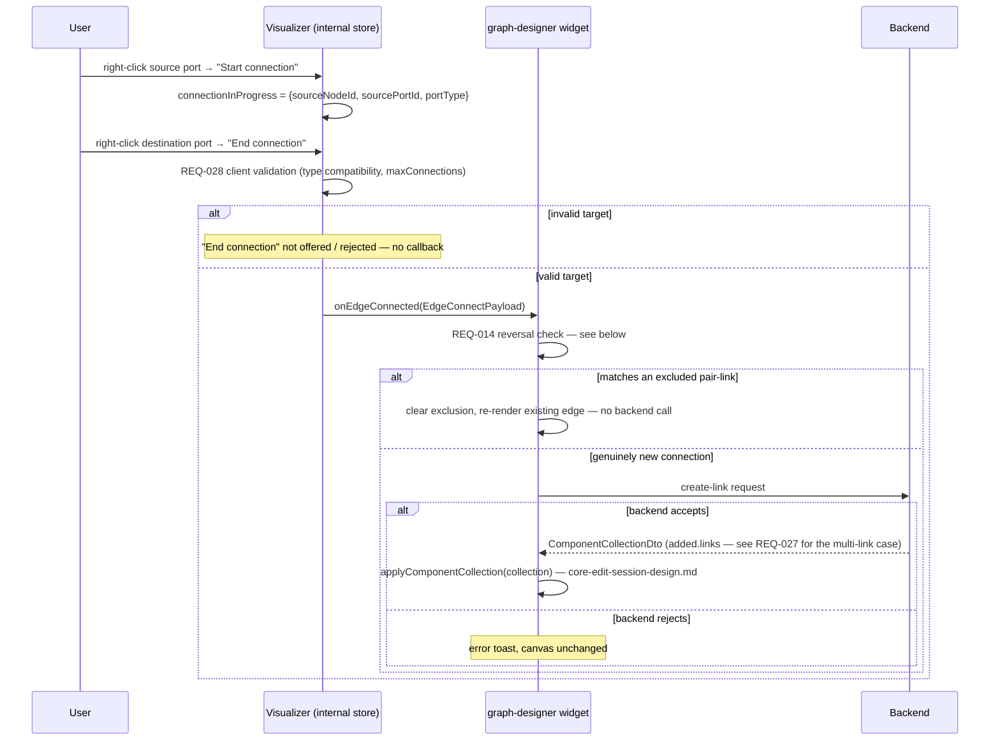
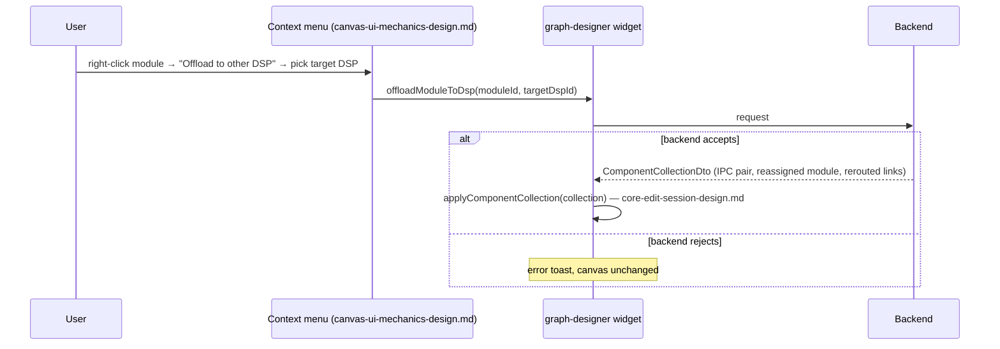

# Graph Designer Edit — Link and Port Operations Design

Requirements: [../requirements/graph-designer-edit-requirements.md](../requirements/graph-designer-edit-requirements.md)
(REQ-024–030, 033–038, 055–057, 072)

Covers connection creation and deletion, port count changes, cross-DSP
bridge connections, the proxy-node connection restriction, and DSP offload.
All operations here assume the edit session (`core-edit-session-design.md`)
is active and reuse the `provenance`/`excludedLinkIds` concepts from
`node-operations-design.md`. Every backend-calling action below is wrapped
in `core-edit-session-design.md`'s `isMutating` lock (REQ-065),
same as every other document in this feature — stated once here, not
repeated per operation.

## Table of Contents

- [Connection Creation Flow](#connection-creation-flow)
- [Bridge Connections & Link Deletion](#bridge-connections--link-deletion)
- [Port Count Changes](#port-count-changes)
- [Proxy Node Connection Restriction](#proxy-node-connection-restriction)
- [MDF Bridging Display Modes](#mdf-bridging-display-modes)
- [Offload to Other DSP](#offload-to-other-dsp)
- [Open Items Inherited](#open-items-inherited)

---

## Connection Creation Flow

**REQ-024, 038 — right-click-to-connect.** The flow is two right-clicks,
not a drag: right-click a source port → "Start connection" → right-click a
destination port → "End connection" (shown only while a connection is in
progress). Because this is click-based rather than drag-based, the
in-progress connection is transient UI state, not a drag payload.

**This state lives inside `UsecaseVisualizer`'s own internal Zustand
store**, not `GraphDesignerStore`/`EditSessionSlice` — consistent with the
Visualizer's existing isolation boundary, where selection, hover, and
viewport cache already live internally and no external component writes to
it. Confirmed during design that nothing outside the canvas needs to react
to a connection being in progress (it doesn't gate the palette, Apply
button, or any other widget).

```typescript
// internal to usecase-visualizer's own store — not exported
interface ConnectionInProgress {
  sourceNodeId: string;
  sourcePortId: string;
  portType: 'data' | 'control';
}
```

**Boundary.** The Visualizer owns: the transient state above, the port
context menu rendering, and **REQ-028's client-side validation** (port type
compatibility — data↔data, control↔control — and `maxConnections`), all as
a pure function over the `LevelView` port data it already receives as
props. **The Visualizer never reads `EditSessionSlice`/`GraphDesignerStore`
directly** — it only ever calls back through the existing
`onEdgeConnected` callback prop; the graph-designer widget is the sole
place that touches `excludedLinkIds`/`pairLinksById`, keeping the
Visualizer's isolation boundary intact. (`node-operations-design.md`'s
sequence diagram for REQ-014 shows this callback abstractly as
`V->>ES`; that arrow represents "Visualizer invokes `onEdgeConnected`,
which the consuming widget then routes into `EditSessionSlice`," not a
direct read by the Visualizer — this document's diagram below is the
literal call sequence.) This validation gates whether "End connection"
completes the action at all; an ineligible target never fires a callback.
On a valid completion, the Visualizer calls the existing
`VisualizerEventHandlers.onEdgeConnected` callback:

```typescript
// packages/react-app/src/features/usecase-visualizer/model/visualizer.types.ts
interface EdgeConnectPayload {
  edgeKind: EdgeKind; // 'data' | 'control' | 'proxy-data' | 'proxy-control'
  sourceNodeId: string;
  sourcePortId: string;
  targetNodeId: string;
  targetPortId: string;
}
```

The consumer widget (`widgets/graph-designer`) owns the actual backend call
and the `GraphDataSlice` mutation — the same producer/consumer split already
documented for `onNodeDropped`/`onEdgesDeleted` in the Visualizer's own
design doc.

**REQ-038 — "End connection" eligibility is precomputed, not a silent
no-op.** The port context menu computes eligibility (REQ-028's type
compatibility + `maxConnections` check, plus REQ-056's proxy-node check)
**before** rendering, and the "End connection" item is only shown in the
menu at all if the current `connectionInProgress` target port is eligible.
There is no case where the item renders and clicking it silently does
nothing — if a port is ineligible, right-clicking it shows a menu with only
whatever base items apply (e.g. "Start connection" is not offered either,
since a connection is already in progress), never a dead "End connection".

**REQ-028's `maxConnections` check uses full-graph connection counts, not
`LevelView`-scoped ones.** Because REQ-026 permits links between modules in
*any* two subgraphs, a port's true connection count can include edges not
present in the currently-rendered `LevelView` (which only shows the active
hierarchy level). The eligibility check therefore counts connections from
the full `GraphDataSlice.connections` collection, filtering by the
candidate port's ID, not from `LevelView`'s own (potentially partial) edge
list. `LevelView` port data is still the source for the port's *type* and
`maxConnections` limit — only the current-connection-count numerator must
come from the full graph state.
the Visualizer only. No callback fires, no API call is made.

**REQ-026 — cross-subgraph/subsystem/module-to-subsystem-port.** No new
mechanism: the same `onEdgeConnected` callback fires regardless of which
kind of nodes own the two ports. The backend decides validity and what
intermediate connections to create — see REQ-027, below.

**REQ-029 — server as final arbiter.** If the backend rejects the
connection, the canvas is left unchanged and an error toast is shown. The
consumer's `onEdgeConnected` handler only merges into `GraphDataSlice` on
success.



**Reversing an excluded pair-link (REQ-014) is handled inside this same
`onEdgeConnected` handler, before any backend call.** This is the concrete
detection logic that `node-operations-design.md`'s Exclude Link section
depends on:

```typescript
function handleEdgeConnected(payload: EdgeConnectPayload): Promise<void> {
  const {sourceNodeId, targetNodeId} = payload;
  const matchingExcluded = get().excludedLinkIds
    .map((id) => get().pairLinksById.get(id)) // pair-link data cached from REQ-013's getSubgraphPairs response
    .find((pairLink) =>
      isSameSubgraphPair(pairLink, sourceNodeId, targetNodeId),
    );

  if (matchingExcluded) {
    // Same subgraph pair as an excluded pair-link — un-exclude and
    // re-render the existing backend connection. No create-link call:
    // REQ-013 already established this link exists server-side.
    set({
      excludedLinkIds: get().excludedLinkIds.filter(
        (id) => id !== matchingExcluded.id,
      ),
    });
    return Promise.resolve();
  }

  // Genuinely new connection — proceed with normal link creation.
  return createLink(payload);
}
```

`isSameSubgraphPair` compares the *subgraph* each endpoint belongs to
(via each node's `subgraphId`) against the pair-link's
`sourceSubgraphId`/`targetSubgraphId`, not the exact node/port — REQ-013's
pair data is a subgraph-to-subgraph relationship, not a port-to-port one,
so any valid reconnection between the same two subgraphs is treated as
reversing the same exclusion. `pairLinksById` is a lookup populated when
REQ-013's `getSubgraphPairs` response is received
(`node-operations-design.md`), keyed by the same link ID used in
`excludedLinkIds`.

---

## Bridge Connections & Link Deletion

**REQ-027 — cross-subsystem bridge connections.** When the user connects a
module inside Subsystem A to a module inside Subsystem B, the backend
creates the full intermediate set in one response: module→A, A→B, B→module.
`createLink`'s return type is `ComponentCollectionDto`
(`core-edit-session-design.md`), the same shared shape every cascading
operation in this feature uses:

```typescript
createLink(payload: EdgeConnectPayload): Promise<ComponentCollectionDto>
// collection.added.links contains however many links the backend created
// for this connection attempt — one for an ordinary link, three for a
// cross-subsystem bridge (module→A, A→B, B→module), etc.
```

`onEdgeConnected`'s success path is a single `applyComponentCollection`
call regardless of how many links came back — no per-link-count branching
needed, since the reconciler already merges whatever `added.links` contains.

**REQ-030 — link delete.** Context menu or Delete key:

```typescript
deleteLink(linkId: string): Promise<void>
```

Removed from canvas only after the backend confirms. This one stays a
narrow `Promise<void>` rather than `ComponentCollectionDto` — deleting a
single link is not a cascade; the caller already knows the one ID to
remove and does so directly, per `core-edit-session-design.md`'s "what does
not go through this mechanism" note.

**Pair-API-origin edges (`origin: 'pair-api'`, `node-operations-design.md`)
show only "Exclude Link" on their context menu, not "Delete."** These edges
represent a real, pre-existing backend connection the user did not create
this session; REQ-014's "Exclude Link" is the only removal action offered
for them, and it never calls `deleteLink` — it only removes the edge from
canvas per the exclusion flow above. The generic "Delete" menu item
(REQ-049) is suppressed for edges carrying `origin: 'pair-api'`; it remains
available, calling `deleteLink` as normal, for every other edge (ordinary
staged links and REQ-027's bridge-connection links).

---

## Port Count Changes

**REQ-033–037.** Data and control port count increase/decrease, on both
module instances and subsystems, is one mechanism used four ways. The
`Port` shape returned here is `graph-data-slice.ts`'s runtime `Port`
(`{direction, isStatic, portId, portName, portType}`) — the same shape
`ModuleInstance.inputPorts`/`outputPorts` already use — **not**
`entities/graph/model/graph.types.ts`'s unrelated `Port` (`portIoType`,
`maxConnections`, `locked`), which belongs to the Visualizer's own
rendering layer and is never the type flowing through this endpoint:

```typescript
updatePortCount(
  nodeId: string,
  portType: 'data' | 'control',
  delta: number,
): Promise<{updatedPorts: Port[]}> // graph-data-slice.ts's Port, full list — see below
```

From the properties panel (`canvas-ui-mechanics-design.md`).

**`updatedPorts` is always the module/subsystem's complete, current port
list for the affected `portType` (both `direction`s) — never only the
delta.** This holds for both increase and decrease: on increase, the list
includes the newly-added port(s) alongside all pre-existing ones; on
decrease, it is the shorter surviving list, telling the client exactly
which port ID(s) were removed by diffing against the node's current
`inputPorts`/`outputPorts`. The consumer replaces (not appends to) the
affected half of the node's port arrays with `updatedPorts`, bucketing each
returned port into `inputPorts` or `outputPorts` by its own `direction`
field.

**REQ-035 — the backend is the sole arbiter of whether a decrease is
allowed** (for example, a port with an active connection likely cannot be
removed). The client makes no attempt to predict this — it sends the
request and handles rejection via the standard toast + no-change pattern.

---

## Proxy Node Connection Restriction

**REQ-056.** Connections cannot be created to or from a subgraph proxy
node, because the proxy node represents a collapsed subgraph and the target
module within it is ambiguous until expanded. This is an extension of
REQ-028's client-side validation (above): the Visualizer's existing
target-eligibility check gains one more condition —

```typescript
if (targetNode.type === 'subgraph-proxy') return false; // invalid target
```

— evaluated regardless of port type match. No new architecture; proxy
ports render as invalid drop targets during a connection operation the same
way a type-mismatched port would.

This is a genuinely different interaction from REQ-011/019's palette
drag-and-drop rejection (native HTML5 `dataTransfer`, designed in
`canvas-ui-mechanics-design.md`) — both share the word "invalid target"
conceptually, but REQ-056 is right-click connection validation, not palette
drop validation, and the two are not unified into one shared code path.

**REQ-057 — rename subgraph proxy node.** Properties panel field, same
shape as the other rename operations (REQ-010/017/031c):

```typescript
renameSubgraphProxy(subgraphId: string, newName: string): Promise<void>
```

Confirmed by the backend before the canvas reflects the change. Note this
renames the underlying subgraph (the proxy is a collapsed view of it, not a
separate entity), so this reuses REQ-017's `renameSubgraph` action from
`node-operations-design.md` rather than introducing a proxy-specific
endpoint.

---

## MDF Bridging Display Modes

**REQ-055.** Cross-DSP connections cause the backend to insert bridge
modules automatically. Two display modes, controlled by user preference:
**Expanded** (bridge modules shown explicitly) and **Virtual connection**
(bridge modules hidden behind a single logical line).

**Persistence reuses the existing config-file-backed preferences
mechanism** — `ConfigFileManager`
(`packages/react-app/src/shared/config/config-manager.ts`), persisted
per-project to `config.json` under the Electron `userData` directory via
`window.configApi`/IPC, and the `useUserPreferences(projectId)` hook
(`shared/config/hooks/use-user-preferences.ts`). This is a persistent,
per-project setting — not session-scoped — consistent with how the other
`visualization.*` preferences already behave (e.g. the currently-unused
`simplifySubsystems` field, which becomes this feature's first real sibling
in the schema):

```typescript
// packages/react-app/src/shared/config/user-preferences-types.ts
interface VisualizationPreferences {
  // ...existing fields...
  crossDspConnectionView: 'expanded' | 'virtual'; // new
}
```

**Rendering is a pure transformation at render time**, alongside the
canvas layer's existing `apply-collapses.ts` transform (which performs a
similarly preference-driven collapse). Given the raw bridge-module data
already present in `GraphDataSlice`, the transform either passes it through
unchanged (`expanded`) or collapses the bridge modules into one virtual edge
(`virtual`). The underlying staged data is never altered by this toggle —
only what's rendered changes.

---

## Offload to Other DSP

**REQ-072.** A context-menu-triggered counterpart to REQ-055's
connection-triggered bridging: the user right-clicks a module, selects
"Offload to other DSP," and picks a target DSP from a list of available
DSPs (designed in `canvas-ui-mechanics-design.md`'s Context Menus section —
this document owns the backend contract and canvas reconciliation, that one
owns the menu itself). The tool calls a new backend endpoint:

```typescript
offloadModuleToDsp(moduleId: string, targetDspId: string): Promise<ComponentCollectionDto>
// first offload: collection.added = {modules: [ipcTxModule, ipcRxModule]}
// re-offload:    collection.updated = {modules: [ipcTxModule, ipcRxModule]}
// both cases:    collection.updated also includes the offloaded module itself
//                (new containerId) and every rerouted link
```

**The response shape does not distinguish "first offload" from
"re-offload" at the type level — the backend just returns the current
state of the IPC pair either way, via `ComponentCollectionDto`'s
`added`/`updated` buckets.** Whether the backend inserted a brand-
new IPC TX/RX pair or updated an existing one from a prior offload is a
backend-internal decision (REQ-072's "first offload" vs. "re-offload"
cases) that the UI does not need to branch on: `applyComponentCollection`
(`core-edit-session-design.md`) already treats `added` and `updated` as
the same upsert-by-ID operation, so the offloaded module's reassigned
container, the IPC TX/RX pair (new or revisited), and every rerouted link
all merge in one `applyComponentCollection` call regardless of which
bucket the backend placed them in. This mirrors REQ-027's "backend returns
everything, UI reconciles in one shot" pattern — no bespoke upsert logic
needed here beyond what the shared reconciler already does.



**No dedicated "un-offload" action.** Reversing an offload is the same
"Offload to other DSP" action, invoked again on the same module, targeting
its original DSP — the backend's update-in-place behavior above handles
this without any UI-side special casing.

**Display mode.** The inserted/updated IPC TX/RX modules are ordinary
bridge modules from the UI's perspective and are subject to REQ-055's
Expanded/Virtual preference (above) exactly like connection-triggered
bridge modules — no separate toggle, no separate rendering path.

---

## Open Items Inherited

- **API contracts** for `updatePortCount`, `deleteLink`, and the
  connection-creation endpoint behind `onEdgeConnected` — all TBD with the
  backend team.
- **Response shape for REQ-027's bridge-connection case** — not yet
  defined; this document assumes a response containing an array of created
  links but the exact DTO is unspecified.
- **`offloadModuleToDsp` API contract** (REQ-072) — endpoint path, the list
  of "available DSPs" source (where does the target-DSP picker's list come
  from — the use case's known DSP set, presumably, but the DTO is
  unspecified), and confirmation of the upsert-vs-insert response shape
  above — all TBD with the backend team.
