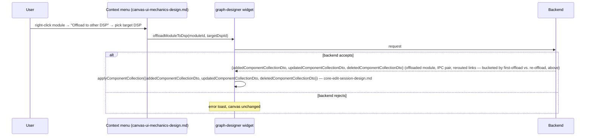

# Usecase Designer Edit — Link and Port Operations Design

Requirements: [../requirements/graph-designer-edit-requirements.md](../requirements/graph-designer-edit-requirements.md)
(REQ-024–030, 033–038, 055–057, 072)

Covers connection creation and deletion, port count changes, cross-DSP
bridge connections, the proxy-node connection restriction, and DSP offload.
All operations here assume the edit session (`core-edit-session-design.md`)
is active and reuse the `provenance`/`excludedLinks` concepts from
`node-operations-design.md`. Every backend-calling action below is wrapped
in `core-edit-session-design.md`'s `withMutationLock` (REQ-065), which also
enforces `mode === 'edit'` — same as every other document in this feature —
stated once here, not repeated per operation.

## Table of Contents

- [Connection Creation Flow](#connection-creation-flow)
- [Control-Port Connection-Limit Warning](#control-port-connection-limit-warning)
- [Bridge Connections & Link Deletion](#bridge-connections--link-deletion)
- [Port Count Changes](#port-count-changes)
- [Proxy Node Connection Restriction](#proxy-node-connection-restriction)
- [MDF Bridging Display Modes](#mdf-bridging-display-modes)
- [Offload to Other DSP](#offload-to-other-dsp)
- [Open Items Inherited](#open-items-inherited)

---

## Connection Creation Flow

**REQ-024, 038 — right-click-to-connect.** The flow is two right-clicks,
not a drag: right-click a source port → "Start connection" → right-click a
destination port → "End connection" (shown only while a connection is in
progress). Because this is click-based rather than drag-based, the
in-progress connection is transient UI state, not a drag payload.

**This state lives inside `UsecaseVisualizer`'s own internal Zustand
store**, not `GraphDesignerStore`/`EditSessionSlice` — consistent with the
Visualizer's existing isolation boundary, where selection, hover, and
viewport cache already live internally and no external component writes to
it. Confirmed during design that nothing outside the canvas needs to react
to a connection being in progress (it doesn't gate the palette, Apply
button, or any other widget).

**Open item: a connection in progress is not protected against a concurrent
mutation deleting one of its endpoints.** Because `connectionInProgress`
lives outside `EditSessionSlice`/`isMutating` by design (above), nothing
stops the user from right-clicking "Start connection" on a port and then,
before completing it, deleting the module (or any ancestor container/
subgraph) that owns that port. This is expected to self-resolve — the
eventual connection-completion call either has no valid target to complete
against or is rejected server-side, surfacing through the standard toast
pattern (REQ-029) — but is not designed around here. See
[Open Items Inherited](#open-items-inherited).

```typescript
// internal to usecase-visualizer's own store — not exported
interface ConnectionInProgress {
  sourceNodeId: string;
  sourcePortId: string;
  portType: 'data' | 'control';
}
```

**Boundary.** The Visualizer owns: the transient state above, the port
context menu rendering, and **REQ-028's client-side validation** (port
type compatibility only — data↔data, control↔control; `maxConnections` is
explicitly not part of this check, see below), all as
a pure function over the `LevelView` port data it already receives as
props. **The Visualizer never reads `EditSessionSlice`/`GraphDesignerStore`
directly** — it only ever calls back through the existing
`onEdgeConnected` callback prop; the graph-designer widget is the sole
place that touches `excludedLinks`/`pairLinksById`, keeping the
Visualizer's isolation boundary intact. (`node-operations-design.md`'s
sequence diagram for REQ-014 shows this callback abstractly as
`V->>ES`; that arrow represents "Visualizer invokes `onEdgeConnected`,
which the consuming widget then routes into `EditSessionSlice`," not a
direct read by the Visualizer — this document's diagram below is the
literal call sequence.) This validation gates whether "End connection"
completes the action at all; an ineligible target never fires a callback.
On a valid completion, the Visualizer calls the existing
`VisualizerEventHandlers.onEdgeConnected` callback:

```typescript
// packages/react-app/src/features/usecase-visualizer/model/visualizer.types.ts
interface EdgeConnectPayload {
  edgeKind: EdgeKind; // 'data' | 'control' | 'proxy-data' | 'proxy-control'
  sourceNodeId: string;
  sourcePortId: string;
  targetNodeId: string;
  targetPortId: string;
}
```

The consumer widget (`widgets/graph-designer`) owns the actual backend call
and the `GraphDataSlice` mutation — the same producer/consumer split already
documented for `onNodeDropped`/`onEdgesDeleted` in the Visualizer's own
design doc.

**REQ-038 — "End connection" eligibility is precomputed, not a silent
no-op.** The port context menu computes eligibility (REQ-028's type
compatibility check, plus REQ-056's proxy-node check) **before** rendering,
and the "End connection" item is only shown in the menu at all if the
current `connectionInProgress` target port is eligible. There is no case
where the item renders and clicking it silently does nothing — if a port
is ineligible, right-clicking it shows a menu with only whatever base
items apply (e.g. "Start connection" is not offered either, since a
connection is already in progress), never a dead "End connection".
**`maxConnections` is not part of this eligibility check for either port
type** — see below.

**REQ-028 — no client-side `maxConnections` check, for either port type.**
An earlier draft of this design eagerly validated `maxConnections`
client-side (for all ports) before allowing "End connection" to complete.
That's removed: the backend is the sole arbiter of whether a connection is
created (REQ-029), for both data and control ports, so nothing here gates
the API call on connection count. What replaces it, for **control ports
only**, is a **post-creation warning** — not a pre-creation block — designed
in [Control-Port Connection-Limit Warning](#control-port-connection-limit-warning),
below. Client-side validation before the API call is therefore reduced to
port-type compatibility alone (data↔data, control↔control).


**REQ-025 — Escape cancels.** Clears the in-progress state to `null` inside
the Visualizer only. No callback fires, no API call is made.

**REQ-026 — cross-subgraph/subsystem/module-to-subsystem-port.** No new
mechanism: the same `onEdgeConnected` callback fires regardless of which
kind of nodes own the two ports. The backend decides validity and what
intermediate connections to create — see REQ-027, below.

**REQ-029 — server as final arbiter.** If the backend rejects the
connection, the canvas is left unchanged and an error toast is shown. The
consumer's `onEdgeConnected` handler only merges into `GraphDataSlice` on
success.

```mermaid
sequenceDiagram
  participant U as User
  participant V as Visualizer (internal store)
  participant O as graph-designer widget
  participant B as Backend

  U->>V: right-click source port → "Start connection"
  V->>V: connectionInProgress = {sourceNodeId, sourcePortId, portType}
  U->>V: right-click destination port → "End connection"
  V->>V: REQ-028 client validation (type compatibility only)
  alt invalid target
    Note over V: "End connection" not offered / rejected — no callback
  else valid target
    V->>O: onEdgeConnected(EdgeConnectPayload)
    O->>O: REQ-014 reversal check — see below
    alt matches an excluded pair-link
      O->>O: clear exclusion, re-render existing edge — no backend call
    else genuinely new connection
      O->>B: create-link request (createDataLink or createControlLink, by payload.edgeKind)
      alt backend accepts
        B-->>O: addedComponentCollectionDto (spfModules/dataLinks/controlLinks — see REQ-027 for the multi-link case; updated/deletedComponentCollectionDto always empty for link create)
        O->>O: applyAddedCollection(addedComponentCollectionDto) — core-edit-session-design.md
        O->>O: if payload.edgeKind === 'control', check maxConnections post-creation — see Control-Port Connection-Limit Warning, below
      else backend rejects
        Note over O: error toast, canvas unchanged
      end
    end
  end
```

**Reversing an excluded pair-link (REQ-014) is handled inside this same
`onEdgeConnected` handler, before any backend call.** This is the concrete
matching logic that `node-operations-design.md`'s Exclude Link section
depends on:

```typescript
function handleEdgeConnected(payload: EdgeConnectPayload): Promise<void> {
  const matchingExcluded = get().excludedLinks.find((link) =>
    isSameConnection(link, payload),
  );

  if (matchingExcluded) {
    // Exact endpoint match against an excluded link — un-exclude and
    // re-render the existing backend connection. No create-link call:
    // REQ-013 already established this link exists server-side.
    set({
      excludedLinks: get().excludedLinks.filter((l) => l !== matchingExcluded),
      graphData: {
        ...get().graphData,
        connections: {
          ...get().graphData.connections,
          [matchingExcluded.connectionId]: matchingExcluded,
        },
      },
    });
    return Promise.resolve();
  }

  // Genuinely new connection — proceed with normal link creation,
  // dispatched to the data or control endpoint by payload.edgeKind.
  return payload.edgeKind === 'control'
    ? createControlLink(payload)
    : createDataLink(payload);
}
```

**`isSameConnection` matches on the *exact* endpoints — module and port,
not just subgraph** — this is what makes reversal precise when more than
one excluded pair-link exists between the same two subgraphs. An earlier
draft compared only each endpoint's *subgraph* (`isSameSubgraphPair`),
which meant any valid reconnection between the same subgraph pair was
treated as reversing *some* excluded link, ambiguously — with two
distinct pair-links excluded between the same subgraphs, redrawing one
could un-exclude the wrong one. Because `excludedLinks` now stores the
full `Connection` object (`node-operations-design.md`), not just an ID,
exact-endpoint matching needs no extra lookup:

```typescript
function isSameConnection(link: Connection, payload: EdgeConnectPayload): boolean {
  return (
    link.fromModuleId === payload.sourceNodeId &&
    link.fromPortId === payload.sourcePortId &&
    link.toModuleId === payload.targetNodeId &&
    link.toPortId === payload.targetPortId
  );
}
```

`pairLinksById` (`node-operations-design.md`) is no longer read by this
matching logic at all — it's a lookup used elsewhere in this feature only
to decide whether an on-canvas link is pair-derived for context-menu
dispatch purposes (`link-and-port-design.md`'s Bridge Connections
section, below); reversal here only ever needs `excludedLinks` itself.

---

## Control-Port Connection-Limit Warning

**REQ-028.** `maxConnections` applies only to control ports, and only as a
**post-creation, non-blocking warning** — never a pre-creation client-side
block, and never applied to data ports at all. This is a deliberate
narrowing from an earlier draft (which validated `maxConnections`
client-side, for all ports, before allowing the connection to complete):
that approach risked showing a "this exceeds the limit" warning for a
connection the backend was about to reject anyway for an unrelated reason
(REQ-029), stacking a confusing informational warning on top of a hard
failure toast for a connection that never actually got created. Checking
only after the backend confirms creation guarantees the warning is only
ever shown for a connection that's real.

**Check happens in `handleEdgeConnected`'s success path, right after
`applyComponentCollection` merges the new link — not before the API call,
and not by the Visualizer.** The Visualizer's own REQ-028 validation
(above) is reduced to port-type compatibility only; it has no
`maxConnections` awareness at all, consistent with `EdgeConnectPayload`
carrying no such flag. The consumer widget owns this check, using
`payload.edgeKind` to scope it to control links only:

```typescript
async function handleEdgeConnected(payload: EdgeConnectPayload): Promise<void> {
  // ...reversal check and create-link dispatch, above...
  const {addedComponentCollectionDto} = await (payload.edgeKind === 'control'
    ? createControlLink(payload)
    : createDataLink(payload));
  get().applyAddedCollection(addedComponentCollectionDto); // link create only ever populates the added bucket
  if (payload.edgeKind === 'control') {
    warnIfControlPortOverLimit(payload.sourceNodeId, payload.sourcePortId);
    warnIfControlPortOverLimit(payload.targetNodeId, payload.targetPortId);
  }
}

function warnIfControlPortOverLimit(nodeId: string, portId: string): void {
  const port = findPortById(get(), nodeId, portId); // same LevelView port data REQ-038's eligibility check already reads
  const onCanvasCount = countConnectionsToPort(get().graphData.connections, portId);
  if (port && onCanvasCount > port.maxConnections) {
    toast.warning(
      "This connection exceeds the port's supported connection limit; concurrent connections beyond this limit may not behave as expected",
    );
  }
}
```

**Both endpoints are checked — this corrects an earlier draft that checked
only the target port.** The earlier draft's rationale was that a source
port's limit "was already established when the user started the connection
from it in an *earlier* completed connection, and would have been checked
at that time as the target of that prior action." That assumption doesn't
hold in general: a control port can be used as the **source** of "Start
connection" any number of times without ever once being the **target**
("End connection") of a different connection — nothing in REQ-024/038
requires a port's first use to be as a target. In that case, the earlier
draft's target-only check would never fire for that port no matter how many
connections it sources, since it's never the newly-connected endpoint from
the check's own point of view. Checking both endpoints on every successful
connection closes this gap; a port that's genuinely already been checked as
a prior connection's target does not get a *materially* redundant warning
from being re-checked here, since `onCanvasCount` reflects its true,
current count each time — the check is cheap and idempotent, not something
that needs suppressing on a "already warned once" basis. If a single
connection completion pushes both endpoints over their respective limits,
two separate toasts are shown, one per port — each is accurate and
independently actionable, not a duplicate of the same fact.

**This reuses `LevelView` port data, the same source REQ-038's eligibility
check and REQ-033–037's port-count-change UI already read** — no new
fetch, no new state. `onCanvasCount` deliberately uses
`GraphDataSlice.connections` (the same selection-scoped count REQ-064's
port coloring uses), not `totalLinksAtPort` — the warning is about
concurrent connections *visible in this session's use-case selection*
exceeding the limit, which is the scope the user can actually see and
reason about on canvas; a port whose *total* backend connection count
(across unselected use cases) exceeds the limit but whose on-canvas count
does not is not this feature's concern to surface.

## Bridge Connections & Link Deletion

**REQ-027 — cross-subsystem bridge connections.** When the user connects a
module inside Subsystem A to a module inside Subsystem B, the backend
creates the full intermediate set in one response: module→A, A→B, B→module.
`createDataLink`/`createControlLink` (the API exposes one endpoint per
link kind, mirroring `deleteDataLink`/`deleteControlLink`'s split, above —
not a single unified `createLink`) return the real, confirmed
three-collection API shape (`addedComponentCollectionDto`/
`updatedComponentCollectionDto`/`deletedComponentCollectionDto`, each a
`ComponentCollectionDto` — `spfModules`/`dataLinks`/`controlLinks`) —
`core-edit-session-design.md`'s shared reconciler, not a bespoke shape per
endpoint. Link creation only ever populates `addedComponentCollectionDto`;
the other two are always empty for these two endpoints:

```typescript
createDataLink(payload: EdgeConnectPayload): Promise<{
  addedComponentCollectionDto: ComponentCollectionDto;
  updatedComponentCollectionDto: ComponentCollectionDto;
  deletedComponentCollectionDto: ComponentCollectionDto;
}>
createControlLink(payload: EdgeConnectPayload): Promise<{
  addedComponentCollectionDto: ComponentCollectionDto;
  updatedComponentCollectionDto: ComponentCollectionDto;
  deletedComponentCollectionDto: ComponentCollectionDto;
}>
// addedComponentCollectionDto.dataLinks/controlLinks (matching payload.edgeKind)
// contains however many links the backend created for this connection
// attempt — one for an ordinary link, three for a cross-subsystem bridge
// (module→A, A→B, B→module)
```

**Which variant — plain vs. `-with-subsystems` — is decided once for the
whole edit session, not per call.** Per `core-edit-session-design.md`'s
`usesSubsystemVariant` flag (set in `enterEditMode()` from whichever
raw/subsystem display mode was active when Edit mode started, and fixed
for the session since that toggle can't change mid-edit),
`createDataLink`/`createControlLink` here mean "call whichever of the two
real endpoints for this link kind — plain or `-with-subsystems` — the
session decided on." A cross-subsystem bridge connection (this REQ) only
produces entries in `addedComponentCollectionDto.subsystems` when the
session is using the `-with-subsystems` variant; in the plain-variant
session, the same bridge is still fully represented via
`spfModules`/`dataLinks`/`controlLinks` alone (subsystem port changes
simply aren't surfaced, consistent with the canvas not rendering
subsystems in raw mode).

`onEdgeConnected`'s success path is a single `applyAddedCollection`
call regardless of how many links, which kind, or which variant came back
— no per-link-count, per-kind, or per-variant branching needed beyond the
one dispatch in `handleEdgeConnected` above, since the reconciler already
merges whatever the response contains.

**REQ-030 — link delete.** Context menu or Delete key. The API exposes two
separate endpoints by link kind, not one unified `deleteLink` — the
consumer widget dispatches on the edge's own `connectionType` field:

```typescript
deleteDataLink(dataLinkSystemId: string): Promise<DataLinkDto> // the one deleted link's own DTO — not part of the three-collection change
deleteControlLink(controlLinkSystemId: string): Promise<ControlLinkDto> // same — a single-link delete, not a cascade
```

Each returns the deleted link's own DTO (tagged `changeType: 'DELETE'`,
"for undo support" per the API description — not consumed by this feature
since undo/redo is out of scope, REQ-067), not `void` and not a
`ComponentCollectionDto` — deleting a single link is not a cascade, so the
response is just that one entity, confirming it's gone. The consumer
removes the edge from `GraphDataSlice` by the returned `systemId` on
success; on failure, toast and no change, per the standard pattern.

**Deleting one hop of a REQ-027 multi-hop bridge connection (e.g. only the
Subsystem A→B segment of module→A→B→module) is a valid mid-session state,
not something this design detects or blocks.** `deleteDataLink`/
`deleteControlLink` operate on one link at a time with no awareness that a
given link is one hop of a bridge set — there is no "delete the whole
bridge" affordance, and REQ-030 does not distinguish a bridge hop from an
ordinary link for deletion purposes. The two now-orphaned remaining hops
render on canvas exactly as staged until Apply. Consistent with this
feature's "server is the final arbiter" pattern (REQ-029/046), validating
whether an orphaned partial bridge is acceptable is left entirely to
`createUsecases` at Apply time (`core-edit-session-design.md`) — a rejected
Apply surfaces as `issues` entries in the modification summary (REQ-046),
same as any other backend-rejected state, and the session stays in Edit
mode for the user to correct it. No client-side detection of this
half-deleted state is designed here.

**Pair-derived edges (identified via `pairLinksById.has(connectionId)`,
`node-operations-design.md`) show only "Exclude Link" on their context
menu, not "Delete."** These edges represent a real, pre-existing backend
connection the user did not create this session; REQ-014's "Exclude Link"
is the only removal action offered for them, and it never calls
`deleteDataLink`/`deleteControlLink` — it only removes the edge from
canvas per the exclusion flow above. The generic "Delete" menu item
(REQ-049) is suppressed whenever this check is true; it remains
available, calling the appropriate delete endpoint as normal, for every
other edge (ordinary staged links and REQ-027's bridge-connection links).
**This same check must also gate the Delete-key/batch-delete path, not
only the context menu** — `canvas-ui-mechanics-design.md`'s `deleteByType`
routes a pair-derived edge to `excludeLink` instead of `deleteLink` for
exactly this reason, since that path has no context-menu rendering to rely
on for the exclusion.
An earlier draft of this document identified pair-derived edges via a
`Connection.origin: 'pair-api'` field — that field is removed
(`node-operations-design.md`'s REQ-013 section); pair-links are ordinary
`Connection` entries once rendered, so this check is the only way to tell
them apart for menu purposes.

---

## Port Count Changes

**REQ-033–037.** Data and control port count increase/decrease, on both
module instances and subsystems, is one mechanism used four ways. The
`Port` shape returned here is `graph-data-slice.ts`'s runtime `Port`
(`{direction, isStatic, portId, portName, portType}`) — the same shape
`ModuleInstance.inputPorts`/`outputPorts` already use — **not**
`entities/graph/model/graph.types.ts`'s unrelated `Port` (`portIoType`,
`maxConnections`, `locked`), which belongs to the Visualizer's own
rendering layer and is never the type flowing through this endpoint:

```typescript
updatePortCount(
  nodeId: string,
  portType: 'data' | 'control',
  delta: number,
): Promise<{updatedPorts: Port[]}> // graph-data-slice.ts's Port, full list — see below
```

From the properties panel (`canvas-ui-mechanics-design.md`).

**`updatedPorts` is always the module/subsystem's complete, current port
list for the affected `portType` (both `direction`s) — never only the
delta.** This holds for both increase and decrease: on increase, the list
includes the newly-added port(s) alongside all pre-existing ones; on
decrease, it is the shorter surviving list, telling the client exactly
which port ID(s) were removed by diffing against the node's current
`inputPorts`/`outputPorts`. The consumer replaces (not appends to) the
affected half of the node's port arrays with `updatedPorts`, bucketing each
returned port into `inputPorts` or `outputPorts` by its own `direction`
field.

**REQ-035 — the backend is the sole arbiter of whether a decrease is
allowed** (for example, a port with an active connection likely cannot be
removed). The client makes no attempt to predict this — it sends the
request and handles rejection via the standard toast + no-change pattern.

**This narrow, non-cascading response shape assumes the backend only ever
accepts or rejects a decrease outright — it has no field to carry cascaded
side effects if the backend instead allowed the decrease and severed the
port's existing links as a consequence, the way module/container delete
cascades to sever links.** If the real (still-TBD) contract turns out to
work that way instead of a hard reject, `{updatedPorts}` alone can't convey
the severed links to the client, and `GraphDataSlice.connections` would go
stale for exactly the links the decrease removed. This is a contract
requirement to confirm with the backend team, not just an open shape
question — see [Open Items Inherited](#open-items-inherited).

**A newly-added port's `totalLinksAtPort` (REQ-064,
`canvas-ui-mechanics-design.md`) is `0` — no connections exist yet to a
port that was just created.** This holds regardless of whether the
backend response's `Port` entries carry the field explicitly or the
consumer defaults it: a brand-new port cannot have any pre-existing
connections by construction, on either the data or control side, so the
consumer sets `totalLinksAtPort: 0` for any port ID in `updatedPorts`
that wasn't present in the node's pre-call port list — the same
increase-vs-decrease diff already computed above (to know which port IDs
are new vs. surviving) also identifies which entries need this default.
Surviving ports (both on increase, for the untouched existing ports, and
on decrease) keep whatever `totalLinksAtPort` they already had — this
value is unaffected by a port-count change on a *different* port of the
same node.

---

## Proxy Node Connection Restriction

**REQ-056.** Connections cannot be created to or from a subgraph proxy
node, because the proxy node represents a collapsed subgraph and the target
module within it is ambiguous until expanded. This is an extension of
REQ-028's client-side validation (above): the Visualizer's existing
target-eligibility check gains one more condition —

```typescript
if (targetNode.type === 'subgraph-proxy') return false; // invalid target
```

— evaluated regardless of port type match. No new architecture; proxy
ports render as invalid drop targets during a connection operation the same
way a type-mismatched port would.

This is a genuinely different interaction from REQ-011/019's palette
drag-and-drop rejection (native HTML5 `dataTransfer`, designed in
`canvas-ui-mechanics-design.md`) — both share the word "invalid target"
conceptually, but REQ-056 is right-click connection validation, not palette
drop validation, and the two are not unified into one shared code path.

**REQ-057 — rename subgraph proxy node.** Properties panel field, same
shape as the other rename operations (REQ-010/017/031c):

```typescript
renameSubgraphProxy(subgraphId: string, newName: string): Promise<void>
```

Confirmed by the backend before the canvas reflects the change. Note this
renames the underlying subgraph (the proxy is a collapsed view of it, not a
separate entity), so this reuses REQ-017's `renameSubgraph` action from
`node-operations-design.md` rather than introducing a proxy-specific
endpoint.

---

## MDF Bridging Display Modes

**REQ-055.** Cross-DSP connections cause the backend to insert bridge
modules automatically. Two display modes, controlled by user preference:
**Expanded** (bridge modules shown explicitly) and **Virtual connection**
(bridge modules hidden behind a single logical line).

**Persistence reuses the existing config-file-backed preferences
mechanism** — `ConfigFileManager`
(`packages/react-app/src/shared/config/config-manager.ts`), persisted
per-project to `config.json` under the Electron `userData` directory via
`window.configApi`/IPC, and the `useUserPreferences(projectId)` hook
(`shared/config/hooks/use-user-preferences.ts`). This is a persistent,
per-project setting — not session-scoped — consistent with how the other
`visualization.*` preferences already behave (e.g. the currently-unused
`simplifySubsystems` field, which becomes this feature's first real sibling
in the schema):

```typescript
// packages/react-app/src/shared/config/user-preferences-types.ts
interface VisualizationPreferences {
  // ...existing fields...
  crossDspConnectionView: 'expanded' | 'virtual'; // new
}
```

**Rendering is a pure transformation at render time**, alongside the
canvas layer's existing `apply-collapses.ts` transform (which performs a
similarly preference-driven collapse). Given the raw bridge-module data
already present in `GraphDataSlice`, the transform either passes it through
unchanged (`expanded`) or collapses the bridge modules into one virtual edge
(`virtual`). The underlying staged data is never altered by this toggle —
only what's rendered changes.

---

## Offload to Other DSP

**REQ-072.** A context-menu-triggered counterpart to REQ-055's
connection-triggered bridging: the user right-clicks a module, selects
"Offload to other DSP," and picks a target DSP from a list of available
DSPs (designed in `canvas-ui-mechanics-design.md`'s Context Menus section —
this document owns the backend contract and canvas reconciliation, that one
owns the menu itself). The tool calls a new backend endpoint:

```typescript
offloadModuleToDsp(moduleId: string, targetDspId: string): Promise<{
  addedComponentCollectionDto: ComponentCollectionDto;
  updatedComponentCollectionDto: ComponentCollectionDto;
  deletedComponentCollectionDto: ComponentCollectionDto;
}>
// First offload: addedComponentCollectionDto.spfModules includes the new
//   IPC TX and IPC RX modules; updatedComponentCollectionDto.spfModules
//   includes the offloaded module itself (new containerId, on the target DSP)
// Re-offload: updatedComponentCollectionDto.spfModules includes the
//   offloaded module AND the existing IPC TX/RX pair (updated in place) —
//   addedComponentCollectionDto is empty for this case, no new IPC pair inserted
// Both cases: updatedComponentCollectionDto.dataLinks/controlLinks includes every rerouted link
```

**Whether the IPC TX/RX pair is brand-new or revisited is now conveyed by
*which bucket* it lands in, not a field on the entity.** Whether the
backend inserted a brand-new IPC TX/RX pair (`addedComponentCollectionDto`)
or updated an existing one from a prior offload
(`updatedComponentCollectionDto`) is a backend-internal decision (REQ-072's
"first offload" vs. "re-offload" cases) that the UI does not need to branch
on: `applyComponentCollection` (`core-edit-session-design.md`) upserts
every module in the added and updated buckets alike — so the offloaded
module's reassigned container, the IPC TX/RX pair (new or revisited), and
every rerouted link all merge in one `applyComponentCollection` call with
no special-cased upsert logic. This mirrors REQ-027's "backend returns
everything, UI reconciles in one shot" pattern.



**No dedicated "un-offload" action.** Reversing an offload is the same
"Offload to other DSP" action, invoked again on the same module, targeting
its original DSP — the backend's update-in-place behavior above handles
this without any UI-side special casing.

**Display mode.** The inserted/updated IPC TX/RX modules are ordinary
bridge modules from the UI's perspective and are subject to REQ-055's
Expanded/Virtual preference (above) exactly like connection-triggered
bridge modules — no separate toggle, no separate rendering path.

---

## Open Items Inherited

- **API contract for `updatePortCount`** — still TBD with the backend team;
  no port-count-change endpoint exists in the API today, unlike link
  create/delete which are confirmed as `POST /data-links`(`/with-subsystems`)
  and `POST /control-links`(`/with-subsystems`). **Must also confirm whether
  a decrease can cascade to sever the port's existing links** (see the Port
  Count Changes section, above) — if so, the response contract needs a
  cascaded-links field the current `{updatedPorts}` shape doesn't have, and
  this design's narrow-response reconciliation (no `ComponentCollectionDto`
  merge) would need revisiting once the backend confirms which behavior
  applies.
- **`offloadModuleToDsp` API contract** (REQ-072) — endpoint path, the list
  of "available DSPs" source (where does the target-DSP picker's list come
  from — the use case's known DSP set, presumably, but the DTO is
  unspecified) — all TBD with the backend team. The response *shape* is
  confirmed as the three-collection
  `{addedComponentCollectionDto, updatedComponentCollectionDto,
  deletedComponentCollectionDto}` envelope (this document's own pattern,
  consistent with every other structural endpoint), but this specific
  endpoint doesn't exist in the API yet.
- **Connection-in-progress vs. concurrent mutation** (see Connection
  Creation Flow, above) — starting a connection from a port and then
  deleting that port's owning module (or an ancestor) before completing the
  connection is not designed around; expected to self-resolve via the
  standard rejection/no-valid-target path, but flagged as a known gap, not
  a resolved one.
