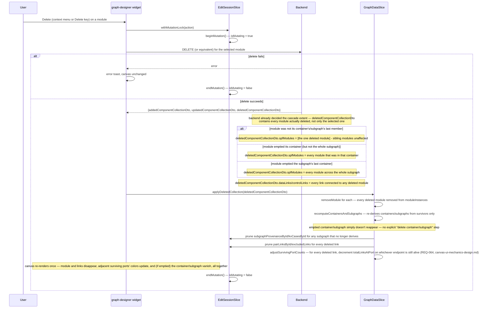
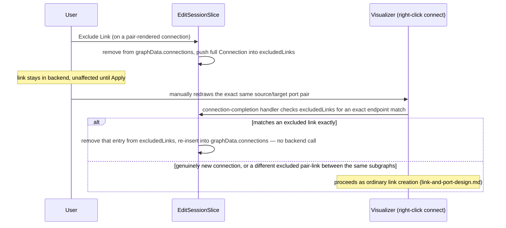

# Graph Designer Edit — Node Operations Design

Requirements: [../requirements/graph-designer-edit-requirements.md](../requirements/graph-designer-edit-requirements.md)
(REQ-004–023, 031a–032)

Covers module, container, subgraph, and subsystem structural operations:
add, delete, rename, implicit creation, and subsystem move/expand. All
operations here assume the edit session designed in
`core-edit-session-design.md` is already active.

## Table of Contents

- [Shared Mutation Pattern](#shared-mutation-pattern)
- [Subgraph Provenance](#subgraph-provenance)
- [Module Operations](#module-operations)
  - [Sequence: Module Drop on Empty Canvas](#sequence-module-drop-on-empty-canvas)
  - [Sequence: Delete Module (Cascading to Container/Subgraph)](#sequence-delete-module-cascading-to-containersubgraph)
- [Container Operations](#container-operations)
- [Subgraph Operations](#subgraph-operations)
- [Subsystem Operations](#subsystem-operations)
- [Open Items Inherited](#open-items-inherited)

---

## Shared Mutation Pattern

Every operation in this document follows the pattern established in
`core-edit-session-design.md`: a dedicated async action calls the backend,
merges the returned DTOs into `GraphDataSlice` only on success, and shows an
error toast with no canvas change on failure. Every action is also wrapped
in `core-edit-session-design.md`'s `withMutationLock` (REQ-065) so the
canvas is non-interactive until the response arrives — this also enforces
`mode === 'edit'` (throwing if it's not, since every action here is only
ever invoked from a UI surface that already doesn't render outside Edit
mode), so no operation below needs its own separate mode check. This
section states both patterns once; each operation below names only its
action and payload, not the wrapping.

**Cascading operations must return their full blast radius in one
response, using the shared three-collection shape.**
Several operations here (module delete, container delete, subgraph delete,
subsystem delete, subsystem expand) cascade to child entities and their
links. For the UI to reconcile in a single response cycle — as the
requirements repeatedly demand — the backend response must include every
affected module/link, bucketed into whichever of
`addedComponentCollectionDto`/`updatedComponentCollectionDto`/
`deletedComponentCollectionDto` applies, not just the entity the user
directly acted on. Rather than each operation below inventing its own
bespoke response shape, every cascading endpoint in this document returns
the same three-field shape (`addedComponentCollectionDto`/
`updatedComponentCollectionDto`/`deletedComponentCollectionDto`, each a
`ComponentCollectionDto` — the real, confirmed API shape, designed once in
`core-edit-session-design.md`'s
[Response Reconciliation](../design/core-edit-session-design.md#response-reconciliation--component-collections)
section) and is merged via that document's single
`applyComponentCollection` reconciler (or its `applyAddedCollection`/
`applyDeletedCollection` helpers, for the pure-create/pure-delete cases
below) — no operation here hand-writes its own merge, and none of them
needs a separate `deletedContainerIds`/`deletedSubgraphIds`-style field,
since containers/subgraphs are derived from grouped modules and disappear
automatically once their last module is deleted. The specific cascading
endpoints below (delete/expand/move/offload) don't exist in the API yet —
these are net-new requirements flagged for the backend team, but expected
to return this same three-collection shape once built, consistent with
every endpoint that does exist today.

## Subgraph Provenance

REQ-016a/b/c and REQ-048 define three different delete behaviors for a
subgraph depending on how it reached the canvas. **The durable store for
this is `EditSessionSlice.subgraphProvenanceById`, a session-local map
keyed by subgraph ID — not a field set once directly on the subgraph node
object.** An earlier draft of this document stated `provenance` was "set
once at creation/load time and never mutated after," directly on
`Subgraph`, the same pattern as the optional `diffState`/`diffChangedFields`
fields on existing node types. That doesn't hold up: `Subgraph` is a
*derived* object, rebuilt from scratch by `recomputeContainersAndSubgraphs`
on every single recompute pass (`core-edit-session-design.md`'s Response
Reconciliation section) — any edit anywhere on canvas triggers this, not
only an edit touching this specific subgraph. A field placed directly on
the derived object and never re-populated would be silently lost the next
time *any* recompute ran — this was the exact root cause already diagnosed
and fixed for `kvCasesById` in that same section; `provenance` needs the
identical fix, for the identical reason.

The map is the source of truth, populated once per subgraph at whichever
moment first learns its provenance (below) and never mutated after that
point — matching the *intent* of the original "set once, never mutated"
language, just relocated to state that survives a recompute. `Subgraph`
still exposes `provenance` as a plain field for every consumer's
convenience — `recomputeContainersAndSubgraphs` stamps it onto each
freshly-derived `Subgraph` from the map on every pass (already shown in
`core-edit-session-design.md`'s `recomputeContainersAndSubgraphs` listing),
so reading `subgraph.provenance` anywhere in this feature works exactly as
before; only the *storage* changed, not the read-side shape:

```typescript
type SubgraphProvenance = 'pre-loaded' | 'palette-placed' | 'newly-created';

interface EditSessionSlice {
  // ...
  subgraphProvenanceById: Map<string, SubgraphProvenance>;
}

interface Subgraph {
  // ...existing fields...
  provenance: SubgraphProvenance; // stamped from subgraphProvenanceById on every recompute — not stored here directly
}
```

**There is no separate "subgraph definition" ID, unlike modules
(`moduleId` vs. `moduleInstanceId`).** An earlier draft of this document
assumed subgraphs had the same definition/instance split as modules and
introduced a `subgraphDefId` field to track it — this doesn't match the
real API. `SubgraphController_getAllSubgraphs`/`querySubgraphs` (the
subgraph palette's own data source) return `SubgraphDto[]` keyed by the
same `systemId` that `getComponentsForSubgraph(subgraphSystemId)`
(REQ-012, below) fetches contents for — placing a subgraph from the
palette doesn't instantiate anything new, it renders the contents of an
already-existing subgraph by its one and only ID. So `Subgraph.subgraphId`
(the existing field) is already the ID REQ-015's duplicate-placement guard
needs — see the corrected guard, below.

| Provenance | Set when | Delete behavior |
| --- | --- | --- |
| `pre-loaded` | At use-case-selection time, in View mode, before Edit mode is even entered — same moment `kvCasesById` is seeded for it (`core-edit-session-design.md`'s Mode State section) | Stages a backend delete call |
| `palette-placed` | Dropped from the subgraph palette this session (REQ-012) | UI-cache-only removal, no backend call |
| `newly-created` | Created via drag-to-empty-space (REQ-006) or paste (see `canvas-ui-mechanics-design.md`) | Stages a backend delete call |

**The `pre-loaded` stamp is easy to miss because it has no dedicated code
snippet of its own elsewhere in this feature — it belongs alongside the
existing `kvCasesById` seeding call, not as a separate fetch.**
`core-edit-session-design.md`'s Mode State section walks through Effect A
seeding `kvCasesById` for every pre-loaded subgraph in detail and never
mentions `subgraphProvenanceById` in the same breath — that section's own
seeding loop must gain one more line per matched subgraph:

```typescript
// inside Effect A's per-subgraph seeding loop (core-edit-session-design.md):
get().subgraphProvenanceById.set(String(subgraph.systemId), 'pre-loaded');
get().kvCasesById.set(String(subgraph.systemId), /* ...existing SGKV seed... */);
```

Same clear-and-reseed treatment as `kvCasesById` applies here too — Effect
A's `if (mode === 'view')` block clears `subgraphProvenanceById` before
this loop runs, per that section's own description of clearing all five
session-local maps together.

**`pre-loaded` and `newly-created` call the same `deleteSubgraph` action —
there is no separate "cascade delete" endpoint.** Cascading to the
subgraph's containers, modules, and links is the backend's responsibility
in both cases; the frontend issues one delete call for the subgraph ID and
does not compute or submit the cascade itself:

```typescript
deleteSubgraph(subgraphId: string): Promise<{
  addedComponentCollectionDto: ComponentCollectionDto;
  updatedComponentCollectionDto: ComponentCollectionDto;
  deletedComponentCollectionDto: ComponentCollectionDto;
}>
// every module that belonged to this subgraph appears in
// deletedComponentCollectionDto.spfModules; every dataLink/controlLink
// connected to any of those modules likewise appears in
// deletedComponentCollectionDto.dataLinks/controlLinks
```

The response shape is the same three-collection shape every cascading
delete in this document uses (`core-edit-session-design.md`) — the canvas
needs the full set of removed modules/links to clear them from
`GraphDataSlice` in one pass via `applyDeletedCollection` (a pure-delete
response — the added/updated buckets are always empty here), regardless of
which provenance triggered the call. There is no separate
`deletedSubgraphId` field to read — once every deleted module is
removed, `recomputeContainersAndSubgraphs` (`core-edit-session-design.md`)
naturally produces no entry for this subgraph's ID, since no surviving
module references it. Only `palette-placed` skips the backend entirely,
per REQ-016a.

The Delete context-menu/Delete-key handler (`canvas-ui-mechanics-design.md`)
branches purely on the `provenance` field — no separate tracking map is
needed, and no branching on the API called, since `pre-loaded` and
`newly-created` both call `deleteSubgraph`.

**`removeFromUiCacheOnly` (REQ-016a) — the UI-cache-only removal path,
designed in full.** This was previously only named in
`canvas-ui-mechanics-design.md`'s dispatch table, never specified. Unlike
`deleteSubgraph` above, there is no backend response to reconcile from —
every entity this removes was seeded directly into `GraphDataSlice` by
REQ-012's placement fetch, so removing it is the frontend's own
responsibility end to end:

```typescript
function removeFromUiCacheOnly(subgraphId: string): Promise<void> {
  set((state) => {
    // 1. Identify every connection touching this subgraph *before* any
    //    module is deleted — both the ones still rendered on canvas
    //    (graphData.connections) and any already-excluded pair-link
    //    (excludedLinks, REQ-014) that references this subgraph's modules
    //    but is no longer present in graphData.connections at all. Both
    //    scans must run now: belongsToSubgraph resolves each endpoint's
    //    subgraphId via moduleInstances — running this after step 2 (below)
    //    deleted those same modules would make every lookup resolve to
    //    undefined, so belongsToSubgraph would wrongly return false for
    //    every connection and nothing would ever be pruned. Pair-links
    //    still on canvas merge into graphData.connections as ordinary
    //    Connection entries (REQ-013, above) — there is no separate edge
    //    category to special-case for those; checking each endpoint
    //    module's own subgraphId covers both ordinary staged links and
    //    on-canvas pair-links uniformly. An *excluded* pair-link, though,
    //    was already removed from graphData.connections by excludeLink
    //    (REQ-014, `node-operations-design.md`'s Exclude Link section) and
    //    lives only in excludedLinks — the subgraph node it's attached to
    //    stays visible and deletable even though its excluded link isn't
    //    rendered, so this scan must check excludedLinks too, or a
    //    subgraph deleted this way leaves a stale entry behind (see below).
    const removedLinkIds = new Set<string>();
    for (const [id, c] of Object.entries(state.graphData.connections)) {
      if (belongsToSubgraph(c, subgraphId, state.graphData.moduleInstances)) {
        removedLinkIds.add(id);
      }
    }
    for (const c of state.excludedLinks) {
      if (belongsToSubgraph(c, subgraphId, state.graphData.moduleInstances)) {
        removedLinkIds.add(c.connectionId);
      }
    }
    // 2. Drop every module this subgraph owns — these were seeded
    //    directly by REQ-012's placement fetch, never merged via
    //    applyComponentCollection, so nothing else will remove them.
    for (const [id, m] of Object.entries(state.graphData.moduleInstances)) {
      if (m.subgraphId === subgraphId) delete state.graphData.moduleInstances[id];
    }
    // 3. Drop the connections identified in step 1, now that the module
    //    scan no longer needs them intact.
    for (const linkId of removedLinkIds) {
      delete state.graphData.connections[linkId];
    }
    // 4. Prune pairLinksById/excludedLinks for those same link IDs —
    //    the same cleanup pruneDeletedLinkBookkeeping does for a
    //    backend-confirmed delete (core-edit-session-design.md), but run
    //    directly here since there's no ComponentCollectionDto response
    //    to drive it from. This is what actually removes the excluded
    //    entries step 1 found in excludedLinks, not just the ones that
    //    were still rendered.
    for (const linkId of removedLinkIds) {
      state.pairLinksById.delete(linkId);
      state.excludedLinks = state.excludedLinks.filter((l) => l.connectionId !== linkId);
    }
    // 5. Re-derive containers/subgraphs now that this subgraph's modules
    //    are gone — recomputeContainersAndSubgraphs (core-edit-session-design.md)
    //    naturally produces no entry for it, and its own prune pass drops
    //    subgraphProvenanceById/kvCasesById for the same reason every
    //    cascade-deleted subgraph's entries get dropped.
    recomputeContainersAndSubgraphs(state);
  });
  return Promise.resolve();
}

function belongsToSubgraph(
  connection: Connection,
  subgraphId: string,
  moduleInstances: Record<string, ModuleInstance>,
): boolean {
  const fromSubgraph = moduleInstances[connection.fromModuleId]?.subgraphId;
  const toSubgraph = moduleInstances[connection.toModuleId]?.subgraphId;
  return fromSubgraph === subgraphId || toSubgraph === subgraphId;
}
```

**Excluding a pair-link removes only the link's on-canvas rendering, not
the subgraph it's attached to — this is why `excludedLinks` needs its own
scan, not just `graphData.connections`.** A subgraph node stays fully
visible and deletable after one of its pair-links is excluded; only that
link disappears (REQ-014/014a). If the user then deletes the subgraph
itself via the context menu (still `palette-placed`, so this same
`removeFromUiCacheOnly` runs), an earlier draft of this function only
scanned `graphData.connections` — which no longer contains the excluded
link at all, since `excludeLink` already moved it into `excludedLinks`
(`node-operations-design.md`'s Exclude Link section: "removing the entry
from `graphData.connections` outright"). That scan alone can never find an
already-excluded link, so it was never added to `removedLinkIds`, and step
4's pruning never ran for it — leaving a stale `Connection` entry in
`excludedLinks` that references modules no longer on canvas. Left
unfixed, that stale entry would still feed into `applyChanges()`'s
`excludedDataLinkSystemIds`/`excludedControlLinkSystemIds` payload
(`core-edit-session-design.md`'s Apply Changes section), sending an
excluded-link reference for a subgraph no longer represented in
`activeSubgraphs` at all. The fix scans both collections in step 1, before
any module is deleted, exactly as `graphData.connections`' own ordering fix
above requires — `belongsToSubgraph` needs the subgraph's modules intact to
resolve either scan correctly.

**Ordering matters here — this is a fix to an earlier draft, not a stylistic
choice.** An earlier draft of this function deleted modules first, then
called `belongsToSubgraph` against the now-mutated `moduleInstances` to find
connections to remove. Because `belongsToSubgraph` resolves both endpoints'
`subgraphId` by looking them up in `moduleInstances`, and step 1's deletion
had already removed every module this subgraph owned, every lookup resolved
to `undefined` — so the connection scan silently matched nothing, for every
connection touching the subgraph, not just some. The practical effect: no
connection was ever removed from `graphData.connections` (leaving dangling
edges referencing module IDs that no longer exist — a rendering hazard, not
just a bookkeeping gap), and `removedLinkIds` stayed empty, so step 3's
`pairLinksById`/`excludedLinks` pruning never ran either — a stale excluded
pair-link for the removed subgraph would still appear in Apply's
`excludedDataLinkSystemIds`/`excludedControlLinkSystemIds` payload after the
subgraph is gone from canvas. The fix is purely a reordering: resolve which
connections belong to the subgraph while `moduleInstances` still has its
modules, and only delete modules afterward.

No backend call, no `isMutating` lock — this is synchronous local state
surgery, not a mutation that needs a spinner or serialization against
other in-flight edits. `belongsToSubgraph` only ever needs to check
ordinary connection endpoints via each endpoint module's own
`subgraphId` field — either endpoint matching is sufficient, consistent
with how a cascading backend delete also removes links with only one
endpoint inside the deleted entity. This covers pair-links too, since
they're plain `Connection` entries once rendered (REQ-013, above); there
is no separate lookup needed for them here.

---

## Module Operations

**All three of REQ-004–007 call the same real endpoint, `addSpfModule`
(`POST /projects/{projectId}/spf-modules`, `CreateSpfModuleRequest`) —
not three separate atomic-creation endpoints.** `subgraphSystemId`/
`containerSystemId` are both optional on the request; the backend
auto-creates whichever is omitted. The response is a single `SpfModuleDto`
— **not** `ComponentCollectionDto` — carrying the new module's own
`subgraphId`/`containerId` fields, which are the *systemIds* of the
(possibly just-auto-created) subgraph/container, not the entities
themselves:

```typescript
addSpfModule(request: {
  moduleSystemId: number;
  procSystemId: number;
  parentId?: number;
  subgraphSystemId?: number;  // omit to auto-create a new subgraph
  containerSystemId?: number; // omit to auto-create a new container
}): Promise<SpfModuleDto>
```

**REQ-004–005 — add to existing container.** Drag from the module palette
onto a container that belongs to an existing subgraph → both
`subgraphSystemId` and `containerSystemId` are supplied (the target
container's own subgraph and container IDs, already known client-side) →
immediate backend call:

```typescript
addModuleInstance(containerId: string, subgraphId: string, moduleDefId: string, position: XY): Promise<void>
// internally: const module = await addSpfModule({..., subgraphSystemId: subgraphId, containerSystemId: containerId});
//             applyAddedCollection({spfModules: [module], dataLinks: [], controlLinks: []}); // pure-create — added bucket only
// the response's subgraphId/containerId are entities GraphDataSlice
// already has — no follow-up query needed, unlike REQ-006/007 below
```

Canvas updates only after confirmation — the returned `SpfModuleDto` is
merged directly (no cascade, no follow-up fetch, since its container and
subgraph both already exist in `GraphDataSlice`). The change propagates to
every use case containing that subgraph on Apply Changes.

**REQ-006 — add to empty canvas space, and REQ-007 — add inside a
subgraph outside any container — are the same endpoint with fewer IDs
supplied, and merge directly with no follow-up query.** For REQ-006, both
`subgraphSystemId`/`containerSystemId` are omitted (auto-create both); for
REQ-007, only `subgraphSystemId` is supplied (auto-create the container
only). In both cases, the response's `subgraphId`/`containerId` reference
entities `GraphDataSlice` has never seen before, but
`recomputeContainersAndSubgraphs` (`core-edit-session-design.md`)
synthesizes a usable `Subgraph`/`Container` entry from the module's own
fields alone — `containerName`/`subgraphName` placeholders derived from
the systemId, containment from grouping, exactly as `loadGraphData`
already does today. An earlier draft of this document required a
follow-up query here to fetch `subgraphType`/`SGKV` for the newly-created
subgraph — that's no longer needed: MDF-ness is computed from module
composition, not fetched (`kv-key-configuration-design.md`'s MDF
Exclusion section), and a newly-created subgraph has no backend SGKV to
fetch in the first place (REQ-042 — `kvCasesById` is seeded empty
directly, no query):

```typescript
createModuleWithAutoCreate(
  moduleDefId: string,
  position: XY,
  existingSubgraphId?: string, // present for REQ-007, absent for REQ-006
): Promise<void>
```

See [Sequence: Module Drop on Empty Canvas](#sequence-module-drop-on-empty-canvas)
below for the full flow (REQ-006's case; REQ-007 is identical, since its
subgraph already exists). On failure, standard toast + no-change-applied
handling — this is a single backend call, so there is no partial-state
failure mode to design around.

### Sequence: Module Drop on Empty Canvas

**A single backend call, merged in one step — no follow-up queries, no
partial-state window.** REQ-006's empty-canvas drop is one call to
`addSpfModule`; its response is merged into `GraphDataSlice` directly.
A placeholder node renders at the drop position immediately (REQ-058)
with a cosmetic spinner — this is purely a canvas affordance so the user
sees *something* land where they dropped; it holds no real data and is
discarded (not reconciled) if the call fails.

```mermaid
sequenceDiagram
  participant U as User
  participant W as graph-designer widget
  participant ES as EditSessionSlice
  participant B as Backend
  participant GD as GraphDataSlice

  U->>W: drop module on empty canvas space
  W->>ES: withMutationLock(action)
  Note over ES: mode !== 'edit'? throw — defensive only, palette doesn't render outside Edit mode
  ES->>ES: beginMutation() — isMutating = true
  W->>W: render placeholder node at drop position (REQ-058), cosmetic spinner, client-generated placeholder ID
  W->>B: POST /spf-modules {moduleSystemId, procSystemId} — subgraphSystemId/containerSystemId both omitted
  alt module create fails
    B-->>W: error
    W->>W: remove placeholder node, error toast
    ES->>ES: endMutation() — isMutating = false
  else module create succeeds
    B-->>W: SpfModuleDto {systemId, subgraphId, containerId, ...}
    W->>ES: stamp provenance: 'newly-created' into subgraphProvenanceById[subgraphId]; kvCasesById[subgraphId] = [] (REQ-042)
    W->>GD: applyAddedCollection({spfModules: [module], dataLinks: [], controlLinks: []})
    Note over GD: recomputeContainersAndSubgraphs synthesizes the Subgraph/Container entries from the module alone (name, containment)
    Note over W: single canvas update — placeholder ID swapped for the real systemId
    ES->>ES: endMutation() — isMutating = false
  end
```

**REQ-008–009 — delete module.** Context menu or Delete key:

```typescript
deleteModuleInstance(moduleId: string): Promise<{
  addedComponentCollectionDto: ComponentCollectionDto;
  updatedComponentCollectionDto: ComponentCollectionDto;
  deletedComponentCollectionDto: ComponentCollectionDto;
}>
// deletedComponentCollectionDto.spfModules = [the deleted module]
// deletedComponentCollectionDto.dataLinks/controlLinks = every link that was connected to it
// addedComponentCollectionDto/updatedComponentCollectionDto are always empty for this endpoint
```

The backend also deletes every link connected to the module; the UI removes
those links from canvas in the same response cycle via
`applyDeletedCollection` (a pure-delete response — the added/updated
buckets are always empty here).

**The backend cascades further than the module alone — it also deletes
the container/subgraph if the module was their last surviving member —
and the frontend does not compute or predict this, only reflect it.**
`deleteModuleInstance`'s response is not limited to the one module the
user selected. Containers/subgraphs are not first-class entities in the
response at all (`core-edit-session-design.md`'s Response Reconciliation
section), so the backend expresses the cascade purely through modules: if
deleting the selected module empties its container, every other module
that was in that container appears in `deletedComponentCollectionDto.spfModules`
too, not only the one the user selected. Same one level up: if the
container being emptied was the subgraph's last container, every module
across the whole subgraph appears there. The frontend has no "is this
the last module" logic to write — `applyComponentCollection`'s
`recomputeContainersAndSubgraphs` step (`core-edit-session-design.md`)
already derives containers/subgraphs fresh from whichever modules survive
after every deleted one is removed, so an emptied container or
subgraph simply fails to re-appear in that derivation, with the
session-local `subgraphProvenanceById`/`kvCasesById`/`pairLinksById`/
`excludedLinks` bookkeeping pruned in the same pass (see that section for
the mechanism). See
[Sequence: Delete Module (Cascading to Container/Subgraph)](#sequence-delete-module-cascading-to-containersubgraph)
below for the full flow.

### Sequence: Delete Module (Cascading to Container/Subgraph)

**The backend decides how far the cascade reaches; the response already
contains every affected module — the frontend only reconciles what comes
back, it never asks "was this the last one?" itself.** This is the same
`applyComponentCollection`/`recomputeContainersAndSubgraphs` mechanism
every other cascading action in this feature uses
(`core-edit-session-design.md`) — deleting a module is not a special case
requiring its own container/subgraph-emptiness detection.



**Why the frontend must not attempt its own "is this the last module"
check before calling `deleteModuleInstance`.** The client-side module list
could, in principle, count siblings in the same container/subgraph and
predict the cascade before the call — but that count can be stale the
moment another tab or a concurrent operation changes it, and predicting
wrong would either show a premature "this will delete the whole subgraph"
warning that doesn't happen, or miss one that does. The backend response
is the only source of truth for cascade extent, consistent with this
feature's "no optimistic mutation" rule (`core-edit-session-design.md`) —
the frontend reflects, it does not predict.

**REQ-010 — rename module.** Properties panel field:

```typescript
renameModuleInstance(moduleId: string, newName: string): Promise<void>
```

Confirmed by the backend before the canvas reflects the change.

**REQ-011 — invalid drop: module onto module, proxy node, or subsystem.**
The *rule* is stated here: dropping a module-palette item onto an existing
module node, a subgraph proxy node, or a subsystem node is always rejected
— modules are not containers, a proxy node represents a collapsed
subgraph, and no auto-create chain into a subsystem is specified (unlike
REQ-006/007's subgraph/container auto-create). The subsystem rejection
applies in both raw and subsystem mode, since only the subgraph palette is
disabled by REQ-047 — the module palette stays enabled either way. The
drag-and-drop *validation mechanism* that enforces this — shared with
REQ-019's subgraph-drop rules — is designed once in
`canvas-ui-mechanics-design.md` and cross-referenced here rather than
re-specified.

---

## Container Operations

**REQ-020 — delete container.** Context menu or Delete key, cascades to
every module instance inside it and their links:

```typescript
deleteContainer(containerId: string): Promise<{
  addedComponentCollectionDto: ComponentCollectionDto;
  updatedComponentCollectionDto: ComponentCollectionDto;
  deletedComponentCollectionDto: ComponentCollectionDto;
}>
// every module the container held appears in deletedComponentCollectionDto.spfModules,
// plus every link that was connected to any of them, in deletedComponentCollectionDto.dataLinks/controlLinks
```

**REQ-021 — no rename.** Containers have no name field. The properties
panel (`canvas-ui-mechanics-design.md`) renders no name field for container
nodes — nothing further to design here.

**REQ-022 — implicit creation only.** Containers are created only as a
side effect of REQ-006/007's atomic add actions above. There is no
standalone "add container" action.

**REQ-023 — edit container ID.** Properties panel field:

```typescript
updateContainerId(containerId: string, newId: string): Promise<void>
```

**This edits the container's primary `containerId`, not a separate cosmetic
field** — `Container` (`graph-data-slice.ts`) has only one ID field, unlike
`ModuleInstance`'s distinction elsewhere in the app between a primary key
and a display label. **Containers are derived, not a first-class entity in
the response** (`core-edit-session-design.md`) — there is no `ContainerDto`
to place in any bucket. Instead, every module the container held appears in
`updatedComponentCollectionDto.spfModules`, its `containerId` field already
set to the new value:

```typescript
updateContainerId(containerId: string, newId: string): Promise<{
  addedComponentCollectionDto: ComponentCollectionDto;
  updatedComponentCollectionDto: ComponentCollectionDto;
  deletedComponentCollectionDto: ComponentCollectionDto;
}>
// updatedComponentCollectionDto.spfModules = every module formerly in
// `containerId`, each with containerId: newId
```

`applyComponentCollection`'s `recomputeContainersAndSubgraphs` step
(`core-edit-session-design.md`) derives the renamed container purely from
these updated modules' `containerId` field — the old container ID simply
stops appearing once no module references it anymore, and the new ID
appears because every affected module now carries it. No delete+add
bookkeeping is needed on the frontend side for this rename, since
containers were never stored as their own addressable entity to begin
with.

Confirmed by the backend before the canvas reflects the update via
`applyComponentCollection`; error toast on failure.

---

## Subgraph Operations

**REQ-012 — placement from palette.** On drop, fetch the full subgraph
contents (containers, modules, internal links) from the backend and render
them on canvas. This is session-local, **not staged**:

```typescript
getSubgraphContents(subgraphSystemId: string): Promise<ComponentCollectionDto>
// unaffected by the added/updated/deleted split mutation endpoints use
// (core-edit-session-design.md) — this is a read-only query endpoint, so
// it stays a single plain ComponentCollectionDto, every returned
// module/link tagged changeInfo.changeType: 'NONE', since this is a read
// query, not a mutation; the reconciler is not used here (see below) —
// this response is merged by REQ-012's own placement logic, not
// applyComponentCollection
```

This is a read-only fetch — no `changeId`, no Apply-time staging. A failed
fetch shows a toast and places nothing. The new subgraph node gets
`provenance: 'palette-placed'`, derived by grouping the response's
`spfModules` by `subgraphId`/`containerId` (same grouping
`recomputeContainersAndSubgraphs` uses, `core-edit-session-design.md`) —
not merged via `applyComponentCollection`, since that reconciler assumes
delta-only `CREATE`/`UPDATE`/`DELETE` responses and this one is a
`NONE`-tagged snapshot, closer to `loadGraphData`'s own merge. Because the
call is scoped to one specific subgraph rather than a use-case selection,
this placement logic can't simply call `loadGraphData` either — it seeds
just the newly-placed subgraph's own entities into `GraphDataSlice`
alongside whatever's already there, rather than replacing the whole
`graphData` object.

**REQ-013 — pair-link auto-render.** Immediately after a successful
placement, the tool calls the subgraph-pairs API to retrieve all known
linked pairs, and for each pair where one side is the newly-dropped subgraph
and the other is already on canvas, renders that connection:

```typescript
// SubgraphPairDto's real API definition is an empty placeholder object
// ({"type": "object", "properties": {}}) as of this writing — fields TBD
// with the backend team. The shape below is this document's own working
// assumption, needed to build even a stub pair-rendering flow; confirm
// against the real contract once published. connectionType is a new
// addition to this working assumption — needed because a pair-link now
// merges directly into GraphDataSlice.connections as an ordinary
// Connection (below), and Connection requires it for the Apply-time
// data/control split; the original assumption omitted it since the
// separate origin: 'pair-api' design (since retired) never needed to
// treat a pair-link as a real Connection object.
interface SubgraphPairDto {
  id: string; // link ID — same as the resulting Connection's connectionId, and the key used in pairLinksById
  sourceSubgraphId: string;
  targetSubgraphId: string;
  fromModuleId: string;
  fromPortId: string;
  toModuleId: string;
  toPortId: string;
  connectionType: 'control' | 'data';
}

getSubgraphPairs(subgraphSystemId: string): Promise<SubgraphPairDto[]>
```

A `getSubgraphPairs` failure does **not** roll back the placement — the
subgraph fetched via `getSubgraphContents` above still lands on canvas; a
toast reports the pairs-fetch failure and the subgraph simply renders with
no pair connections. The two calls are independent failure domains.

**Pair-links merge directly into `GraphDataSlice.connections` as
ordinary `Connection` entries — there is no separate edge category.**
An earlier draft of this document introduced a third edge category
(`Connection.origin?: 'pair-api'`) to distinguish pair-rendered
connections from normal staged links. That field is removed: a
pair-link, once rendered, is indistinguishable in shape from any other
`Connection` — same `connectionId`/`connectionType`/`fromModuleId`/
`fromPortId`/`toModuleId`/`toPortId` fields, mapped 1:1 from
`SubgraphPairDto`. These connections already exist in the backend and
require no staging — "kept in UI cache only," per the requirement — so
they're merged into `graphData.connections` directly by this placement
logic (not via `applyComponentCollection`, which is reserved for backend
mutation responses), the same way REQ-012's modules/containers/subgraphs
are seeded directly rather than reconciled as a delta.

**Whether a given on-canvas link is pair-derived (for context-menu
dispatch — REQ-049, `canvas-ui-mechanics-design.md`) is decided by
`pairLinksById.has(connectionId)`, not a field on the edge.** The
`getSubgraphPairs` response is cached on `EditSessionSlice`, keyed by
link ID, both for this dispatch check and so the reversal detection in
`link-and-port-design.md` can look up a pair-link's exact endpoints
without re-fetching:

```typescript
interface EditSessionSlice {
  // ...
  pairLinksById: Map<string, SubgraphPairDto>;
}
```

This map is populated once, when a pair-link is first rendered, and is
**not** pruned when that link is excluded (below) — excluding only
removes the entry from `graphData.connections`, it doesn't change
whether the link is still, structurally, a pair-derived one. It's only
pruned when the backend actually confirms the link deleted (a
cascade elsewhere severing it) — see
`core-edit-session-design.md`'s `pruneDeletedLinkBookkeeping`.

**REQ-014 — Exclude Link.** Excluding a pair-rendered connection **removes
it from the canvas** (not merely a visual change) — chosen over keeping it
visible with a distinct style, because REQ-014 only guarantees the link
survives in the backend, not that it stays rendered. Concretely, this
means removing the entry from `graphData.connections` outright — there is
no render-layer filter doing this, since the connection has no
distinguishing field to filter on once it's an ordinary `Connection`.
Exclusion is tracked on `EditSessionSlice` (a cross-cutting session
concern feeding directly into `applyChanges()`'s payload, per
`core-edit-session-design.md`):

```typescript
interface EditSessionSlice {
  // ...
  excludedLinks: Connection[]; // the full removed Connection object, not just its ID — see below for why
  excludeLink: (connectionId: string) => void; // removes from graphData.connections, pushes the full object here — no backend call
}
```

**`excludedLinks` stores the whole `Connection` object, not just its ID
— this is what makes exact-link reversal possible.** An earlier draft
stored only `excludedLinkIds: string[]`, requiring a separate
`pairLinksById` lookup at reversal time and matching only at the
*subgraph* level (`isSameSubgraphPair`, `link-and-port-design.md`) — which
meant that if two distinct pair-links existed between the same two
subgraphs and both were excluded, redrawing one could ambiguously
un-exclude the wrong one, since subgraph-level matching can't tell them
apart. Storing the full `Connection` (with its own exact
`fromModuleId`/`fromPortId`/`toModuleId`/`toPortId`) fixes this: reversal
matching (`link-and-port-design.md`'s `handleEdgeConnected`) compares the
redrawn connection's exact endpoints against each excluded entry's own
exact endpoints, so redrawing one specific link only reverses that one —
every other excluded link between the same subgraph pair stays excluded,
regardless of how many there are.

**At Apply time, `excludedLinks` is split by kind, not sent as one
combined list.** `core-edit-session-design.md`'s confirmed
`CreateUsecasesRequestDto` has two separate fields —
`excludedDataLinkSystemIds`/`excludedControlLinkSystemIds` — rather than
one. `applyChanges()` derives both directly from each excluded entry's
own `connectionType` (`excludedLinks.filter(l => l.connectionType ===
'data').map(l => l.connectionId)`, and the control equivalent) — no
separate lookup into `pairLinksById`/`GraphDataSlice` is needed, since
every field the split requires already lives on the stored `Connection`
object itself.

**Reversing an exclusion has no dedicated "un-exclude" UI.** The user
reverses it by manually re-drawing the connection via the normal right-click
port-to-port flow (REQ-024). That flow's connection-completion handler
checks whether the manually-drawn connection's exact endpoints match one
of `excludedLinks`' entries, and if so, simply removes it from
`excludedLinks` and re-inserts the same `Connection` object back into
`graphData.connections`, **with no backend call**, since REQ-013 already
established the link exists server-side. It must not be treated as
new-link creation, which would incorrectly call the link-creation
endpoint for a link the backend already has. **The concrete matching
logic (the `handleEdgeConnected` branch) is designed in
`link-and-port-design.md`'s Connection Creation Flow section** — this
document owns the `excludedLinks`/`pairLinksById` state it reads.



**REQ-015 — duplicate-placement guard.** The subgraph palette
(`canvas-ui-mechanics-design.md` owns rendering) needs to know which
subgraph IDs are currently placed on canvas — since there is no separate
definition ID (above), this compares palette entries' own `subgraphId`
directly against placed subgraphs' `subgraphId`, both ultimately the same
`SubgraphDto.systemId` — a derived read from `GraphDataSlice`:

```typescript
const placedSubgraphIds = new Set(
  Object.values(graphData.subgraphs).map((sg) => sg.subgraphId),
);
```

**REQ-017 — rename subgraph.** Properties panel field, same shape as
module rename (REQ-010):

```typescript
renameSubgraph(subgraphId: string, newName: string): Promise<void>
```

Confirmed by the backend before the canvas reflects the change.

**REQ-018 — implicit creation only.** Subgraphs are created implicitly via
REQ-006 (documented above) or via pasting a subgraph
(`pasteSubgraphFromSnapshot`, `canvas-ui-mechanics-design.md`'s Copy/Paste
section) — no separate design needed here beyond cross-referencing that
section; both paths stamp `provenance: 'newly-created'` the same way. There
is no third, standalone "add subgraph" action beyond these two.

**REQ-019 — invalid drop, tightened.** The original requirement text
("dropping a subgraph inside an existing subgraph") left ambiguous whether
it covered the subgraph's contents and proxy nodes. It has been amended in
the requirements doc to explicitly cover: dropping a subgraph onto an
existing subgraph, onto that subgraph's contents (containers or modules),
or onto a subgraph proxy node. Dropping a subgraph onto a subsystem is
**not** a drop-target-validation case at all — it's prevented entirely by
REQ-047 disabling the subgraph palette while the canvas is in subsystem
mode (`canvas-ui-mechanics-design.md`), since a disabled palette item has no
drag payload to validate in the first place. The DnD *mechanism* enforcing
REQ-019 is designed once in `canvas-ui-mechanics-design.md`, shared with
REQ-011.

---

## Subsystem Operations

**REQ-031a — create/move into subsystem.** Right-click a subgraph or
subsystem → "Move to Subsystem" → prompt for an existing subsystem or a new
one. One action covers both cases — the backend either creates-and-moves in
one call, or just reparents.

**Self-nesting guard: when the right-clicked node is itself a subsystem, it
is excluded from its own destination picker.** Without this, a user could
select "Move to Subsystem" on Subsystem A and then pick A itself (or, since
the picker lists every existing subsystem project-wide, one of A's own
descendants) as the destination, producing a cycle in the containment
hierarchy that neither the frontend nor any documented backend contract
guards against. The picker's candidate list is filtered client-side to
exclude the right-clicked subsystem's own ID before rendering — a plain
membership check, since the picker already has the full subsystem list
in hand to populate itself:

```typescript
const availableSubsystems = allSubsystems.filter((s) => s.id !== rightClickedNodeId);
```

This only excludes the exact node acted on, not its descendants — a
subsystem nested two levels inside A is not itself checked against A here.
Moving a subgraph/subsystem into one of its own descendants is a separate,
narrower case (the moved node is not the destination, but the destination is
inside the moved node's own subtree) left to the backend to reject, the same
"server is the final arbiter" pattern used everywhere else in this feature —
see [Open Items Inherited](#open-items-inherited).

```typescript
moveToSubsystem(
  nodeId: string,
  target: {subsystemId: string} | {createNew: true; name: string},
): Promise<{
  addedComponentCollectionDto: ComponentCollectionDto;
  updatedComponentCollectionDto: ComponentCollectionDto;
  deletedComponentCollectionDto: ComponentCollectionDto;
}>
// createNew path: addedComponentCollectionDto.subsystems includes the new subsystem;
//                 updatedComponentCollectionDto.spfModules includes the moved node's modules (new parentId)
// existing-subsystemId path: updatedComponentCollectionDto.spfModules includes the moved node's modules only
```

Confirmed by the backend before the canvas reflects the change, merged via
`applyComponentCollection`. On the `createNew` path, the new subsystem node
is positioned at the moved node's own prior position (the subsystem
visually replaces it on canvas). On the existing-`subsystemId` path, no new
subsystem entity is created — only the moved node's modules change
`parentId`, which is why no `subsystems` entry appears on that path.

**REQ-031c — rename subsystem.** Properties panel field, same shape as
subgraph rename (REQ-017):

```typescript
renameSubsystem(subsystemId: string, newName: string): Promise<void>
```

Confirmed by the backend before the canvas reflects the change.

**REQ-031b — delete subsystem.** Cascades to all contents:

```typescript
deleteSubsystem(subsystemId: string): Promise<{
  addedComponentCollectionDto: ComponentCollectionDto;
  updatedComponentCollectionDto: ComponentCollectionDto;
  deletedComponentCollectionDto: ComponentCollectionDto;
}>
// deletedComponentCollectionDto.subsystems = [this subsystem]
// deletedComponentCollectionDto.spfModules = every module it contained
// deletedComponentCollectionDto.dataLinks/controlLinks = every link connected to any of them
```

**REQ-031c — rename.** Standard properties-panel rename, confirmed before
the canvas reflects it — see `renameSubsystem` above.

**REQ-031d — update contents: not a new operation, but corrected from an
earlier draft.** This requirement describes the *net effect* of REQ-031a
(move in) and REQ-031e (move out) — it does not introduce a distinct
"update subsystem contents" action. An earlier draft of this design
treated "move out" as standard deletion of the moved node; that's wrong —
the backend team has confirmed the subsystem is **not** deleted when its
last subgraph/subsystem is moved out, so "move out" needs its own
operation (REQ-031e, below), not a reuse of `deleteSubgraph`/
`deleteSubsystem`.

**REQ-031e — remove from subsystem.** Right-click a subgraph or subsystem
that is currently inside a parent subsystem → "Remove from Subsystem" —
the symmetric counterpart to REQ-031a's "Move to Subsystem," reparenting
the node one level up instead of down:

```typescript
removeFromSubsystem(nodeId: string): Promise<{
  addedComponentCollectionDto: ComponentCollectionDto;
  updatedComponentCollectionDto: ComponentCollectionDto;
  deletedComponentCollectionDto: ComponentCollectionDto;
}>
// updatedComponentCollectionDto.spfModules includes the moved node's modules (parentId reset one level up)
// no subsystems entry in any bucket — the parent subsystem is never
// deleted by this action, confirmed with the backend team, even if this
// empties it of every remaining subgraph/subsystem
```

Confirmed by the backend before the canvas reflects the change, merged via
`applyComponentCollection` the same as `moveToSubsystem`. **This is a
genuinely different response shape from REQ-032's Expand**, which *does*
delete the subsystem (an entry in `deletedComponentCollectionDto.subsystems`)
— Remove-from-Subsystem never produces a `subsystems` entry in any bucket,
in either the emptying or non-emptying case, since the subsystem survives
either way. The context-menu entry (designed in
`canvas-ui-mechanics-design.md`'s Context Menus section) is only shown on
a subgraph/subsystem node whose current parent is itself a subsystem —
nodes at the top level or inside a plain subgraph have no "Remove from
Subsystem" option, since there is nothing to remove them from.

**REQ-032 — expand.** Deletes the subsystem container and promotes all its
contents one hierarchy level up. The backend deletes connections to the
subsystem's external ports as part of the operation and must return the
deleted-connection list so the UI reconciles in one shot, following the
same cascading-response pattern as delete operations above:

```typescript
expandSubsystem(subsystemId: string): Promise<{
  addedComponentCollectionDto: ComponentCollectionDto;
  updatedComponentCollectionDto: ComponentCollectionDto;
  deletedComponentCollectionDto: ComponentCollectionDto;
}>
// deletedComponentCollectionDto.subsystems = [the expanded subsystem]
// updatedComponentCollectionDto.spfModules = every promoted module
//   (parentId/subgraphId/containerId updated to reflect the promoted level)
// deletedComponentCollectionDto.dataLinks/controlLinks = the severed external-port connections
```

Each promoted module's new containment fields
(`parentId`/`subgraphId`/`containerId`, whichever apply) come back already
set by the backend to reflect the **expanded subsystem's own former
parent** — the response is self-describing, so
`recomputeContainersAndSubgraphs` (`core-edit-session-design.md`) can
re-derive the promoted subgraphs/containers purely from the updated
modules' own fields, with no client-side guessing needed and no separate
`promotedNodeIds` list to cross-reference.

Standard failure handling: toast, no change applied.

---

## Open Items Inherited

- **Whether `moveToSubsystem` rejects moving a node into its own descendant
  subsystem.** The client-side guard above only excludes the right-clicked
  subsystem from its own destination picker (direct self-nesting); it does
  not walk the picker's full candidate list against the moved node's own
  subtree to exclude descendants too. Whether the backend rejects a
  descendant-nesting cycle server-side, and if so what error surfaces, is
  unconfirmed with the backend team.
- **Subsystem CRUD backend API**: endpoint shapes for `moveToSubsystem`,
  `removeFromSubsystem` (REQ-031e — new, not yet in the API in any form),
  `deleteSubsystem`, rename, and `expandSubsystem` — all TBD with the
  backend team, per the requirements doc's own open items.
- **API contracts** for the module/container/subgraph *deletion* endpoints
  that don't exist yet (`deleteModuleInstance`, `deleteContainer`,
  `deleteSubgraph`, `updateContainerId`) — this document specifies required
  `ComponentCollectionDto` contents but not final paths/DTOs. **REQ-004–007
  (module add, both existing-container and auto-create) are, by contrast,
  now confirmed** via the real `addSpfModule` endpoint
  (`POST /spf-modules`, `CreateSpfModuleRequest`/`SpfModuleDto`) — no
  longer an open item; see the Module Operations section above, including
  its corrected non-`ComponentCollectionDto` response shape and the
  single-call auto-create flow (an earlier draft required a two-round-trip
  follow-up query here; that's no longer needed, see that section).
  `getSubgraphContents` and `getSubgraphPairs` (REQ-012/013) are similarly
  already confirmed real endpoints (`GET /subgraphs/{id}/components`,
  `GET /subgraphs/{id}/subgraph-pairs`) — no longer an open item for their
  *paths*. **`SubgraphPairDto`'s field shape is still genuinely open**,
  though — the real API defines it as an empty placeholder object with no
  fields yet; the shape used above is this document's own working
  assumption pending backend confirmation.

Excluded-links Apply payload shape is now resolved — see
`core-edit-session-design.md`'s confirmed `CreateUsecasesRequestDto`
(`excludedDataLinkSystemIds`/`excludedControlLinkSystemIds`), no longer an
open item.
