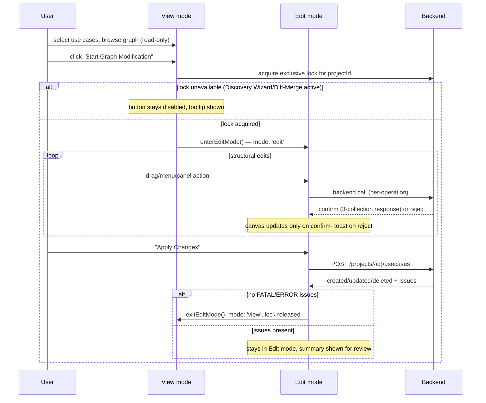
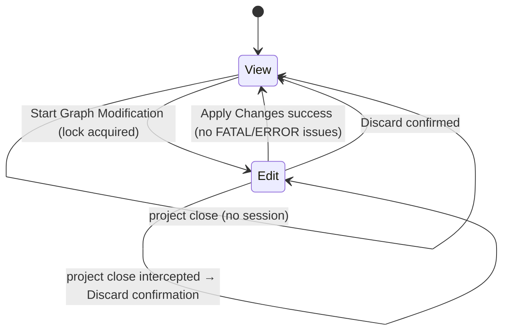

# LLD: Graph Designer — Edit Feature

| | |
| --- | --- |
| **Epic Link** | `<Epic link to related JIRA/epic — TBD>` |
| **Document status** | DRAFT |
| **Document owner** | `<TBD>` |
| **Target release** | `<Milestone — TBD>` |
| **Stakeholders** | Module owner, reviewers, backend API team, other developers impacted (Discovery Wizard, Diff/Merge, Key Configurator) |

Source documents (this LLD synthesizes, and defers to for full detail):
- [Requirements](requirements/graph-designer-edit-requirements.md) — REQ-001 to REQ-072
- [Core Edit Session Design](design/core-edit-session-design.md)
- [Node Operations Design](design/node-operations-design.md)
- [Link and Port Design](design/link-and-port-design.md)
- [KV & Key Configuration Design](design/kv-key-configuration-design.md)
- [Canvas UI Mechanics Design](design/canvas-ui-mechanics-design.md)

---

## 1. Feature Overview and Strategic Fit

Today, the Graph Designer canvas is **read-only**: a user can select use
cases, view the resulting module/subgraph/subsystem graph, and double-click
a module to open a cal/tag tuning tab — but cannot change the graph's
structure from the canvas itself.

This feature adds a **structural editing mode** to the same canvas. From the
user's perspective:

1. The user clicks **"Start Graph Modification"** to enter **Edit mode**.
2. While in Edit mode, the user can drag modules/subgraphs from palettes onto
   the canvas, draw or delete connections, resize port counts, group
   subgraphs into subsystems, configure calibration/tag keys and KV
   selections, and copy/paste parts of the graph — all via context menus, a
   properties panel, and a Key Configurator panel.
3. Every structural change is confirmed by the backend before the canvas
   reflects it (no optimistic UI) — the user always sees a loading state
   while a change is in flight and a toast if it fails.
4. When done, the user clicks **"Apply Changes"** to commit the session (the
   backend re-runs routing/use-case generation and returns a modification
   summary), or **"Discard"** to abandon everything staged this session.

This turns the Graph Designer from a browsing tool into the primary
authoring surface for use-case graphs, replacing (over time) whatever
external/manual process is used today to construct them.

**Out of scope for this pass** (see [§16](#16-not-doing)): undo/redo
(REQ-067), inline quick-actions (REQ-068), the raw/subsystem display-mode
toggle itself (REQ-047 only consumes it), and Discovery Wizard/Diff-Merge as
real features (this pass only adds the exclusive-lock hook they'll plug
into).

---

## 2. Architectural Impacts

No HLD exists yet for this feature area; this is the first structural design
for it. Impacts on existing architecture:

- **New `EditSessionSlice`** composed into the existing
  `GraphDesignerStore` (`packages/react-app/src/features/graph-designer/model/graph-designer-store.ts`),
  alongside `GraphDataSlice`, `KeyConfigSlice`, `VisualizerSlice`, etc. This
  slice owns session bookkeeping only (mode, in-flight flags, provenance/KV
  maps) — it holds **no graph data** of its own; every structural mutation
  still lands in `GraphDataSlice`.
- **New cross-project exclusive-lock map** on the existing cross-cutting
  `shared/store/global-store.ts` (`activeExclusiveModeByProject`), keyed by
  `projectId`, shared by three features: Graph Edit (built here), Discovery
  Wizard (stub today), and Diff/Merge (doesn't exist yet). This is a
  deliberate FSD-compliant decoupling point — Graph Edit does not import
  either of the other two features.
- **New response-reconciliation contract.** Every mutating structural
  endpoint in this feature returns three `ComponentCollectionDto` buckets
  (`added`/`updated`/`deleted`) in one response. A single shared reconciler
  (`applyComponentCollection`, in `core-edit-session-design.md`) merges all
  three into `GraphDataSlice` and re-derives containers/subgraphs — this
  generalizes and extends the existing `loadGraphData` grouping logic rather
  than replacing it.
- **Architectural principle: every backend-confirmed edit in this feature,
  regardless of which panel originated it, must flow back through one
  reconciliation path so `GraphDataSlice`/`EditSessionSlice` — and therefore
  every UI component reading them — reflects the latest backend state.**
  This explicitly includes properties-panel edits (rename, port count,
  container ID) and Key Configurator edits (CKV/TKV, Subsystem Keys), not
  only the canvas/palette/context-menu actions the three-collection
  reconciler was originally scoped to. Concretely:
  - Structural, cascading edits use `applyComponentCollection` as designed.
  - Narrow single-entity edits (rename, `updatePortCount`,
    `assignSubsystemKey`/`unassignSubsystemKey`) update the one affected
    entity's field(s) directly in `GraphDataSlice`/its owning map on
    backend confirmation — no polling, no separate re-fetch needed, but
    also no edit that only updates a component-local or feature-local store
    with no path back to the shared state other components read.
  - **This corrects an earlier gap, now fixed in the design docs
    themselves.** `core-edit-session-design.md`'s Architecture section and
    `kv-key-configuration-design.md`'s CKV/TKV section have both been
    patched to state this principle: CKV/TKV staging still writes through
    the pre-existing `features/key-configurator` stores
    (`calibration-keys-store.ts`, `module-tag-keys-store.ts`,
    `subgraph-config-store.ts`, `subsystem-config-store.ts`), but each
    action's confirmed response must now also land in
    `GraphDataSlice.moduleInstances` (module-scoped, narrow-response
    update, the same treatment as renames/`updatePortCount`) so the canvas
    and any other open panel observe the change too — not sealed inside the
    key-configurator store family alone. Subsystem Keys assignment
    (REQ-071) already satisfies this without any intermediate cache — its
    confirmed response writes straight onto `Subsystem.filteredKeys` in
    `GraphDataSlice` (a real backend field, unlike the frontend-only
    concepts `subgraphProvenanceById`/`kvCasesById` need their own maps
    for) and needed no correction.
- **Reused, not replaced:** `UsecaseVisualizer`'s existing producer/consumer
  callback boundary (`onNodeDropped`/`onEdgesDeleted`/`onEdgeConnected`),
  the existing properties panel widget (`widgets/properties-panel/`, gains a
  `readOnly` prop), the existing Key Configurator panel
  (`features/key-configurator/`, gains real backend staging — see
  [§6.4](#64-ckvtkv-and-subsystem-keys-staging)), the existing
  `ConfigFileManager`/`useUserPreferences` preferences mechanism (for the
  cross-DSP display-mode toggle), and the existing FlexLayout tab-lifecycle
  model (the exclusive lock is tied to component mount lifetime, not tab
  focus).
- **Prerequisite fix, not new architecture:** the frontend `SubgraphDto`
  type (`entities/subgraph-definitions/model/subgraph-definition.dto.ts`) is
  stale against the real backend schema and must be corrected before any of
  this feature's subgraph-provenance/KV work can build on it — see
  [§9](#9-open-questions).

---

## 3. Assumptions

- The raw/subsystem display-mode toggle ("subsystem mode" vs. "raw mode")
  is built **separately**, before or in parallel with this feature, and
  exposes a `useSubsystemDisplayMode(): 'raw' | 'subsystem'` hook (or
  equivalent). This feature only consumes it (REQ-047); if it hasn't landed
  by ship time, the consuming hook is stubbed to always return
  `'subsystem'` so the subgraph palette is never spuriously disabled.
- Discovery Wizard and Diff/Merge, as real mounted features with their own
  exclusive-lock acquisition, are built separately. Until then, this
  feature's lock enforcement point for Discovery Wizard is the existing
  `sideNavItems` menu entry (currently a no-op); Diff/Merge has no
  enforcement point at all yet since it has no code.
- The backend team will deliver the still-open endpoints listed in
  [§9](#9-open-questions) (module/container/subgraph/subsystem delete,
  `moveToSubsystem`/`removeFromSubsystem`/`expandSubsystem`,
  `updatePortCount`, `offloadModuleToDsp`, CKV/TKV staging, Subsystem Keys
  staging, `pasteSubgraphFromSnapshot`/batch-create, a single-subgraph SGKV
  fetch) in the same three-collection response shape used by every
  confirmed endpoint today.
- Position/layout overrides (REQ-059) persist through a mechanism TBD with
  the backend team; this feature only guarantees the existing client-side
  `positionOverrides`/`parentSizes` behavior is unaffected by Edit mode.
- Users interact with this feature from the desktop Electron app (existing
  target platform for this tool) — no new platform assumptions.

---

## 4. Requirements

Full itemized requirements: [requirements/graph-designer-edit-requirements.md](requirements/graph-designer-edit-requirements.md)
(REQ-001–072). Condensed by section:

| # | Section | Summary | Importance | Type | Notes |
| - | --- | --- | --- | --- | --- |
| 1 | Canvas modes (REQ-001–003) | View/Edit mode toggle; View mode is read-only except double-click-to-tune and read-only properties panel; Edit mode exposes palettes/menus/panels | Must have | Functional | Foundation for every other section |
| 2 | Module operations (REQ-004–011) | Add module (to container / empty space / subgraph-no-container), delete (cascades to links), rename, invalid-drop rejection | Must have | Functional | `addSpfModule` confirmed endpoint |
| 3 | Subgraph operations (REQ-012–019) | Palette placement (session-local), pair-link auto-render + exclude, duplicate-placement guard, provenance-based delete, rename, invalid-drop rejection | Must have | Functional | 3 provenances drive delete behavior |
| 4 | Container operations (REQ-020–023) | Delete (cascades), no rename, implicit creation only, edit container ID | Must have | Functional | Containers are derived, not first-class |
| 5 | Link operations (REQ-024–030) | Right-click-to-connect, Escape-cancel, cross-subsystem bridging, control-port limit warning, server as final arbiter, delete | Must have | Functional | No client-side `maxConnections` gate |
| 6 | Subsystem operations (REQ-031a–032) | Move into / remove from subsystem, delete (cascades), rename, expand (promotes contents) | Must have | Functional | Move-out never deletes the subsystem |
| 7 | Port operations (REQ-033–038) | Data/control port count inc/dec on modules & subsystems, backend-arbitrated decrease, port context menu | Must have | Functional | `updatePortCount` — endpoint TBD |
| 8 | KV assignment — existing subgraph (REQ-039–041) | Checklist of supported KV cases, custom KV add, UI-only until Apply | Must have | Functional | Case-level, not per-KV-pair |
| 9 | KV assignment — new subgraph (REQ-042–043) | Free-form add/remove, UI-only until Apply | Must have | Functional | No backend SGKV list to seed from |
| 10 | Apply Changes (REQ-044–046) | Disabled while mutating/in-flight; sends use cases + excluded links + KV selections; summary view on success/failure | Must have | Functional | `POST /projects/{id}/usecases` confirmed |
| 11 | Palettes (REQ-047) | Subgraph palette disabled in subsystem mode | Must have | Functional | Depends on out-of-scope toggle |
| 12 | Context menus (REQ-048–050) | Node/edge Delete dispatch by type; Delete key parity with menu | Must have | Functional | Shared `deleteSelection` dispatcher |
| 13 | Properties panel (REQ-051) | Editable fields per node type incl. port-count controls | Must have | Functional | Reuses existing panel widget |
| 14 | Key Configurator panel (REQ-052–053, 071) | Content dispatch by node type; CKV/TKV staged immediately; Subsystem Keys staged immediately | Must have | Functional | CKV/TKV needs real implementation, not just wiring |
| 15 | MDF use cases (REQ-054–055, 072) | No KV UI for MDF subgraphs; expanded/virtual bridge display modes; Offload to other DSP | Must have | Functional | MDF is UI-computed, not backend field |
| 16 | Subgraph proxy nodes (REQ-056–057) | No connections to/from proxy nodes; rename proxy (renames underlying subgraph) | Must have | Functional | Distinct from palette drop rejection |
| 17 | Positioning (REQ-058–059) | Exact drop coordinates, no auto-layout snap-back; drag-to-reposition in both modes, not staged as an edit | Must have | Functional | Backend persistence TBD |
| 18 | Edit mode lifecycle (REQ-060–062) | Exclusive lock vs. Discovery Wizard/Diff-Merge, per project; Discard with confirmation, incl. project-close | Must have | Functional | `POST /projects/{id}/discard-changes` confirmed |
| 19 | Canvas interaction (REQ-063, 069–070) | Multi-select in both modes with cascade-aware batch delete; copy/paste incl. cross-hierarchy-level | Must have | Functional | Batch-create endpoint for paste still open |
| 20 | Visual feedback (REQ-064–065) | Port coloring (black/grey/white) by selection-scoped connection visibility; loading spinners on every backend call | Must have | Functional / Performance | `totalLinksAtPort` must be added to the `Port` type |
| 21 | Enhancements (REQ-066–068) | `changeId` per staged edit (satisfied already); undo/redo and quick actions deferred | Deferred | Functional | Explicitly out of scope this pass |

---

## 5. User Interaction and Design

No visual mockups exist yet for this feature; the interaction model below is
derived entirely from the requirements/design docs' behavioral
specifications. (If Figma/mockups are produced separately, link them here.)

### 5.1 Mode switch

- **View mode** (default): canvas shows the last-selected use cases (or the
  first available, on first open). Only interactions: double-click a module
  → opens cal/tag tuning tab; click a module/subgraph/container/link → opens
  the properties panel **read-only**. "Start Graph Modification" button is
  visible, enabled unless another exclusive-mode session (Discovery
  Wizard/Diff-Merge) is active for this project.
- **Edit mode**: entered via "Start Graph Modification". Module palette,
  subgraph palette, context menus, inline connection creation, editable
  properties panel, and Key Configurator panel all become active. "Apply
  Changes" and "Discard" buttons appear.

### 5.2 Structural editing surfaces

| Surface | Interaction |
| --- | --- |
| Module palette | Drag a module definition onto a container, subgraph (outside a container), or empty canvas space |
| Subgraph palette | Drag an existing subgraph definition onto empty canvas space only; disabled (greyed, tooltipped) for subgraphs already placed, or entirely in subsystem mode |
| Context menu (node) | Delete; "Move to Subsystem"; "Remove from Subsystem" (only if parent is a subsystem); "Offload to other DSP" (modules only) |
| Context menu (edge) | Delete, or "Exclude Link" for pair-derived edges |
| Delete key | Same dispatch as context-menu Delete, for the current selection (single or multi) |
| Right-click port | "Start connection" / "End connection" (two-click connection flow, not drag) |
| Escape | Cancels an in-progress connection |
| Properties panel | Rename, port count +/-, container ID edit — depending on node type |
| Key Configurator panel | KV checklist / free-form add (subgraphs), CKV/TKV entries (modules), Keys assign/unassign (subsystems) |
| Multi-select | Shift+click or rubber-band drag; batch Delete respects cascade ordering |
| Copy/Paste | Ctrl+C/Ctrl+V or context-menu Paste; pastes at cursor/viewport-center/right-click point |

### 5.3 Feedback

- **Loading**: a full-canvas overlay (wait cursor + pointer-event capture)
  is the single enforcement point while any one mutation is in flight
  (`isMutating`); a lightweight per-entity spinner is a cosmetic-only
  addition on top.
- **Errors**: toast on failure for nearly every operation, leaving the
  canvas untouched. Exception: Apply Changes success/failure are both shown
  in a modal **modification summary view**, not a toast.
- **Port coloring**: black (fully visible), grey (partially visible), white
  (no connections) — computed live from selection-scoped connection counts
  vs. total backend connection counts.

### 5.4 End-to-end flow



---

## 6. Component Design

### 6.1 Front-end store composition

```typescript
export type GraphDesignerStore = UsecaseSelectionSlice &
  GraphDataSlice &
  VisualizerSlice &
  SubsystemSlice &
  KeyConfigSlice &
  ValidationResultSlice &
  ModuleListSlice &
  SubgraphListSlice &
  PropertiesViewSlice &
  PanelLayoutSlice &
  PanelTabRegistrySlice &
  SearchSlice &
  EditSessionSlice; // new
```

`EditSessionSlice` (new) holds session bookkeeping only:

```typescript
interface EditSessionSlice {
  mode: 'view' | 'edit';
  enterEditMode: () => boolean;   // false if exclusive lock unavailable
  exitEditMode: () => void;

  isMutating: boolean;            // single serial mutation lock, REQ-065
  beginMutation: () => void;
  endMutation: () => void;

  usesSubsystemVariant: boolean;  // fixed for the session, set in enterEditMode()

  applyStatus: 'idle' | 'in-flight';
  modificationSummary: CreateUsecasesResponseDto | null;
  dismissSummary: () => void;
  applyChanges: () => Promise<void>;

  discardConfirmationOpen: boolean;
  requestDiscard: () => void;
  confirmDiscard: () => Promise<void>;
  cancelDiscard: () => void;

  // Session-local maps — cleared and/or reseeded on every '→ view' transition
  subgraphProvenanceById: Map<string, SubgraphProvenance>;
  kvCasesById: Map<string, KvCase[]>;
  pairLinksById: Map<string, SubgraphPairDto>;
  excludedLinks: Connection[];
}
```

**Subsystem Keys assignment (REQ-071) deliberately has no map here.**
Unlike `subgraphProvenanceById`/`kvCasesById` — frontend-only concepts the
backend has no field for, which is exactly why they need their own
session-local storage — `Subsystem.filteredKeys` is a real backend field
already present on every `SubsystemDto`. Assign/unassign's confirmed
response is written directly onto `graphData.subsystems[subsystemId].filteredKeys`
in `GraphDataSlice`, the same narrow-response treatment as renames/
`updatePortCount`, and the panel reads that same field for rendering — no
intermediate cache, nothing to seed at Edit-mode entry, nothing to clear on
the `'view'` transition. See
[kv-key-configuration-design.md's Keys Assignment section](design/kv-key-configuration-design.md#keys-assignment--subsystems)
for the full reasoning, including the one open dependency this relies on
([§9](#9-open-questions)): every subsystem-bearing mutation response must
keep `filteredKeys` accurate, not stale or omitted.

`KvCase` (referenced above) is a single selectable KV *case* — one whole
Key+Value combination a subgraph supports as a unit, not a flat individual
Key=Value pair (`kv-key-configuration-design.md`'s KV Assignment section):

```typescript
interface KvCase {
  id: string; // this case's own SGKV systemId if supported; a client-generated placeholder if custom (never sent to the backend as a systemId)
  keyValuePairs: KeyValueInfo[]; // mirrors KeyValuePairsInfo.keyValueCollection — {keyInfo, valueInfo}[]
  source: 'supported' | 'custom'; // from SGKV vs. user-added (REQ-041/043)
  selected: boolean;
}
```

**Design principle — no optimistic mutation.** Every action: call backend →
merge response into `GraphDataSlice` only on success → toast + no change on
failure. `EditSessionSlice` never holds graph data itself.

**This "merge on success" rule applies uniformly to every backend-confirmed
edit in the feature, not only canvas/palette/context-menu actions.**
Properties-panel edits (rename, port count, container ID) and Key
Configurator edits (CKV/TKV, Subsystem Keys — [§6.4](#64-feature-area-component-map))
are held to the same standard: their confirmed response must land back in
`GraphDataSlice`/the relevant `EditSessionSlice` map, not only in a
panel-local or feature-local store, so that any other component reading
shared state (canvas, a different open panel) sees the change too. See
[§2](#2-architectural-impacts) — `core-edit-session-design.md` and
`kv-key-configuration-design.md` have both been patched to state this
principle explicitly for CKV/TKV/Subsystem Keys.

Rejected alternatives (see `core-edit-session-design.md` for full rationale):
a command-pattern undo buffer (unnecessary now that undo/redo is deferred),
and a fully separate sibling store (would only add cross-store sync
plumbing).

### 6.2 Exclusive locking (cross-project)

Lives in `shared/store/global-store.ts` (cross-cutting, not owned by any one
feature, since FSD forbids Graph Edit from importing Discovery
Wizard/Diff-Merge directly):

```typescript
type ExclusiveGraphMode = 'none' | 'graph-edit' | 'discovery-wizard' | 'diff-merge';

interface GlobalStore {
  activeExclusiveModeByProject: Record<string, ExclusiveGraphMode>;
  setActiveExclusiveMode: (projectId: string, mode: ExclusiveGraphMode) => boolean;
  releaseExclusiveMode: (projectId: string, mode: ExclusiveGraphMode) => void;
}
```

- Keyed by `projectId` (this app supports multiple simultaneously open
  projects) — a lock on Project A must never block Project B.
- Each of the three modes is single-instance-per-project, **including
  against itself** — a second Graph Designer tab on the same project cannot
  acquire a second `'graph-edit'` lock.
- Lock is tied to **component lifetime**, not tab focus — FlexLayout keeps
  inactive tabs mounted (hidden via CSS), so switching focus away does not
  release the lock; only unmount (tab close) does.
- Discovery Wizard has no mount lifecycle yet (stub menu entry) — its
  enforcement point for this pass is the menu item's own
  `onClick`/`disabled`, reading the same selector. Diff/Merge doesn't exist
  in code at all.

### 6.3 Response reconciliation (shared across all node/link/subsystem docs)

**Real, confirmed backend contract:** every mutating structural endpoint
returns three separate `ComponentCollectionDto` buckets in one response —
not a single collection with per-entity change tags:

```typescript
interface ComponentCollectionDto {
  spfModules: SpfModuleDto[];
  dataLinks: DataLinkDto[];
  controlLinks: ControlLinkDto[];
  subsystems?: SubsystemDto[]; // only on the -with-subsystems endpoint variant
}
// { addedComponentCollectionDto, updatedComponentCollectionDto, deletedComponentCollectionDto }
```

A single shared reconciler (`applyComponentCollection`) merges all three
into `GraphDataSlice`, then:
1. Re-derives containers/subgraphs by grouping surviving modules
   (`recomputeContainersAndSubgraphs`) — containers/subgraphs are **never**
   first-class entities in the response; they disappear automatically when
   their last module does.
2. Stamps `provenance`/`kvCasesById` (from session-local maps, since these
   are frontend-only fields with no backend counterpart) onto each derived
   `Subgraph`, and prunes both maps for any subgraph that no longer derives.
3. Prunes `pairLinksById`/`excludedLinks` for any link ID present in the
   deleted bucket.
4. Adjusts `totalLinksAtPort` on surviving endpoints for every added/deleted
   link (`adjustSurvivingPortCounts`) — the backend response never includes
   the surviving sibling module's updated port count directly.

Two narrow-response endpoint classes are **excluded** from this mechanism
(no collection to reconcile): (a) actions that mutate exactly one
already-known entity's own field (renames, `updatePortCount`, CKV/TKV,
Subsystem Keys assign/unassign); (b) read-only placement queries
(`getSubgraphContents`, `getSubgraphPairs`) which merge directly into
`GraphDataSlice` via their own dedicated logic since they're `NONE`-tagged
snapshots, not deltas.

### 6.4 Feature-area component map

| Design doc | Owns | Key state | Key backend calls |
| --- | --- | --- | --- |
| Core Edit Session | Mode switch, exclusive lock, `isMutating`, Apply, Discard | `EditSessionSlice` core fields | `createUsecases`, `discardChanges` |
| Node Operations | Module/container/subgraph/subsystem CRUD, provenance | `subgraphProvenanceById` | `addSpfModule`, `deleteModuleInstance`/`deleteContainer`/`deleteSubgraph`/`deleteSubsystem`, `moveToSubsystem`/`removeFromSubsystem`/`expandSubsystem`, `getSubgraphContents`/`getSubgraphPairs` |
| Link & Port | Connections, port counts, DSP offload | Visualizer-internal `connectionInProgress` | `createDataLink`/`createControlLink`(`-with-subsystems`), `deleteDataLink`/`deleteControlLink`, `updatePortCount`, `offloadModuleToDsp` |
| KV & Key Configuration | Key Configurator panel content | `kvCasesById` | CKV/TKV staging (TBD), `assignSubsystemKey`/`unassignSubsystemKey` (TBD, writes directly to `Subsystem.filteredKeys`) |
| Canvas UI Mechanics | DnD validation, palettes, context menus, properties panel, positioning, multi-select, port coloring, copy/paste | `Selectable`/`ClipboardBuffer` | `pasteSubgraphFromSnapshot` (TBD) |

**CKV/TKV real implementation required, not just wiring.** The existing Key
Configurator panel (`features/key-configurator/`) has a batch-save stub
(`saveToBackend()` across all 4 config stores always resolves `false`, never
implemented). REQ-053 requires each CKV/TKV add/edit/remove to call the
backend **immediately** — this is new implementation work replacing the
existing click-to-local-state-then-batch-save-later flow entirely, not a
reuse of already-working code.

**Reconciliation into `GraphDataSlice` is now part of the CKV/TKV design,
not an implementation-time gap.** `calibration-keys-store.ts`/
`module-tag-keys-store.ts`/`subgraph-config-store.ts`/
`subsystem-config-store.ts` (the four stores behind the Key Configurator
panel) remain independent of `GraphDesignerStore` as the panel's own
rendering source, but once their `saveToBackend()` stubs are replaced with
real immediate-stage calls (above), each action's success path must also
write the confirmed value onto the affected module's own entry in
`GraphDataSlice.moduleInstances` — a narrow, module-scoped field update, the
same treatment renames/`updatePortCount` already use, not a
`ComponentCollectionDto` reconciliation. Subsystem Keys assignment
(REQ-071) already does the equivalent, and more directly — its confirmed
response writes straight onto `Subsystem.filteredKeys` with no intermediate
`EditSessionSlice` map at all, since `filteredKeys` is a real backend field
with no seed-from-nothing problem to solve (see
[§6.1](#61-front-end-store-composition)). See
`kv-key-configuration-design.md`'s CKV/TKV and Keys Assignment sections for
the patched requirements.

### 6.5 UML — session/mode state machine



---

## 7. API Design

All endpoints below are **existing/confirmed** unless marked `TBD`. See
[§9](#9-open-questions) for the full open-item list.

### 7.1 Confirmed endpoints

| Endpoint | Method | Request | Response |
| --- | --- | --- | --- |
| `/projects/{projectId}/spf-modules` | POST | `CreateSpfModuleRequest {moduleSystemId, procSystemId, parentId?, subgraphSystemId?, containerSystemId?}` | `SpfModuleDto` |
| `/subgraphs/{id}/components` | GET | — | `ComponentCollectionDto` (all `changeType: 'NONE'`) |
| `/subgraphs/{id}/subgraph-pairs` | GET | — | `SubgraphPairDto[]` (field shape still TBD — see §9) |
| `/data-links`, `/data-links-with-subsystems` | POST | `EdgeConnectPayload`-derived | 3-collection response |
| `/control-links`, `/control-links-with-subsystems` | POST | " | 3-collection response |
| `/data-links/{id}`, `/control-links/{id}` | DELETE | — | The deleted link's own DTO |
| `/projects/{projectId}/usecases` | POST | `CreateUsecasesRequestDto` (below) | `CreateUsecasesResponseDto` (below) |
| `/projects/{projectId}/discard-changes` | POST | `DiscardChangesRequestDto {changeIds?}` | `DiscardChangesResponseDto` |
| `getAllSubgraphs(projectId)` | GET | — | `SubgraphDto[]` (incl. `SGKV`) |
| `getAllKeyDefinitions` | GET | — | Key/Value catalog (existing, reused for KV/CKV/TKV/Keys pickers) |

### 7.2 Apply Changes contract

```typescript
interface SubgraphKvSelectionDto {
  systemId: string;
  valueSystemIds: string[][]; // one inner array per selected KV case
}

interface CreateUsecasesRequestDto {
  selectedUsecaseSystemIds: string[];
  activeSubgraphs: SubgraphKvSelectionDto[]; // one entry per subgraph on canvas, never omitted
  excludedDataLinkSystemIds?: string[];
  excludedControlLinkSystemIds?: string[];
}

interface CreateUsecasesResponseDto {
  created: UsecaseIdentifierDto[];
  updated: UsecaseIdentifierDto[];
  deleted: UsecaseIdentifierDto[];
  issues: ApiIssueItem[]; // {code, message, severity: 'FATAL'|'ERROR'|'WARNING', category?, impactedEntity?, impactedUsecases?}
}
```

Always `200`; "failure" = `issues` containing `FATAL`/`ERROR` severity.
`WARNING` is informational only.

### 7.3 Discard contract

```typescript
interface DiscardChangesRequestDto {
  changeIds?: string[]; // omitted/empty = discard everything
}

interface DiscardChangesResponseDto {
  success: boolean;
  processedChangeIds: string[];
  failedChangeIds: string[];
  message: string;
  cascadedChangeIds: string[];
}
```

Carries **no graph payload** — on success, the client's own View-mode load
effect re-fetches the current use-case selection fresh.

### 7.4 Cascading delete/move/expand response shape (shared pattern)

Every cascading structural endpoint (confirmed or TBD) returns the same
envelope:

```typescript
Promise<{
  addedComponentCollectionDto: ComponentCollectionDto;
  updatedComponentCollectionDto: ComponentCollectionDto;
  deletedComponentCollectionDto: ComponentCollectionDto;
}>
```

| Action | Added | Updated | Deleted |
| --- | --- | --- | --- |
| `deleteModuleInstance`/`deleteContainer`/`deleteSubgraph`/`deleteSubsystem` | — | — | Every cascaded module/link (+ `subsystems` for subsystem delete) |
| `moveToSubsystem` (new) | New subsystem | Moved node's modules | — |
| `moveToSubsystem` (existing) | — | Moved node's modules | — |
| `removeFromSubsystem` | — | Moved node's modules | — (subsystem never deleted) |
| `expandSubsystem` | — | Every promoted module | The subsystem + severed external links |
| `offloadModuleToDsp` (first offload) | New IPC TX/RX | Offloaded module + rerouted links | — |
| `offloadModuleToDsp` (re-offload) | — | Offloaded module, existing IPC pair, rerouted links | — |
| `pasteSubgraphFromSnapshot` | Every pasted module/link | — | — |

### 7.5 Non-cascading narrow-response endpoints

```typescript
updatePortCount(nodeId, portType, delta): Promise<{updatedPorts: Port[]}> // complete list for that portType, not a delta — TBD endpoint
renameModuleInstance/renameSubgraph/renameSubsystem/renameSubgraphProxy(id, newName): Promise<void>
updateContainerId(containerId, newId): Promise<{...3-collection...}> // modules only, no ContainerDto
assignSubsystemKey/unassignSubsystemKey(subsystemId, keyId): Promise<{assignedKeyIds: string[]}> // TBD endpoint
```

---

## 8. Database Design

**Not applicable.** This feature has no direct database access — the
frontend communicates exclusively through the backend's REST API
(`addSpfModule`, `createUsecases`, `discardChanges`, etc.), and all schema
concerns (tables, ACDB storage, migrations) belong to the backend team's own
service, not this LLD's scope. The only "storage" this feature introduces
is:

- **Frontend session state** (`EditSessionSlice`'s maps, all in-memory,
  cleared on every `'view'` transition — no persistence).
- **One new persisted user preference** — `VisualizationPreferences.crossDspConnectionView: 'expanded' | 'virtual'`
  (REQ-055), via the existing `ConfigFileManager`/`config.json`
  mechanism (Electron `userData` directory), not a database.

---

## 9. Open Questions

*(TBD with backend team, unless noted)*

- **`SubgraphPairDto` field shape** (REQ-013) — the endpoint path is
  confirmed; the DTO is currently an empty placeholder in the API spec. This
  LLD's working assumption (`id`/`sourceSubgraphId`/`targetSubgraphId`/
  `fromModuleId`/`fromPortId`/`toModuleId`/`toPortId`/`connectionType`) is
  unconfirmed.
- **Delete/move/expand endpoint contracts** — `deleteModuleInstance`,
  `deleteContainer`, `deleteSubgraph`, `deleteSubsystem`, `updateContainerId`,
  `moveToSubsystem`, `removeFromSubsystem`, `expandSubsystem` all lack
  confirmed paths/DTOs today (response *shape* is fixed per §7.4, but no
  endpoint exists to call).
- **`updatePortCount` contract** (REQ-033–037) — no endpoint exists yet.
- **`offloadModuleToDsp` contract** (REQ-072) — endpoint path and the
  "available target DSPs" list source are both undecided.
- **CKV/TKV staging endpoints** (REQ-053) — the existing panel's
  `saveToBackend()` is an unimplemented stub across all four config stores;
  real per-action endpoints don't exist yet.
- **Subsystem Keys staging endpoint** (REQ-071) — no endpoint accepts this
  payload at all today; `SubsystemDto.filteredKeys` is read-only.
- **Whether every subsystem-bearing mutation response reliably carries an
  accurate `filteredKeys`** — unconfirmed. Keys assignment
  ([§6.1](#61-front-end-store-composition)) reads/writes `filteredKeys`
  directly on `GraphDataSlice`'s `Subsystem` node with no intermediate
  cache, which is only safe if every endpoint that can return a
  `SubsystemDto` in any bucket (`moveToSubsystem`, a `-with-subsystems`
  link create, a future subsystem port-count change) keeps that field
  current. If one doesn't, its `upsertSubsystem` call would silently
  overwrite a just-confirmed Keys assignment with a stale value.
- **Resolved: `discardChanges` (omitted `changeIds`) does revert REQ-053/071's
  immediately-staged CKV/TKV and Keys-assignment changes** — confirmed with
  the backend team. Immediate-staging's benefit is that the panel/canvas
  reflect the change right away, not that it survives a Discard.
- **Single-subgraph-by-ID SGKV fetch** (REQ-012's placement flow) — doesn't
  exist; `getAllSubgraphs(projectId)` returns the whole project, wrong shape
  for a per-drop lookup.
- **Batch/atomic multi-entity creation for paste** (REQ-069/070) — no
  endpoint guarantees all-or-nothing creation for a multi-entity paste;
  sequential single-entity calls risk silent partial-paste failure.
- **Position/layout-override persistence mechanism** (REQ-059) — explicitly
  unspecified; no candidate endpoint proposed by design.
- **`totalLinksAtPort` correction for DSP-offload-rerouted links** — the
  offload response's `updatedComponentCollectionDto` link entries carry only
  the *new* endpoint, not the *old* one being vacated; a port on the
  original DSP keeps a stale (too-high) count until this is resolved (either
  a backend contract addition or a client-side before/after diff).
- **Orphaned backend state when a `palette-placed` subgraph is removed
  (REQ-016a) after already staging edits onto it.** Nothing prevents this
  sequence: place subgraph X from the palette (session-local, REQ-012) → add
  a module into one of X's containers (REQ-004/005) or draw a link to/from X
  (REQ-024), both staged to the backend immediately → then delete X via the
  context menu, which per REQ-016a/REQ-048 is a UI-cache-only removal with
  **no backend call**, since X's provenance is `palette-placed`. The module
  and link were already committed server-side before the delete. Apply's
  `activeSubgraphs` simply omits X once it's off canvas, but nothing in the
  design targets the already-staged module/link for deletion — they are
  neither in the Apply payload nor the target of any delete call. Needs a
  decision: either `removeFromUiCacheOnly` must detect this case and fall
  back to a real `deleteSubgraph` call (i.e., a subgraph stops being
  eligible for cache-only removal the moment anything is staged onto it), or
  the backend needs to be told separately. Flagged here, not resolved by any
  of the five design docs.
- **Direct subsystem-port-to-subsystem-port connections** — REQ-026/027
  cover module↔module and module↔subsystem-port connections, and the backend
  auto-bridging that results when both modules sit inside different
  subsystems. Neither the requirements nor any design doc addresses a
  connection drawn directly between two subsystems' own ports, with no
  module endpoint on either side. Unclear whether the backend supports this
  case at all; if it does, the UI has no designed path for it.
- **Whether `moveToSubsystem` rejects a descendant-nesting cycle.** The
  client-side guard added to REQ-031a only excludes the right-clicked
  subsystem from its own destination picker (direct self-nesting); moving a
  node into one of its own descendant subsystems is a narrower case left to
  the backend to reject, unconfirmed with the backend team.
- **Whether `updatePortCount`'s decrease can cascade to sever the port's
  existing links.** The design assumes the backend either allows the
  decrease outright or rejects it — if it instead allows the decrease and
  severs links as a side effect (the way module/container delete cascades),
  the current narrow `{updatedPorts}` response shape has no field to carry
  those severed links, and the client-side reconciliation would need
  revisiting.
- **Connection-in-progress vs. concurrent mutation** — starting a connection
  from a port and deleting that port's owning module (or an ancestor)
  before completing the connection is not designed around; expected to
  self-resolve via the standard rejection/no-valid-target path (REQ-029),
  but flagged as a known gap.
- **Frontend `SubgraphDto` staleness** — implementation prerequisite, not a
  backend question: `entities/subgraph-definitions/model/subgraph-definition.dto.ts`
  only declares `description`/`name`/`subgraphId`/`subgraphType` against a
  real schema of `changeInfo`/`systemId`/`id`/`name`/`relatedEndPointLinks`/
  `scenarioType`/`deviceType`/`subGraphSharedType`/`SGKV`. Must be fixed
  (type + `subgraph-list-slice.ts`'s `toSubgraphDefinition` mapper) before
  any of REQ-039's KV work can build on it.

---

## 10. Interfaces, Services — UML Diagrams

The five design docs contain the full set of sequence diagrams for this
feature; summarized here by flow (see each linked doc for the literal
diagram):

- **Mode entry / exclusive lock** — [core-edit-session-design.md § Mode State & Exclusive Locking](design/core-edit-session-design.md#mode-state--exclusive-locking)
- **Apply Changes** — [core-edit-session-design.md § Apply Changes](design/core-edit-session-design.md#apply-changes)
- **Discard / project-close interception** — [core-edit-session-design.md § Discard / Rollback](design/core-edit-session-design.md#discard--rollback)
- **Module drop on empty canvas (auto-create chain)** — [node-operations-design.md § Sequence: Module Drop on Empty Canvas](design/node-operations-design.md#sequence-module-drop-on-empty-canvas)
- **Module delete cascade** — [node-operations-design.md § Sequence: Delete Module](design/node-operations-design.md#sequence-delete-module-cascading-to-containersubgraph)
- **Exclude Link / reversal** — [node-operations-design.md § Subgraph Operations, REQ-014](design/node-operations-design.md#subgraph-operations)
- **Connection creation (right-click flow)** — [link-and-port-design.md § Connection Creation Flow](design/link-and-port-design.md#connection-creation-flow)
- **Offload to other DSP** — [link-and-port-design.md § Offload to Other DSP](design/link-and-port-design.md#offload-to-other-dsp)
- **Copy/paste** — [canvas-ui-mechanics-design.md § Copy/Paste](design/canvas-ui-mechanics-design.md#copypaste)

Class-level shapes of the entities this feature depends on
(`ComponentCollectionDto`, `SpfModuleDto`, `Connection`, `KvCase`,
`Selectable`, `ClipboardBuffer`, etc.) are inlined in [§6](#6-component-design)
and [§7](#7-api-design) above and are not restated as separate UML class
diagrams, since each is a plain TypeScript interface already shown in full.

---

## 11. Error Handling

**Uniform pattern across the entire feature:** call backend → merge on
success → **toast + zero canvas change** on failure. No exceptions to this
for any structural mutation (module/container/subgraph/subsystem/link
CRUD, port count, DSP offload).

**Two deliberate departures — both scoped to a completed response, not to
a transport failure:**

1. **Apply Changes** — when the request completes, it always returns `200`;
   "failure" is `issues` entries with `severity: 'FATAL'|'ERROR'` inside the
   response body, not an HTTP error. Both that success and that
   issues-based failure render through the same modal **modification
   summary view**, never a toast. `WARNING`-severity issues are
   informational, not failures. **If the request itself never completes**
   (network error, timeout, non-2xx, thrown exception), this departure does
   not apply — there is no response body to summarize, so it falls back to
   the feature's default toast + no-change pattern: error toast, `mode`
   stays `'edit'`, staged changes intact, summary view never opens. See
   `core-edit-session-design.md`'s Apply Changes section.
2. **Discard failure** (`success: false`), **and Discard transport
   failure alike** — both shown as an error toast (consistent with the
   general pattern); `success: false` populates the toast from
   `message`/`failedChangeIds`, a transport failure populates it with a
   generic error. Either way the session stays in Edit mode with staged
   changes intact, no forced exit. See `core-edit-session-design.md`'s
   Discard / Rollback section.

**Programming-error vs. user-facing failure distinction:**
`withMutationLock` throws (does not toast) when called with `mode !== 'edit'`
— this signals a bug in the caller (every legitimate call site is already
UI-gated to Edit mode only), not a user-facing failure. The one exception,
`deleteSelection`/`pasteSelection` (reachable via a global `keydown`
listener with no render-layer gate), checks `mode` itself *before* calling
`withMutationLock` and no-ops silently — a Delete/Ctrl+V keypress in View
mode is an expected, normal user action, not a bug.

**Partial-failure handling:**
- `getSubgraphContents`/`getSubgraphPairs` (subgraph placement) are
  independent failure domains — a pairs-fetch failure only costs missing
  auto-rendered connections, the subgraph itself still lands.
- The use-case-selection-time `loadGraphData`/`getAllSubgraphs` pair is
  treated as one failure unit — either fails the whole load, since an
  unseeded `kvCasesById` would silently break the Key Configurator with no
  visible cause.
- A half-deleted multi-hop bridge connection (one hop of REQ-027's
  module→A→B→module deleted independently) is a valid mid-session state,
  not detected client-side — validation is deferred entirely to Apply time,
  surfacing as `issues` if the backend rejects it.

**Control-port `maxConnections` warning** is the one **non-blocking**
signal in the feature — shown only *after* the backend confirms a control
link was created and its target port's on-canvas count now exceeds
`maxConnections`; the connection is never undone or blocked.

---

## 12. Security Considerations

- **Authentication/authorization**: unchanged from the rest of the app —
  every backend call in this feature (module/link/subsystem CRUD, Apply,
  Discard) rides the existing project-scoped session/auth already enforced
  by the API layer; this feature introduces no new auth surface.
- **No new externally-reachable input surface.** All user input
  (module/subgraph/KV/key selections, positions, names) is scoped to a
  single project the user already has access to and is validated
  server-side as the final arbiter (REQ-029, REQ-035) — the client never
  trusts its own validation as authoritative.
- **Cross-project isolation.** The exclusive-lock map is explicitly keyed by
  `projectId` specifically to prevent one project's edit session from
  affecting another open project's state — this is as much a data-integrity
  boundary as a UX one.
- **Electron preferences file** (`config.json`, for the
  `crossDspConnectionView` display preference) is local-machine,
  per-project, non-sensitive UI state — no new secrets or credentials are
  introduced.
- **No client-side trust of cascade extent.** The frontend never predicts
  which entities a delete/expand will affect (e.g. "is this the last module
  in its container") — it always waits for and reflects the backend's own
  authoritative response, avoiding a class of race/staleness bugs that
  could otherwise be exploited by a second concurrent session.

---

## 13. Performance/Scalability Considerations

- **Strict serialization of mutations (`isMutating`).** Only one mutating
  operation may be in flight per edit session at any time. This was chosen
  over a per-entity `pendingEntityIds` set specifically to eliminate a race
  class: cascading deletes affect entities the client doesn't yet know the
  IDs of, so per-entity locking cannot, by construction, block interaction
  with them. The accepted cost is that independent edits (e.g. renaming
  module A while deleting module B) no longer run concurrently — deliberate
  tradeoff, not an oversight.
- **Batch delete concurrency is scoped, not unlimited.** `deleteSelection`'s
  internal `Promise.all` over multiple cascade roots is one mutation from
  `isMutating`'s perspective — concurrency *within* one user action, not a
  violation of the one-mutation-at-a-time rule.
- **Single-pass reconciliation.** Every cascading response — however large
  its blast radius — is merged in exactly one `applyComponentCollection`
  pass (module upserts, container/subgraph re-derivation, provenance/KV
  pruning, port-count adjustment), avoiding N re-renders for an N-entity
  cascade.
- **No polling, no manual event wiring for the exclusive lock** — implemented
  as a Zustand selector, so any subscribed component re-renders exactly once
  when the relevant project's lock state changes.
- **MDF-ness and port coloring are computed, not cached.** Both are cheap,
  pure derivations from data already resident in `GraphDataSlice`
  (`moduleInstances`, `connections`) — deliberately not stored in a
  separate map that would need its own invalidation/sync logic on every
  recompute pass.
- **Known scaling gap, flagged not solved:** paste of many entities today
  would require N sequential single-entity backend calls with no atomicity
  guarantee — flagged in [§9](#9-open-questions) as needing a batch-create
  endpoint before this is production-safe for large copy/paste operations.

---

## 14. Testing Strategy

No test plan exists yet in the source docs; this section states the
strategy implied by the design's own architecture and should be expanded
into concrete test cases during implementation planning.

- **Unit tests**
  - `EditSessionSlice` actions in isolation: `enterEditMode`/`exitEditMode`
    (lock acquire/release, including same-mode-twice rejection),
    `beginMutation`/`endMutation`, `applyChanges`/`confirmDiscard` request-body
    construction (`activeSubgraphs`/`excludedDataLinkSystemIds`/
    `excludedControlLinkSystemIds` derivation).
  - `applyComponentCollection`/`recomputeContainersAndSubgraphs` — upsert vs.
    delete per bucket, container/subgraph re-derivation, session-local map
    pruning, `adjustSurvivingPortCounts` increment/decrement correctness on
    both create and cascading-delete paths.
  - `isMdfSubgraph`, `isSameConnection`/exclusion-reversal matching,
    `isAncestorOf`/`isCoveredByRootCascade` (multi-select cascade-aware
    filtering) — each has clear edge cases (exact vs. subgraph-level
    matching; a selected container plus an unselected descendant edge).
  - Port-count diff logic (`updatedPorts` bucketing by `direction`, new-port
    `totalLinksAtPort: 0` default).
- **Integration tests**
  - Full mutation round-trips against a mocked backend: add/delete/rename
    for each entity type, verifying `GraphDataSlice` state post-merge
    matches expectations for both the pure-create/pure-delete and mixed
    three-bucket cases.
  - Cross-slice interactions: `EditSessionSlice` state changes correctly
    read by `GraphDataSlice`-dependent selectors (port coloring, MDF
    exclusion, provenance-based context-menu dispatch).
  - Exclusive-lock behavior across two simulated Graph Designer tabs on the
    same `projectId` vs. two tabs on different projects.
  - Apply/Discard against both success and `FATAL`/`ERROR`/`WARNING`
    issue-bearing responses.
- **End-to-end tests**
  - Full user flow: select use cases → Start Graph Modification → drag
    module to empty canvas → connect it → assign KV → Apply Changes → verify
    modification summary and post-Apply View-mode canvas state.
  - Discard mid-session, including the project-close interception path.
  - Multi-select batch delete across a container + its own module + an edge
    into that container (verifies no double-delete / no orphaned survivor).
  - Copy/paste across hierarchy levels (into/out of a subsystem).
- **Manual/exploratory** (until backend contracts land): every endpoint
  flagged `TBD` in [§9](#9-open-questions) needs contract verification
  against the real backend team's implementation before its automated tests
  can be considered complete rather than mocked.

---

## 15. Open-Source Libraries

No new open-source libraries are introduced by this feature.

- Drag-and-drop uses **native HTML5 `dataTransfer`** (confirmed: no DnD
  library exists in this repo's dependencies today) — consistent with the
  existing Visualizer's own MIME-sentinel convention.
- Connection creation is a **two-click, not drag-based** interaction, so it
  needs no drag library either.
- All other mechanics (context menus, properties panel, Key Configurator
  panel) reuse existing in-repo widgets/components.

---

## 16. Not Doing

- **Undo/redo (REQ-067)** — explicitly deferred. The data-layer prerequisite
  (`changeId` per staged edit, REQ-066) is already satisfied and needs no
  frontend work; the `changeId` stack + undo/redo panel itself is a future
  enhancement. Open design problem noted for later: session-local palette
  placements have no backend `changeId` today, so including them in a
  future undo/redo stack needs either a client-side undo layer or staging
  palette drops to the backend on drop.
- **Inline quick actions (REQ-068)** — deferred alongside undo/redo. Context
  menus are the only interaction surface for node/edge actions in this pass.
- **The raw/subsystem display-mode toggle itself** — REQ-047 depends on this
  pre-existing, cross-cutting concept (predates this feature, applies to
  both View and Edit mode), but building the toggle's own state/UI/canvas-
  filtering logic is out of scope here; this feature only consumes whatever
  it exposes once built elsewhere.
- **Discovery Wizard and Diff/Merge as real features** — this feature only
  adds the shared exclusive-lock hook they will acquire/release from their
  own mount lifecycle once built; neither is implemented here (Discovery
  Wizard is a stub menu entry, Diff/Merge doesn't exist in code).
- **Backend routing/validation logic** — the backend is the sole arbiter of
  connection validity, port-count decreases, and Apply-time routing
  (REQ-029/035/046); this feature designs only the client's request/response
  handling around those decisions, not the routing algorithm itself.
- **Position/layout-override backend persistence** — the mechanism is
  explicitly left to a future backend-team decision; only the client-side
  contract (unchanged from today) is in scope here.
- **A dedicated "un-offload" action** — reversing a DSP offload reuses the
  same "Offload to other DSP" action targeting the module's original DSP;
  no separate action is built.
