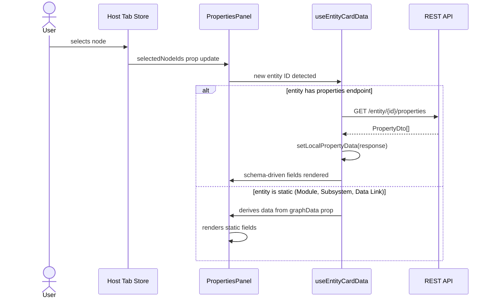
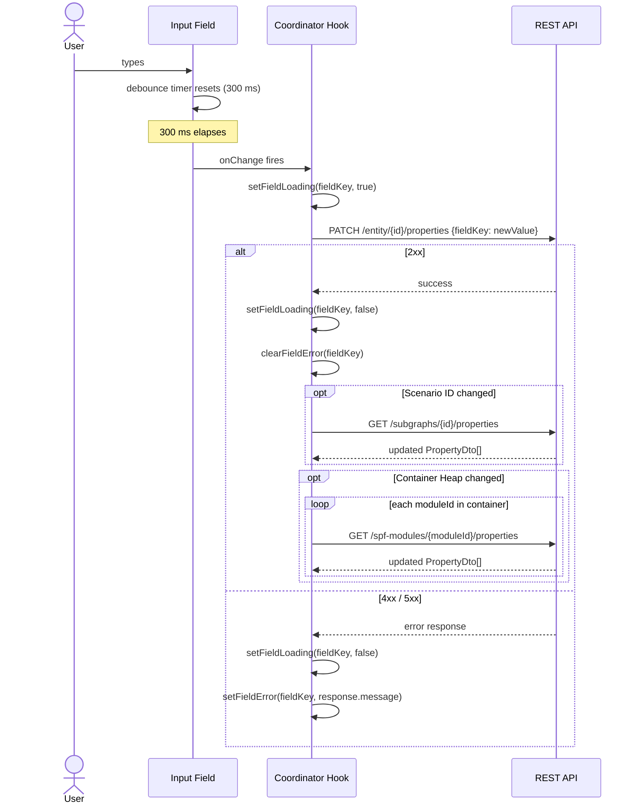
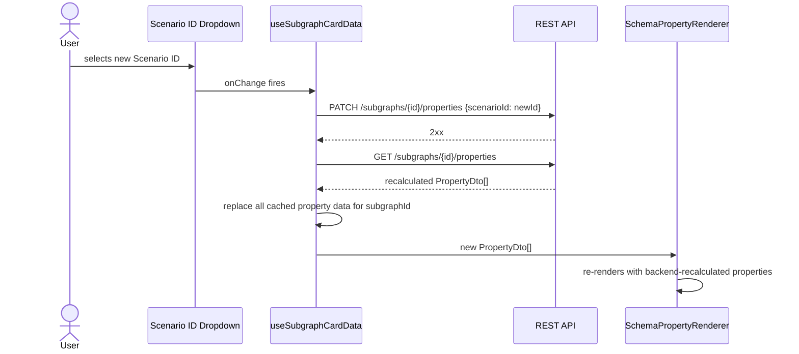
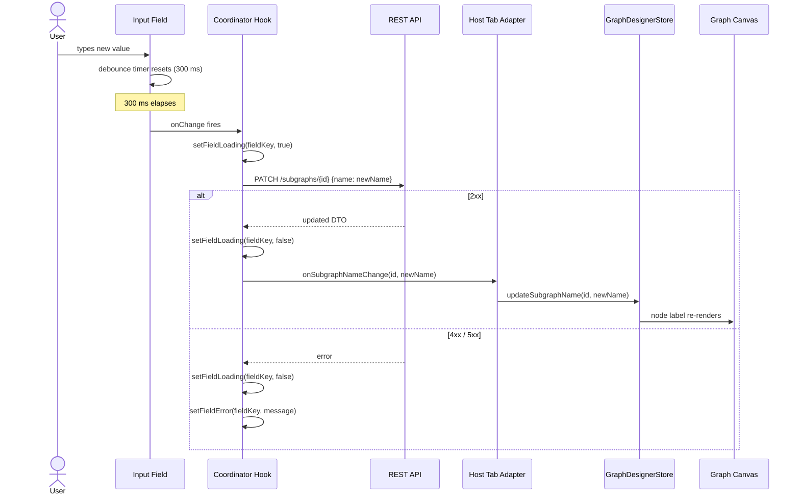
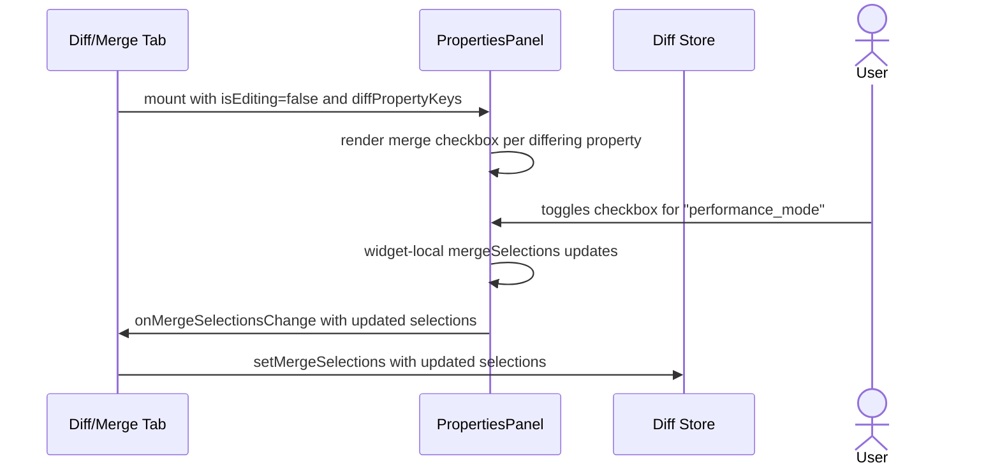

# LLD — Properties View

| Field | Value |
|---|---|
| **Target release** | TBD |
| **Milestone** | 1 |
| **Epic** | Properties View |
| **Link to epic/Jira** | TBD |
| **Document status** | DRAFT |
| **Document owner** | Ramesh Naidu |
| **Stakeholders** | Module owner, widget consumers (graph designer tab, diff/merge tab), reviewers |

---

## Feature Overview and Strategic Fit

The Properties View is a panel widget that displays and edits the properties of
entities selected in the Use Case Visualizer. A user selects one or more nodes
or edges on the graph canvas and the panel immediately shows all relevant
metadata — some fields read directly from the local `graph-data-slice`, others
fetched on demand from a dedicated properties REST endpoint.

The panel supports a global read-only / edit mode that is driven by a master
toggle in the host tab (graph designer toolbar). Auto-save fires a PATCH call
on every field change. The widget is designed as a self-contained, props-driven
component so it can be mounted without modification in any tab — graph
designer, diff/merge, or any future tab.

Eight entity types are supported: Subgraph, Container, Module, Subsystem, Data
Link, Control Link, Virtual Data Link, and Virtual Control Link.

---

## Architectural Impacts

- **New widget** — `widgets/properties-panel/` introduced at the widget layer
  (FSD). No existing widgets are modified.
- **New entity API functions** — thin API client modules added under
  `entities/<domain>/api/` for each entity type that has a properties endpoint.
  No existing entity modules are modified.
- **New shared controls** — `shared/controls/copyable-id.tsx` and
  `shared/controls/property-row.tsx` promoted to `shared/` for reuse across
  tabs.
- **Tab store change** — `shared/store/tab-store-slices/properties-view-slice.ts`
  adds `isPropertiesPanelOpen` to each tab's store. No other store state is
  added; all API-fetched property values live in widget-local state only.
- **Consumer adapter** — each host tab wraps `<PropertiesPanel>` in a thin
  adapter component that reads from its own store and passes values down via
  props. The widget itself has no store imports.
- No HLD-level architectural changes. The addition stays within the established
  FSD layering rules.

---

## Assumptions

1. Virtual Data Links are not created by the backend. The Use Case Designer
   creates Virtual Data Links and is responsible for setting the
   `virtualDataLinkKind` field (`'standard' | 'mdf'`) on each entity at
   creation time. Inferring type from the presence of modules is not acceptable
   — an MDF link with zero modules would silently render as the wrong variant.
2. `GET /subgraphs/{id}/properties` returns a self-describing `PropertyDto[]`
   list that contains both the field schema (name, type, display type, editable
   flag) and current values. No separate schema-definition endpoint call is
   needed.
3. `GET /containers/{id}/properties` follows the same self-describing pattern as
   subgraphs.
4. When the user changes Scenario ID on a subgraph, the backend transforms the
   property data (deletes incompatible groups, inserts new ones with defaults)
   and returns the authoritative set on the next `GET /subgraphs/{id}/properties`
   call. No client-side filtering is needed.
5. When the user changes Container Heap, the backend cascades the update to all
   module heaps within the container. The frontend re-fetches each module's
   properties to reflect the backend-updated values.
6. `PATCH /subgraphs/{id}/properties` and `PATCH /containers/{id}/properties`
   endpoints are TBD. The corresponding API client functions will be stubbed
   (returning a resolved promise) until the endpoints are available.
7. Authentication and authorization for all PATCH/GET calls are handled at the
   application HTTP client layer (interceptors). The widget itself does not
   handle auth.
8. The diff/merge tab permanently sets `isEditing={false}` and provides no
   master toggle. The widget renders in read-only mode unconditionally when
   mounted there.

---

## Requirements

| # | Title | User Story | Importance | Type | Notes |
|---|---|---|---|---|---|
| REQ-001 | Multi-entity display | As a user, I want to see the properties of any selected entity (subgraph, container, module, subsystem, link) without leaving the canvas view. | Must have | Functional | 8 entity types supported |
| REQ-002 | Subgraph properties | As a user, I want to view and edit the name and all backend-defined properties (Performance Mode, SG Direction, Scenario ID, etc.) for a selected subgraph. | Must have | Functional | Name from slice; rest from `GET /subgraphs/{id}/properties` |
| REQ-003 | Container properties | As a user, I want to view and edit the container ID, container type, and all backend-defined properties for a selected container. | Must have | Functional | Container Type is a single combobox; `GET /containers/{id}/properties` |
| REQ-004 | Module properties | As a user, I want to view and edit the alias, container assignment, port counts, and see port tables for a selected module. | Must have | Functional | All static — no properties endpoint call |
| REQ-005 | Subsystem properties | As a user, I want to view and edit the name of a selected subsystem and copy its ID. | Must have | Functional | Name from slice; ID is read-only with copy icon |
| REQ-006 | Data link properties | As a user, I want to see the source and destination component info and port IDs for a selected data link. | Must have | Functional | All read-only; no API call on selection |
| REQ-007 | Control link properties | As a user, I want to see peer component info and port IDs for a selected control link, and view or edit its intents and heap property, and delete it. | Must have | Functional | Peer/port info from graph-data-slice (read-only); intents and heap from `GET /control-links/{id}/properties` |
| REQ-008 | Virtual data link — standard variant | As a user, I want to see the data link rows with navigate and delete actions for a standard virtual data link. | Must have | Functional | Requires `virtualDataLinkKind: 'standard'` on entity |
| REQ-009 | Virtual data link — MDF variant | As a user, I want to see read-only data link rows and a modules list for an MDF virtual data link. | Must have | Functional | Requires `virtualDataLinkKind: 'mdf'` on entity |
| REQ-010 | Virtual control link | As a user, I want to see a scrollable list of real control links — each showing peer component info, intents, heap ID, and a delete button — for a selected virtual control link. | Must have | Functional | All data from graph-data-slice; no properties endpoint call |
| REQ-011 | Multi-selection grouping | As a user, I want entities grouped by type (with collapsible headers showing type + count) when I select multiple entities. | Must have | Functional | Fixed group order; cards within group in selection order |
| REQ-012 | Edit mode via props | As a user, I want all editable fields to become interactive when the host tab's edit toggle is on, and disabled when it is off. | Must have | Functional | No toggle inside the panel; `isEditing` via props |
| REQ-013 | Always-active copy icon | As a user, I want to copy ID field values to clipboard even when the panel is in read-only mode. | Must have | Functional | Copy icon remains active regardless of `isEditing` |
| REQ-014 | Auto-save on field change | As a user, I expect my edits to be saved automatically — I should not need to click a Save button. | Must have | Functional | Text inputs debounced 300 ms; all others fire immediately |
| REQ-015 | Per-field inline errors | As a user, I want to see an error message next to the field that failed to save, rather than a generic toast. | Must have | Functional | Error from PATCH response; cleared on next successful save |
| REQ-016 | Scenario ID refresh | As a user, after changing a subgraph's Scenario ID, I expect the property panel to reflect the backend-recalculated properties immediately. | Must have | Functional | Re-fetch `GET /subgraphs/{id}/properties` on PATCH success |
| REQ-017 | Container Heap cascade | As a user, after changing a container's heap, I expect module heap fields to update to reflect the backend cascade. | Must have | Functional | Re-fetch module properties for each module in the container |
| REQ-018 | Schema-driven rendering | The panel must render all `PropertyDto[]` fields returned by the properties endpoint without hard-coding individual fields. | Must have | Functional | `displayType` → QUI control mapping via `PropertyField` |
| REQ-019 | Navigate to node | As a user, I want to click a navigate button on a virtual data link row to jump to the related node in the canvas. | Must have | Functional | Fires `onNavigateToNode(nodeId)` prop callback |
| REQ-020 | Delete link action | As a user, I want to delete a control link or virtual data link row directly from the properties panel. | Must have | Functional | Fires `onDeleteLink(linkId)` prop callback |
| REQ-021 | Diff/merge read-only mode | As a user reviewing a diff, I want the properties panel to be permanently read-only with merge checkboxes per differing property. | Must have | Functional | `isEditing={false}` always; `diffPropertyKeys` and `onMergeSelectionsChange` props |
| REQ-022 | Deletion cleanup | When a selected entity is deleted, its cached property data must be evicted from widget-local state. | Must have | Functional | `useEffect` diffs selection arrays and evicts stale data |
| REQ-023 | Hidden / read-only policy | Fields with `policy: Hidden` must not render. Fields with `isReadOnly: true` must never be interactive regardless of edit mode. | Must have | Functional | |

---

## User Interaction and Design

### Panel placement

The panel sits in a resizable side panel of the host tab (graph designer or
diff/merge). Visibility is toggled via `isPropertiesPanelOpen` in the tab store.
The panel receives all data via props — it does not read the store directly.

### Empty state

When no entity is selected, the panel shows an empty state message:
"Select a node or edge to view its properties."

### Single-selection layout

One entity card renders in the panel body. The card has a header (entity type
badge + entity name/ID) and a list of property rows below.

### Multi-selection layout

Cards are grouped by entity type. Each group renders as a collapsible section
header showing the entity type name and count (e.g. "Modules (3)"). Individual
cards inside the group are independently collapsible. Group order is fixed:

> Subgraphs → Containers → Modules → Subsystems →  
> Data Links → Control Links → Virtual Data Links → Virtual Control Links

### Edit mode vs. read-only mode

- **Edit mode (`isEditing: true`):** editable fields render as interactive QUI
  controls (Input, Select, Checkbox, Slider).
- **Read-only mode (`isEditing: false`):** editable fields render as disabled
  display text. Copy icon buttons on ID fields remain active.

### Auto-save feedback

- While a PATCH call is in-flight, the affected field shows a loading indicator.
- On PATCH failure, an inline error message appears next to the field.
- On PATCH success, the loading indicator clears; no success toast.

### Diff/merge checkbox overlay

When `diffPropertyKeys` is provided, a merge checkbox is rendered at the leading
edge of each property row whose key appears in the map. A card-level checkbox
in the entity card header reflects the aggregate state (checked / indeterminate /
unchecked) of its children.

---

## Component Design

### FSD layer placement

```
entities/
  subgraphs/api/
    fetch-subgraph-properties.ts
    patch-subgraph.ts                    ← name update
    patch-subgraph-properties.ts         ← stub — endpoint TBD
  containers/api/
    fetch-container-properties.ts
    patch-container.ts                   ← id / type update
    patch-container-properties.ts        ← stub — endpoint TBD
  modules/api/
    patch-module.ts                      ← alias / port counts / container
    fetch-module-properties.ts           ← heap re-fetch after container cascade
    patch-module-properties.ts
  control-links/api/
    fetch-control-link-properties.ts
    patch-control-link-properties.ts
  subsystems/api/
    patch-subsystem.ts                   ← name update

shared/store/tab-store-slices/
  properties-view-slice.ts              ← isPropertiesPanelOpen only

widgets/properties-panel/
  model/
    use-module-card-data.ts
    use-subsystem-card-data.ts
    use-subgraph-card-data.ts
    use-container-card-data.ts
    use-data-link-card-data.ts
    use-control-link-card-data.ts
    use-virtual-data-link-card-data.ts
    use-virtual-control-link-card-data.ts
  ui/
    properties-panel.tsx                ← groups selection by entity type
    entity-cards/
      module-properties-card.tsx
      subsystem-properties-card.tsx
      subgraph-properties-card.tsx
      container-properties-card.tsx
      data-link-properties-card.tsx
      control-link-properties-card.tsx
      virtual-data-link-properties-card.tsx
      virtual-control-link-properties-card.tsx
    shared/
      schema-property-renderer.tsx      ← walks PropertyDto[]
      property-field.tsx                ← maps displayType → QUI control
  index.ts

shared/controls/
  copyable-id.tsx                       ← ID text + copy-to-clipboard icon
  property-row.tsx                      ← label/value layout + action slot
```

### UI layer hierarchy

```
┌─────────────────────────────────────────────────────────┐
│  HOST TAB ADAPTER  (per-tab, reads from tab store)      │
│  GraphDesignerPropertiesPanel  /  DiffPropertiesPanel   │
└───────────────────────────┬─────────────────────────────┘
                            │ props only (no store imports below this line)
┌───────────────────────────▼─────────────────────────────┐
│  PROPERTIES PANEL  widgets/properties-panel/ui/         │
│  properties-panel.tsx                                   │
│  • groups selectedNodeIds + selectedEdgeIds by type     │
│  • renders collapsible group headers (type + count)     │
└───────────────────────────┬─────────────────────────────┘
                            │ one card per entity
┌───────────────────────────▼─────────────────────────────┐
│  ENTITY CARDS  entity-cards/  (8 types)                 │
│  SubgraphCard  ContainerCard  ModuleCard  SubsystemCard │
│  DataLinkCard  ControlLinkCard                          │
│  VirtualDataLinkCard (standard | mdf variant)           │
│  VirtualControlLinkCard                                 │
│                                                         │
│  Each card backed by a use*CardData coordinator hook    │
│  that fetches API data and holds widget-local state     │
└──────────────────┬──────────────────┬───────────────────┘
                   │ API-backed cards  │ static cards
                   │ (Subgraph,        │ (Module, Subsystem,
                   │  Container,       │  DataLink, VDL, VCL)
                   │  ControlLink)     │ derive from graphData
       ┌───────────▼──────────┐        │
       │ SCHEMA RENDERER      │        │
       │ schema-property-     │        │
       │ renderer.tsx         │        │
       │ • walks PropertyDto[]│        │
       │ • skips Hidden policy│        │
       │                      │        │
       │ PropertyField        │        │
       │ • displayType →      │        │
       │   QUI control        │        │
       └───────────┬──────────┘        │
                   │                   │
       ┌───────────▼───────────────────▼────────────────────┐
       │  SHARED CONTROLS  shared/controls/                 │
       │  PropertyRow — label / value / action slot layout  │
       │  CopyableId  — ID text + clipboard copy icon       │
       └───────────────────────┬────────────────────────────┘
                               │
       ┌───────────────────────▼────────────────────────────┐
       │  QUI LEAF CONTROLS  (@qualcomm-ui/react)           │
       │  Input  Select  Checkbox  Slider                   │
       │  (+ read-only text display for non-interactive)    │
       └────────────────────────────────────────────────────┘
```

**Key data flows:**
- Static field edits (name, alias, port counts) → prop callback → host adapter
  → store update → canvas re-render
- Schema field edits (PropertyDto fields) → direct `entities/` API PATCH →
  widget-local state only; no callback needed
- `isEditing` flows down as a prop through every layer — nothing inside the
  panel reads it from a store

---

### `PropertiesPanel` props interface

```typescript
interface PropertiesPanelProps {
  projectId: string;
  graphData: UsecaseGraphData;
  selectedNodeIds: string[];
  selectedEdgeIds: string[];
  isEditing: boolean;
  // Callbacks for writes that affect graph-data-slice (cause canvas re-renders)
  onModuleAliasChange(moduleId: string, alias: string): void;
  onModulePortCountChange(
    moduleId: string,
    field: 'maxInputPorts' | 'maxOutputPorts' | 'maxControlPorts',
    value: number,
  ): void;
  onModuleContainerChange(moduleId: string, newContainerId: string): void;
  onSubsystemNameChange(id: string, name: string): void;
  onSubgraphNameChange(id: string, name: string): void;
  onContainerIdChange(containerId: string, newId: string): void;
  onDeleteLink(linkId: string): void;
  onNavigateToNode(nodeId: string): void;
  // Diff/merge only — omit in graph designer
  diffPropertyKeys?: Record<string, string[]>;
  onMergeSelectionsChange?: (selections: Record<string, string[]>) => void;
}
```

**Callback rule:** a callback is included only when the operation has impact
outside the widget — specifically when `graph-data-slice` must be updated so
that the graph view re-renders. All other field changes (properties API fields)
are handled inside coordinator hooks via direct `entities/` API calls with no
callback needed.

### Coordinator hook signature (example: Subgraph)

```typescript
function useSubgraphCardData(
  subgraphId: string,
  graphData: UsecaseGraphData,
  projectId: string,
  callbacks: SubgraphCardCallbacks,
): SubgraphCardViewModel
```

Each `use*CardData` hook:
- Accepts entity ID, `graphData`, `projectId`, and a callbacks object.
- Has **no store imports** — fully props-driven.
- Fetches properties API data into widget-local `useState` on mount and ID
  change.
- Returns a flat, typed view model and typed update handlers.
- Update handlers for graph-data fields call `entities/` API functions and
  invoke the corresponding prop callback; the adapter then updates the store.

### `SchemaPropertyRenderer`

Accepts a `PropertyDto[]` list and renders each item via `PropertyField`.
Skips items where `policy === 'Hidden'`. Passes `isReadOnly` flag down to
`PropertyField`.

### `PropertyField` — `displayType` → QUI control mapping

| `displayType` | QUI control |
|---|---|
| `TextBox` | `Input` |
| `DropDown` | `Select` |
| `CheckBox` | `Checkbox` |
| `Slider` | `Slider` |
| `DbTextBox` | `Input` (dB unit suffix) |
| `QFormattedValue` | `Input` (Q-format display) |
| `StringField` | `Input` |
| `BitField` | `Input` (hex display) |
| `Formula` | Read-only computed display |
| `Dump` / `File` | Read-only display |

### Consumer adapter — graph designer

```typescript
// widgets/graph-designer/ui/graph-designer-properties-panel.tsx
function GraphDesignerPropertiesPanel() {
  const graphData = useGraphDesignerStore(s => s.graphData);
  const selectedNodeIds = useGraphDesignerStore(s => s.selectedNodeIds);
  const selectedEdgeIds = useGraphDesignerStore(s => s.selectedEdgeIds);
  const isEditing = useGraphDesignerStore(s => s.isEditing);
  const store = useGraphDesignerStore.getState();

  return (
    <PropertiesPanel
      projectId={projectId}
      graphData={graphData}
      selectedNodeIds={selectedNodeIds}
      selectedEdgeIds={selectedEdgeIds}
      isEditing={isEditing}
      onSubgraphNameChange={(id, name) => {
        patchSubgraph(projectId, id, {name});
        store.updateSubgraphName(id, name);
      }}
      onDeleteLink={(linkId) => store.deleteLink(linkId)}
      onNavigateToNode={(nodeId) => store.focusNode(nodeId)}
      // ... other graph-data callbacks
    />
  );
}
```

### Consumer adapter — diff/merge (always read-only)

```typescript
function DiffPropertiesPanel() {
  const graphData = useDiffStore(s => s.baseGraphData);
  const diffPropertyKeys = useDiffStore(s => s.diffPropertyKeys);
  const store = useDiffStore.getState();

  return (
    <PropertiesPanel
      projectId={projectId}
      graphData={graphData}
      selectedNodeIds={selectedNodeIds}
      selectedEdgeIds={selectedEdgeIds}
      isEditing={false}
      diffPropertyKeys={diffPropertyKeys}
      onMergeSelectionsChange={(sel) => store.setMergeSelections(sel)}
      onModuleAliasChange={() => {}}
      onModulePortCountChange={() => {}}
      onModuleContainerChange={() => {}}
      onSubsystemNameChange={() => {}}
      onSubgraphNameChange={() => {}}
      onContainerIdChange={() => {}}
      onDeleteLink={() => {}}
      onNavigateToNode={(nodeId) => store.focusNode(nodeId)}
    />
  );
}
```

### Adding the panel to a new tab

Any tab that wants to host `<PropertiesPanel>` follows four steps:

**Step 1 — Extend the tab store slice**

Compose `propertiesViewSlice` into the tab's Zustand store so
`isPropertiesPanelOpen` is available for the tab's toolbar toggle.

**Step 2 — Create a host tab adapter component**

Create `widgets/<tab-name>/ui/<tab-name>-properties-panel.tsx`. The adapter:
- Reads `selectedNodeIds`, `selectedEdgeIds`, `isEditing`, `graphData`, and
  `projectId` from the tab's own store via narrow selectors.
- Passes them straight down as props to `<PropertiesPanel>`.
- Implements the prop callbacks (see Step 3).
- Has no other logic — it is glue only.

**Step 3 — Implement the prop callbacks**

The callbacks split into two groups:

| Callback group | Read-write tab | Read-only tab |
|---|---|---|
| Write callbacks (`onSubgraphNameChange`, `onModuleAliasChange`, etc.) | Call the `entities/` API then dispatch the matching store action | Pass a no-op `() => {}` |
| Navigation / delete callbacks (`onNavigateToNode`, `onDeleteLink`) | Dispatch to store | `onNavigateToNode` → dispatch to store; `onDeleteLink` → no-op |
| Diff/merge props (`diffPropertyKeys`, `onMergeSelectionsChange`) | Omit both | Pass `diffPropertyKeys` from store; `onMergeSelectionsChange` → dispatch to store |

**Step 4 — Mount the adapter in the tab layout**

Place the adapter inside the tab's resizable side panel. Toggle visibility
using `isPropertiesPanelOpen` from the tab store.

---

**Checklist for a new read-only consumer (e.g. diff/merge)**

- [ ] `isEditing` is hardcoded `false` — never passed from store
- [ ] All write callbacks (`on*Change`, `onDeleteLink`) are no-ops
- [ ] `onNavigateToNode` dispatches to the tab store if canvas focus is needed
- [ ] `diffPropertyKeys: Record<string, string[]>` passed from store
- [ ] `onMergeSelectionsChange` callback dispatches to store
- [ ] No master edit toggle is rendered in the tab toolbar

---

## Back-end API Design

### Subgraph

| Operation | Method | Endpoint | Request body | Response |
|---|---|---|---|---|
| Fetch properties | GET | `/subgraphs/{id}/properties` | — | `PropertyDto[]` |
| Update name | PATCH | `/subgraphs/{id}` | `{name: string}` | Updated subgraph DTO |
| Update properties | PATCH | `/subgraphs/{id}/properties` | `PropertyPatchDto` | Updated `PropertyDto[]` |

**Scenario ID change flow:**
1. PATCH new Scenario ID → `PATCH /subgraphs/{id}/properties`
2. On 2xx: re-fetch `GET /subgraphs/{id}/properties`
3. Replace cached property data in widget-local state.

### Container

| Operation | Method | Endpoint | Request body | Response |
|---|---|---|---|---|
| Fetch properties | GET | `/containers/{id}/properties` | — | `PropertyDto[]` |
| Update ID or type | PATCH | `/containers/{id}` | `{containerId?: string, containerType?: string}` | Updated container DTO |
| Update properties | PATCH | `/containers/{id}/properties` | `PropertyPatchDto` | Updated `PropertyDto[]` |

**Container Heap cascade flow:**
1. PATCH Container Heap → `PATCH /containers/{id}/properties`
2. On 2xx: for each `moduleId` in `graphData.containers[id].modules`, re-fetch
   `GET /spf-modules/{moduleId}/properties`.
3. Update widget-local state for each module.

### Module

| Operation | Method | Endpoint | Request body | Response |
|---|---|---|---|---|
| Update alias / port counts / container | PATCH | `/arc-api/v1/projects/{projectId}/spf-modules` | `SpfModulePatchDto` | Updated module DTO |
| Fetch module properties (heap re-fetch) | GET | `/spf-modules/{moduleId}/properties` | — | `PropertyDto[]` |
| Update module properties | PATCH | `/spf-modules/{moduleId}/properties` | `PropertyPatchDto` | Updated `PropertyDto[]` |

### Subsystem

| Operation | Method | Endpoint | Request body | Response |
|---|---|---|---|---|
| Update name | PATCH | `/subsystems/{id}` | `{name: string}` | Updated subsystem DTO |

### Control Link

| Operation | Method | Endpoint | Request body | Response |
|---|---|---|---|---|
| Fetch properties (intents, heap) | GET | `/control-links/{id}/properties` | — | `PropertyDto[]` |
| Update properties | PATCH | `/control-links/{id}/properties` | `PropertyPatchDto` | Updated `PropertyDto[]` |

### Data Link, Virtual Data Link, Virtual Control Link

No properties endpoint calls on selection. All data is served from
`graph-data-slice`. Delete and navigate actions are forwarded via prop
callbacks to the host tab.

---

## Database Design

Not applicable — this is a frontend widget. There is no new database schema.

**Widget-local state (replaces DB in this section):**

API-fetched property values, loading states, and per-field error states are
held in widget-local `useState` / `useReducer` inside each coordinator hook.
They are **not** persisted to the tab store, Redux, or any external store.
The only piece of panel state in the tab store is `isPropertiesPanelOpen`
(boolean). All other panel state is ephemeral and lives only for the lifetime
of the selection.

**State eviction rules:**
- When an entity ID is removed from `selectedNodeIds` / `selectedEdgeIds`, a
  `useEffect` in `PropertiesPanel` evicts its cached property data.
- When a module is deleted while its parent container is selected, a `useEffect`
  diffs `graphData.moduleInstances` against cached module IDs and evicts stale
  data.

---

## Interfaces, Services, and Sequence Diagrams

### Sequence: entity selected → properties rendered



### Sequence: user edits a text field (debounced)



### Sequence: Scenario ID changed



### Sequence: subgraph name / container ID change (graph-data update)

Unlike schema-field edits, name and ID changes must propagate to the graph
canvas. The coordinator hook calls the entities API and then fires a prop
callback; the host adapter handles the store update that triggers the
canvas re-render. The same flow applies to all graph-data field changes
(subgraph name, container ID, module alias, etc.) — only the entity card,
API endpoint, and prop callback differ.



### Sequence: diff/merge checkbox interaction



---

## Error Handling

| Scenario | Handling |
|---|---|
| `GET /entity/{id}/properties` fails | Panel shows inline error in the card: "Failed to load properties. Retry." Retry button triggers re-fetch. |
| `PATCH` call fails (4xx) | Per-field inline error message from `response.message`. Field value reverts to last known good value. |
| `PATCH` call fails (5xx / network) | Per-field inline error with generic message: "Save failed — please try again." |
| Entity deleted while properties fetch in-flight | Fetch response is discarded if the entity ID is no longer in the selection on arrival. |
| `virtualDataLinkKind` field absent | Virtual Data Link card renders an error state: "Unknown link variant — virtualDataLinkKind not set." Does not silently fall through to a wrong variant. |
| `PropertyField` receives unknown `displayType` | Renders a read-only text display and logs a warning. Does not crash the card. |

---

## Security Considerations

- **Authentication / Authorization:** All PATCH and GET calls go through the
  application's existing HTTP client interceptor, which attaches the
  authenticated session token. The widget does not handle auth directly.
- **Input sanitization:** Property field values submitted via PATCH are
  primitive values (string, number, boolean) typed by `PropertyDto`. No free-
  form HTML or script content is accepted.
- **Copy-to-clipboard:** Uses the `navigator.clipboard` API. No sensitive
  credential data — only entity IDs — are ever placed in the clipboard.
- **No state persisted beyond session:** Widget-local state is in-memory only.
  No property values are written to `localStorage` or similar.

---

## Performance / Scalability Considerations

- **Debounced text inputs (300 ms):** Prevents per-keystroke PATCH calls.
- **On-demand fetch:** Properties API calls are made only when an entity is
  selected, not on panel mount. Unselected entities never incur a network
  request.
- **Widget-local state eviction:** Cached property data is evicted when the
  entity is deselected (REQ-022). Memory does not grow unboundedly with
  session length.
- **Lazy module heap re-fetch:** After a Container Heap PATCH, only the modules
  inside the affected container are re-fetched — not all modules in the project.
- **Selector subscriptions:** Host tab adapter components use narrow Zustand
  selectors (`s => s.selectedNodeIds`) so unrelated store updates do not cause
  `PropertiesPanel` to re-render.
- **Multi-selection scale:** Entity cards are independently collapsible. For
  large multi-selections (e.g. 50 modules) the user can collapse groups to avoid
  rendering hundreds of rows simultaneously.

---

## Testing Strategy

### Unit tests — coordinator hooks

- `use<Entity>CardData` hooks are tested with mock API responses using
  `msw` (or fetch mocks).
- Verify that on ID change the hook re-fetches and updates local state.
- Verify Scenario ID change triggers a second GET call.
- Verify Container Heap change triggers module property re-fetches.
- Verify state eviction when entity ID leaves the selection.

### Component tests — entity cards

- Each `*PropertiesCard` is tested with React Testing Library.
- Verify fields render correctly for both `isEditing: true` and `isEditing: false`.
- Verify copy icon is active in read-only mode.
- Verify PATCH call is fired on field change (text after 300 ms debounce).
- Verify inline error renders on PATCH failure.
- Verify `Hidden` policy fields do not render.
- Verify `isReadOnly: true` fields are never interactive.

### Component tests — `PropertiesPanel`

- Verify empty state when `selectedNodeIds` and `selectedEdgeIds` are empty.
- Verify multi-selection groups are rendered in correct fixed order.
- Verify group collapsibility.
- Verify diff/merge checkboxes render only for keys present in `diffPropertyKeys`.
- Verify `onMergeSelectionsChange` fires with correct payload on checkbox toggle.

### Integration tests

- Mount `GraphDesignerPropertiesPanel` adapter; verify that a store selection
  change causes the correct card to appear with data.
- Verify `onDeleteLink` prop callback fires when delete button is clicked on a
  control link card.
- Verify `onNavigateToNode` fires when navigate button is clicked on a virtual
  data link row.

### Tests out of scope

- Undo/redo (not in scope for this feature — see "Not Doing").
- Merge execution logic — owned by the diff/merge tab, not the widget.

---

## Open-Source Libraries

No new open-source libraries are introduced. All controls use the existing
`@qualcomm-ui/react` (QUI) component library. Clipboard access uses the
browser-native `navigator.clipboard` API.

---

## Questions

| # | Question | Owner | Status |
|---|---|---|---|
| Q-001 | When will `PATCH /subgraphs/{id}/properties` endpoint be available? Widget is stubbed until then. | Backend team | Open |
| Q-002 | When will `PATCH /containers/{id}/properties` endpoint be available? Widget is stubbed until then. | Backend team | Open |
| Q-003 | When will the `virtualDataLinkKind` field be added to the Virtual Data Link entity DTO? Implementing the virtual data link card is blocked on this. | Backend team | Open |
| Q-004 | Should the Container Type combobox be sourced from a static enum or from an API endpoint? The spec shows graph-data-slice as the source but does not clarify the set of valid values. | Design / Backend | Open |
| Q-005 | Is there a maximum number of entities that can be selected simultaneously? If so, should the panel show a warning or limit the rendered cards? | Product | Open |

---

## Not Doing

The following items were discussed and are explicitly out of scope for this
release:

- **Undo/redo for property edits** — auto-save fires immediately; no undo
  stack will be maintained.
- **Bulk editing** — when multiple entities of the same type are selected,
  editing one card does not apply the change to the others.
- **Property search / filter** — no search box inside the panel for filtering
  visible properties.
- **Validation beyond inline errors** — no client-side field validation rules
  are implemented. Validation is enforced server-side; errors are displayed
  from the PATCH response.
- **Merge conflict resolution UI** — the diff/merge panel renders per-property
  and per-card selection checkboxes only. Resolution logic and conflict
  highlighting are owned by the diff/merge tab, not this widget.
- **Dual-list Container Type dialog** — the previous dual-list container type
  selection dialog is not re-implemented. A single combobox replaces it.
